# 【破解】小生我怕怕中级逆向班 - P10：10.8 - 计算机学习委员 - BV1gE411u7WG

(我現在正在錄影，請大家不要忘記關注我)。

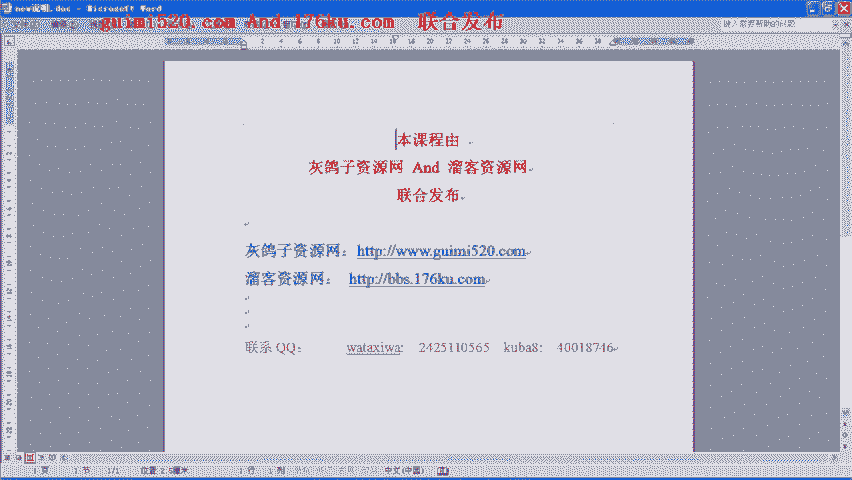

大家好，我是小松，我爸爸，今天我們開始我們的第八課，我們來看一下第八課。

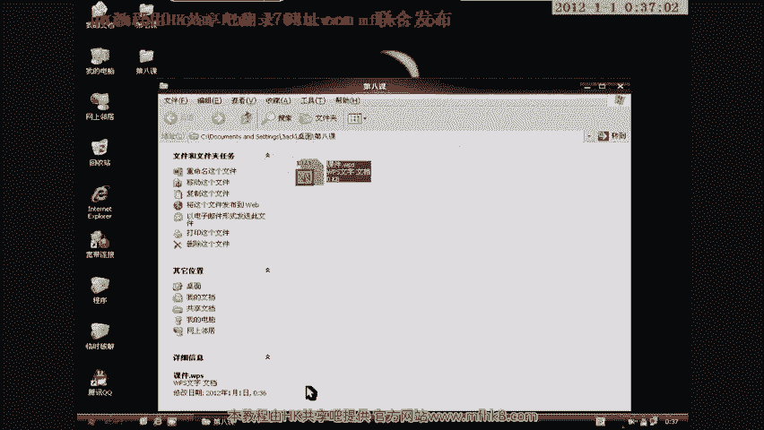

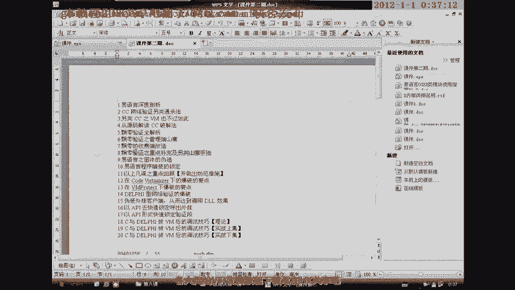

飄靈，本來飄靈是沒有什麼講的。

但是我發現大家都理解得還不夠充分，所以說，再安排這樣一課，給大家再細節化，飄靈驗證，飄靈驗證之重點補充。

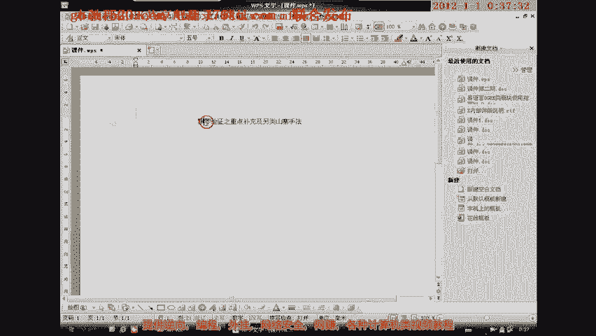

及應內的三在手法，首先我們繼續，第七課的課典。

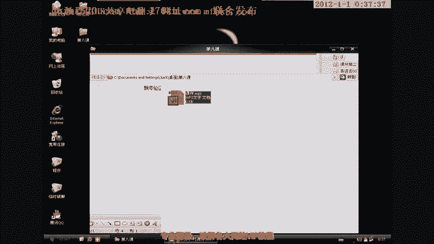

我們繼續第七課的課典，這個是它的原版。

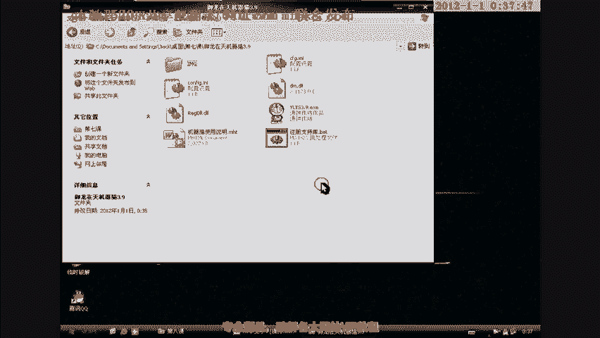

原版，(我現在正在錄影，請大家不要忘記關注我)。

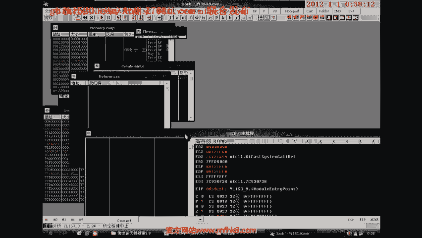

老規矩，知乎算知好，(我現在正在錄影，請大家不要忘記關注我)。

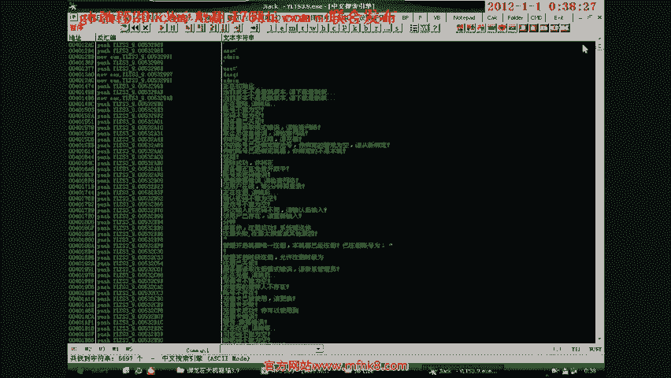

(我現在正在錄影，請大家不要忘記關注我)，就ASP的地址，ASP的網址，(我現在正在錄影，請大家不要忘記關注我)，電話網址，首先我們再來說一下這個密鑰的問題，密鑰的問題，密鑰從我們這個角度上去看。

從我們這個角度上去看，它真的是調用到了這樣一串，這樣一串，就它這個程序，實際它的密鑰，是沒有浪長的，它的密鑰應該是1637081987，它的密鑰就應該是這個，還是複製一下這個鏡子吧。

讓大家容易看清楚一些，這裡我們複製，它的密鑰，根據推算，根據在上一課的推算，跟蹤算法過程，發現它會精簡掉前面的兩個字，應該是八個字節，精簡掉前面的八個字節，它會在這裡面，在這個位置上精簡掉這個八個字節。

在這裡，精簡掉這個八個字節，在這裡，通過算法，然後在這裡，把它給傳遞到內存之後，然後它會再進入這個口，進入到這個口之後，它會在這裡取精簡掉這八個字節，在這裡取精簡掉這八個字節。

在這個位置取精簡掉這八個字節，精簡掉八個字節，它精簡掉這八個字節參數，進入內存，進行觀察，也就是說，其實此時此刻，我們這裡是最好的時機，最好的時機，我們再來看，大家來看，這裡，目前它是。

由這個參數去調用的，我先引領到這吧，它現在是0054DF1C，DF1C。

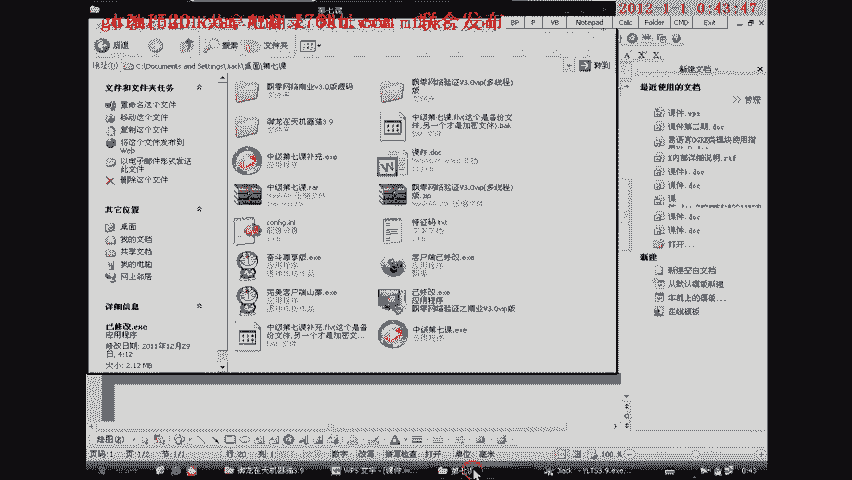

我們來看，DF1C，如果我們要給它刪在一個管理端，我們目前是已知它是3。0的版本。

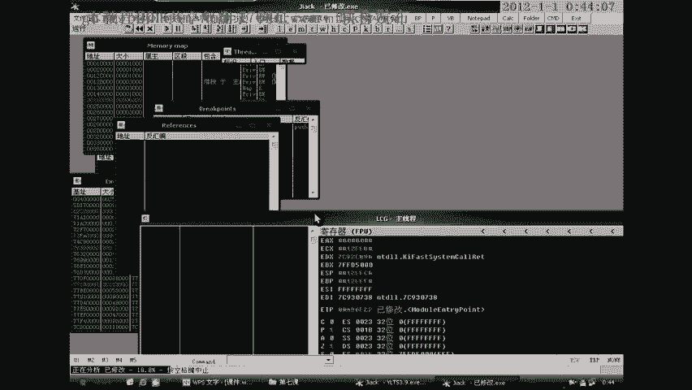

我們來看一下，目前已知它是3。0的版本。

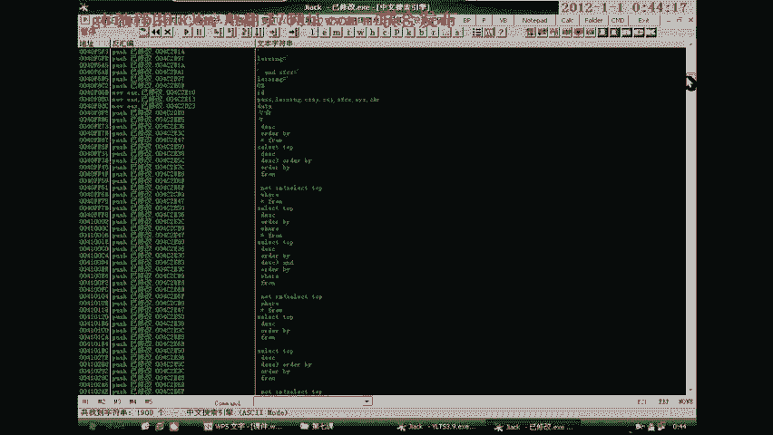

我們同樣把這個給它運一下，我們來看一下，我們這裡，這個密鑰和它的相等程度，這個密鑰是這樣，比如說，我們需要替換的，管理端的密鑰，我們需要替換的管理端的密鑰，密鑰等於1819910122，那麼常理推算。

1819910122，就是這個，那麼既然它那裡會經典到這個18，而我們上面的是多少呢，是1A，那麼這裡，我們就把它給複製，然後這裡，最後一個字節，就是顏必要的最後一個字節，然後同樣複製，大家來看，你看。

它這裡是從前面修改，然後後面有兩個字節沒修改，那麼我們這裡撤銷，這裡再來像這樣，大家來看，像這樣，它現在就是把最後的兩個字節給補上了，就是我們當前的字節是取尾數的長，就是取尾，以尾數計算，以尾。

最後一位，來計算密鑰的位置，最尾的插檔，當前的密鑰，我們得以最後一位把它給進行計算，它的密鑰是這個樣子，10122，這個是它的密鑰，這個是它的密鑰。

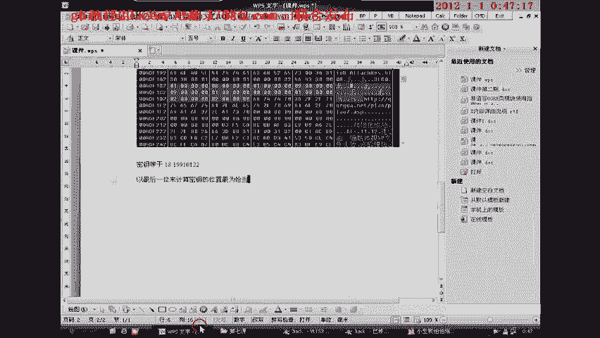

這個是短的方法修改，短數的修改，好，那麼這裡我們既然講了短數的修改，我們就把它給複製上來，在這裡，我們來看，1819910122，那麼這裡是1C，從此刻可以看我們需要精簡掉前面的八個字節。

我們打開計算器，加快，那麼也就是我們這裡的密鑰就需要修改成這個，看到沒有，就是當前的密鑰地址，就是這個，1819910122，然後這裡的王子，王子，我們需要先給它保存一份，這個地址先給它複製。

先給它保存一份，連那個王子一塊改了，這個，我們給它加滿，後面以00填充，0代表空代碼是不帶任何參數的，0是代表空代碼是不帶任何參數的，這裡我已經說了，大家要好好記住，就是我們先把它保存一份。

同樣把這裡複製，然後重載，同樣到這，現在是1C，我們把它修改掉，同樣保存一下，我們來看一下，這個是我們今天修改好的，大家看到，可以看到，我們現在已經是直接把它登錄上來了，很簡單，這裡我們再來強調一下。

如果密鑰過長的情況下，我們就可以不採取這個地址，我們就可以通常到最後的末尾段，不動滾動調拉到最後，找到空代碼的語句，然後複製這一句，我們需要很長的密鑰，這就表示，我們就可以這樣看。

我們就把密鑰給它移到這個位置來了，就這樣的話我們就可以採取另外的方法，同樣給它複製一份，然後這個地址也需要給它複製一份，上面是服務器的空間地址，上面是密鑰，那麼我們來保存一份，也是加插密鑰的修改。

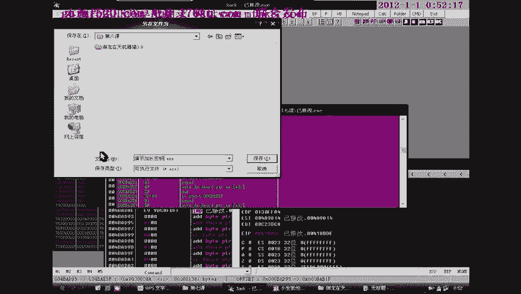

不管它的服務器IP地址有多長，還有這個密鑰有多長，我們都不用管，我們只需要這樣再來，我們再來看這裡。

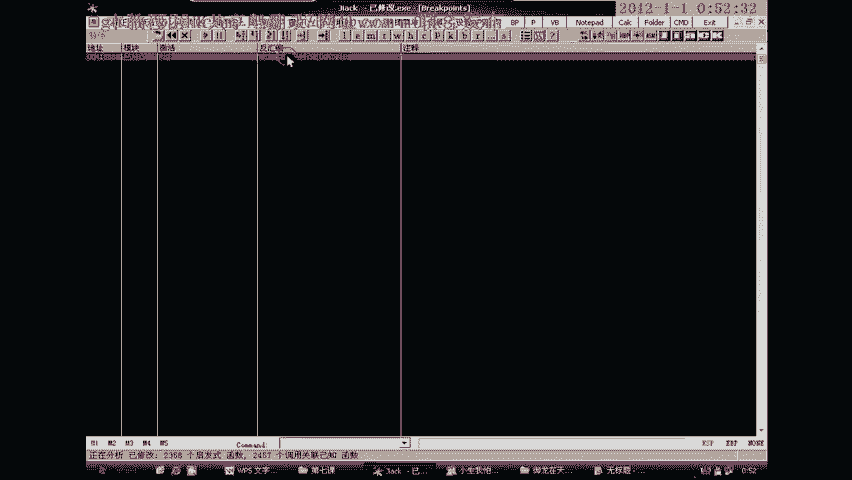

此時此刻我們把它這個位置給它修改掉，同樣把它保存一份。

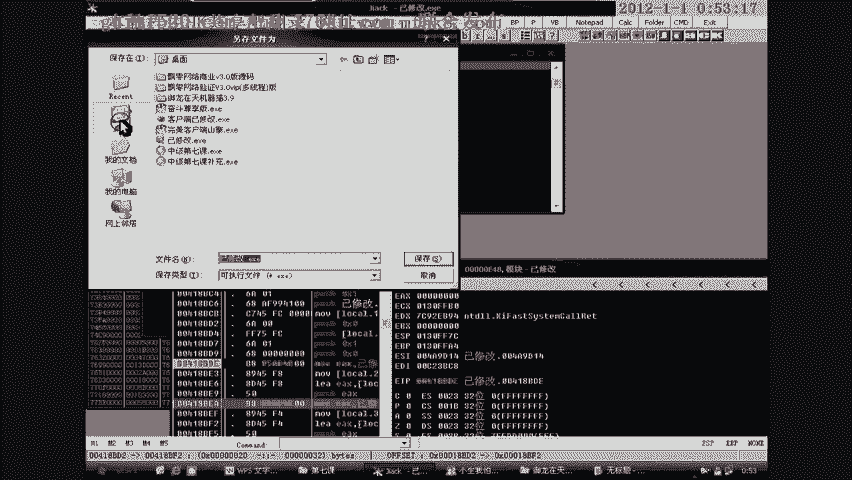

我們來看我們的加插密鑰，就是這個修改的結果如何。

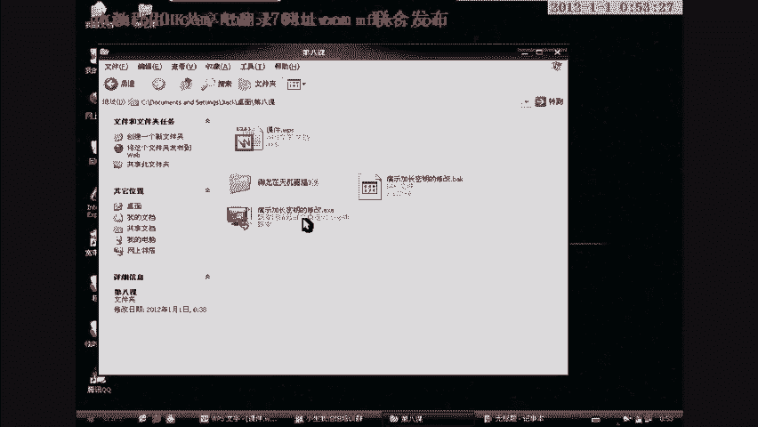

大家看一下，它現在是出現了下邊越界，那麼我們來看為什麼會下邊越界。

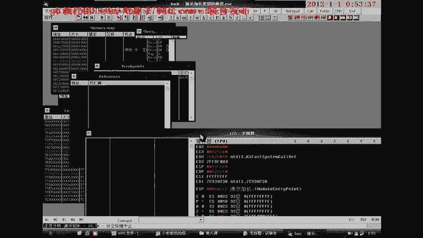

我們去看我們這個指紋，大家看在這個位置它並沒有修改到，也就表示說我們這個位置現在是空的，整體找不到，那麼我們去例子，這個就是那個網址。

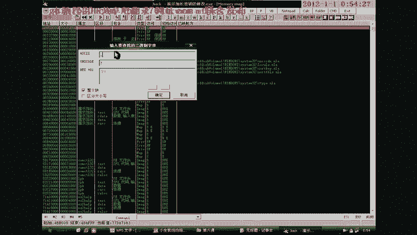

我們現在需要複製的就是這一串，把它給複製，然後整體來說，同樣找到那個D95光，我們把它拉長，整體，修改為1，那麼我們再看，大家看見了，現在它已經可以，就是通過我修改了密鑰之後。

它就現在和那個的地址是不一樣的，我現在把這個載入給大家看，大家就可以看到，剛才我們是找不到網址的，現在它就可以找到網址了，密鑰和網址就在這，這就是它的一個加長和減短的密鑰的一個派系的一個方法。

那麼漂亮的音樂，我們還需要記錄一些什麼呢，這裡我們再來說一下，同樣給大家借助一個圓碼，借助一個圓碼，就是來給大家講解一下，因為如果不給你們圓碼。

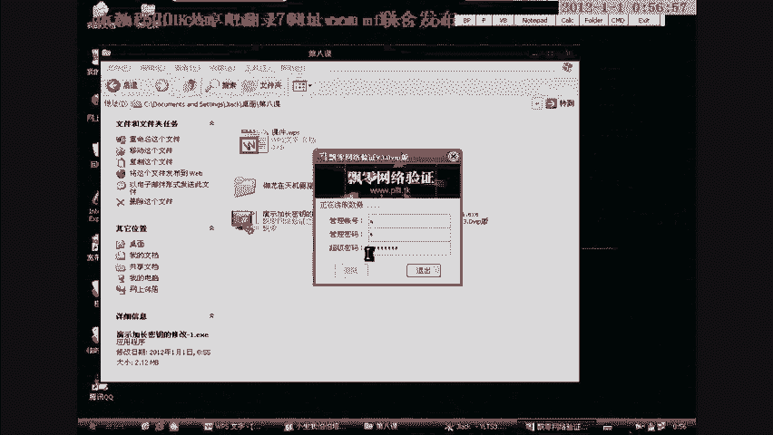

看就是單這樣分可可用的分析的話，那是根本看不懂什麼，看不到任何的，這個靜態數據，就飄零的這個靜態數據而言，是飄零的，就是用於防爆破的一個措施吧，靜態數據的查找，這裡啊，我以前教過大家。

就是用圓碼去觀看一個程序的流程，不管它再怎麼變都變不了什麼的，那麼我們來看，就是這個，它的數據是怎麼來的，我們登錄，然後收費模式，我們就看收費模式，然後到登錄成功，好我們來看登錄成功，登錄成功之後。

這裡就有一個特徵數據，特徵數據，去飄零靜態數據，就是這個去靜態數據，意思就是說，它登錄成功之後，它就會取這個靜態的數據，登錄成功之後獲取靜態的數據，它這個可能會是一個網址，也有可能是一個機制。

或者是任何可以用於組裝和拼裝，就是用於組起來，然後拼裝後，找到一個功能的實現的，一個地址，一個地址就可能存放在這個位置，而這個位置所存放的東西，我們可以在什麼地方找到，這裡我們同樣用圓碼來看。

它就是登錄成功之後。

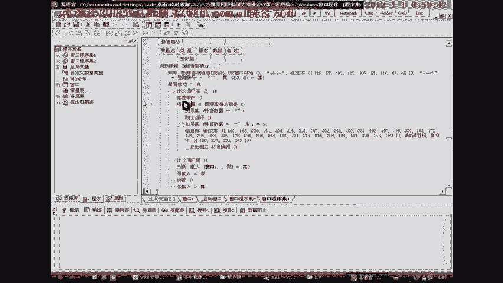

我們來看登錄成功，它這個沒有登錄成功，那麼我們需要在哪裡看，找它的這個登錄成功。

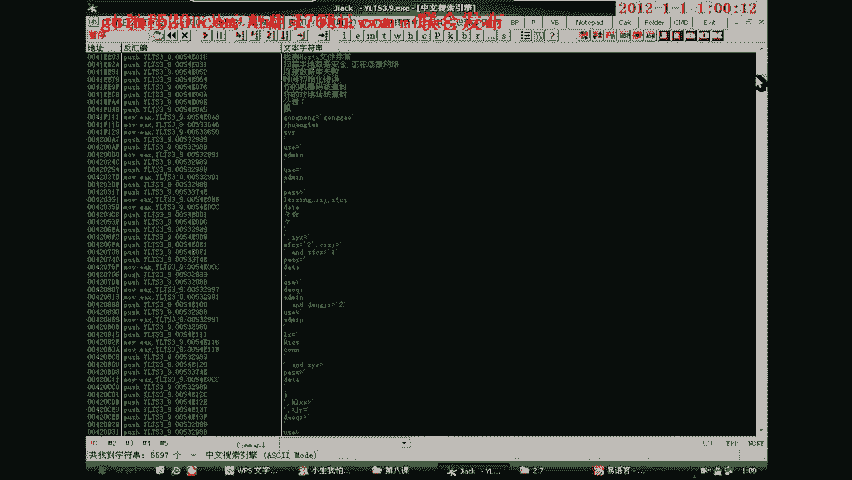

我們用那個3。0的吧，我們看它的登錄成功，驗證現場，收費模式，然後它調用到了什麼，登錄標誌為1，登錄標誌為1，登錄標誌為2，那麼它這個也就是調用到了一個樹組，調用到了一個樹組，我們來看它這個收費模式。

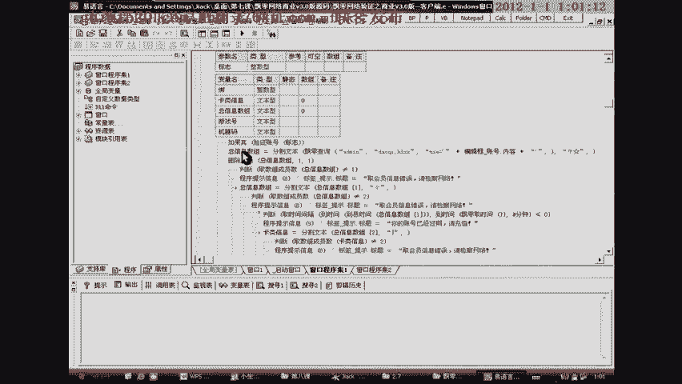

它調用到了一個樹組，那麼我們來找票扣扣，通過這個字幕上去找。

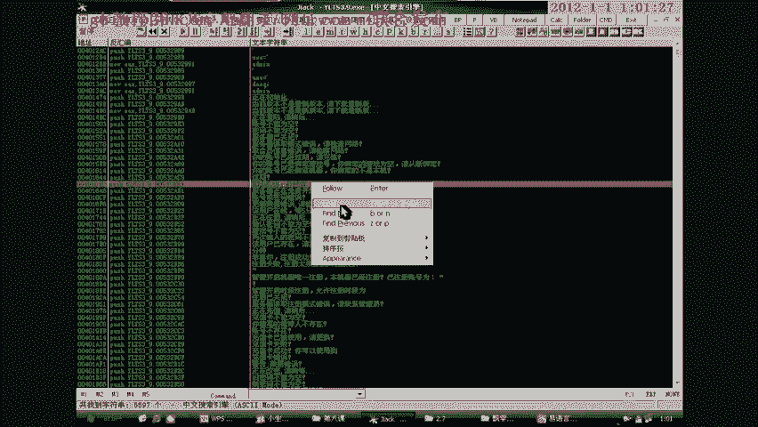

票扣扣，我們來看這裡，當然不可能是在這，這是老票，就是通過這裡，通過這樣一個樹組循環，這樣一個樹組循環，它讀取靜態驗證的一個數據，然後這個裡面，3。0好像沒有那個，讀取靜態數據，沒有那個模塊看不到。

它這個沒有那個模塊看不到，就是國際檢測，登錄帳號，帳號已過期，就它這個我們看一下，從頭到尾看一下，都沒有那個數據，文件特徵值，這是票名區文件特徵值，它這個沒有那個，那麼我們就用這個來給它，用2。

7來看吧，剛好我們D6顆當中有一個2。7的扣段，這裡有一個扣段，大家看到了，就是這個，我們怎麼來看就是說，我們可以通過，通過它這個登錄成功，就是看到它是登錄成功，那麼是有哪些子程序來電我們登錄成功呢。

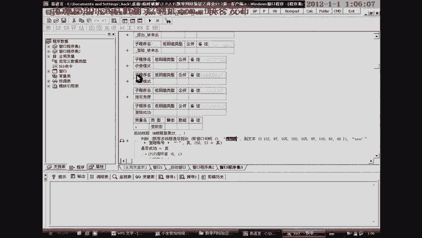

驗證登錄成功，你將在什麼什麼，登錄成功，你將在什麼什麼，那麼也就是，你將在登錄成功，你將在，大家就關注這幾個字符。

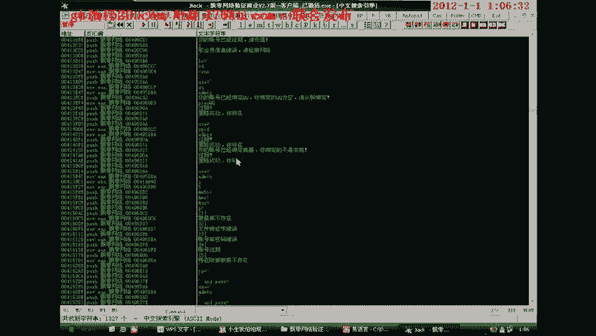

那麼我們從，這裡來看啊，登錄成功，你將在什麼什麼，然後到它這裡，點我們到那個Core，就現在我們就是到達了登錄驗證的這個Core，現場登錄AP，然後這裡就對應著它的機制循環手。

這個就是一個機制循環手的一個標誌，那麼處理事件就可以是這個Core，處理事件就是那個Core，然後特徵數據等於飄零去靜態數據，那麼也就是這個Core，這個Core它是有網絡連接的，有網絡連接的。

那麼也就是在這裡，在這裡就可以去到我們EAX，我們EAX存放的數據，它就是那個飄零的靜態，靜態防爆過的那個數據，我們EAX存放的數據，就是飄零的靜態防爆過數據，這裡就是飄零的靜態防爆過數據。

這個讀取到然後存放到EAX，就是飄零的靜態防爆過數據，那麼這裡我們就可以給它定義一個特徵碼，定義一個特徵碼，就這個特徵碼就夠了，就這個特徵碼就可以把它所有的那個，防爆過數據全部給它弄出來。

就是說我們用以前的原碼就可以把它給輕鬆KO，那麼我們再來看3。0的。

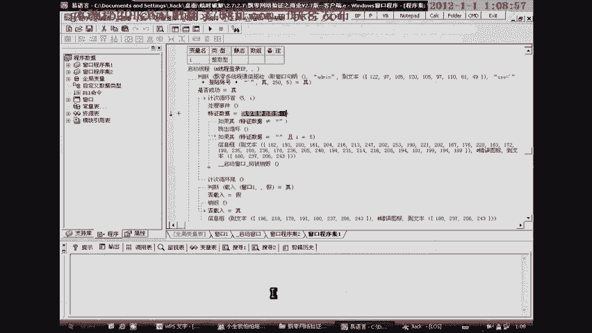

我們來看有沒有存在這樣一句。

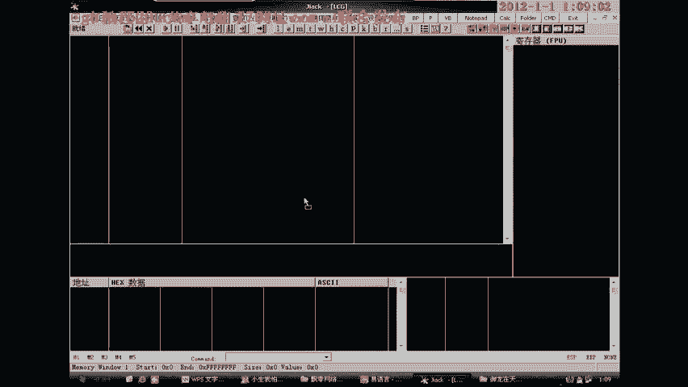

同樣看到，同樣看到，就是這裡，它也一樣調用到網絡，調用到網絡，大家就可以用這一個，用這一句去盡情的查找，當然不可能是這一句去調用到，它這個是應該是另外一個數據，應該是另外一個數據，就是說飄零的程序。

其實在我們有原碼的情況下，每一個功能，我們都可以通過它的對應的子程序的一個調用，子程序的一個調用，然後逐步去拆解，從原碼去解讀一個程序，那是最容易的，最容易的，如果大家留心看這幾課的課程的話。

從原碼去解讀，真的很容易的，我們不是要，不好意思，是要看3。0的，3。0的，創格創建完畢，飄零寫DRO，寫數據，寫通訊數據，特徵數據，也就是說，他此時此刻，他此時此刻，他已經把那個特徵數據，登錄標誌。

等你，登錄現場，防爆破初始化，取文件特徵制，取文件特徵制，他也就是取這個用戶名，然後進行防爆破初始化的話，也就是進行一個加密，加密後的密鑰，就會和那個3。0的一個管理，管理當然我給大家看一下，他就會。

給這裡的文件特徵制，進行一個比較，針對這個位置進行一個比較，文件特徵制，就這個特徵制，我們可以選擇這個文件，然後進行加密，然後他就，我們這裡設置一下，他就讀取的是這個判斷，讀取的是這個判斷，你看。

模式一，然後標誌，收費模式，標誌，就到達了這，驗證帳號標誌，然後標誌為一，標誌為一，標誌為一，如果這裡失敗，那麼也就等於標誌為二，標誌為二，今天我們可以就是，這個3。0的話，就是如果，僅僅只是3。

0的話，很簡單的，很簡單，他的密鑰，他的密鑰如果在讀取的時候，他都會一定會與網絡連接，與網絡連接，就他會讀取那個密鑰，其他的信息，基本上也沒啥的了，也沒啥的了，就飄零的話，3。0，你看這裡就是，這裡。

靜態數據飄零難評，這裡就是那個飄零的一個難評，所以這個需要，特徵數據，靜態，靜態數據現場，就是我們得看一下，他的這個靜態數據現場，他是有雷力掉雲，嗯，嗯，嗯，嗯，看看下面(廣東省)，(廣東省)。

(廣東省)，(廣東省)，(廣東省)，(廣東省)，(廣東省)，(廣東省)，(廣東省)，(廣東省)，(廣東省)，(廣東省)，(廣東省)，(廣東省)，(廣東省)，(廣東省)，(廣東省)，(廣東省)。

(廣東省)，(廣東省)，(廣東省)，(廣東省)，(廣東省)，(廣東省)，(廣東省)，(廣東省)，(廣東省)，(廣東省)，(廣東省)，(廣東省)，(廣東省)，(廣東省)，(廣東省)，(廣東省)。

(廣東省)，(廣東省)，(廣東省)，(廣東省)，(廣東省)，(廣東省)，(廣東省)，(廣東省)，首先我們得找到那個，用到它的那個現成的，用到它的那個現成的，(廣東省)，(廣東省)，(廣東省)。

(廣東省)，(廣東省)，(廣東省)，(廣東省)，(廣東省)，(廣東省)，(廣東省)，(廣東省)，(廣東省)，(廣東省)，(廣東省)，(廣東省)，(廣東省)，(廣東省)，(廣東省)，(廣東省)。

(廣東省)，(廣東省)，(廣東省)，(廣東省)，(廣東省)，(廣東省)，(廣東省)，(廣東省)，(廣東省)，(廣東省)，(廣東省)，(廣東省)，(廣東省)，(廣東省)，(廣東省)，(廣東省)。

(廣東省)，(廣東省)，(廣東省)，(廣東省)，(廣東省)，(廣東省)，(廣東省)，(廣東省)，(廣東省)，(廣東省)，(廣東省)，(廣東省)，(廣東省)，(廣東省)，(廣東省)，(廣東省)。

(廣東省)，(廣東省)。

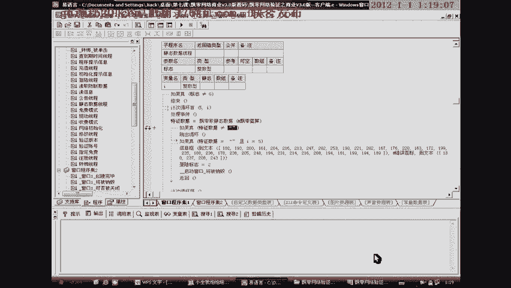

(廣東省)，(廣東省)，(廣東省)，(廣東省)。

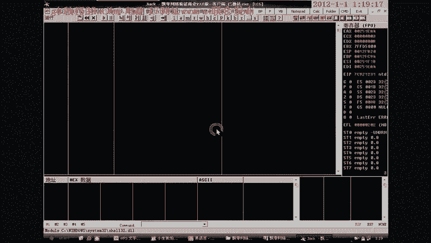

(廣東省)，(廣東省)，(廣東省)。

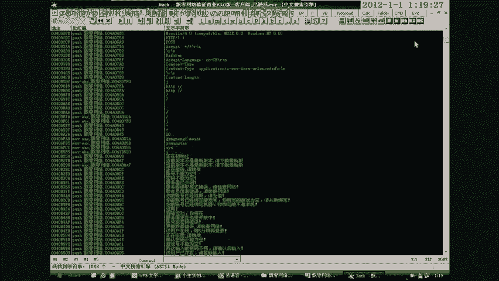

(廣東省)，(廣東省)，(廣東省)，(廣東省)，(廣東省)，(廣東省)，(廣東省)，(廣東省)，(廣東省)，(廣東省)，(廣東省)，(廣東省)，(廣東省)，(廣東省)，(廣東省)，(廣東省)。

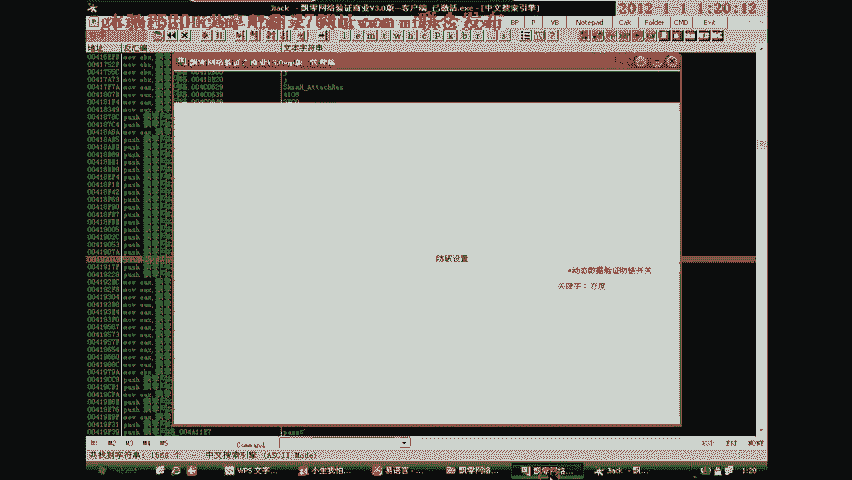

(廣東省)，(廣東省)，(廣東省)，(廣東省)，(廣東省)，(廣東省)，(廣東省)，(廣東省)，(廣東省)，(廣東省)，(廣東省)，(廣東省)，(廣東省)，(廣東省)，(廣東省)，(廣東省)。

(廣東省)，(廣東省)，(廣東省)，(廣東省)，(廣東省)，(廣東省)，(廣東省)，(廣東省)，(廣東省)，(廣東省)，(廣東省)，(廣東省)，(廣東省)，(廣東省)，(廣東省)，(廣東省)。

(廣東省)，(廣東省)，(廣東省)，(廣東省)，(廣東省)，(廣東省)，(廣東省)，(廣東省)，(廣東省)。

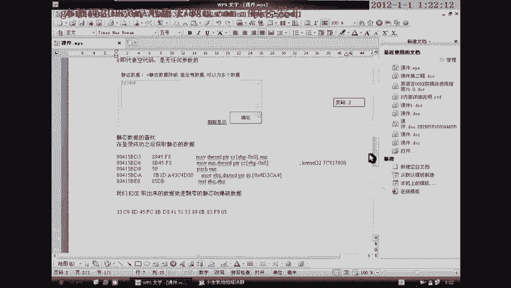

(廣東省)，(廣東省)，(廣東省)，(廣東省)，(廣東省)，(廣東省)，(廣東省)，(廣東省)，(廣東省)。

