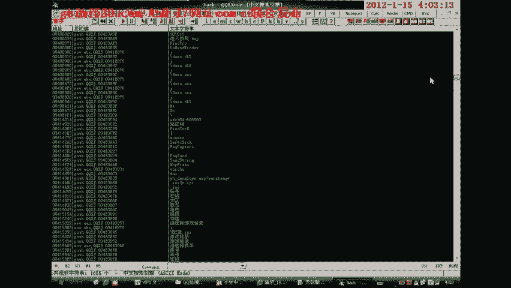
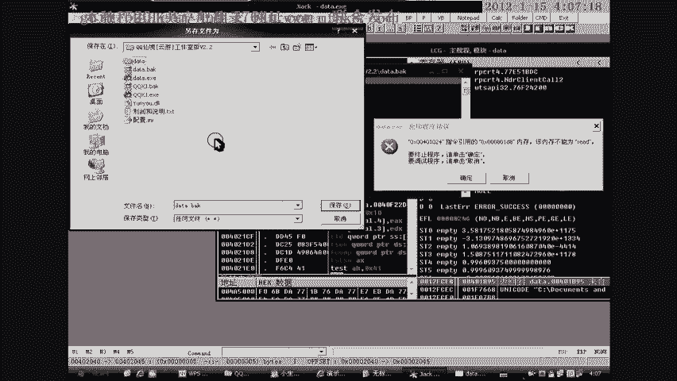
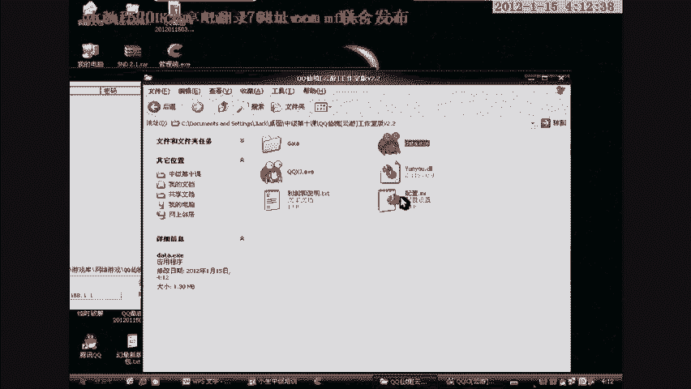

# 【破解】小生我怕怕中级逆向班 - P13：13.10-1 - 计算机学习委员 - BV1gE411u7WG

(字幕君：我都聽不懂了，請大家多多指教)。

大家好，我是小鐘五步步，今天我們開始我們的終極課程的第十課，一語言，暗裝的鎖定，首先我們來講解暗裝的大致原理，暗裝通常分為以下幾種，一是讀文件大小，是對功能進行限制，二是讀封包，三是讀網絡信息。

同樣是對功能進行限制，所謂的暗裝也就是讓你可以看到界面，但是無法看到該功能，暗裝部分將會用數據加密，然後解密，用於阻止別人調試，放在網絡當中，就這個程序而言，大家可以看一下，也是一語言的。

我們用這個來看，大家看一下，它現在是沒有功能的分支的了。

就是我們啟動起來之後，它把第一個創體給它註銷了，大家看一下，其實也就是點擊一個啟動多開，然後它就多開，好，那麼廢話就不多說，我們直接載入Od看。

這個程序是我已經脫殼的，但是不是太理想，可能跨越平台這方面應該是不能跨越才對，這是我的創體，這個是一語言的黑月。

這裡它是獲取一個創體的一個類名，那麼這種類型的就叫做分支，這裡我們先給它截個圖，就是這種通常被多數調用在安裝上面，多數語言都用它來進行安裝的一個調用，其實要破解好一款程序。

最好的就是去理解它的編寫的語言，好，那麼我們這裡先把它全部找出來，首先在這裡，然後把它給關閉掉，把這裡四字節給它切換成未知數，那麼這四字節，就這個，全部給它下成段，好，至於下一步就是按這個。

這個它其實沒有FF25了，它已經沒有FF25了，它這個程序原體數據已經變成了一堆匠骨叉叉，我們來看90，它n多的90，其實它黑越大多數都是透過APA去進行編寫，我們來看它的原體數據，它的原體變成什麼樣。

我先給大家講一下黑越吧，它是通過這樣一個支援的程序編輯的一個jq的介面，就是一個可視介面，然後剩下的就是它的那個語言的編譯的一個程序，這種也是像現在的語言一樣的，它是通過c的neak。

然後把它給逐一編譯的，相對來說現在的語言比它這個要強大不少，也要穩定不少，也要好寫不少，這個是純APA構造的，對，就是這樣，這裡就是它的語言體的一個，你看這個語言體可怕不可怕，就在這裡，從這裡調動過來。

看到沒有，它從這裡調動到它的語言體，語言體的一個核心，從這裡到這裡，就來到這，這些都是無數的一個分支，當然我們不用管它，我們現在首先調動到這，這裡也就是第一個分支，也就是它的創建創體的位置。

它首先有網絡通信，然後就到它這裡，它有網絡通信之後，它這個就在這裡去調動，然後這裡它是不關事的，你看，只是一個鋁碳，然後這裡就自然就是退出了，自然電容退出，就程序不可用，自然電容退出。

那麼可以判斷這裡就是我們的第一個分支，第一個分支，然後這個分支，它會，我們來看，然後到這裡，然後繼續到這裡，都是一系列的驗證，一系列的驗證，大家可以看一下，就我們把它全部下在這些位置上面，把這裡撤銷。

然後大家看，你看，它到這裡，對吧，就是它的那個，你看，青年還未註冊，卡密，網頁換版，那麼也就是說這裡就是第二個創體，溫馨提示請輸入卡號密碼，那麼這裡就是那個註冊的，它的黑月很好認，這裡好像是那個改密的。

更改帳號密碼的，我們來看這裡，換版，那麼也就是說，我們這樣邊界來看，換版密碼效應，這一段，這都是驗證，我們把它給它掉到那裡，我們看剛才下了一個push dbp，不是這個，是另外一個push dbp，對。

就是一個push dbp，我們現在給它一個掉入機會，我們來看一下這裡，它驗證沒驗證，它到不到那裡，還是不掉，好，重來，感到，因為驗證的位置，驗證的位置，我們來看一下，它到這裡了，重來。

這樣，掉到這，它到這，就是一個循環的檢測，但不關事的，就是它這個程序，就是到這，進行一個複製，讓它自己跳過去，不能讓它跳，它一跳過去就完蛋了，檢測多開，那麼可以判斷得出，它的窗體。

就是可以從上到下這樣去推，這樣去推，既然這裡是驗證，它第一個應該找的，應該找的窗體就是這個，那麼我們給它掉入這個，它第一個窗體應該掉入這個，然後它繼續到這，我們繼續在這看，它在檢測，循環的檢測。

檢測到之後，它就會啟動那個多開，啟動那個，啟動多開，大家可以看一下，它這個啟動多開，在這裡，在這裡，它是沒有那個十字的功能的，就我們這裡下個段，啟動多開，它沒有十字的功能，就我們現在在每一個。

Push EVP上面下段，來看它的這個啟動多開，啟動多開，在什麼功能，(看著手機)，(看著手機)，(看著手機)，(看著手機)，我們接著上下腿，在這裡，這裡就撤銷了那個，啟用多開的功能。

這裡就是控制啟用多開，(看著手機)，如果沒猜錯，功能是從這裡開始的，這裡應該就是那個多開，(看著手機)，138，134，(看著手機)，(看著手機)，這裡跳了，跳下來就是跳到這，它有很多很多的那個，分支。

大家可以看一下，這種就是構成了一個強大的那個安裝的一個，怎麼說呢，一個龐大的安裝網吧，應該說是，你看這裡，(看著手機)，它這個不是EVP，就是由這個地方過來的，我們可以把這個也給它複製了。

就看它第一個掉的那個，(看著手機)，我們還找到所有複製的EVP，第一個扣。

(看著手機)，卡住了，太多次了，(看著手機)，(看著手機)，(看著手機)，(看著手機)，(看著手機)，(看著手機)，大家稍等一下，有些卡，他媽的。

好了正常，就我們讓它直接掉入那個不是EVP，它就退出，看看，它就直接過來，好那麼，調試也就不用調試了，直接給大家講怎麼去破解吧，首先啊，首先它是找到內門，內門就是這裡，直接貼上它這裡，找到內門之後。

它會怎麼做呢，就會注入程序，這個就是，不用揣測的東西，甚至閉著眼睛都會想到這種東西，它是通過這個DD6，來判斷丈夫是否做錯，丈夫是否做錯，就是大家注意一下，這個DD6的字，這裡模糊，2，就是到期了。

到期了，這裡就是到期了，大家看一下，比較正一點，2就是到期了，其實如果是正常的話，你看這個比較，1，模糊0。

就模糊0的話，繼續向上，它就是通過各個分支的，比較，對它進行一個，複製，(嘆氣)，它這裡，是您，就繼續向上，廢話就不多說了，直接給大家講功能吧，就這裡，就是它的功能，繼續向上，找到這裡，找到功能之後。

我們需要怎麼做呢，我們先運行一下，第一個分支這樣就好了，這裡是第二個分支，我們把它保存一下，這樣就無視了。

所有的安裝，所有的安裝，就是音樂園的，安裝通常都是由分支去處理的，就是由分支去處理的，大家這樣看。

什麼都看不到，我們現在這樣來看，大家也看不到它注入了什麼。

對吧，我們來看吧，都沒注入東西，大家肯定以為我在FB大家，以為肯定是沒破解，好，那麼我們來這樣看。

進行，我來下一個C的，函數，我們來看，暫停了，沒看，沒注入出來，強制吧，這個不用多說是注入。

調用注入的，繼續，繼續把段點下上，真正的程序來了，真正的程序來了，注入了對吧，就它再怎麼注入，你什麼東西都看不到，什麼東西都看不到，就它注入的東西你也看不到，你什麼東西都看不到，這個就是今天主要要講的。

安裝。

你看，這是功能出來的，分鐘，各項功能就在這，這個多少多少開，我們，等於多少開就在這，然後我把它徹底運行起來，大家都看不到吧，但是我們在這裡，它還是存在的，它是實質的存在，我們不管修改什麼東西。

它就是現在已經注入，到內存裡去，到內存裡去，它這個就是那個英語言的內存注入，內存注入，你根本看不到，根本看不到，功能是已經注入進來了，就那麼簡單，就那麼簡單。

就是進，獲取它的進程，這個程序如果有一張正版卡的話，可以更好跟，可以更好跟，在那個，這上面更一下就知道，這個就是黑月的，一個安裝的一個講解，安裝的一個講解，它把功能藏在這裡面，所有功能全部藏在這裡面。

就是解密函數，解密函數，大家看，它會把這個先解密，解密之後然後得到一個掉，得到一個掉，然後把它給注入進去，這裡面什麼都沒有，什麼都沒有，大家可以看一下，什麼都沒有，就兩個英語言，繼續出來。

大家看一個無殼的掉，無殼的掉，但我們剛才所看到的是，絕對有殼的，大家都已經看到了，我這裡就不詳加解釋，這個就是那個掉，我們再來繼續這個掉，你看，它什麼都沒有，對不起，什麼都沒找到，就是它已經把這個。

全部都給解密了，就是我們，我們所破解的，它就是已經是正確了，正確了，就是它解密後還有VM，還有VM，好，那麼我們就來講解這個，CC的，CC的，首先它是無殼的，這個是附加的課程，附加的課程。

就是因為這個安裝的程序，不太好找，找到這樣一個分支的程序，就是它的，分支通常，安裝都是由分支去控制，由各項分支去控制，控制著，各個安裝，每一個安裝，就是我們，直接把它的功能給掉了，把它的功能給掉了。

就是每一個分支它都有相應的控制，相應的控制，我們只需要從，一開始把它給調用過去，就OK了，調用過去就OK了。

其實分支，這東西很好處理，像這種類型的，因為它是需要，一定的數據解密之後，得到一個循環。

然後才會調到這些數據去，好，這裡就可以看到，它的那個解密了，解密，但是我們既然。

要破解的是，這樣一個程序，就是我所說的，它從網絡調用來的解密，但是這個程序，它絕對不是這樣的，好，大家看一下吧，科科先進雲流，它就是通過這裡，讀取到這幾個網址，讀取到這幾個網址，就是它的日名，日名。

那麼我們這裡，看一下吧，百度，結果，5213，誒，1314，誒，不對，先取一下啊，誒，郵件裡面是說，難道是這個，不是這個就是一節課啊，就破解這種東西啊，就是別用自己的課程去，別用自己的博客去搞啊。

就是我用一個，重新註冊的一個博客，就是，也是為了破它這個程序吧，誰訪問了都知道，全部給它換成這個，tk，我的文件我已經上傳好了，它是用這個做分割符，好修改成功，閱讀全文，好OK，網址得到，OK。

找身分證，這些就是他們用過的外掛，所以能夠查出來，是哪些人，哪些人在用。

這邊我們來看看，這樣，然後把它替換掉，這個就不多說了，怎麼替換大家都懂，因為它這個是解析它的域名下來的，多了一個，00天龍，保存，好在這裡下個段，那個txt我已經上傳了的。

已經上傳了，就這個txt我已經上傳了，上傳好了，就文件名要對應。

文件名要對應，cc的文件夾也要對應，就這個我再給大家說一下，1。0，3。0。

這幾個外掛全部都是它的，它的外掛，它的外掛，文件夾，然後文件，還有域名都要對應，每一個文件都要對應，好那麼我們繼續上下跟吧，還有啥想的，有網絡通信都寫出來了，看到沒在這，我們來看這裡，都寫到這裡。

然後文件夾，就是它這個，它會讀取一個文件夾，讀取一個文件夾，就是看你到底，是否存在這個文件夾，看可不可以先進，更新至多少多少版本，不讓它讀取，這裡1。x。0。2，好我們來正台，我們跳過來，先進。

它在上面，在這個位置，它就讀了，先進，我們從這裡開始跳，從這裡開始跳，跳到那裡，哪一個位置比較適合，跳到這吧，從這裡開始跳，跳到下面去，跳到下面，要提醒大家就是這個程序，它是帶有隔盤的，在我們調試階段。

需要先把隔盤去掉。

很危險，很危險，安全至上，小心第一，第二，第三，第四，第五，第六，第七，第八，第九，第十，第十一，第十二，第十三，第十四，第十五，第十六，第十七，第八，第九，從這裡開始跳，從這裡開始跳，跳下去。

直接邁過出錯的地方，當你再次跳下去時，你的隔盤就會被隔開。當你再次跳下去時，你的隔盤就會被隔開。當你再次跳下去時，你的隔盤就會被隔開。當你再次跳下去時，你的隔盤就會被隔開。

當你再次跳下去時，你的隔盤就會被隔開。當你再次跳下去時，你的隔盤就會被隔開。當你再次跳下去時，你的隔盤就會被隔開。當你再次跳下去時，你的隔盤就會被隔開。當你再次跳下去時，你的隔盤就會被隔開。

當你再次跳下去時，你的隔盤就會被隔開。當你再次跳下去時，你的隔盤就會被隔開。當你再次跳下去時，你的隔盤就會被隔開。當你再次跳下去時，你的隔盤就會被隔開。當你再次跳下去時，你的隔盤就會被隔開。

當你再次跳下去時，你的隔盤就會被隔開。當你再次跳下去時，你的隔盤就會被隔開。當你再次跳下去時，你的隔盤就會被隔開。當你再次跳下去時，你的隔盤就會被隔開。當你再次跳下去時，你的隔盤就會被隔開。

當你再次跳下去時，你的隔盤就會被隔開。當你再次跳下去時，你的隔盤就會被隔開。當你再次跳下去時，你的隔盤就會被隔開。當你再次跳下去時，你的隔盤就會被隔開。當你再次跳下去時，你的隔盤就會被隔開。

當你再次跳下去時，你的隔盤就會被隔開。當你再次跳下去時，你的隔盤就會被隔開。當你再次跳下去時，你的隔盤就會被隔開。當你再次跳下去時，你的隔盤就會被隔開。當你再次跳下去時，你的隔盤就會被隔開。

當你再次跳下去時，你的隔盤就會被隔開。當你再次跳下去時，你的隔盤就會被隔開。當你再次跳下去時，你的隔盤就會被隔開。當你再次跳下去時，你的隔盤就會被隔開。當你再次跳下去時，你的隔盤就會被隔開。

當你再次跳下去時，你的隔盤就會被隔開。當你再次跳下去時，你的隔盤就會被隔開。當你再次跳下去時，你的隔盤就會被隔開。

當你再次跳下去時，你的隔盤就會被隔開。當你再次跳下去時，你的隔盤就會被隔開。當你再次跳下去時，你的隔盤就會被隔開。當你再次跳下去時，你的隔盤就會被隔開。當你再次跳下去時，你的隔盤就會被隔開。

當你再次跳下去時，你的隔盤就會被隔開。當你再次跳下去時，你的隔盤就會被隔開。當你再次跳下去時，你的隔盤就會被隔開。當你再次跳下去時，你的隔盤就會被隔開。當你再次跳下去時，你的隔盤就會被隔開。

當你再次跳下去時，你的隔盤就會被隔開。當你再次跳下去時，你的隔盤就會被隔開。當你再次跳下去時，你的隔盤就會被隔開。當你再次跳下去時，你的隔盤就會被隔開。當你再次跳下去時，你的隔盤就會被隔開。

當你再次跳下去時，你的隔盤就會被隔開。當你再次跳下去時，你的隔盤就會被隔開。當你再次跳下去時，你的隔盤就會被隔開。當你再次跳下去時，你的隔盤就會被隔開。當你再次跳下去時，你的隔盤就會被隔開。

當你再次跳下去時，你的隔盤就會被隔開。當你再次跳下去時，你的隔盤就會被隔開。當你再次跳下去時，你的隔盤就會被隔開。當你再次跳下去時，你的隔盤就會被隔開。當你再次跳下去時，你的隔盤就會被隔開。

當你再次跳下去時，你的隔盤就會被隔開。當你再次跳下去時，你的隔盤就會被隔開。當你再次跳下去時，你的隔盤就會被隔開。當你再次跳下去時，你的隔盤就會被隔開。當你再次跳下去時，你的隔盤就會被隔開。

當你再次跳下去時，你的隔盤就會被隔開。當你再次跳下去時，你的隔盤就會被隔開。當你再次跳下去時，你的隔盤就會被隔開。當你再次跳下去時，你的隔盤就會被隔開。當你再次跳下去時，你的隔盤就會被隔開。

當你再次跳下去時，你的隔盤就會被隔開。當你再次跳下去時，你的隔盤就會被隔開。當你再次跳下去時，你的隔盤就會被隔開。當你再次跳下去時，你的隔盤就會被隔開。當你再次跳下去時，你的隔盤就會被隔開。

當你再次跳下去時，你的隔盤就會被隔開。當你再次跳下去時，你的隔盤就會被隔開。當你再次跳下去時，你的隔盤就會被隔開。當你再次跳下去時，你的隔盤就會被隔開。當你再次跳下去時，你的隔盤就會被隔開。

當你再次跳下去時，你的隔盤就會被隔開。當你再次跳下去時，你的隔盤就會被隔開。當你再次跳下去時，你的隔盤就會被隔開。當你再次跳下去時，你的隔盤就會被隔開。當你再次跳下去時，你的隔盤就會被隔開。

當你再次跳下去時，你的隔盤就會被隔開。當你再次跳下去時，你的隔盤就會被隔開。當你再次跳下去時，你的隔盤就會被隔開。當你再次跳下去時，你的隔盤就會被隔開。當你再次跳下去時，你的隔盤就會被隔開。

當你再次跳下去時，你的隔盤就會被隔開。當你再次跳下去時，你的隔盤就會被隔開。當你再次跳下去時，你的隔盤就會被隔開。當你再次跳下去時，你的隔盤就會被隔開。當你再次跳下去時，你的隔盤就會被隔開。

當你再次跳下去時，你的隔盤就會被隔開。當你再次跳下去時，你的隔盤就會被隔開。當你再次跳下去時，你的隔盤就會被隔開。當你再次跳下去時，你的隔盤就會被隔開。當你再次跳下去時，你的隔盤就會被隔開。

當你再次跳下去時，你的隔盤就會被隔開。當你再次跳下去時，你的隔盤就會被隔開。

當你再次跳下去時，你的隔盤就會被隔開。當你再次跳下去時，你的隔盤就會被隔開。當你再次跳下去時，你的隔盤就會被隔開。

當你再次跳下去時，你的隔盤就會被隔開。當你再次跳下去時，你的隔盤就會被隔開。當你再次跳下去時，你的隔盤就會被隔開。當你再次跳下去時，你的隔盤就會被隔開。當你再次跳下去時，你的隔盤就會被隔開。

當你再次跳下去時，你的隔盤就會被隔開。當你再次跳下去時，你的隔盤就會被隔開。當你再次跳下去時，你的隔盤就會被隔開。當你再次跳下去時，你的隔盤就會被隔開。當你再次跳下去時，你的隔盤就會被隔開。

當你再次跳下去時，你的隔盤就會被隔開。當你再次跳下去時，你的隔盤就會被隔開。當你再次跳下去時，你的隔盤就會被隔開。當你再次跳下去時，你的隔盤就會被隔開。當你再次跳下去時，你的隔盤就會被隔開。

當你再次跳下去時，你的隔盤就會被隔開。當你再次跳下去時，你的隔盤就會被隔開。當你再次跳下去時，你的隔盤就會被隔開。當你再次跳下去時，你的隔盤就會被隔開。當你再次跳下去時，你的隔盤就會被隔開。

當你再次跳下去時，你的隔盤就會被隔開。當你再次跳下去時，你的隔盤就會被隔開。當你再次跳下去時，你的隔盤就會被隔開。當你再次跳下去時，你的隔盤就會被隔開。當你再次跳下去時，你的隔盤就會被隔開。

當你再次跳下去時，你的隔盤就會被隔開。當你再次跳下去時，你的隔盤就會被隔開。當你再次跳下去時，你的隔盤就會被隔開。當你再次跳下去時，你的隔盤就會被隔開。當你再次跳下去時，你的隔盤就會被隔開。

當你再次跳下去時，你的隔盤就會被隔開。當你再次跳下去時，你的隔盤就會被隔開。當你再次跳下去時，你的隔盤就會被隔開。當你再次跳下去時，你的隔盤就會被隔開。當你再次跳下去時，你的隔盤就會被隔開。

當你再次跳下去時，你的隔盤就會被隔開。當你再次跳下去時，你的隔盤就會被隔開。當你再次跳下去時，你的隔盤就會被隔開。當你再次跳下去時，你的隔盤就會被隔開。當你再次跳下去時，你的隔盤就會被隔開。

當你再次跳下去時，你的隔盤就會被隔開。當你再次跳下去時，你的隔盤就會被隔開。當你再次跳下去時，你的隔盤就會被隔開。當你再次跳下去時，你的隔盤就會被隔開。當你再次跳下去時，你的隔盤就會被隔開。

當你再次跳下去時，你的隔盤就會被隔開。當你再次跳下去時，你的隔盤就會被隔開。當你再次跳下去時，你的隔盤就會被隔開。當你再次跳下去時，你的隔盤就會被隔開。當你再次跳下去時，你的隔盤就會被隔開。

當你再次跳下去時，你的隔盤就會被隔開。當你再次跳下去時，你的隔盤就會被隔開。當你再次跳下去時，你的隔盤就會被隔開。當你再次跳下去時，你的隔盤就會被隔開。當你再次跳下去時，你的隔盤就會被隔開。

當你再次跳下去時，你的隔盤就會被隔開。當你再次跳下去時，你的隔盤就會被隔開。當你再次跳下去時，你的隔盤就會被隔開。當你再次跳下去時，你的隔盤就會被隔開。當你再次跳下去時，你的隔盤就會被隔開。

當你再次跳下去時，你的隔盤就會被隔開。當你再次跳下去時，你的隔盤就會被隔開。當你再次跳下去時，你的隔盤就會被隔開。當你再次跳下去時，你的隔盤就會被隔開。當你再次跳下去時，你的隔盤就會被隔開。

當你再次跳下去時，你的隔盤就會被隔開。當你再次跳下去時，你的隔盤就會被隔開。當你再次跳下去時，你的隔盤就會被隔開。當你再次跳下去時，你的隔盤就會被隔開。當你再次跳下去時，你的隔盤就會被隔開。

當你再次跳下去時，你的隔盤就會被隔開。當你再次跳下去時，你的隔盤就會被隔開。當你再次跳下去時，你的隔盤就會被隔開。當你再次跳下去時，你的隔盤就會被隔開。當你再次跳下去時，你的隔盤就會被隔開。

當你再次跳下去時，你的隔盤就會被隔開。當你再次跳下去時，你的隔盤就會被隔開。當你再次跳下去時，你的隔盤就會被隔開。當你再次跳下去時，你的隔盤就會被隔開。當你再次跳下去時，你的隔盤就會被隔開。

當你再次跳下去時，你的隔盤就會被隔開。當你再次跳下去時，你的隔盤就會被隔開。當你再次跳下去時，你的隔盤就會被隔開。當你再次跳下去時，你的隔盤就會被隔開。當你再次跳下去時，你的隔盤就會被隔開。

當你再次跳下去時，你的隔盤就會被隔開。當你再次跳下去時，你的隔盤就會被隔開。當你再次跳下去時，你的隔盤就會被隔開。當你再次跳下去時，你的隔盤就會被隔開。當你再次跳下去時，你的隔盤就會被隔開。

當你再次跳下去時，你的隔盤就會被隔開。當你再次跳下去時，你的隔盤就會被隔開。當你再次跳下去時，你的隔盤就會被隔開。當你再次跳下去時，你的隔盤就會被隔開。當你再次跳下去時，你的隔盤就會被隔開。

當你再次跳下去時，你的隔盤就會被隔開。當你再次跳下去時，你的隔盤就會被隔開。當你再次跳下去時，你的隔盤就會被隔開。當你再次跳下去時，你的隔盤就會被隔開。當你再次跳下去時，你的隔盤就會被隔開。

當你再次跳下去時，你的隔盤就會被隔開。當你再次跳下去時，你的隔盤就會被隔開。當你再次跳下去時，你的隔盤就會被隔開。當你再次跳下去時，你的隔盤就會被隔開。當你再次跳下去時，你的隔盤就會被隔開。

當你再次跳下去時，你的隔盤就會被隔開。當你再次跳下去時，你的隔盤就會被隔開。

當你再次跳下去時，你的隔盤就會被隔開。當你再次跳下去時，你的隔盤就會被隔開。當你再次跳下去時，你的隔盤就會被隔開。當你再次跳下去時，你的隔盤就會被隔開。當你再次跳下去時，你的隔盤就會被隔開。

當你再次跳下去時，你的隔盤就會被隔開。當你再次跳下去時，你的隔盤就會被隔開。當你再次跳下去時，你的隔盤就會被隔開。當你再次跳下去時，你的隔盤就會被隔開。當你再次跳下去時，你的隔盤就會被隔開。

當你再次跳下去時，你的隔盤就會被隔開。當你再次跳下去時，你的隔盤就會被隔開。當你再次跳下去時，你的隔盤就會被隔開。當你再次跳下去時，你的隔盤就會被隔開。當你再次跳下去時，你的隔盤就會被隔開。

當你再次跳下去時，你的隔盤就會被隔開。當你再次跳下去時，你的隔盤就會被隔開。當你再次跳下去時，你的隔盤就會被隔開。當你再次跳下去時，你的隔盤就會被隔開。當你再次跳下去時，你的隔盤就會被隔開。

當你再次跳下去時，你的隔盤就會被隔開。當你再次跳下去時，你的隔盤就會被隔開。當你再次跳下去時，你的隔盤就會被隔開。當你再次跳下去時，你的隔盤就會被隔開。當你再次跳下去時，你的隔盤就會被隔開。

當你再次跳下去時，你的隔盤就會被隔開。當你再次跳下去時，你的隔盤就會被隔開。當你再次跳下去時，你的隔盤就會被隔開。當你再次跳下去時，你的隔盤就會被隔開。當你再次跳下去時，你的隔盤就會被隔開。

當你再次跳下去時，你的隔盤就會被隔開。當你再次跳下去時，你的隔盤就會被隔開。當你再次跳下去時，你的隔盤就會被隔開。

當你再次跳下去時，你的隔盤就會被隔開。當你再次跳下去時，你的隔盤就會被隔開。當你再次跳下去時，你的隔盤就會被隔開。當你再次跳下去時，你的隔盤就會被隔開。當你再次跳下去時，你的隔盤就會被隔開。

當你再次跳下去時，你的隔盤就會被隔開。當你再次跳下去時，你的隔盤就會被隔開。當你再次跳下去時，你的隔盤就會被隔開。當你再次跳下去時，你的隔盤就會被隔開。當你再次跳下去時，你的隔盤就會被隔開。

當你再次跳下去時，你的隔盤就會被隔開。當你再次跳下去時，你的隔盤就會被隔開。當你再次跳下去時，你的隔盤就會被隔開。當你再次跳下去時，你的隔盤就會被隔開。當你再次跳下去時，你的隔盤就會被隔開。

當你再次跳下去時，你的隔盤就會被隔開。我應該這樣。

一點點，我應該這樣。一點點，我應該這樣。腹肌太爛了，太卡了。嘴卡了。嘴卡了。我真的不知道是誰去賣的臉卡。不管是誰賣的吧，我都不想管。我都不想管。我好像給過別人臉卡。我好像給過別人臉卡。多餘的。

我那天精神不好的時候，我直接給他清空。大家看，控制他。大家看，控制他。我們來看他的這個。明明是一斤米二手。明明是一斤米二手。我看他。我看他。我看他。

我看他。我看他。我看他。我看他。我看他。[麥克風旋轉中。]，[麥克風旋轉中。]，[麥克風旋轉中。]。

[麥克風旋轉中。]，[麥克風旋轉中。]。

[麥克風旋轉中。]。

[麥克風旋轉中。]，[麥克風旋轉中。]，[麥克風旋轉中。]，[麥克風旋轉中。]，[麥克風旋轉中。]，[麥克風旋轉中。]，[麥克風旋轉中。]，[麥克風旋轉中。]，[麥克風旋轉中。]。

[麥克風旋轉中。]，(字幕製作：貝爾)，(字幕由Amara。org社区rå 245mm 纳入)。