# 【破解】小生我怕怕中级逆向班 - P11：11.9-1 - 计算机学习委员 - BV1gE411u7WG

大家好，我是小周的朋友，今天我们开始我们的终极课程的第九课，一语言之窗体的伪造。

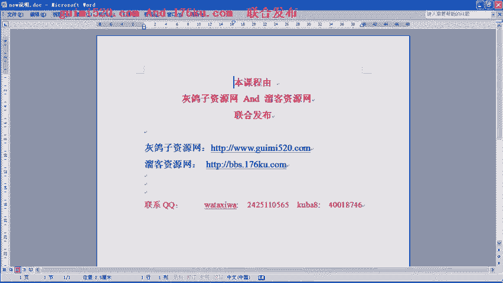

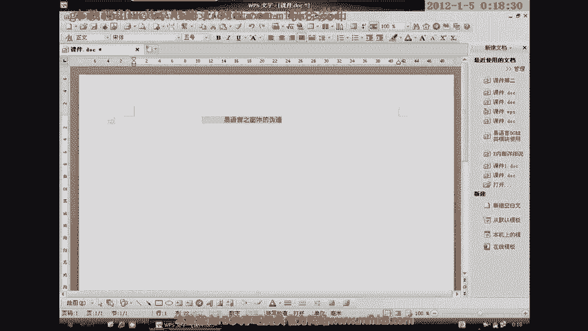

一语言的窗体，在前面的课程我已经说过了，这里是两个语言已经创建的窗体1的一个程序，目前都是运用在外国上面，就是另外一种窗体的创建，好，那么今天我们来看一下，先轻松一下UDD5的问题。

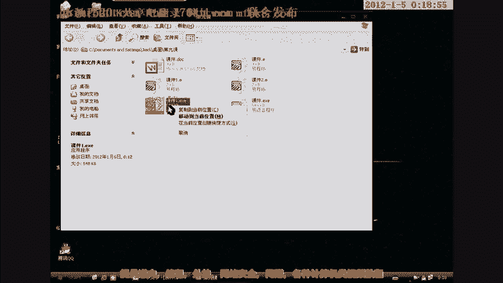

这两个都是无壳的，无壳的，就一个滑窗体，啥都没有，大家可以看到。

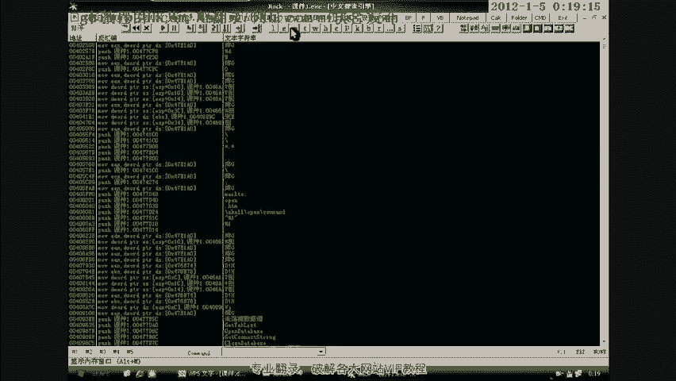

这个就是另外一个窗体的创建，然后我们再来看这个。

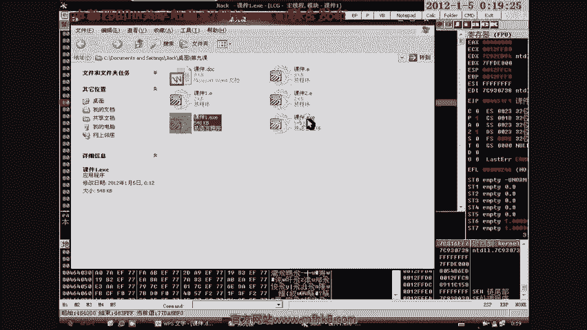

两个都是一样的，同样是创建窗体。

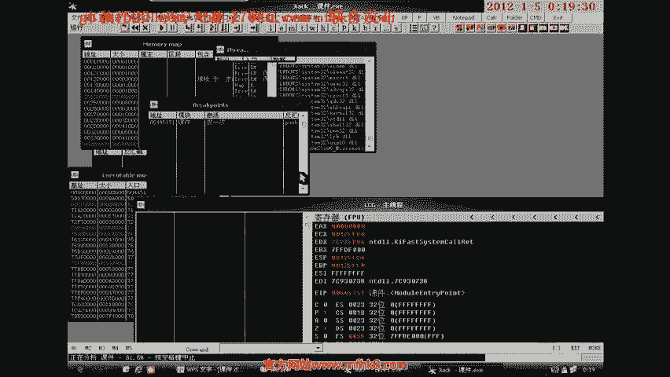

未设置的窗体，没有进行特殊的设置的窗体创建代码，就是这个样子，就我们给它截个图，方便大家看，就我们讲过，讲过这个窗体创建的代码。

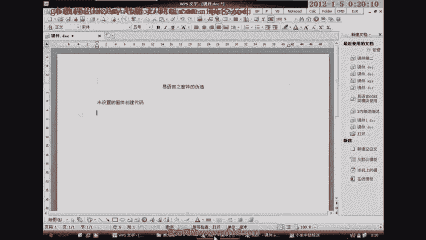

它是这个样子。

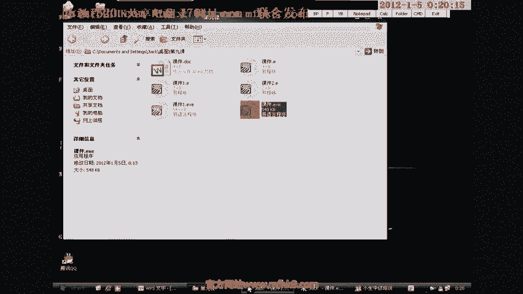

就是这个样子，设置过之后的窗体创建代码，它将是这样一个形式的。

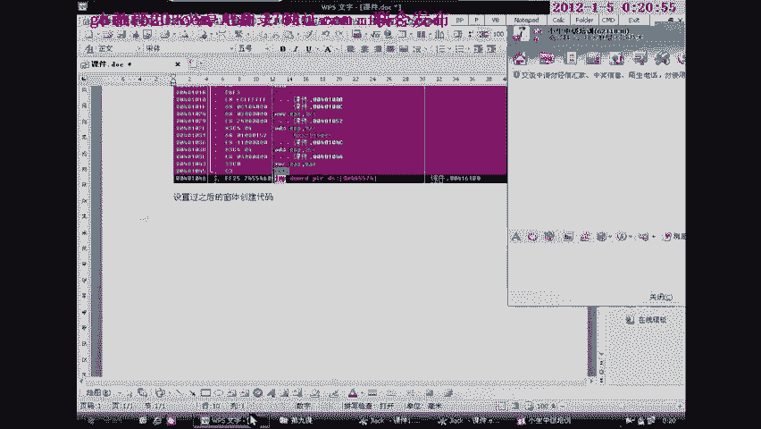

这样一个形式，这个图还没截好，再把这里拉上来一些，再拉上来一些，这个创建代码的长度就要稍微高一些。

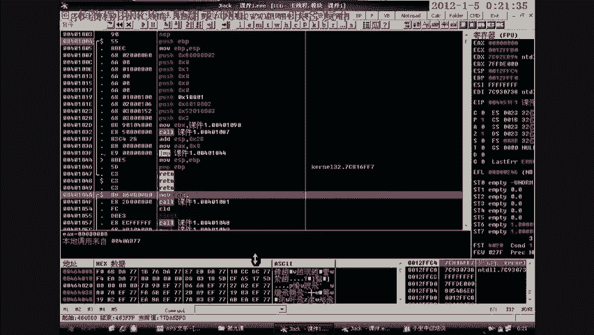

对，就是这个，它创建在这儿，好，为什么说它是这个窗体的创建，窗体的创建，分为以下两种。

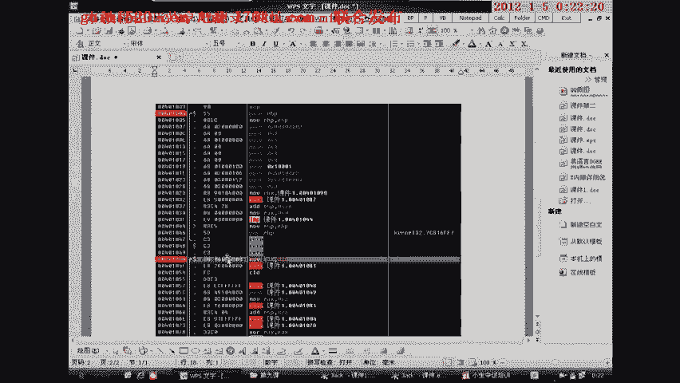

就是我们曾经提及过，就是替换一个窗体，替换纸窗体达到另外一种效果，我们一开始讲的是这一种，就在这个位置去进行一个替换，那么大家就看一下，它是在这里来进行一个窗体的一个创建事件，一个窗体的创建事件。

那么我们来同样看一看这个程序，它是在什么位置去创建，你看，创建纸窗体事件的一个。

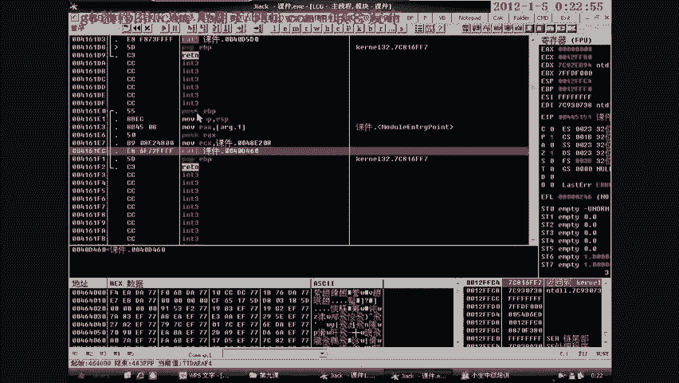

接口都不一样，接口都不一样。

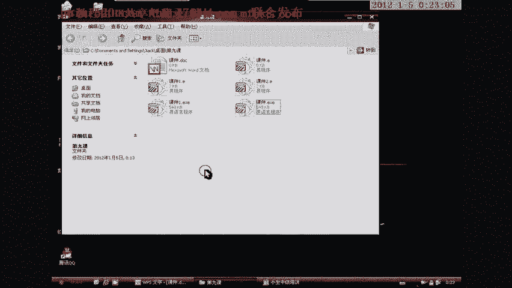

这里就是课件一的，它是通过语言系统设置，设置启动纸程序，由纸程序去启动，就这样启动一个纸程序，然后再创建窗体，那么我们给它设置一个很大的按钮，然后再给它加一个窗体，一般外挂都是两个窗口，或者更多。

1-2，我们保存一下。

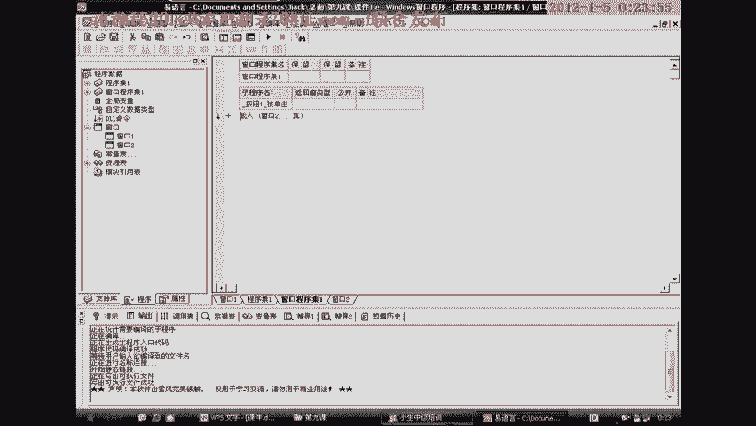

我们来看，它这里弹出来两个窗体，我们今天主要介绍的就是它。

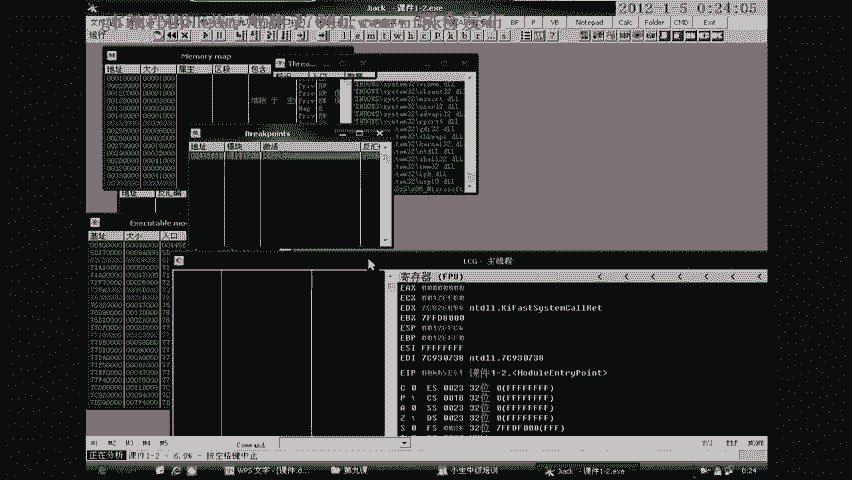

大家来看，我们来看它这两个窗体创建的事件，有什么不一样，有什么不一样，如果大家留心，留心不难发现，不难发现，就是它这个，一元的窗体，一元的窗体，是这种类型的，你看，我们来核对一下，你看它，8002。

8002，001，000，三个0，然后000，三个0，然后1001，然后这里，副窗体AD，副窗体AD不一样，主窗体AD，大家看一下，主窗体AD，这个就是一个主窗体，一个创建的一个事件流程。

就这两处不一样，其余的都是一样的，其余的都是一样的，好，那么我们就特地来VM掉第一只窗体事件，第一只窗体事件，就是这一局，通常我们把它给VM掉，我们用最强的保护，最强的保护，变异加虚拟。

就是把它给整个给它保护起来，就把这一段整个给保护起来。

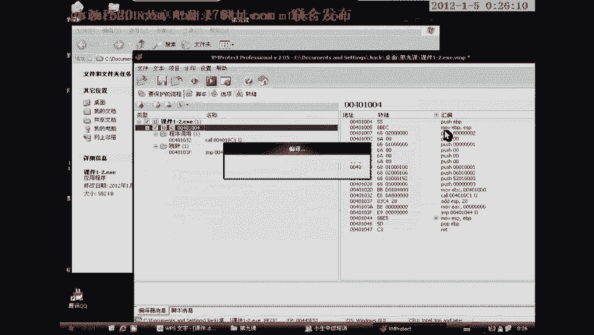

我们看一下。

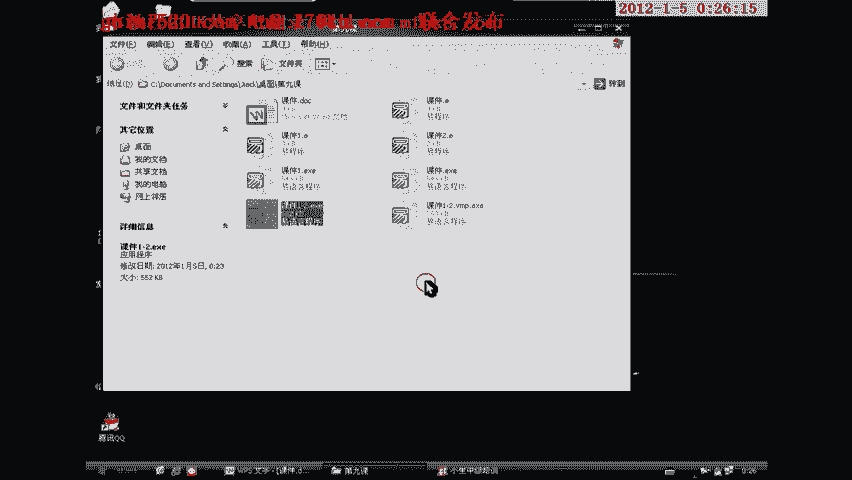

这个是我们已经保护好的代码，保护好的代码。

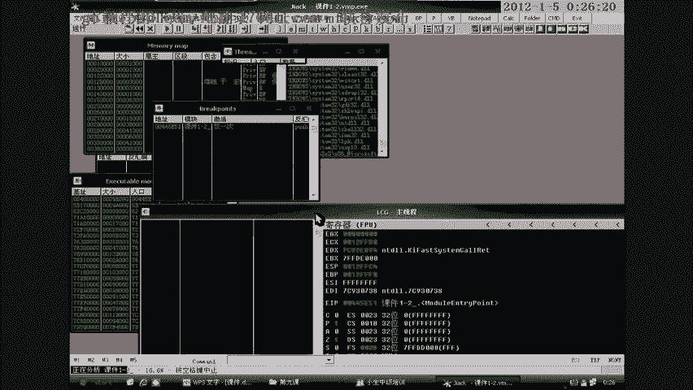

一会儿我去找个外国来，我们临场实战一下，大家看一下，它现在是被VM成这个样子，VM成这个样子，我们刚才已经知道了，窗体创建只是由，窗体AD不一样，造成所创建的窗体不一样，好，既然既然我们知道push。

push的作用，就是压入窗体，就是压入代码，对战，当然我们这里，我们这里可以把它说成窗体代码，但是为了让它广义一些，我们就说成压入代码到对战，这里就是对战窗口，而这一个代码，这一个代码。

它会有怎么一个创建，怎么一个创建来进行完成，这里我们来看，它已经VM了，对吧，我们不需要到那里去找，我们就在这里下个段，然后运行它，这样就可以看出来，他所压入的代码。

就我们在他窗体要创建的一个只程序事件上面去下段，然后他这里分别是push，802，802，我直接给他多复制几段，多复制几段，然后回头来修改，好，push 802，然后接着，都是push0。

然后push1，然后push0，push0，push0，三个0之后，又是1001，push60102，然后push，120103，最后接着的是push3，push3，至于这一句，至于这一句。

这个Move EVP，我们就可以看这里，Move EVX，我们就可以看这里的EVX的值，我们就可以猜出他的是，Move EVX，这个，然后所有创建窗体的语句就是这一句，那么通用调用的就是这一句。

然后最后就是这几个字，这几个字，这一语言只要采取的是这种形式的，他的这个规律是不会变的，就他不管调用了几个窗体，他调用窗体的指示键，都是在这里面去完成的，就是在这个位置去完成的，我们来对一下。

我们把它给汇编一下，看看他能不能运行，能不能运行，首先，首先当然是这两个是不会少的老规矩，日语言永久不变的老规矩，那个是不会少的，(音量調整中)，(音量調整中)，(音量調整中)。

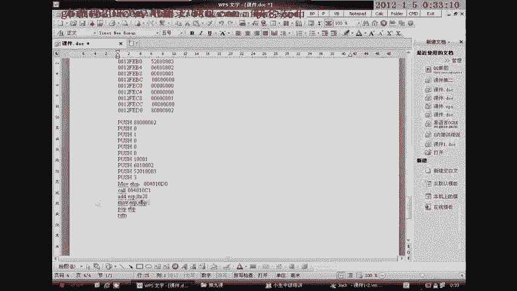

(音量調整中)，大家就可以看出來多了這樣一串帶子，不管它，把它給徹底拉不掉，(音量調整中)。

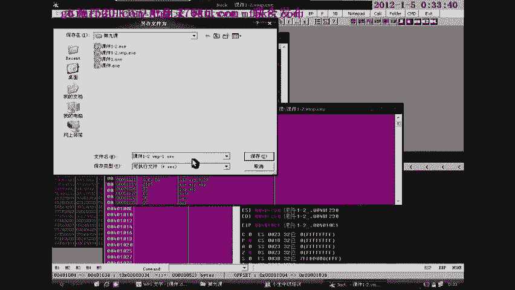

(音量調整中)。

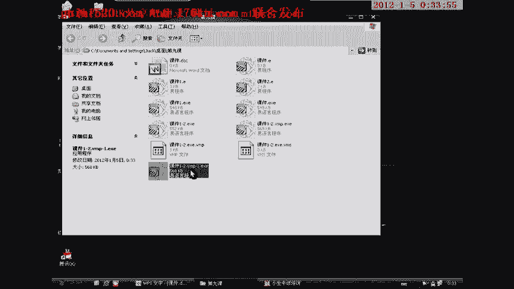

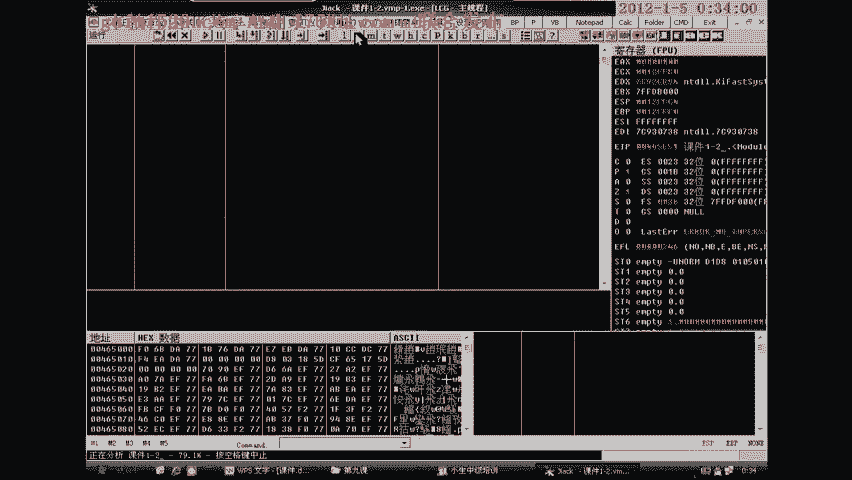

我們這下重新開原有沒有VM過的，來進行比對，有什麼地方不一樣。

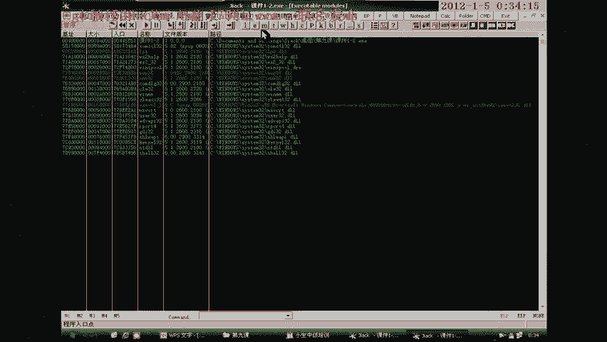

大家可以看到，它有這樣一個，這樣一絕還有這樣一絕，我們沒有會變到，但是，它這裡是一樣OK的，我們用這個裝體給它創新，它也一樣調這個裝體，一語言，不管你VM在VM有多漂亮，我這裡再用它的程序給它還原一份。

看看它的直接機是不是我剛剛佔用，看到沒有，VM再漂亮，它的直接機，那也只是剛剛，VM的多少直接機，這裡直接機都會在的，這個我們把它徹底還原，這是從它那個複製過來的，但是我們這種可以這種複製。

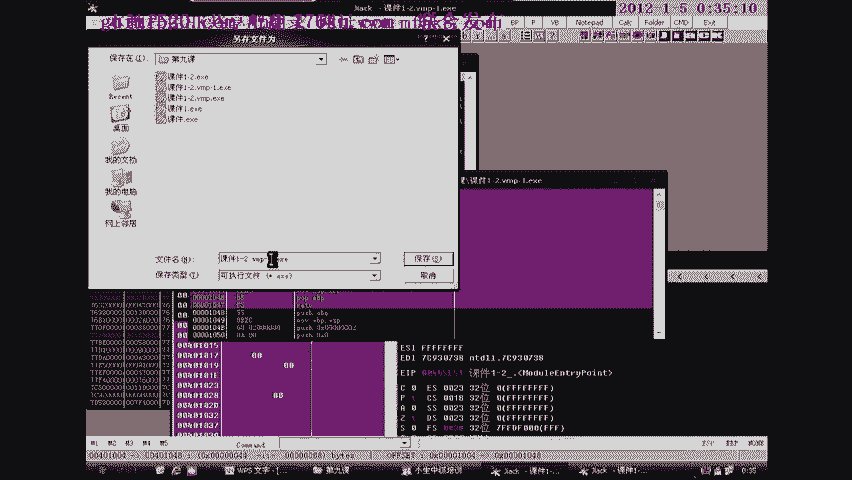

也可以不用這樣複製，大家可以看得到，都是一樣的，功能都是存在的，就是說一語言的代碼，一語言的代碼，我們可以從它的另外一個紙裝體的一個事件，去搜索它，我這裡找一下，看看找一個飄零的驗證碼，就用它的這個2。

7的客戶端吧。

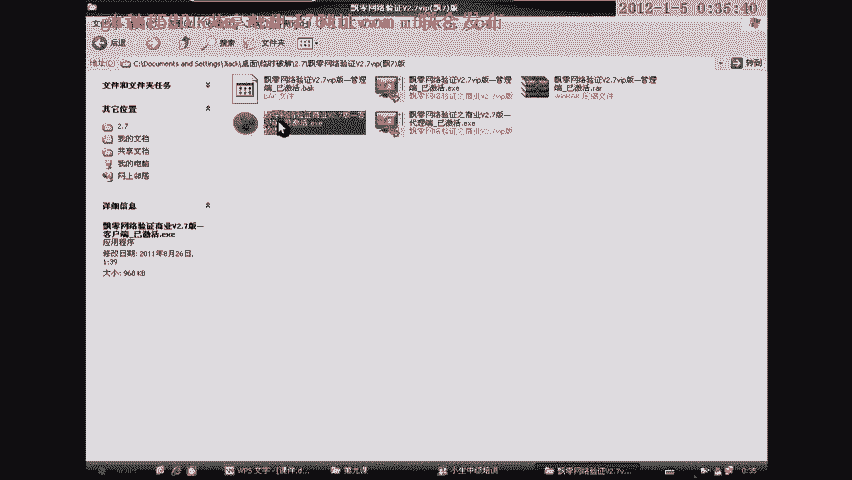

然後我們來看。

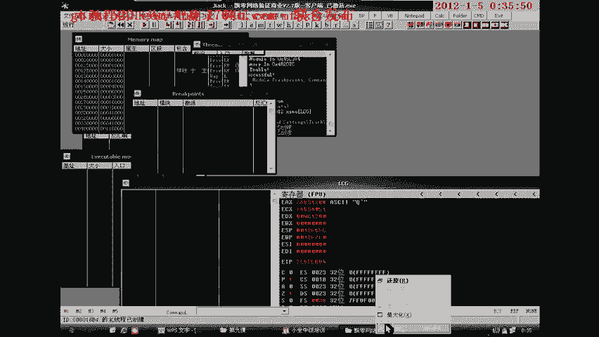

看看它是屬於哪一種，它這個創建的就不是那麼好了，那麼我們就用它的這個來給大家講解，一下這個客戶端的一個紙裝機的一個創建，就是任何作者所編譯出來的程序，那相差都是無幾的，就是大體上所調用到的位置。

那都是相差無幾的，大家可以看到這裡所調用到的也是這樣一句，然後這裡調用到的也是這樣一句，它都沒有任何的，就是我這裡給大家看，我把這裡，它既然兩個是一樣的，我把這裡換成這個樣，它們是一樣過的。

大家看一樣起來的。

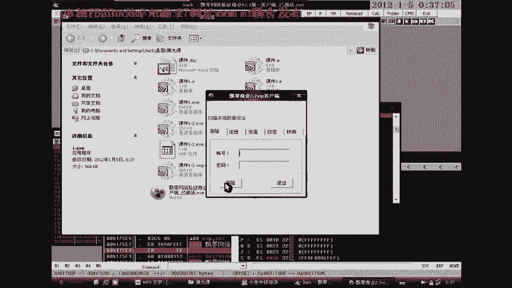

就是說我們用它的這個程序，用它的這個程序，我們來核對一下，就是我們看一下我們的客建，我們的客建當然肯定不像它的。

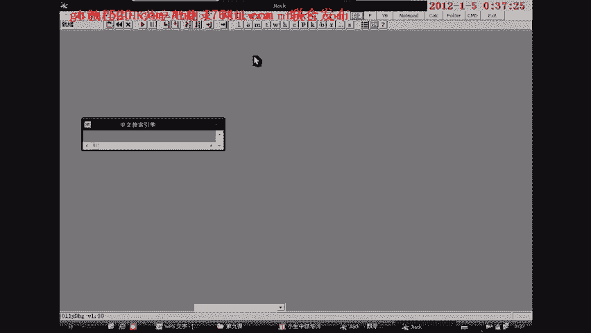

它這裡所調用到的都不一樣，並不是說這種情況，通常我們就可以找一個，再把它的那個管理端也給複製過來，代理端吧，就我們來看代理端的別印。

就是我們只要找到一個。

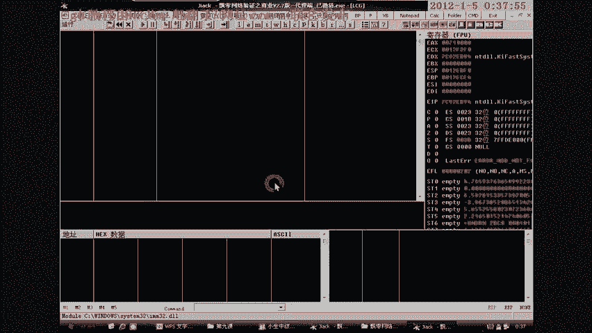

其中一個無殼的程序，不管它VM調哪裡，VM調什麼位置，基本上我們可以從它原有的代碼去拆解回來。

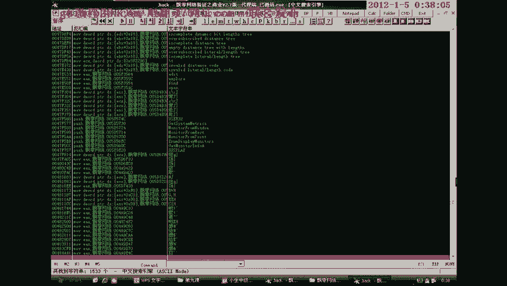

拆解回來，拆這個我們把它給拆出來，好這裡我們來看，你看我們來看它這個不一樣吧，但是我們這裡給它複製一份，這個因為它調用的位置不一樣，客戶端的位置不一樣，就，管理端刪了，找一份那個3。0的客戶端來。

因為那個每一個代碼，它所處置的智慧機不一樣，看一下這個有顆無殼無殼，這是它的3。0的。

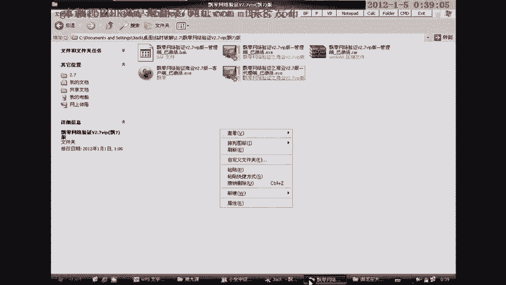

我們來看一下，就它的3。0。

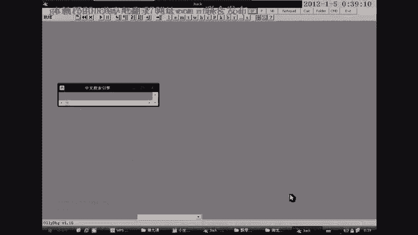

這個是一個外掛。

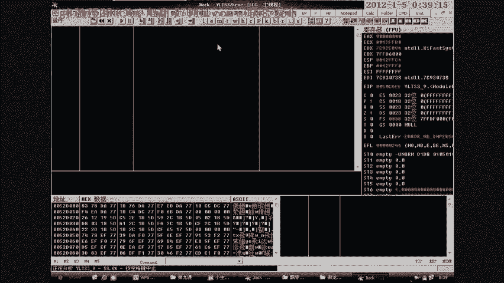

然後通過兩個人不同的編譯，不同的編譯，這個，就像它的那個管理端的一個粗糙化的手法一樣的，但這個位置，它通常是沒有人去把它給微壓抑鬱掉的，就我們來看，首先我們在這裡，我們把這個全部給它刪了斷。

我們看第二個粗糙化的窗體的位置是哪一句，就是這裡，就是這裡，這三句，它都是在粗糙化窗體，大家可以看一下，但是真正核心粗糙化的應該是這個口，就我們首先要看它這個窗體是在哪個位置去創建出來的。

彈出窗體的那個位置就是，推出了，那個推出按鈕，就是當我們遇見這種窗體無法創建的時候。

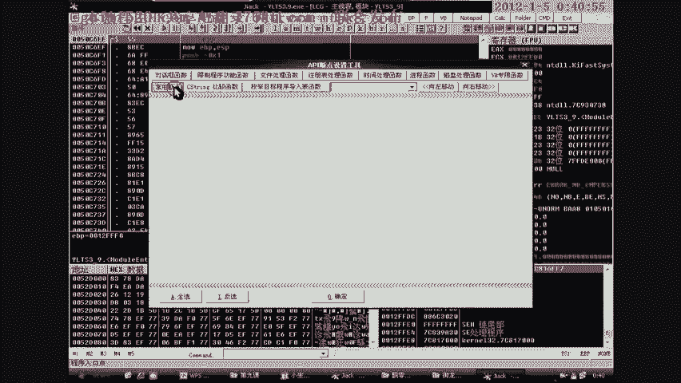

無法創建的時候，先把它推出給它解決，先把它推出給它解決，我們就找一個隨意給它創建一個窗體，讓它去執行我們所創建的窗體，它在這個位置，創建出來的窗體。

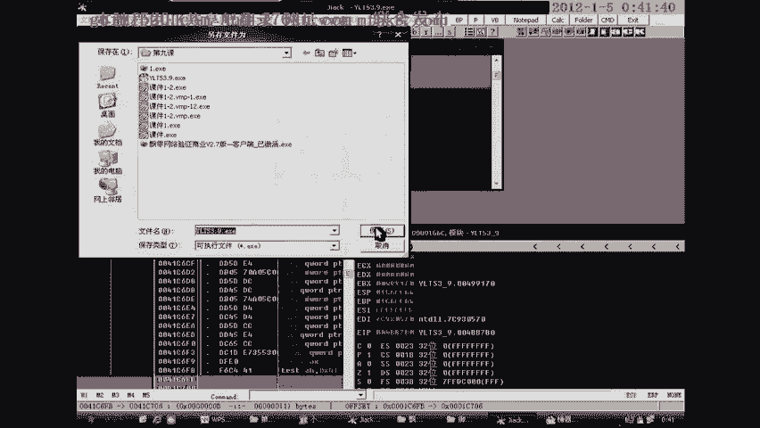

剩下的這些其實是在獨配字文件，我們來看。

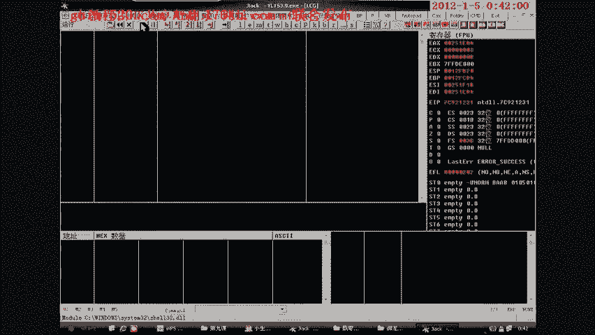

這樣，這裡就是第一個窗體，所創建的位置，我們把所有的窗體刪掉，然後在這裡刪一個段，看一下它是否創建了窗體，我可以告訴大家它就是在這創建的窗體，那個窗體是已經創建了的，我們把它給解決掉，大家看到。

它的窗體一樣是創建，對吧，現在我們來把它給污染掉，嘗試給它創建一個我們偽造出來的窗體，我們已知功能是這個，我們來看看這個是不是功能的窗體，我們首先要創建出功能的窗體來。

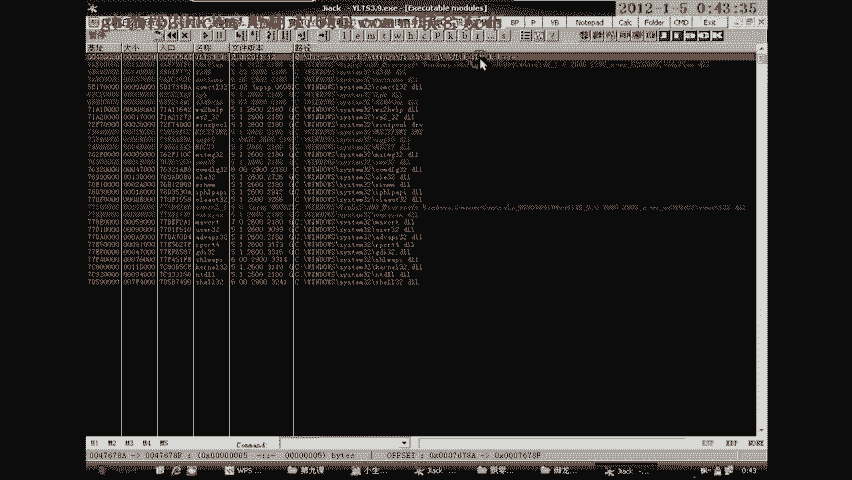

我們在這裡下個段，首先給它創建一個功能的窗體出來。

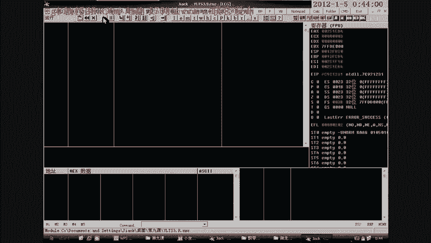

使用幫助，證明這裡並不是功能的那個窗體，但是它並不是沒用的，有用，這個位置有用，大家要記住我剛才所說的一切。

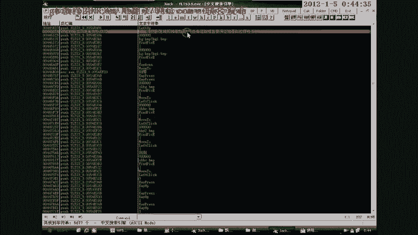

這個位置是有用的，我們現在需要的是這一段代碼，這樣一段代碼，也就是創建的一個代碼。

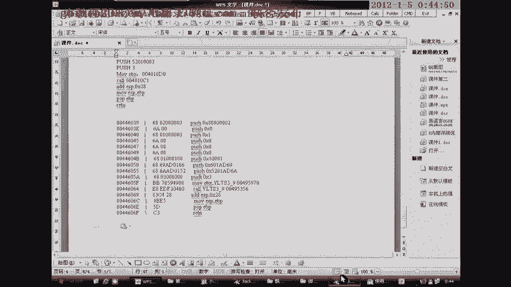

我們來看功能的介面。

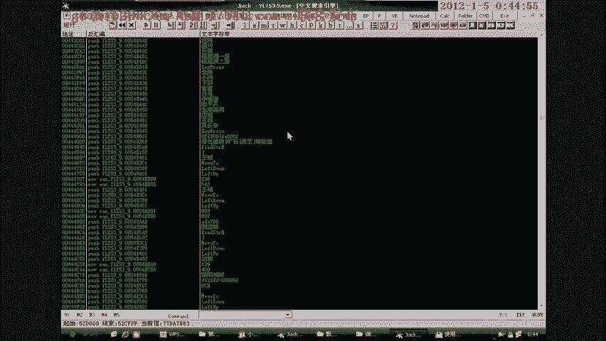

介面上的一個，這個腳本掛掉窗體的地方都很少，基本上都是一個腳本，在讀取一個功能代碼，功能代碼，對這個，我們同樣需要這兩個位置，這三個位置，給它來個輔助，扣這個位置，現在還有解壓聲音。

其實它彈出那個就表示，我們已經是找到了它的那個窗體，這裡是一個宿主循環，對就這裡，它註冊了一個，解壓的環節，我們這裡先不管它，我們把這一句給它複製保存了，就是讓它能看到窗體，讓它能看到窗體。

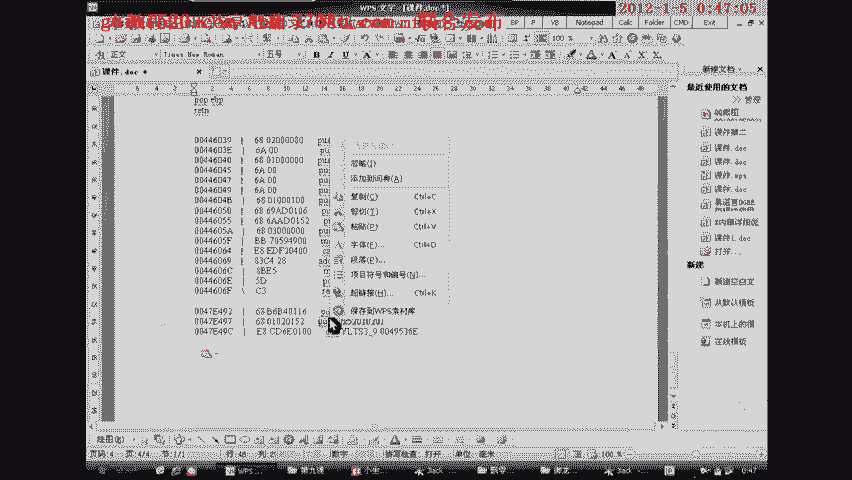

Fuji 520，201，推出了，它在推出安裝，也就是說，我們得把推出安裝給它幹掉，看清楚，推出安裝，把各個每一個推出給它幹掉，如果上下跳就是推出，這一句先不修改，我們需要改好一個程序，先改好一個程序。

然後重新再重新。

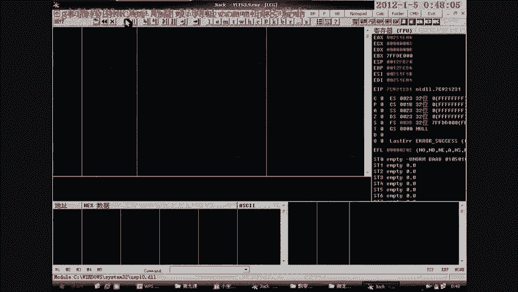

Fuji 520。

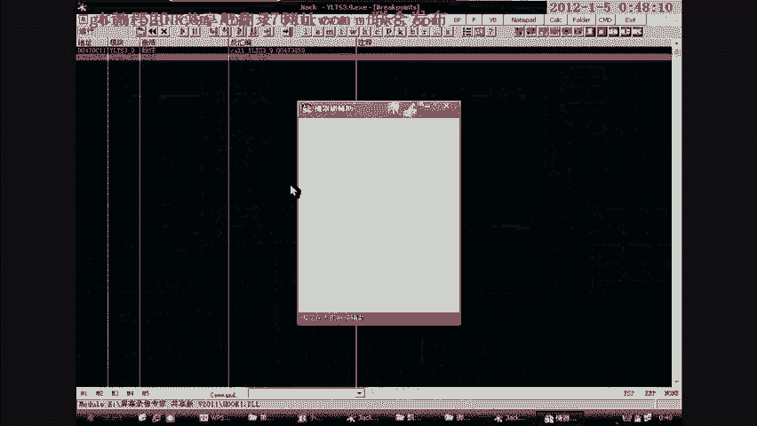

找到這裡，下刀，複製一下，我們這裡過來，你看這裡還有推出，還有推出，各種推出，飄名的推出特別多，推出特別多。

這裡又是一個推出，又是一個推出，不管了。

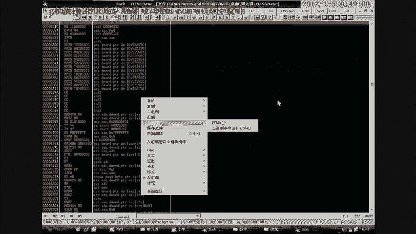

這個5201就讓它穿進去吧，免得每一次修改都麻煩死了，下邊越界，我教過大家下邊越界怎麼去處理的，找到那個，這個位置，然後看它的下邊越界是什麼位置，注意看，它的下邊越界那個調用的位置，這裡。

這個特徵已經告訴過大家的了，大家都懂的，下標，看到沒有，這裡下邊越界，就他們每一個下邊越界我們都有辦法給它找到，有辦法給它找到，又是一個推出，又是一個推出，緊跟著的又是一個推出，很長一段代碼。

其實你已經過期了，在這個位置，給大家看一下，這樣每一個安裝就算是排除完畢。

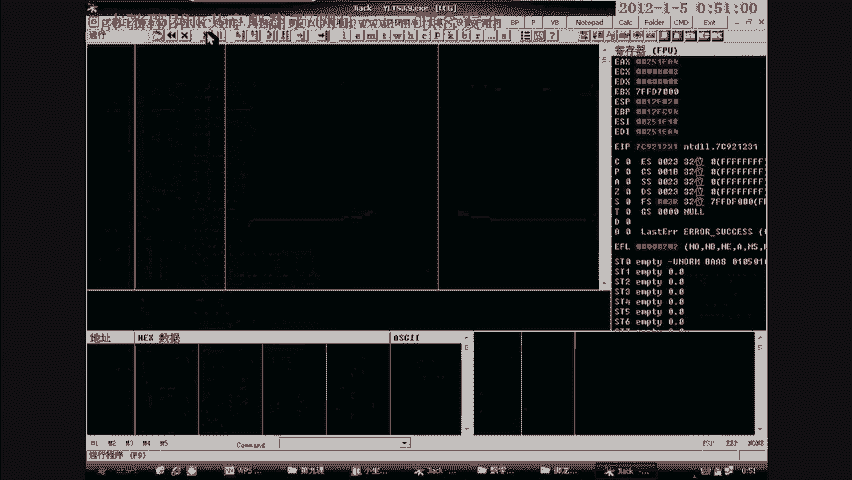

還在有，還是這個位置，還是一閃而過。

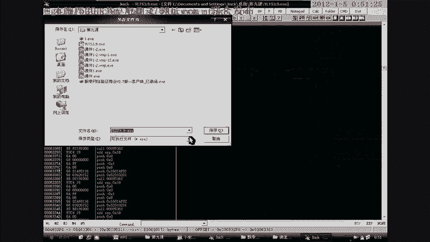

還一閃而過，大家看得到的，它這個所謂的一閃而過，這是你來看，把所有的這個窗皮下三段，因為它已經一閃而過了。

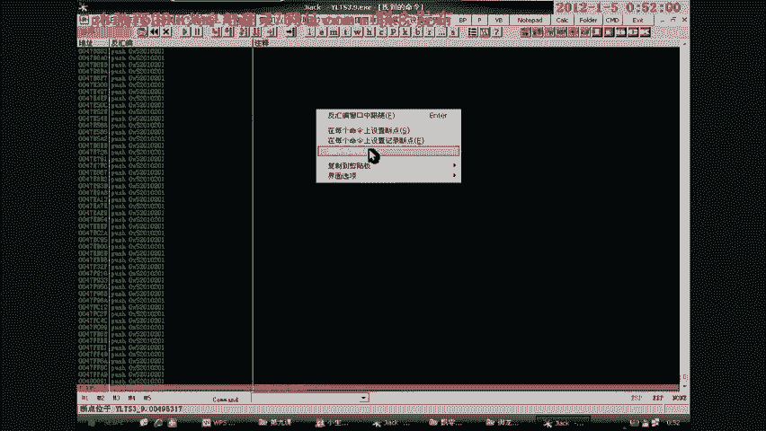

它一定就會調用到，調用到，那麼我們先回到，這是這裡，它一閃而過的原因，這裡，我們把這裡給它撈掉，保存一份。

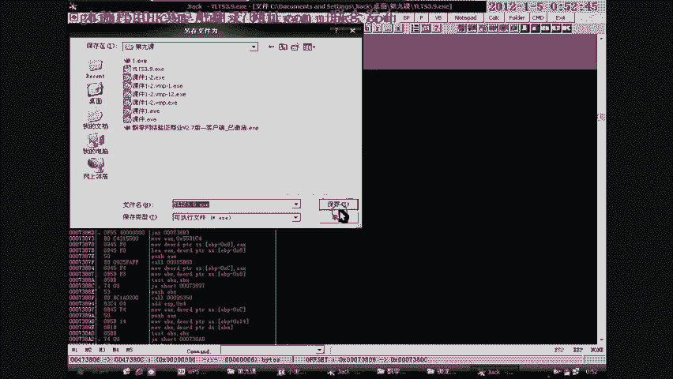

因為那裡是最後它調用的位置，所以我們把它給撈掉。

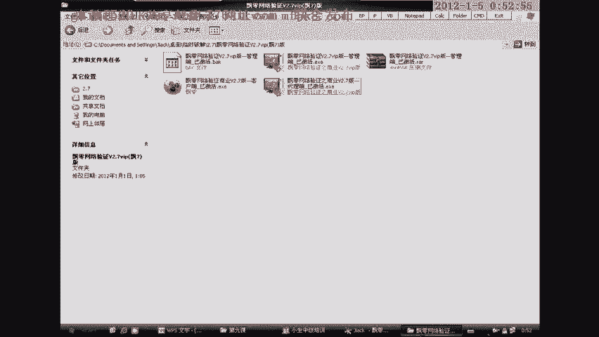

大家看現在它就直接跳進了這個窗體，那麼我們現在把它給撤銷回2001，基本上現在就是安裝已經全部出去了，安裝已經全部出去了，我們可以硬爆破把它爆破進去，但我們今天講的不是硬爆破。

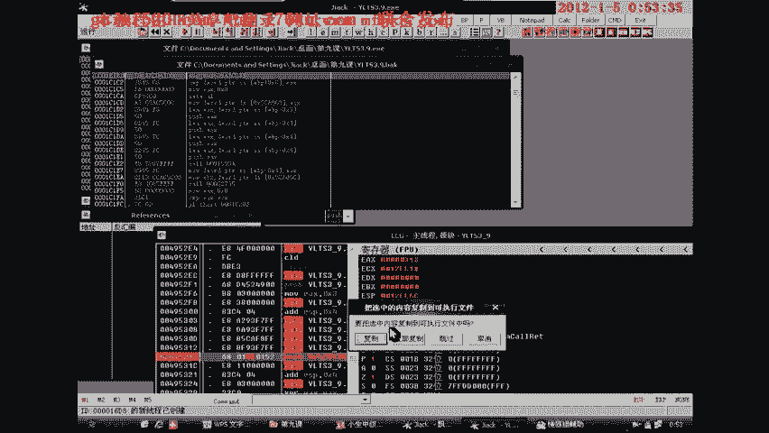

我們今天要講的是我們今天這個。

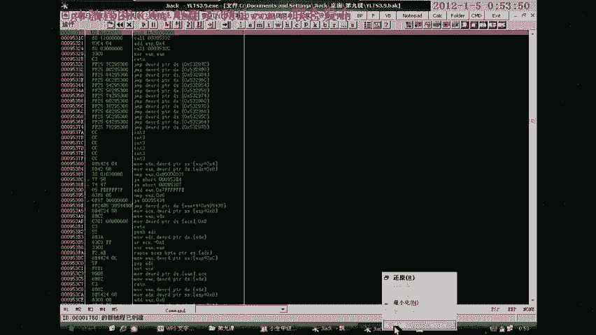

我們來看我們把窗體VM掉，因為現在也找不到什麼外掛，就我說的那種形式的編譯，如果是這種形式的話更好辦，就是我剛才所說的那個，因為不是太好找吧，應該說也不是找不到，並不是太好找。

所以現在這裡我們把它給VM掉，窗體的代碼還有變量的代碼，還有文本的代碼，甚至可以說一語言很多很多的代碼，它都可以通用，通用記清楚這個字。

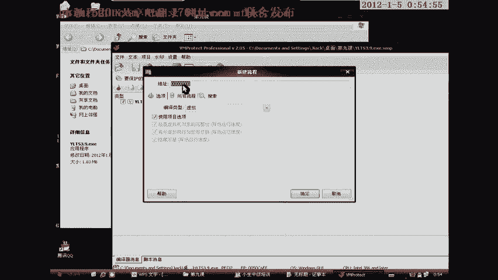

OK，每一個功能事件的代碼都可以通用，這個沒作用了，這個的正版大家都有。

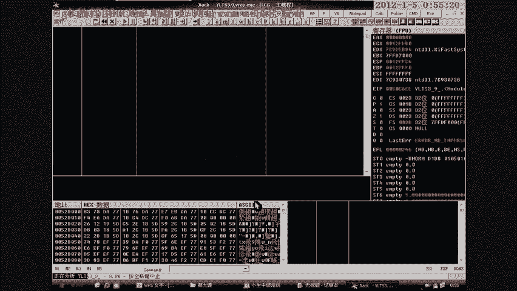

前面的課程也放了原版在裡面，所以這一課就沒必要去放原版，這裡是它的文本，我們需要VM的段子。

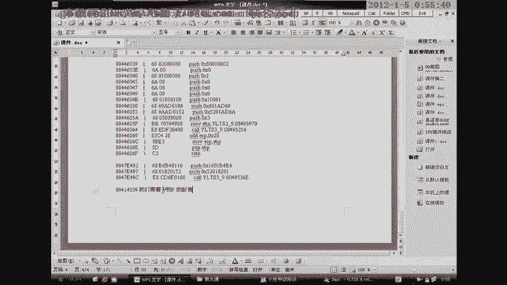

我這裡教大家如何去偽造窗體。

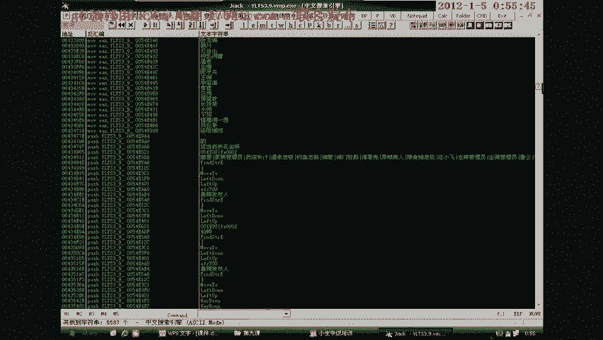

也就是拼裝窗體，F225，我們給它F25 F45 F21，然後到這裡，外面的漂亮啊，槓槓的，你看，這代碼簡直是沒有一句剩下的，好那麼我們就來給它偽造一個窗體，首先當然是。

Push EVP Morph EVP ESP，這個是不變的，所以所有的主窗體就是一語言的第一句，就這個樣子，然後我們來創建窗體，來創建窗體，就通過這兩個窗體創建的位置，是我們一早就保存好的，它是通用的。

上面，當然副窗體AD可換可不換，但是這裡只能要，讓它的窗體完美，那麼就比較快了，這裡我們把它保存。

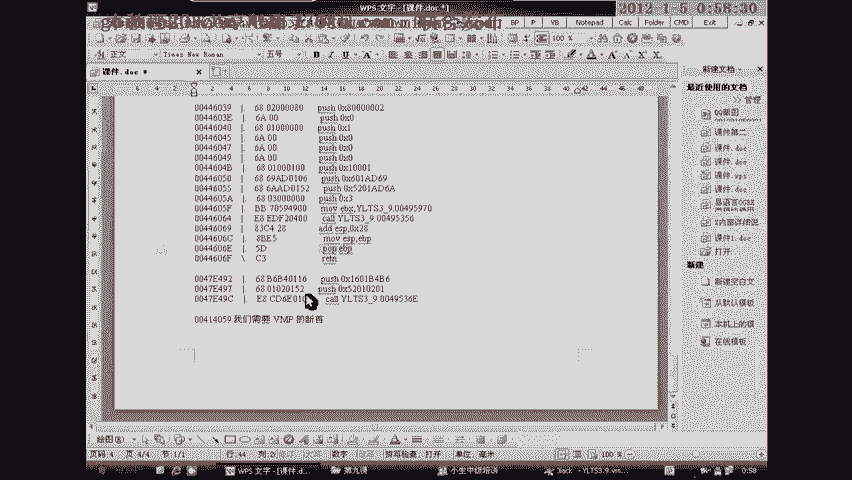

然後改名，窗體已換。

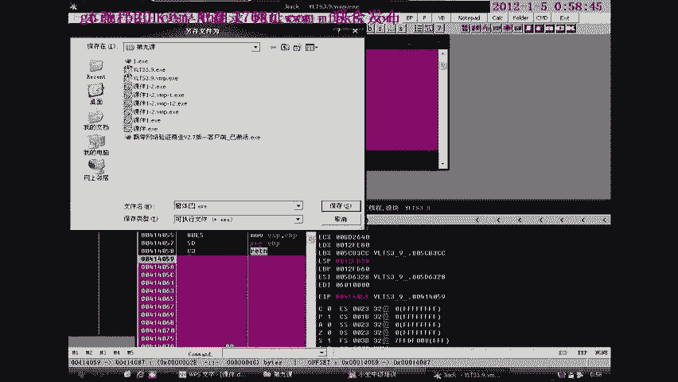

我們來看這邊，就是說它為什麼出現這個，就因為它的那個窗體沒能載入。

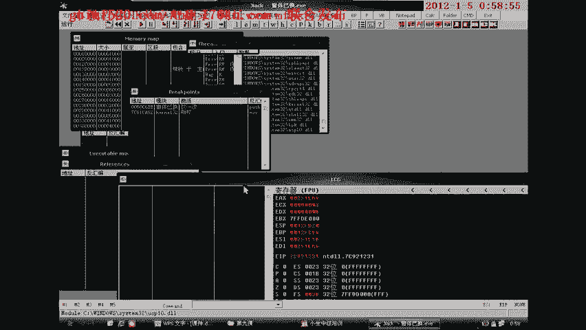

它第一個窗體沒能載入。

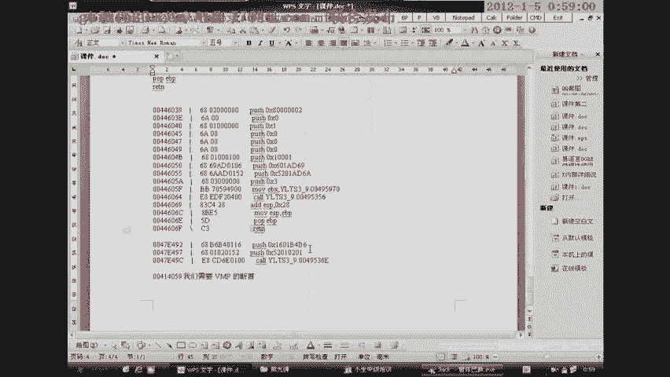

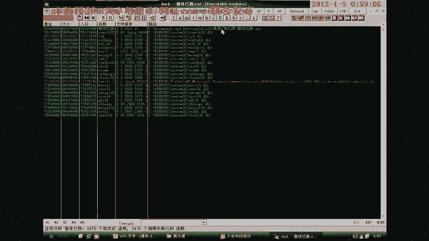

它這個窗體沒能載入，大家看著我現在把這裡給它換一下，換一下，這一句給它換一下，4P439F，哦，少了這一句，難怪，不好意思啊，不好意思啊，我的過錯，我的過錯，少蓋了一句，隨意給它替換上任何一個吧。

就用這個，用這個，這個完全是用窗子裝的，蓋上，蓋上，把它複製上來。

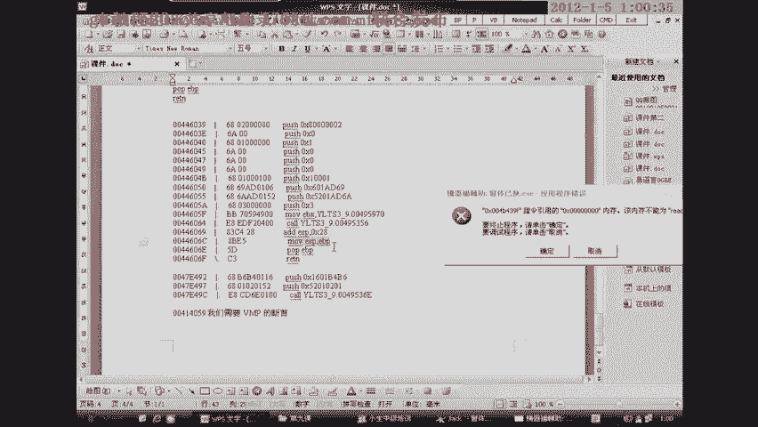

然後窗體已換，大家看現在窗體就出來了，對吧。

按照它的常規的思路。

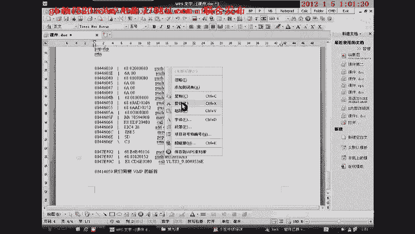

就是按照那種調整形式的思路，就是來到這裡，就是它會來到這個位置去創建一個窗體，然後我們通過在這裡修改一個窗體的一個創建的一個子程序，一個窗體創建的一個子程序，我們就可以直接把它給爆破了。

因為這裡沒有那個，就是那種窗體的創建，所以說這裡修改的，它也是指認外面創建的那個窗體，當然有外面那種更好，SF25。

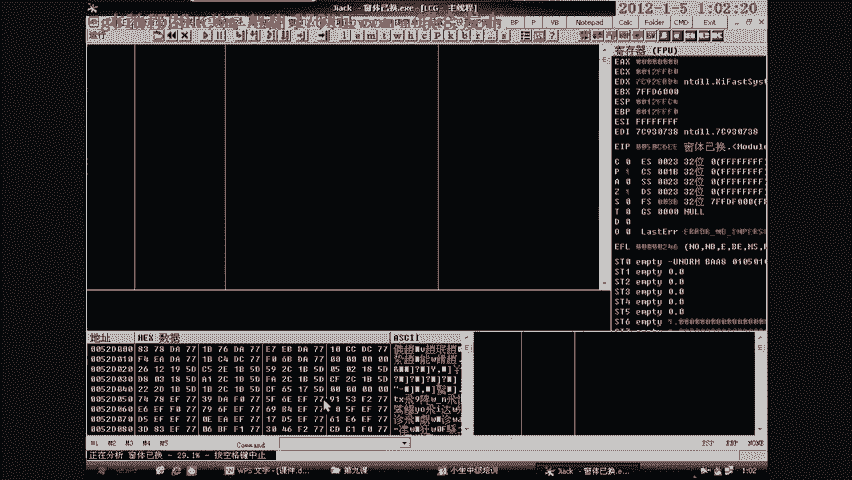

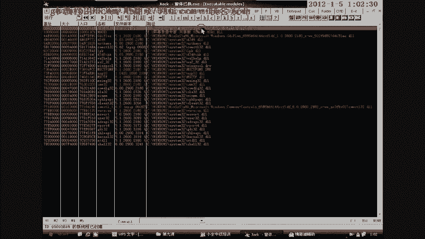

還有一種就是窗體的硬內的尾罩，就我們首先到達這裡，可以看到它是窗體是在這創建的，然後我們FF55，FF75，FF75E，我們來看這個窗體，它是在什麼位置創建的，就在這，在這創建的另外一個窗體。

在這創建的另外一個窗體，好，那麼我們就用這個方法，用這個方法，就我們既然知道它的窗體，就是我們目前，剛才我所說的那個方法，就是用於去探測它的子窗體所在的位置，就這裡，我們可以在這裡，jump過去。

jump到那裡去，跳。

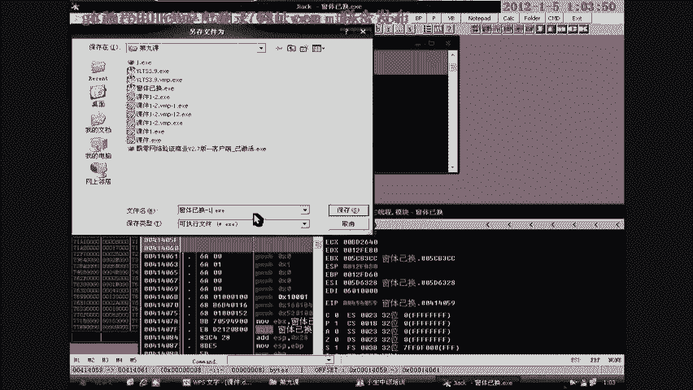

就是直接跳到它的窗體的一個接口去。

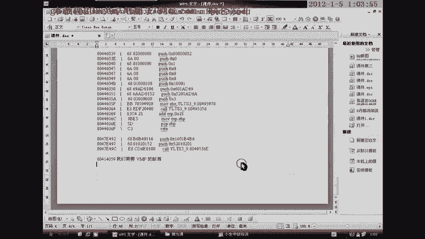

(看著鏡頭，看著鏡子)。

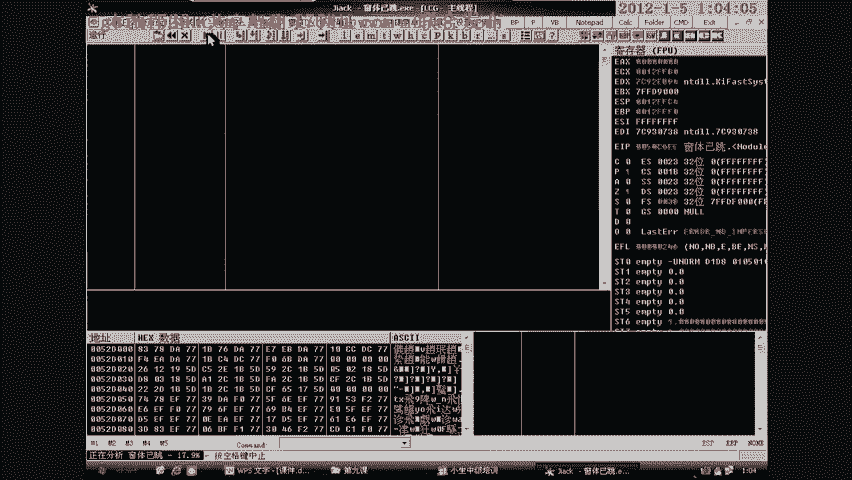

(看著鏡子)，(看著鏡子)，(看著鏡子)，(看著鏡子)。