# 【破解】小生我怕怕中级逆向班 - P12：12.9-2 - 计算机学习委员 - BV1gE411u7WG

不從那個位置跳，我們從這裡跳，它到達這裡了。

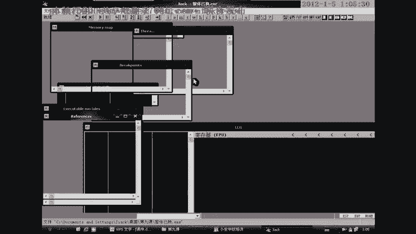

我從這裡跳過去，跳到它的窗底，窗間伺服器進去。

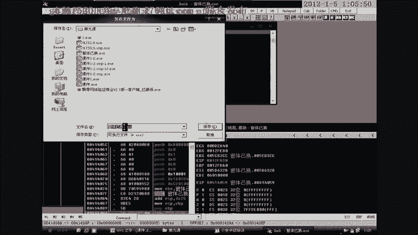

因為這種代碼，這個外掛就是對語言不是太了解。

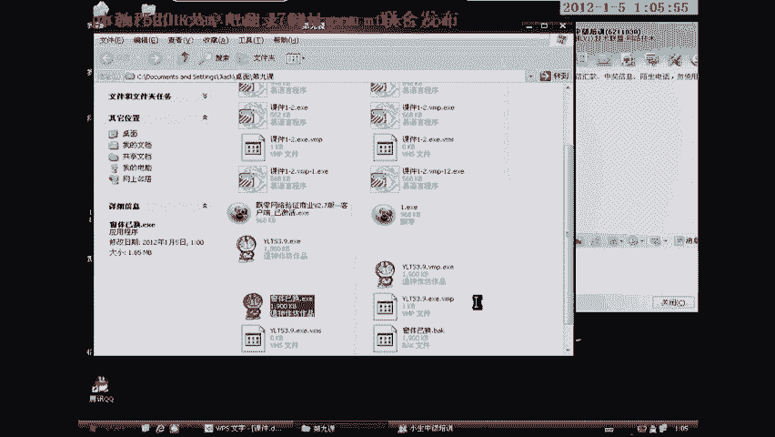

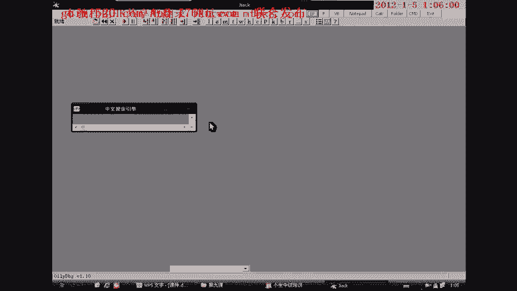

如果它對語言了解的話，寫出來的程序絕對不是這樣的。

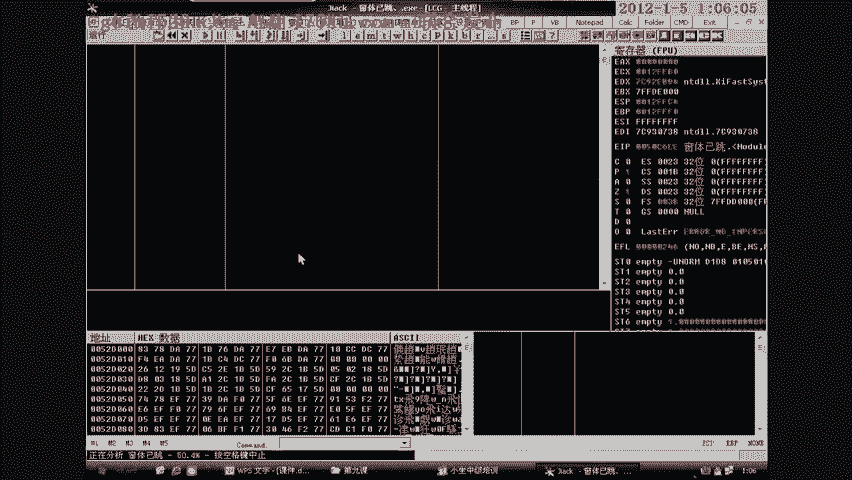

都應該是用紙程序去驅動程序，因為那種程序的話，基本上就是改一下窗體ID就OK了，我們來看，繼續跳吧，登陸，從這裡，哇，那個太麻煩了，從這裡，我們把它給反過過去。

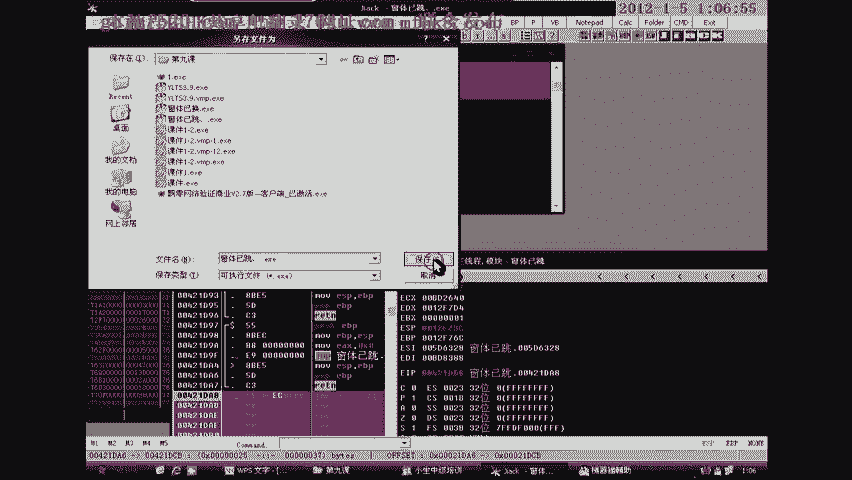

我們來看看啊。

登陸，然後，到達這裡，反應滿了，(翻譯)。

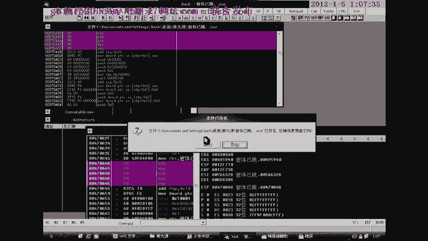

它那個紙窗體，窗間ID啊。

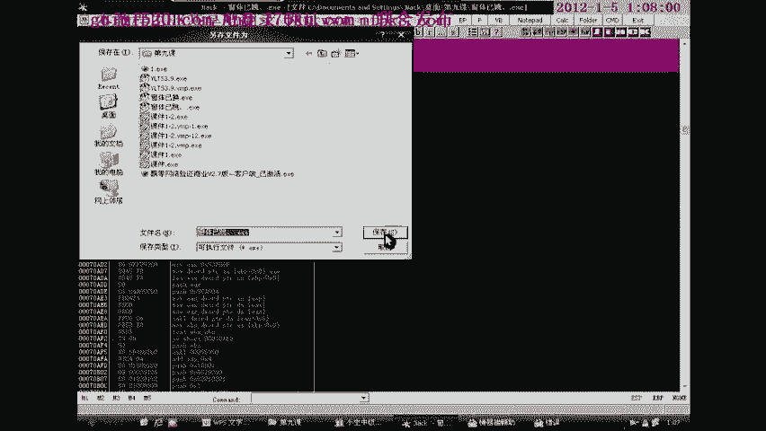

它一直提示這個，哇，它想提示啊。

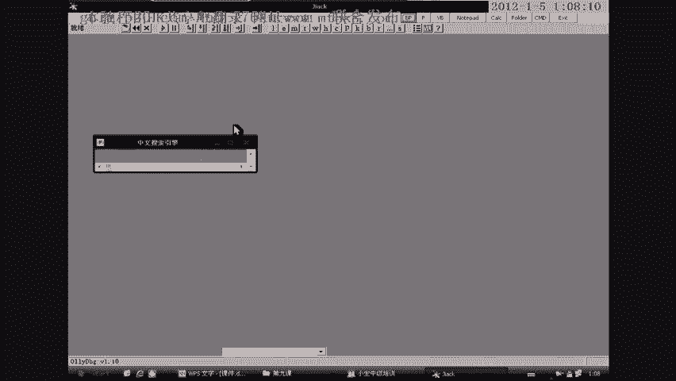

(翻譯)。

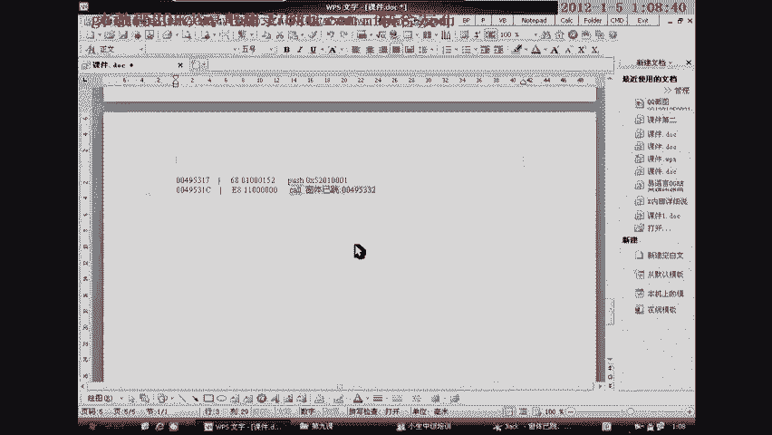

窗底一跳，(翻譯)，我們用這種方法來給它創建一個窗體，也是可以的，也是可以的，(翻譯)。

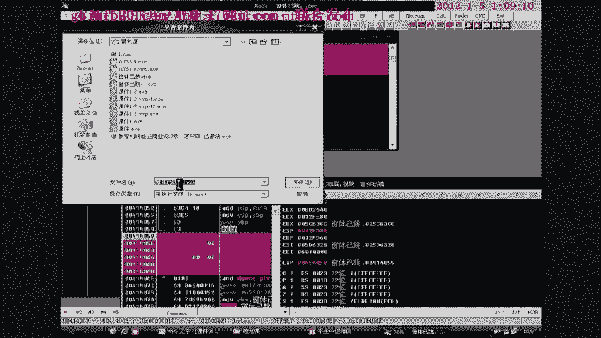

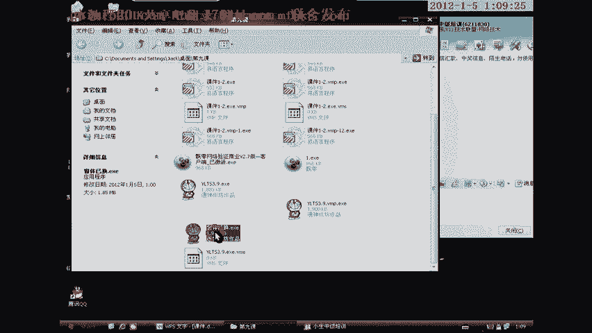

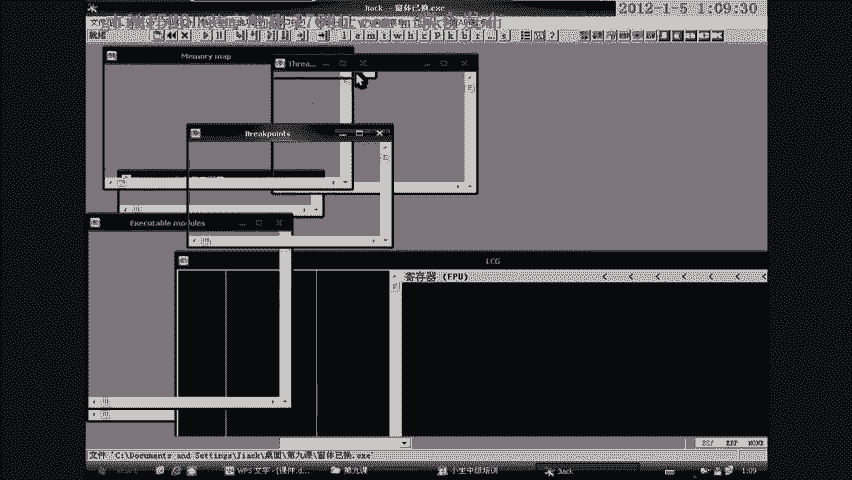

如果我們在這裡，把這裡換成201，又是另外一回事了，它就直接就出來了，直接就到這了，它窗子就出來了，因為這個程序的特殊，就是這個位置，它不像我們那個程序一樣，它這裡是一個扣，一個扣調用到一個紙才去創建。

那麼我們就讓它跳過去吧，跳的時候，我們同樣給它換一個201。

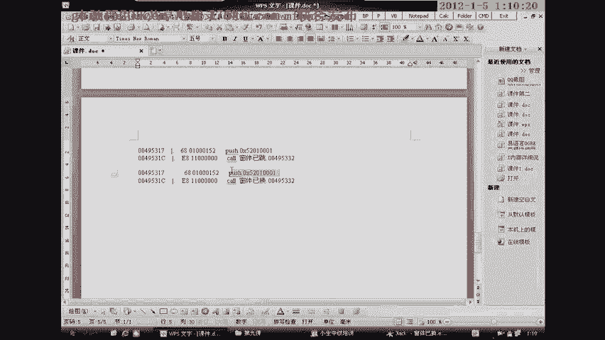

Push 201，(翻譯)，扣，(翻譯)。

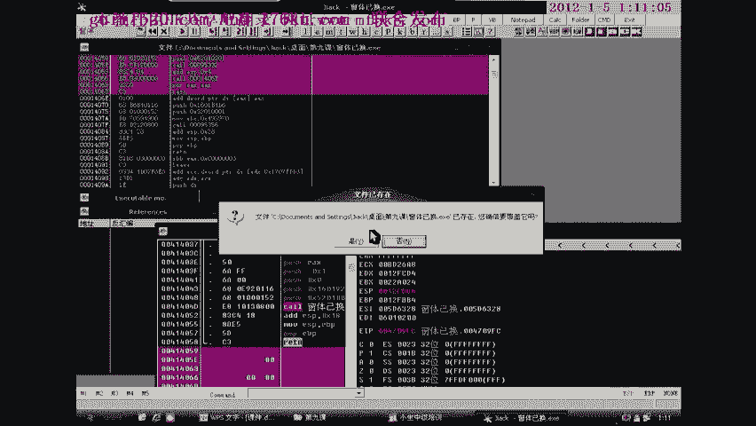

Push 202，(翻譯)。

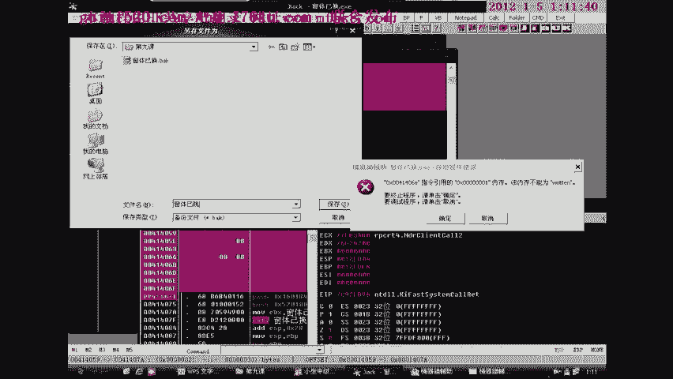

這裡出錯了啊，這裡出錯了，大家看到了，就是剛才它窗底一跳而過，這種我們也可以採用這種方法去把它進行跳過，(翻譯)，(翻譯)，它應該是在這裡窗底顯示的時候，它這個應該是在窗底顯示的時候，然後又被那個。

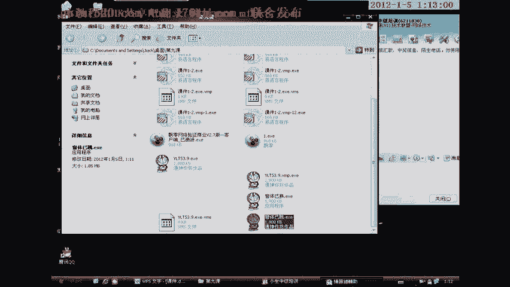

我們一開始創建的那個負，那個52001那一塊。

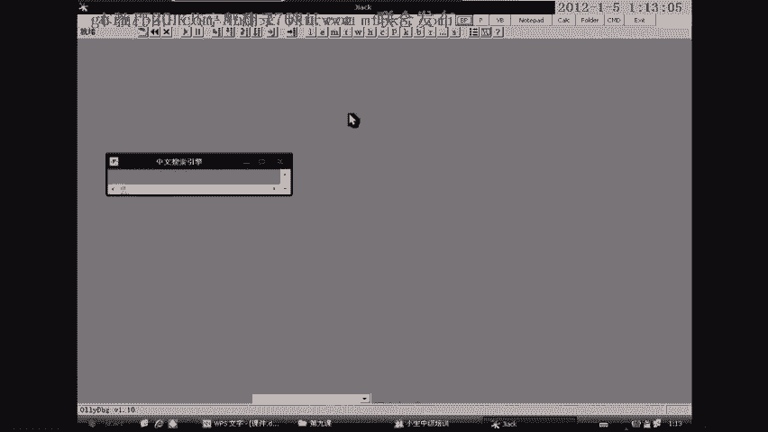

其實我們現在是已經成功的，我們現在已經是成功的，就是目前是被那個52001，就是這一塊，把它給擠掉了，就是它這裡又創建了這個窗底，但是沒有銷毀，所以說這個窗子。

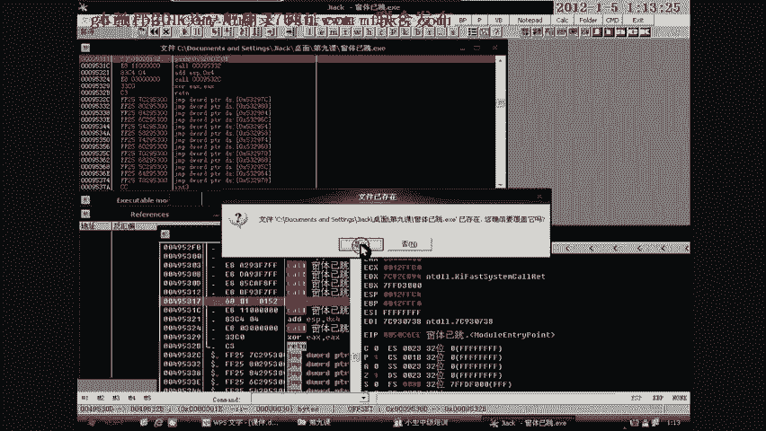

直接就錯誤了，你看這樣它就OK了，這裡我們找不到那種相應的程序，就是我今天所說的這一句話，就是說我們可以找到一個窗底創建的一個程序事件，然後可以給它讓它去創建一個窗底。

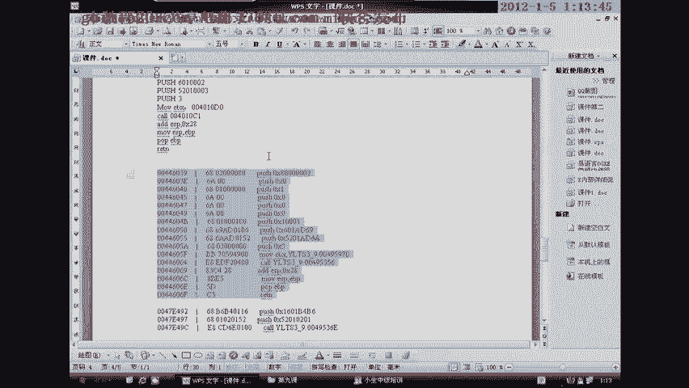

讓它去創建一個窗底，就像我們的這個程序一樣的，就我們完全可以還原掉窗底的代碼，完全可以還原掉窗底的代碼，就是不管你在怎麼VM也好，還是什麼樣的眼報，它都是可以還原的，它都是可以還原的，就這些程序。

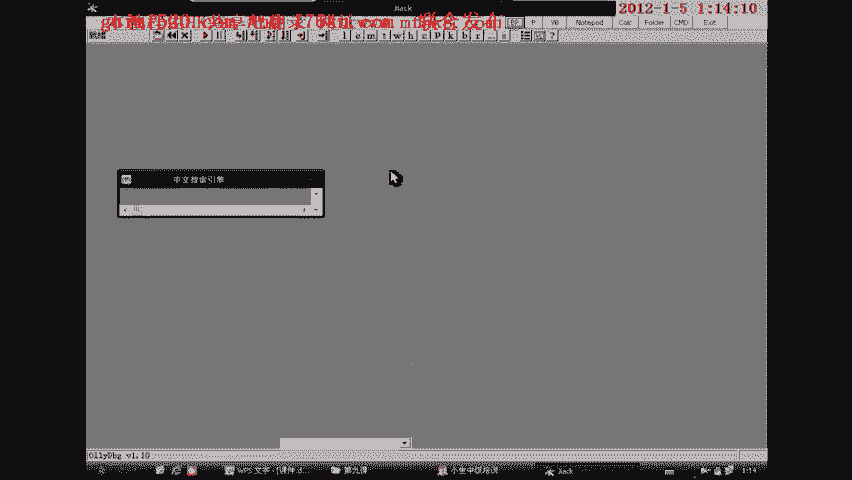

它都是一些簡短便易的，一些好的外掛就不是這個樣子，這裡就是沒有的，全部都是用Qual，大家在實戰中可以去慢慢理解，就是如果遇到不懂的，遇到像這一刻不懂的，大家可以問一下我，問一下我。

我可以給大家再演示一下，窗底的創建和跳躍，窗底的創建和跳躍，就我們可以通過直接跳躍到另外一個紙窗體去，但是通常需要在，第一個窗體銷毀之後才能跳躍，銷毀之後才能跳躍，或者說就是我們的第二窗體創建之後。

會有一個銷毀的代碼。

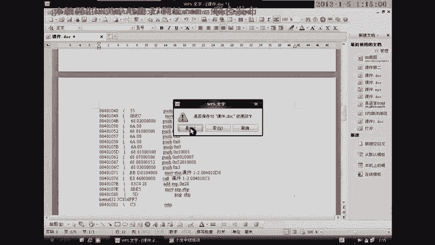

會有一個前者窗體的銷毀的代碼，否則的話就一跳過去就會出現剛才那種現象，就是把第二個窗體給擠掉的現象，那麼本課就到此為止，謝謝大家，再見，(字幕製作：貝爾)。

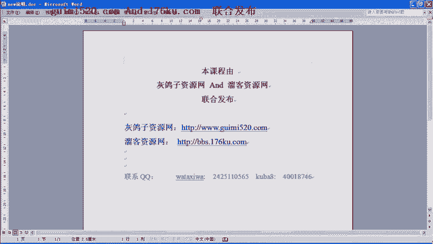

(字幕製作：貝爾)，(完成)。