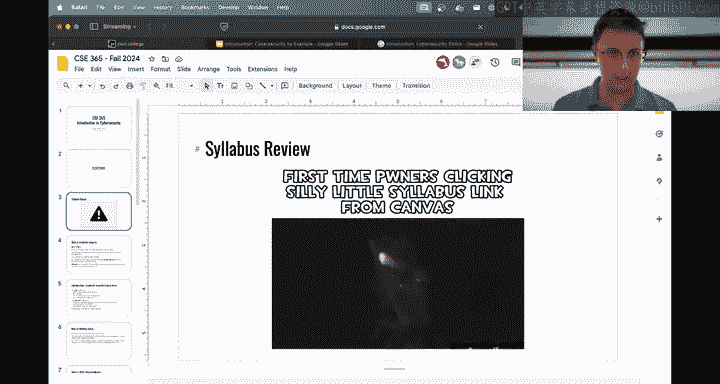
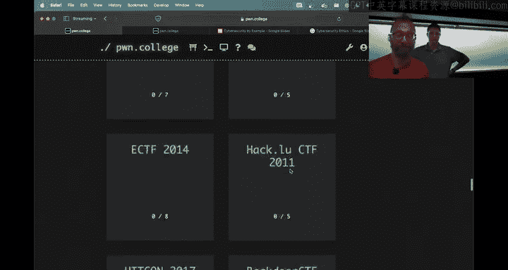
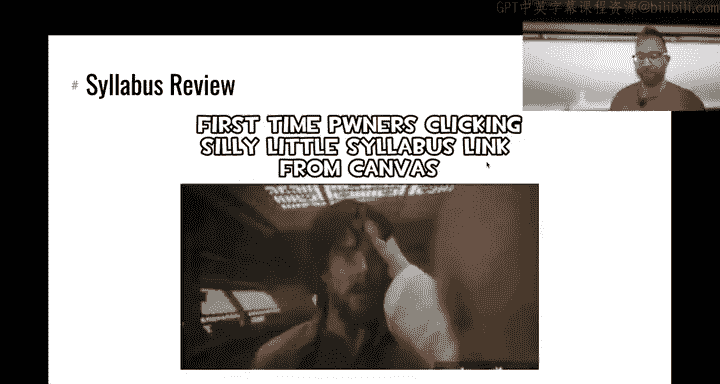
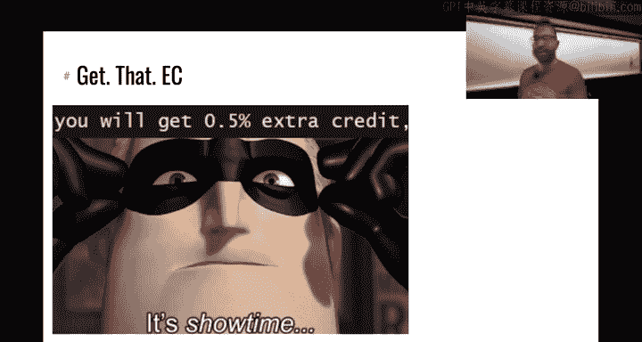
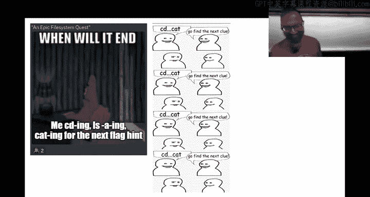

# 1：课程介绍与教学大纲 📚

在本节课中，我们将学习课程的基本框架、教学大纲、评分结构以及学术诚信政策。我们将通过一个真实的网络安全事件作为引子，探讨网络安全的重要性与复杂性。

## 课程概述与案例引入

大家好，欢迎来到CSE 365网络安全导论课程。我是Yan，这位是Connor。我们将通过一个真实案例来开启我们的网络安全之旅。

2015年7月，黑客组织“Phineas Fisher”入侵了网络安全公司Hacking Team，并通过其Twitter账户泄露了该公司的全部源代码、内部邮件和监控系统数据。这次攻击展示了即使是最注重安全的公司，也可能因为一个微小的漏洞而导致全线崩溃。

Phineas Fisher的攻击步骤如下：
1.  **侦察**：她发现Hacking Team一个对外服务器的固件可供下载。
2.  **利用零日漏洞**：通过分析该固件，她发现了一个未被公开的漏洞（零日漏洞），并以此作为进入内网的入口。
3.  **内部侦察与横向移动**：进入内网后，她进行被动监听和扫描，发现了一个物理安全监控系统服务器存在安全缺陷。
4.  **权限提升**：通过访问备份服务器，她获取了邮件服务器的备份，并从中提取了仍在使用的管理员凭证。
5.  **达成目标**：利用获取的凭证，她安装了键盘记录器，最终窃取了开发人员的密码，获得了核心源代码的访问权限，并完成了数据泄露。

这个案例表明，在网络安全中，防御者必须每次都成功，而攻击者只需成功一次。本节课我们将探讨此类攻击的原理，并在后续课程中学习如何识别、利用和防御这些漏洞。

## 关于网络安全的伦理思考 🤔

上一节我们看到了一个攻击案例，本节中我们来探讨其背后的伦理问题。

Phineas Fisher的行为是正义的“吹哨人”行为，还是非法的黑客攻击？这个问题没有简单答案。在网络安全领域，法律与个人伦理有时存在冲突。

**本课程的核心伦理与法律规则是：**
*   **绝对不要入侵你没有明确获得授权入侵的系统。**
*   许多公司设有“漏洞赏金计划”，明确规定了允许测试的范围。如果你不确定，就不要行动。
*   作为学术研究的一部分，在受控环境下进行安全研究通常受到法律保护（如《数字千年版权法》的研究豁免条款）。

**在本课程中：**
*   所有课程挑战（`challenges`）都是允许并鼓励你们去“攻击”的。
*   课程核心基础设施（如存储学生信息的服务器）是**禁止**攻击的。
*   我们的目标是**学习**，在安全、合法的环境中实践技能。

## 课程结构与教学大纲详解 📖

了解了伦理边界后，我们来看看本课程的具体运作方式。本课程的结构与传统课程有很大不同。

### 课程形式与安排
*   **大班混合教学**：所有章节（周一、周三、在线班）合并为一个大型班级。周三的讲座是新课，不会重复周一内容。所有学生都需要观看每周的两次讲座（可直播或观看录像）。
*   **无考试**：成绩100%来源于实践作业。
*   **主要学习平台**：我们**不使用Canvas**作为主要平台。所有课程材料、作业和成绩都发布在 **`Pwn.College`** 网站上。Canvas仅用于同步截止日期和最终成绩显示。

### 作业与评分
课程将包含大约10个作业。每个作业由一系列挑战（`challenges`）组成。

**评分分为两部分：**
1.  **检查点**：在作业发布约一周后截止。你需要完成该作业约30%的挑战。这是一个“通过/不通过”的评分，占总成绩的30%。目的是督促大家尽早开始。
2.  **最终提交**：在作业最终截止日期前，你需要完成尽可能多的挑战。这部分占总成绩的70%。

**最终成绩计算公式为：**
`最终成绩 = 检查点分数（30%） + (完成挑战数 / 总挑战数) * 70%`

**迟交政策**：在最终截止日期后，作业的70%部分仍可提交并获得50%的分数，直到学期成绩截止日（约12月16日）。**检查点过期不候**。

### 辅导课与帮助渠道
*   **线下辅导**：每周一至周五下午4:30 - 5:20，在BYENG 209教室。这是获得面对面帮助的最佳场所，你可以随时去任何一天的辅导课。
*   **Discord社区**：课程主要的在线交流平台。可以异步提问、讨论概念、分享提示（非代码）。在这里帮助他人还可以获得额外学分。
*   **线上同步辅导**：每周六在Discord语音频道进行。

### 额外学分
你可以通过以下方式获得最多**15%** 的额外学分：
1.  **制作优质梗图**：每周在课程Discord的`#memes`频道发布与课程内容相关、有洞察力的梗图，最多可获得0.5%的额外学分。**发布低质量或抄袭梗图会导致“梗图监狱”**，失去本途径的额外学分资格。
2.  **帮助同学**：在Discord上有效帮助其他同学解决问题，当对方公开感谢你时，即可累积帮助次数。根据公式 `额外学分 = 1.337 ^ (log₂(帮助次数))` 计算奖励。
3.  **解决CTF挑战**：在`Pwn.College`的CTF存档中解决挑战，并提交详细的原创解题报告，每个挑战可获得0.5%的额外学分。
4.  **负责任地披露漏洞**：如果你在课程基础设施中发现并负责任地报告了安全漏洞，也可获得额外学分。

**严禁滥用系统**（如刷感谢、互刷帮助），我们将进行监控和数据统计分析，违者将按学术不端处理。

### 学术诚信与合作政策
**严禁作弊**。我们拥有先进的监控系统，可以追溯检测作弊行为。

**允许的合作包括：**
*   在公开的课程Discord频道或辅导课上，**基于概念**进行讨论、分享思路和提示。
*   **不允许的合作包括：**
    *   分享代码、直接答案或旗帜（`flag`）。
    *   在任何其他私人或非课程官方的Discord服务器、SMS群组等私下讨论作业。
    *   与修过本课程往届学生合作。

请使用我们提供的官方渠道进行交流。违反政策将导致严重的学术后果。

### 给学生的实用建议
*   **立即开始**：第一个作业（Linux Luminarium）包含84个挑战，已发布并将于周日截止。请现在就登录`Pwn.College`开始。
*   **避开截止日期高峰**：服务器在作业截止前几小时可能会因负载过高而变慢或不稳定。请提前规划，不要拖到最后一刻。
*   **善用资源**：遇到困难时，首先查阅`Pwn.College`上的“Getting Started”指南，然后利用辅导课和Discord寻求帮助。
*   **关于特殊安排**：本课程无考试且出勤不强制，能满足多数学业调整需求。由于作业环环相扣，延长截止日期通常会导致后续学习困难，不建议申请。

## 总结与下节预告 🎯

本节课我们一起学习了网络安全的一个经典案例，探讨了相关的伦理问题，并详细解读了本课程独特的教学大纲、评分结构、支持资源以及严格的学术诚信政策。

**核心要点回顾：**
1.  网络安全是攻防不对称的领域，小漏洞可引发大问题。
2.  必须在法律和伦理框架内进行安全实践。
3.  本课程成绩100%源于实践挑战，请务必关注检查点和最终截止日期。
4.  充分利用官方Discord和每日辅导课获取帮助。
5.  严禁作弊，合作需在公开场合进行概念性讨论。

下节课（周三），我们将深入技术内容，并演示如何使用`Pwn.College`平台。现在，你的首要任务是完成平台设置并开始第一个作业。

祝大家好运，我们周三见！