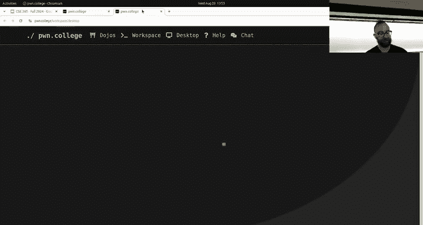
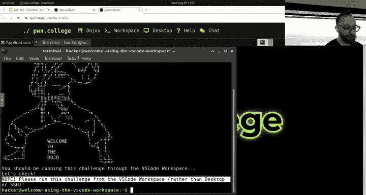
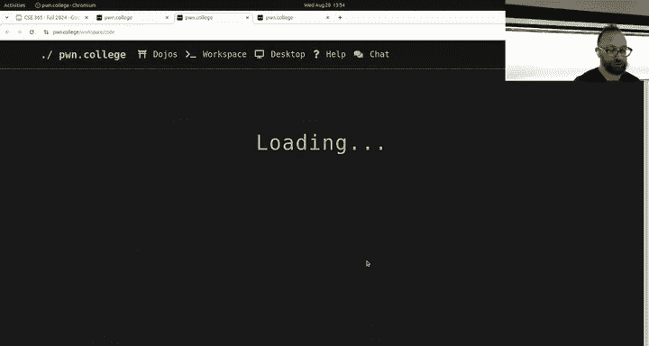
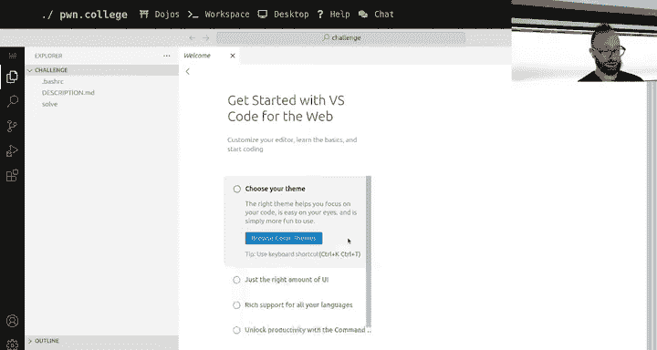
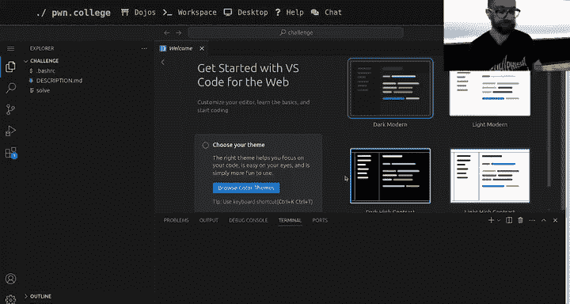
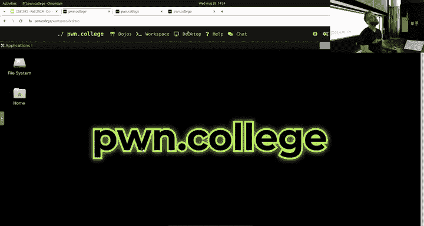
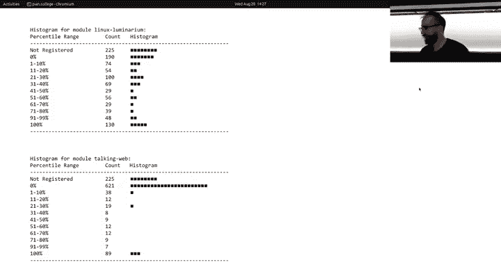
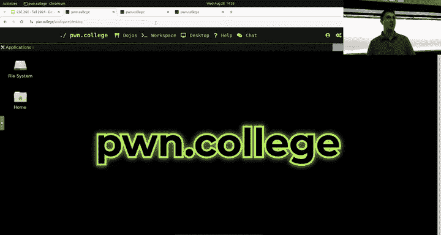
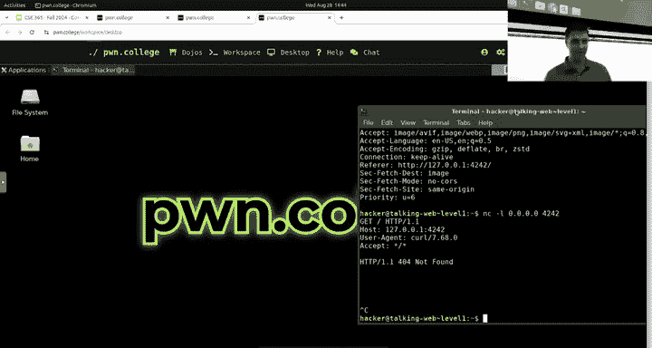
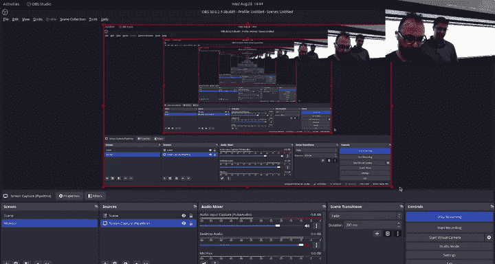

# 2：课程概述与作业入门指南 🚀


在本节课中，我们将一起回顾课程的基本结构，并重点介绍前两个作业（Linux Luminarium 和 Talking Web）的入门知识。我们将学习如何使用课程平台（Pwn College Dojo）、理解命令行基础以及初步探索HTTP网络请求。


---

## 课程结构与作业状态 📊

上一节我们介绍了课程的基本框架，本节中我们来看看当前课程作业的完成情况。

本课程由 Connor 和 Yan 两位教授共同授课，所有学生被视为一个大班。如果你错过了周一的课程，需要尽快通过录播视频和课程大纲进行补课。

目前有两个作业已发布：
*   **Linux Luminarium**：Linux 命令行入门。
*   **Talking Web**：HTTP 请求入门。

这两个作业都将在**本周日晚上 11:59** 截止。强烈建议你尽早开始，原因如下：
1.  作业具有一定挑战性，可能需要数小时完成。
2.  临近截止日期时，服务器负载会很高，可能导致访问缓慢。


根据当前数据，大部分同学已开始 Linux Luminarium，但仍有不少同学尚未开始 Talking Web。我们建议先完成 Linux Luminarium。

---









## Pwn College Dojo 平台使用指南 💻

现在我们已经了解了作业的截止日期和重要性，接下来看看如何高效地使用我们的学习平台。



Pwn College Dojo 是我们完成挑战的主要平台。每个挑战都可以在网页的图形化桌面环境中完成。

### 快速提交与导航技巧

以下是提高平台使用效率的几个技巧：

*   **网页内快速提交**：在挑战页面，点击右上角的**小旗子图标**，你可以在弹出的窗口中直接阅读题目描述、输入并提交Flag，无需在页面间反复跳转。
*   **使用SSH连接**：如果你更喜欢在本地终端工作，可以使用SSH连接到Dojo服务器。这能提供更流畅的挑战体验，尤其是在服务器负载较高时。

### SSH连接设置步骤

设置SSH连接只需简单几步：

1.  在Dojo的“Getting Started”部分，按照指引生成SSH密钥对。命令通常是 `ssh-keygen`。
2.  将生成的**公钥**（如 `key.pub` 文件内容）复制到Dojo网站的设置（Settings）-> SSH Keys 页面中。
3.  启动一个挑战后，在终端使用 `ssh hacker@pwn.college` 命令并指定你的私钥文件即可连接。

连接成功后，你的SSH会话会自动绑定到当前活跃的挑战环境。当你完成一个挑战并开启下一个时，SSH连接会自动刷新到新挑战的shell中，实现快速切换。


---

## Linux 命令行核心概念 🐧

在熟悉了平台操作后，我们需要掌握本课程的核心工具——Linux命令行。本节将介绍其基本哲学和构成。

计算机早期通过开关、打孔卡与文本终端交互。尽管后来出现了图形界面，但命令行因其高效和强大的脚本能力，至今仍是计算领域的基石。

在终端中，你看到的是 **`提示符（Prompt）`**，它通常显示用户名、主机名和当前目录，并以 `$` 符号结尾。后面的光标等待你输入**命令（Command）**。

### 命令的语法与参数

命令行的语法类似于自然语言，具有特定的结构：

*   **命令**：你输入的第一个词。它告诉计算机要运行哪个程序。
*   **参数**：命令之后的所有词，也称为**参数（Arguments）**。它们会改变命令的具体行为。

例如，在终端中输入：
```bash
echo hello there
```
*   `echo` 是命令，它的功能是将参数回显到屏幕。
*   `hello` 和 `there` 是传递给 `echo` 命令的两个参数。
*   因此，输出结果是：`hello there`。

不同的命令以不同的方式解释其参数。例如，`cat` 命令将其参数解释为**文件名**，并显示这些文件的内容。
```bash
cat /home/hacker/world.txt
```
这条命令会显示位于 `/home/hacker/` 目录下 `world.txt` 文件的内容。


### 文件系统基础


Linux文件系统是一个单一的树状结构，所有文件和目录都从 **根目录 `/`** 开始。你的个人文件通常位于 `/home/你的用户名/` 目录下。路径使用正斜杠 `/` 来分隔目录层级。



---


## Talking Web：HTTP 请求初探 🌐



掌握了命令行基础后，我们就可以开始探索第二个作业“Talking Web”了，它关乎网络通信的基础——HTTP协议。



我们每天使用浏览器访问网站时，都在发起 **HTTP 请求**。这个协议实际上是人类可读的文本协议，建立在 TCP 网络连接之上。


### 使用 Netcat 模拟网络通信

我们可以使用 `netcat` (或 `nc`) 工具来模拟最基础的网络通信。它可以在两台计算机之间建立原始的 TCP 连接。

1.  **启动服务端（监听）**：在一个终端中运行以下命令，表示在 4242 端口监听连接。
    ```bash
    nc -l 0.0.0.0 4242
    ```
2.  **启动客户端（连接）**：在另一个终端中运行以下命令，连接到本机（`127.0.0.1` 代表自己）的 4242 端口。
    ```bash
    nc 127.0.0.1 4242
    ```
3.  **进行通信**：此时，两个终端建立了连接。在任一终端输入文字并按回车，消息就会显示在另一个终端中。这演示了最基本的双向通信。

### 理解 HTTP 请求与响应

HTTP 协议规定了客户端（如浏览器）和服务器之间通信的文本格式。

*   **HTTP 请求**：当你在浏览器地址栏输入 `http://127.0.0.1:4242` 并访问时，浏览器会向该地址发送一个类似下面的文本块：
    ```
    GET / HTTP/1.1
    Host: 127.0.0.1:4242
    User-Agent: Mozilla/5.0...
    ...（其他头部信息）
    ```
*   **HTTP 响应**：服务器（比如我们用 `netcat` 模拟的）需要按照 HTTP 协议回复一个响应。一个最简单的响应如下：
    ```
    HTTP/1.1 200 OK
    Content-Length: 10

    HelloWorld
    ```
    浏览器在收到这个响应后，就会在页面上显示 `HelloWorld`。

除了使用浏览器，你还可以用命令行工具 `curl` 来发送 HTTP 请求，这在自动化测试和调试时非常有用。
```bash
curl http://127.0.0.1:4242
```

---

## 总结与后续安排 🎯


本节课中我们一起学习了以下内容：
1.  **课程节奏**：了解了前两个作业（Linux Luminarium 和 Talking Web）的紧迫性，以及“尽早开始”的重要性。
2.  **平台熟练度**：掌握了 Pwn College Dojo 平台的高效使用技巧，特别是网页内提交和 SSH 连接的方法。
3.  **Linux 核心**：理解了命令行的基本哲学、命令与参数的概念，以及 Linux 文件系统的树状结构。
4.  **Web 基础**：通过 `netcat` 工具直观感受了网络通信，并初步了解了 HTTP 请求与响应的文本格式。

从下周开始，主要课程内容将通过录播视频发布。而像今天的直播课程将侧重于深入讨论特定主题和答疑。

如果你在完成作业时遇到困难，请记住：
*   仔细阅读作业描述和附带的讲座视频。
*   利用课程 Discord 频道进行提问。
*   参加工作日的 **Pwn College Power Hour（下午 4:30）**，那里有助教可以提供面对面帮助。






祝大家在 Linux Luminarium 和 Talking Web 中顺利获得 Flags！我们下周将进入更精彩的模块。再见，黑客们！