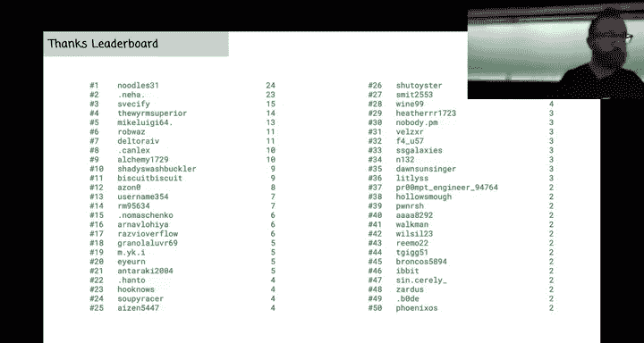
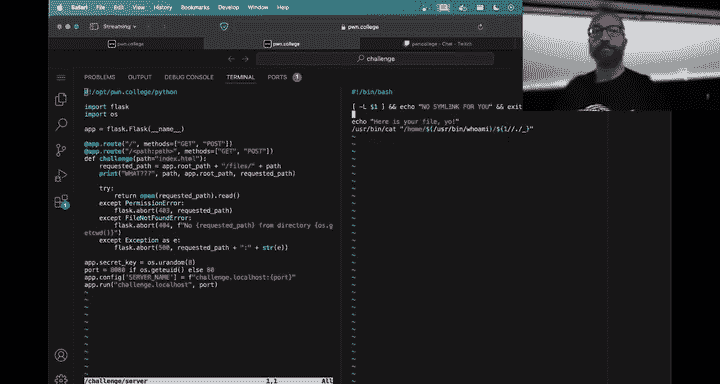

# 3：Web Security - 课程回顾与入门


在本节课中，我们将回顾课程前几周的状态，并正式开启新的“Web安全”模块。我们将探讨如何培养网络安全所需的对抗性思维，并学习如何开始应对新的挑战。

## 课程状态回顾

上一节我们完成了Linux和H模块的学习。现在，我们正式进入“Web安全”模块。这个模块结合了之前的知识，并引入了一些更具挑战性的概念。

以下是关于新模块的一些关键信息：
*   **模块内容**：包含27个挑战，探索Web应用程序的各种安全漏洞。
*   **截止日期**：作业将于9月15日到期。
*   **检查点**：本周日晚上前需完成30%的挑战，否则将损失3%的最终成绩。
*   **难度提示**：每个Web安全挑战的个体难度将显著高于之前的Linux挑战，请预留充足时间。

## 培养对抗性思维

在网络安全中，培养对抗性思维至关重要。这意味着我们需要像攻击者一样思考，找出开发者所做的、但在现实中可能不成立的假设。

让我们通过一个简单的脚本示例来理解这种思维。假设我们有一个名为 `your_file_formatter.sh` 的脚本，其核心功能是读取用户主目录下的指定文件。

```bash
#!/bin/bash
# 初始版本：存在漏洞
cat "$HOME/$1"
```

攻击者会思考：脚本假设 `$HOME` 变量是可信且安全的。但如果攻击者能控制这个变量呢？例如，通过设置 `HOME=/`，攻击者就能尝试读取系统根目录下的文件，如 `/flag`。

**修复尝试1**：开发者决定不使用 `$HOME`，而是硬编码一个路径。
```bash
cat "/home/user/$1"
```
然而，攻击者可能通过输入 `../../../flag` 作为参数 `$1` 来进行路径遍历攻击。

**修复尝试2**：开发者尝试过滤掉参数中的点号。
```bash
cleaned_input=$(echo "$1" | tr -d '.')
cat "/home/user/$cleaned_input"
```
但攻击者可能利用符号链接（symlink）或竞争条件等更底层的系统特性来绕过防护。



这个例子说明，安全是一个持续的过程。开发者修复一个漏洞时，可能会引入新的问题，或者未能从根本上解决某一类漏洞。作为安全研究者，你需要不断深入思考，探究系统底层的工作原理和所有可能的交互方式。

## Web安全挑战入门指南

本节中我们来看看如何开始应对Web安全挑战。理解挑战的运行机制是第一步。

每个挑战本质上是一个小型Python Web应用程序（使用Flask框架）。你可以通过以下方式与之交互：
1.  在终端使用 `curl` 命令。
2.  在浏览器中访问提供的地址。

为了理解挑战的逻辑，**实践模式** 是你的得力工具。在实践模式下，你可以查看并修改服务器源代码，插入调试语句。

例如，在第一个Web安全挑战中，你可以修改 `web_security_1.py`，添加打印语句来查看关键变量：

```python
@app.route('/<path:filepath>')
def serve_file(filepath):
    print(f"[DEBUG] app.root_path: {app.root_path}")
    print(f"[DEBUG] Requested filepath: {filepath}")
    # ... 原有代码 ...
```

然后重启挑战服务器，你的请求细节就会在终端输出，帮助你理解程序如何处理输入。

此外，充分利用文档、Discord社区、Sensei AI助手以及课程提供的预录讲座。当Sensei给出建议时，请批判性地思考，并将其作为启发思路的工具，而非绝对正确的答案。

## 课程文化与资源

本课程鼓励通过“梗图”进行交流和学习。每周发布与课程内容相关的原创梗图可以获得额外学分。这些梗图不仅能活跃气氛，也常常包含解决挑战的关键提示或对课程的有效反馈。

在寻求或提供帮助时，请善用Discord的“点赞”功能。对有帮助的回复进行点赞，可以为帮助者积累额外学分，这是对他们贡献的认可和激励。

请记住，**尽早开始** 完成作业。这能让你有充足的时间思考、调试，并在截止日期前从容地寻求帮助，避免服务器和帮助渠道在最后时刻过载。

## 总结



本节课中我们一起学习了如何从Linux基础过渡到Web安全领域。我们强调了培养对抗性思维的重要性，即通过质疑假设和深入系统底层来发现漏洞。我们还介绍了开始Web安全挑战的实用技巧，特别是使用实践模式进行调试。最后，我们回顾了课程的协作文化和可用资源。现在，是时候将这些知识付诸实践，开始你的Web安全探索之旅了。祝你破解顺利！