# 4：Web安全 - 答疑与调试方法

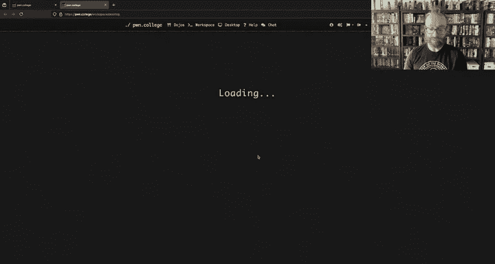

在本节课中，我们将学习如何高效地调试和分析网络安全挑战，特别是针对SQL注入和路径遍历漏洞。我们将通过实际例子，讲解如何将复杂的Web应用简化为可交互的脚本，以及如何系统地定位漏洞并学习必要的技术知识。


## 调试SQL注入挑战

上一节我们介绍了课程的基本情况，本节中我们来看看如何具体调试一个SQL注入挑战。当面对一个包含Web前端的复杂应用时，直接通过HTTP请求进行测试可能非常繁琐。一个有效的方法是剥离Web部分，创建一个可以直接与核心漏洞代码交互的简化环境。


以下是创建一个简化调试环境的步骤：

1.  **定位核心代码**：在挑战文件（如`sqli2.py`）中找到执行数据库查询的关键部分。
2.  **剥离无关代码**：删除所有与Flask Web框架、路由处理、HTTP请求/响应相关的代码。
3.  **创建交互脚本**：将核心的SQL查询逻辑提取到一个独立的Python脚本中。使用命令行参数或直接修改代码来提供输入。
4.  **使用交互式Python**：通过`python -i`命令运行脚本，进入交互式Python环境，可以方便地执行查询、检查结果和测试不同的注入载荷。


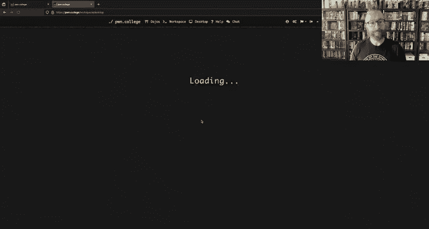


例如，原始Web应用中的查询代码可能如下：
```python
query = f“SELECT * FROM users WHERE username = ‘{username}’ AND password = ‘{password}’”
result = db.execute(query)
```
可以简化为：
```python
import sqlite3
conn = sqlite3.connect(‘:memory:‘)
# ... 初始化数据库 ...
username = input(“Enter username: “)
password = input(“Enter password: “)
query = f“SELECT * FROM users WHERE username = ‘{username}’ AND password = ‘{password}’”
print(“Debug Query:“, query)
cursor = conn.execute(query)
print(“Result:“, cursor.fetchall())
```


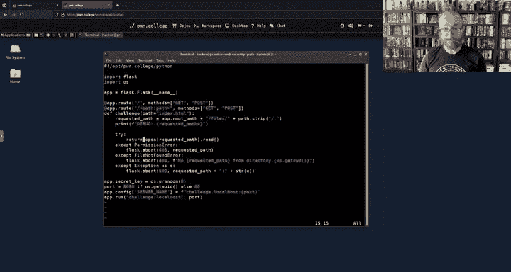

这种方法让你能快速验证注入点，而无需处理网络层的问题。

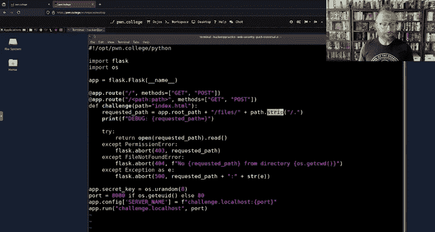


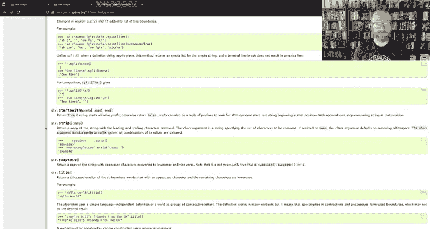

## 系统性的漏洞分析方法


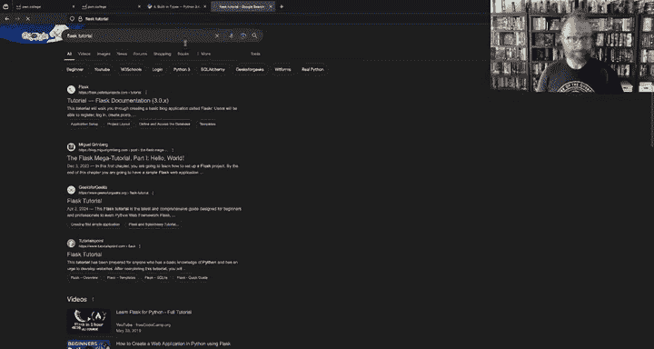


在解决了如何调试的问题后，我们需要一个系统性的方法来定位漏洞。无论面对何种挑战，第一步总是明确最终目标：获取`flag`。

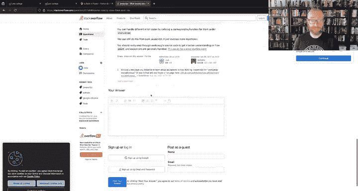

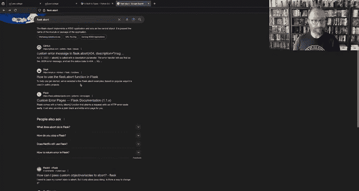


以下是分析漏洞的通用步骤：

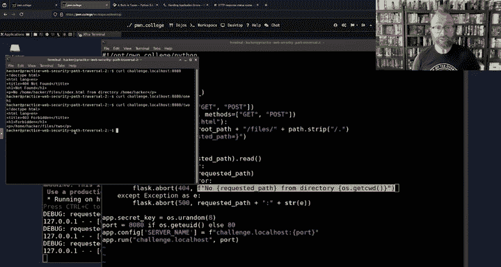


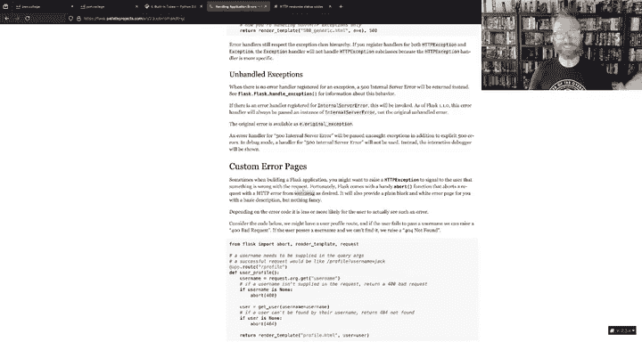

1.  **明确目标**：在代码或应用描述中搜索`flag`，确定获取`flag`的条件（例如“以admin身份登录”）。
2.  **逆向推理**：思考如何满足该条件。这通常意味着需要绕过身份验证（如窃取密码或利用登录逻辑漏洞）。
3.  **定位可疑代码**：根据挑战主题（如SQL注入、路径遍历），在代码中搜索可能存在问题的地方（如动态拼接的SQL语句、用户控制的文件路径参数）。
4.  **聚焦测试**：集中精力测试最可疑的代码片段。如果毫无进展，再考虑其他可能性。


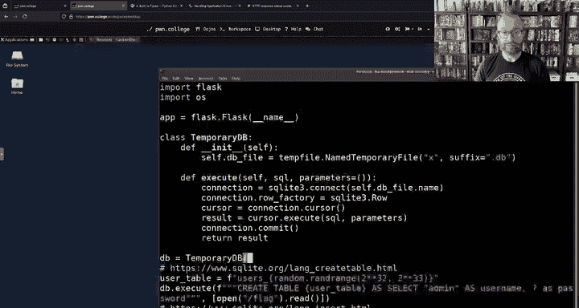


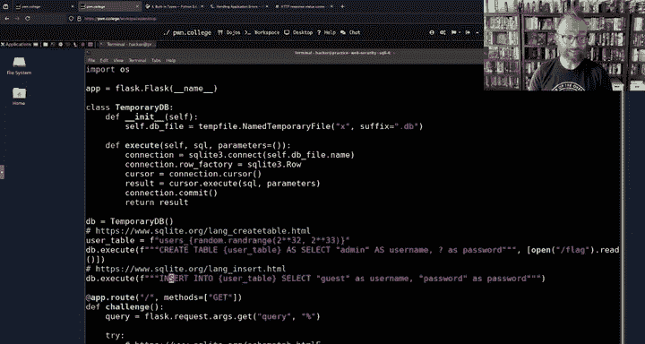

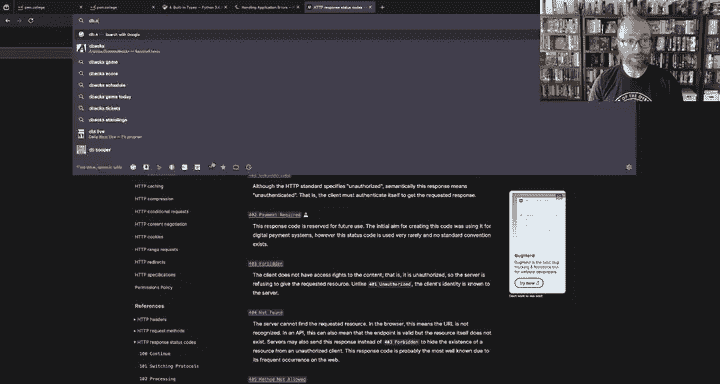


以路径遍历挑战为例：
*   **目标**：读取`/flag`文件。
*   **推理**：应用本身没有直接输出`flag`的功能，因此需要利用其文件读取功能。
*   **定位**：查找用户输入影响文件路径的代码，例如`open(path)`中的`path`变量。
*   **分析**：检查对`path`变量的过滤或清理逻辑（如使用`strip(‘./’)`），并研究其确切行为。

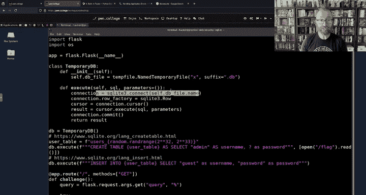


## 快速学习未知技术

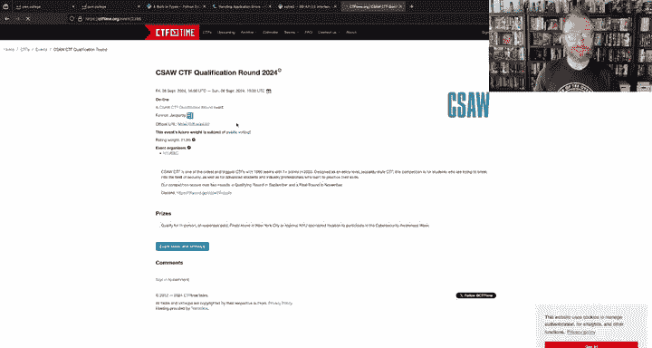


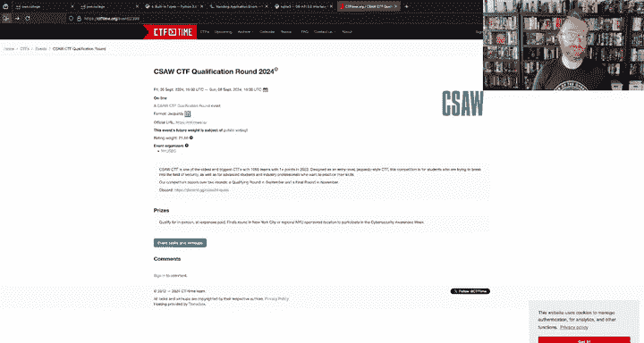


在分析过程中，你肯定会遇到不熟悉的技术或框架（如Flask、SQLite）。网络安全要求具备快速学习的能力。


以下是高效学习的方法：

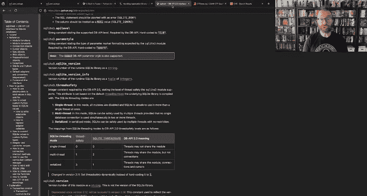

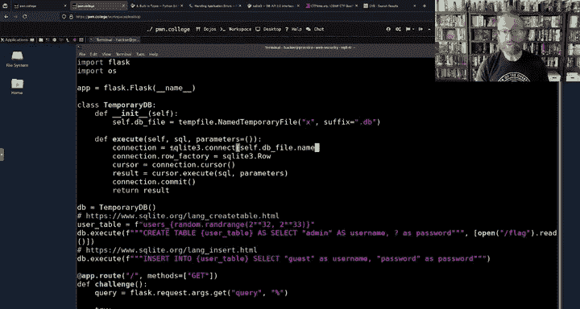


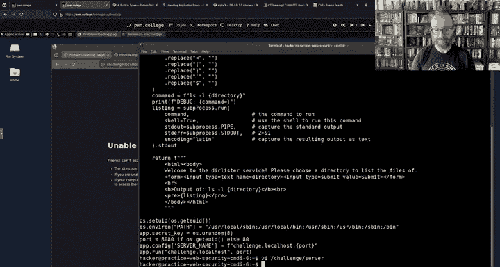


1.  **善用官方文档**：遇到未知函数（如Flask的`abort()`或Python的`strip()`），第一时间查阅官方文档。
2.  **把握抽象层次**：无需立即深入每个细节。先理解其基本功能和在该上下文中的安全影响。只有当其他路径都走不通时，才深入挖掘。
3.  **针对性搜索**：使用准确的关键词进行搜索（例如“python sqlite3 cursor execute”而非泛泛的“db execute”）。

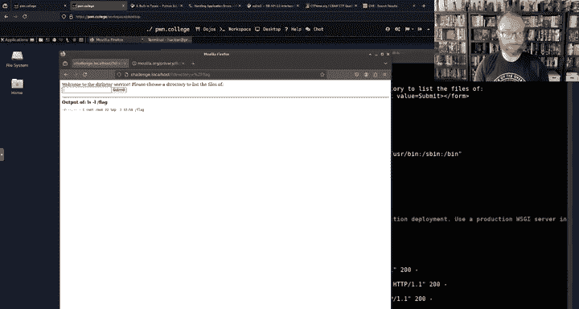


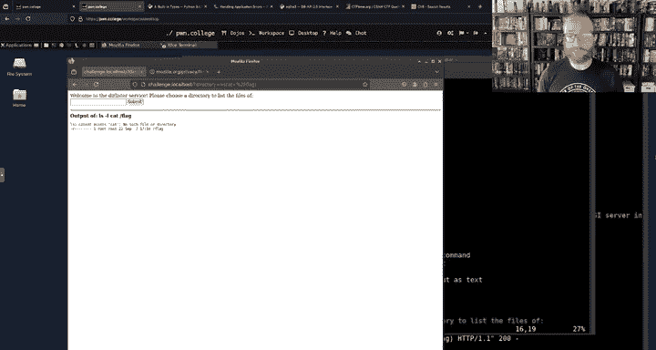

例如，你不必精通Flask的所有细节，但需要快速了解`abort(403)`会向浏览器返回一个“403 Forbidden”HTTP错误，并可能附带消息。这种程度的知识可能就足以理解漏洞的利用方式。


## 现实意义与总结


本节课中我们一起学习了如何通过简化代码来调试SQL注入，以及一套系统性的漏洞分析方法。更重要的是，我们探讨了在网络安全领域中快速学习未知技术的必要性和方法。这些技能不仅适用于Pwn College的挑战，也直接对应现实世界中的安全漏洞（如CVE列表中的大量SQL注入和路径遍历案例）。通过练习，你将培养出“快速学习，足够深入”的能力，这是安全研究员最关键的核心技能之一。

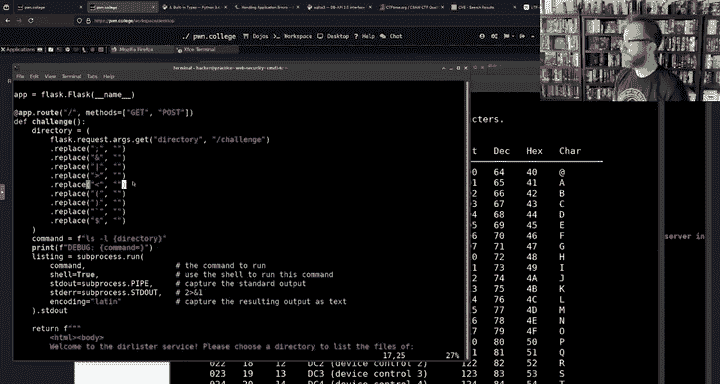


请记住，对于Web安全模块的检查点，你需要在截止日期前完成一定数量的挑战。如果某个挑战卡住，不妨暂时跳过，先解决其他问题以确保拿到基础分数。