# 5：Web安全 - 课程回顾与解题方法

在本节课中，我们将回顾Web安全模块的学习情况，并深入探讨一种系统性的解题方法。我们将学习如何分析一个复杂的系统，识别其安全策略，并找到违反该策略的漏洞。课程将涵盖命令注入、SQL注入和跨站脚本等核心概念，并通过实例演示如何分解问题、调试代码和构建攻击链。

## 课程回顾与观察

上一节我们介绍了Web安全的基础知识。本节中，我们来看看同学们在实践中的表现和遇到的常见问题。

Web安全并不像想象中那么难。事实上，本模块的完成情况相当不错：近三分之二的同学达到了检查点要求，甚至有部分同学已经完成了所有挑战。然而，我们也观察到一些同学将任务拖到了最后期限，这反映出安全挑战需要深入理解，而理解所需的时间是难以预测的。

对于本模块，大部分同学在周六下午之后才解决了第一个挑战。理想情况下，我们希望同学们能更早开始，以便有足够时间发现自己知识的不足。Linux和Talking Lab模块可能相对直接，导致一些同学低估了Web安全的难度。请不要低估后续模块的挑战性，我们已经进入了一个将持续一段时间的难度水平。

在帮助方面，我们的助教团队（如Rob、Veify、Hanto noodles等）发挥了巨大作用。请记住在Discord上获得帮助时感谢他们。寻求帮助的最佳方式是：理解给出的提示或指导，并尝试自己重构从提示前到提示后的思考路径。如果你对“我该如何想到这一点”感到困惑，可以询问帮助你的人。很多时候，他们也是通过试错才找到答案的。


我们真正要教授的，不仅仅是触发命令注入的技巧，更是如何**跳入一个现有的复杂系统、理解漏洞并推理其影响**。这是一项很难直接传授的技能，我们主要通过“暴露疗法”来让大家掌握。

同时，你需要理解问题的**关键点**，而不必深入到每一个细节。例如，要进行SQL注入，你并不需要完全理解SQL的历史。只要你有足够的知识来发现和推理漏洞，这就足够了。当然，我们应尽可能多地学习，但也要注意平衡，避免钻牛角尖。


在调试过程中，一个常见的错误是忘记启动服务器，却花费数小时调试解决方案。请务必注意这一点。此外，服务器代码并非不可更改的“青铜巨像”。你可以利用它来帮助你调试和利用漏洞。服务器代码底部有选择端口的代码，如果你不以root身份运行，可以复制出来修改并运行在新端口上，这样你就可以插入调试语句或修改它以辅助攻击。

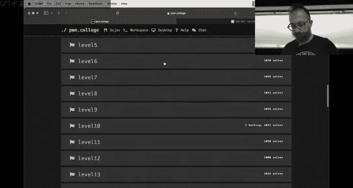

## 核心挑战与解题思路

现在，让我们将焦点转向具体的挑战和系统性的解题方法。我们将以命令注入1为例，然后将其思路应用到更复杂的SQL注入1上。

### 分析方法：以命令注入1为例

首先，请完整阅读挑战描述和代码。我们的分析始于一个核心问题：**这个脚本应遵守的安全策略是什么？而我们又要如何违反它？**

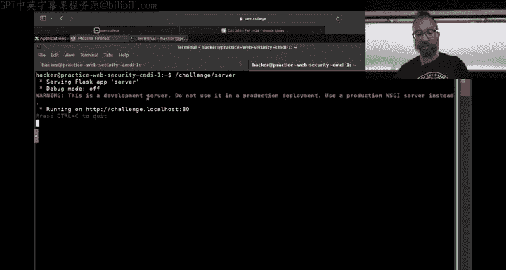

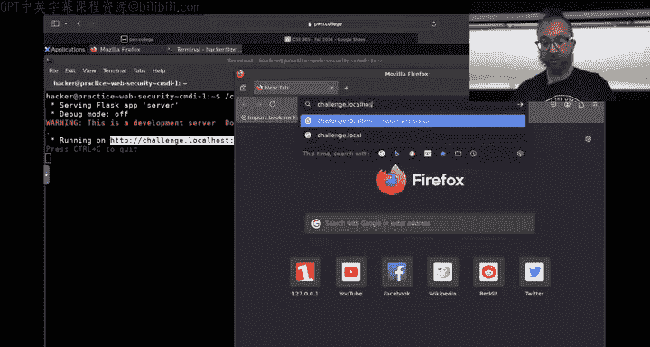


对于命令注入1，脚本的安全策略是：允许用户使用其预期功能（列出目录），但不允许违反**标志文件的机密性**。我们的攻击目标正是读取标志文件。

确定了安全属性后，我们接着问：**如何实现？** 知道这是一个命令注入，并且看到用户输入被直接拼接进字符串，我们就知道问题所在。我们的注意力转向如何利用这个问题。

这一切都要求我们首先**理解挑战文件**和**源代码**。理解你正在攻击的程序与确定初始的安全属性同等重要。为了推理攻击，我们需要理解这个服务器，因为它以root身份运行，可能有权访问标志文件。

理解代码意味着逐行阅读，至少在高层次上了解其功能。例如：
*   `import subprocess`：用于启动和与进程交互的模块。
*   `Flask`：一个Python网络服务器模块。
*   `f"ls {directory}"`：这是一个Python格式字符串，会将用户输入添加到字符串中。
*   `subprocess.run`：用于生成进程。

理解了代码后，我建议动态地与系统交互。这意味着实际运行并操作它。许多同学仅使用`curl`命令，这就像试图用叉子喝汤一样。系统是为特定交互方式设计的，对于Web漏洞，使用浏览器（如Firefox）通常是更直观的调试工具。


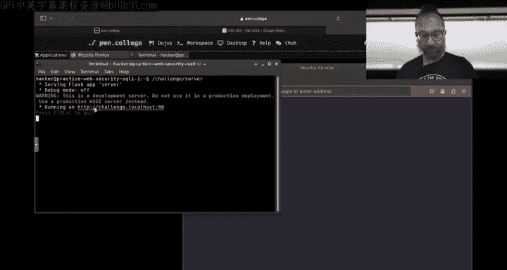


如果你在使用`curl`或类似工具时遇到困难，无法理解发生了什么，那么就需要开始调试。一个强大的技巧是：**分解问题**。


例如，命令注入1涉及两种技术：HTTP和Shell命令行。一旦你确定了内部问题（命令注入），你可以创建一个**代理挑战**，只探索那个问题，而无需处理HTTP。你可以复制服务器代码，删除所有与Web（Flask）相关的部分，只保留核心的命令拼接与执行逻辑，然后通过命令行直接与之交互。这允许你在不处理HTTP的情况下，专注于理解漏洞的本质。

**注意**：在修改代码时，请注意上下文。原始服务器在启动时会更改工作目录（例如到`/challenge`）。在你的简化版本中，可能需要保持一致，以确保行为与原始挑战一致。

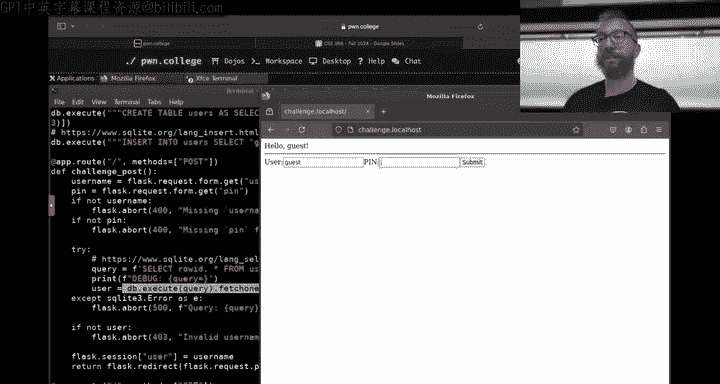

### 方法应用：SQL注入1


现在，让我们将同样的分析方法应用到更复杂的SQL注入1。许多同学的做法是：复制所有72行代码和描述，粘贴到ChatGPT并询问如何解决。ChatGPT或许能帮你解决第一个挑战，但如果你不从中学到东西，那么到了SQL注入2或更后面，当你的概念知识严重滞后时，挑战将变得无法解决。请不要这样做。

让我们系统性地分析SQL注入1：
1.  **安全目标**：我们的目标是获取标志（flag）。这指导我们的一切行动。
2.  **如何获取标志**？代码显示，需要以`admin`用户身份登录。
3.  **分析登录机制**：
    *   用户名从Flask会话cookie中获取，而Flask会话受服务器密钥保护，无法伪造。
    *   查看数据库创建语句：有一个`admin`用户和一个`pin`码；还有一个`guest`用户，`pin`为1337。
    *   尝试以`guest/1337`登录成功。这验证了我们对程序工作方式的理解，并帮助我们建立与代码匹配的心智模型。
4.  **寻找漏洞**：查看处理登录的代码，发现这一行：
    ```python
    query = f"SELECT * FROM users WHERE username = '{username}' AND pin = {pin}"
    ```
    这是一个将用户输入（`pin`）直接放入的格式字符串，然后该字符串被用作SQL查询。这很危险。
5.  **验证漏洞**：尝试以`guest`身份登录，`pin`输入一个分号`;`。服务器崩溃，说明存在SQL语法错误，证实了SQL注入点就在`pin`参数处。

现在，我们可以在浏览器中直接测试和调试这个注入点，这比使用`curl`更方便。

如果我们想更深入地理解SQL查询本身，而不受Web部分干扰，可以再次使用**分解法**。创建一个简化脚本，移除所有Flask和HTTP相关代码，只保留数据库连接和查询逻辑。我们可以让脚本从命令行接收`pin`输入，然后打印出构建的查询和结果。这样，我们就有了一个专注于SQL交互的“调试器”。

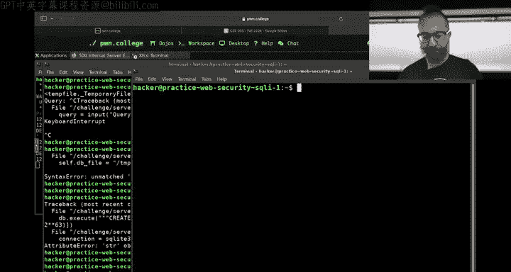

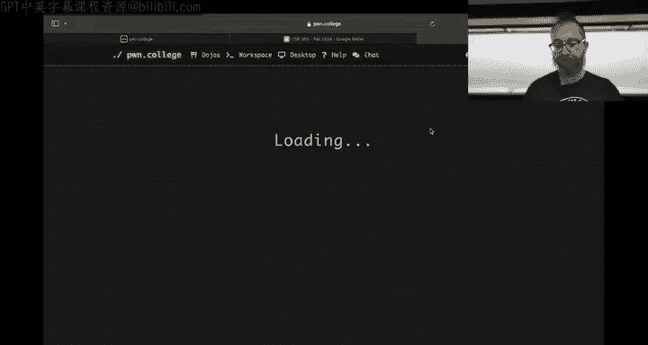

更进一步，我们可以直接与挑战创建的数据库文件交互。服务器会在`/tmp`目录下创建一个SQLite数据库文件。我们可以用另一个终端，使用`sqlite3`命令行工具直接打开这个文件并执行任意SQL查询。这让我们能够完全绕过Web界面，直接操作数据库，从而更好地理解数据结构并测试我们的攻击载荷。


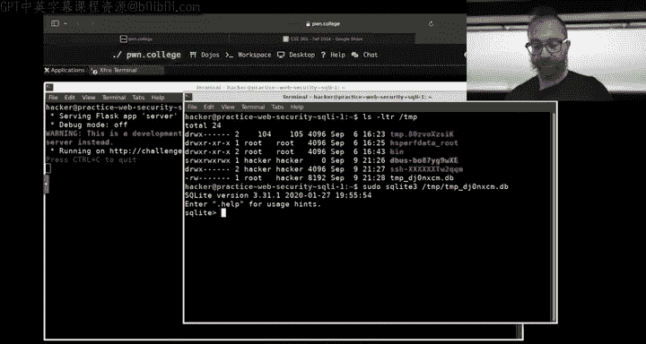


### 方法推广：XSS与CSRF

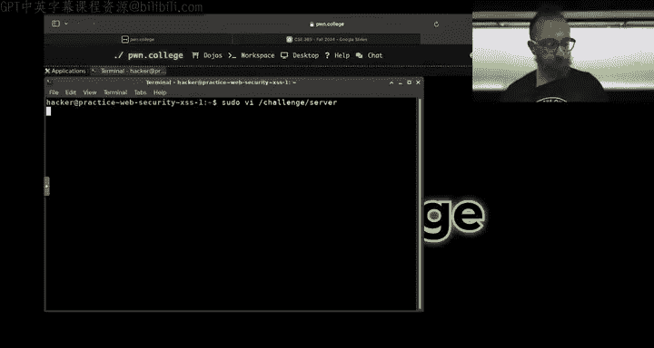

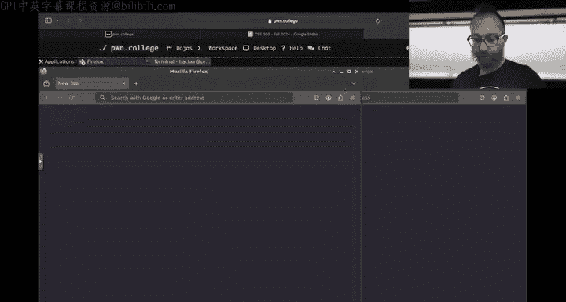


这种分解问题、隔离核心漏洞的思想可以推广到其他类型的挑战，如跨站脚本和跨站请求伪造。


以XSS为例，挑战可能涉及服务器、客户端浏览器（受害者）以及它们之间的交互。你的攻击链可能包含多个步骤。你可以：
1.  **单独测试组件**：像处理SQL一样，你可以直接操作后端数据库，插入测试数据，验证攻击的最终效果是否可行。
2.  **逆向构建**：如果你知道最终目标（例如，让管理员浏览器执行特定JavaScript），你可以先确保这一步能独立工作。然后倒退一步，构建触发这一步的HTTP响应，并确保各个环节衔接无误。
3.  **修改“受害者”**：在一些有模拟受害者浏览器的挑战（如XSS2或CSRF）中，“受害者”本身也是一个脚本（例如使用Selenium）。在练习模式下，你可以修改这个受害者脚本，例如移除“无头”模式，让它显示浏览器窗口，或者添加暂停，以便你观察攻击发生时浏览器内的具体情况。


关键在于认识到，这些挑战都是**由多个部分组合而成的复杂系统**。你可以与不同部分进行不同方式的交互。分解并隔离它们，可以让你与更小、约束更强的问题进行交互，从而可以精细地调整攻击的每一步。之后，再将各个步骤组合起来，完成端到端的攻击。

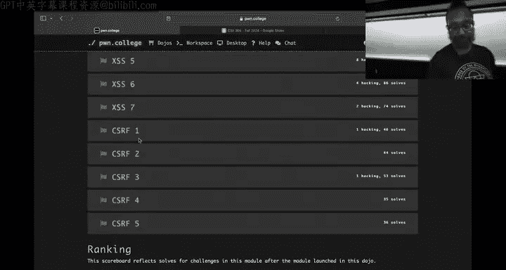


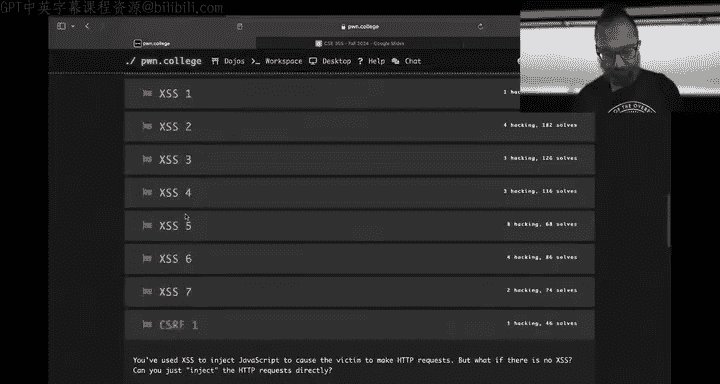

## 总结

本节课中，我们一起学习了应对Web安全挑战的系统性方法。我们首先强调了理解代码和明确安全目标（违反何种策略）的重要性。接着，我们深入探讨了如何通过**动态交互**和**问题分解**来分析和调试漏洞，具体包括：
*   使用合适的工具（如浏览器）进行交互。
*   创建简化版的“代理挑战”，隔离核心漏洞（如命令注入、SQL逻辑）。
*   直接与系统组件交互（如用`sqlite3`操作数据库文件）。
*   在涉及受害者浏览器的挑战中，修改受害者行为以辅助观察。

这项技能的本质是：**对一个相对复杂的目标进行安全分析时，你必须拆分问题**。这类似于做几何证明，你需要从目标（获取flag）出发，逆向推导出潜在的步骤，并逐一探索和验证。本课程要求你快速自学多种技术（如SQL、HTTP、浏览器自动化），并具备消化文档的能力。通过有意识地运用这些分析方法，你将能更有效地解决未来的安全挑战。

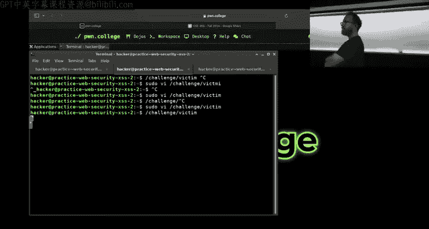

---
**课程名称**：CSE365 网络安全导论  
**章节编号**：06  
**章节名称**：Web安全 - 课程回顾与解题方法