# 6：Web Security

## 概述


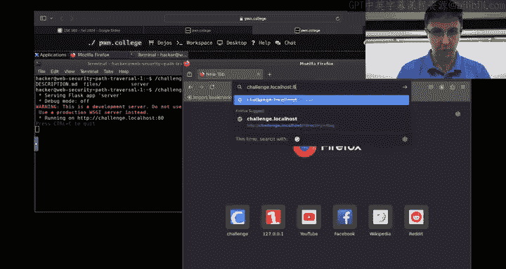

在本节课中，我们将学习Web安全模块的核心概念，特别是跨站脚本攻击。我们将通过分析一个具体的挑战（XSS 5）来理解如何识别漏洞、构建攻击链，并最终获取目标标志。课程将涵盖从理解应用程序结构到利用XSS漏洞执行管理员操作的完整流程。

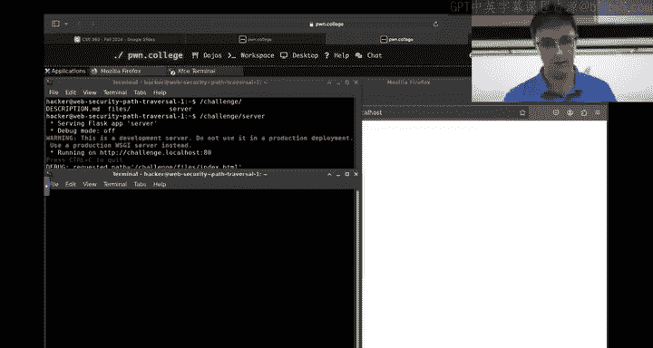

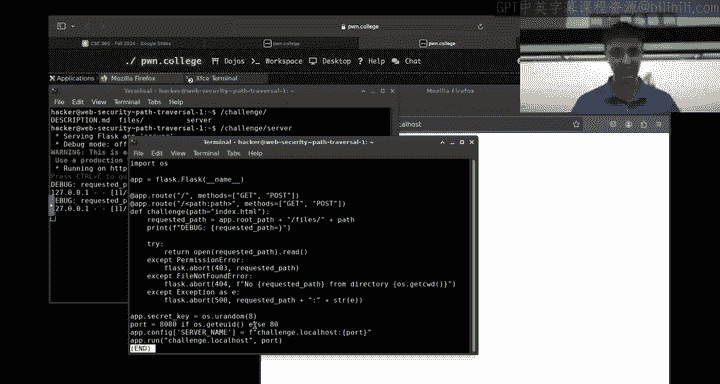

---

## 课程结构说明

在深入挑战之前，我们先回顾一下本课程的结构。课程大纲提供了模块和挑战的概览，但具体内容可能会有所调整。每个模块都包含一系列挑战，难度逐渐增加。本模块涉及路径遍历、命令注入、身份验证绕过、SQL注入、跨站脚本和跨站请求伪造等主题。

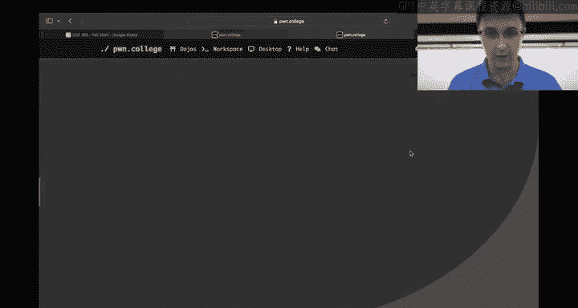

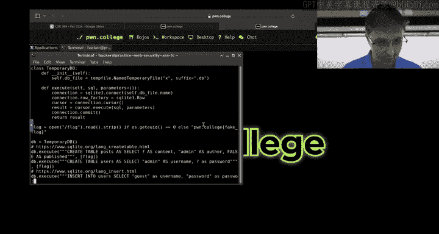

跨站脚本5是一个较难的挑战，它建立在之前挑战的基础上。如果你对某个概念感到困惑，例如如何开始一个挑战，本节将为你提供指导。

---

## 启动挑战

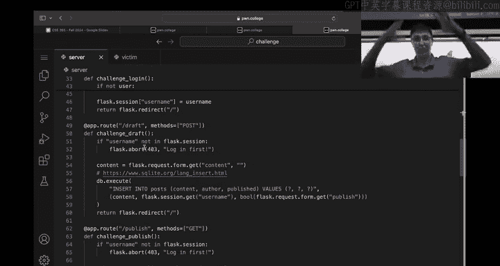

以下是开始本挑战的步骤：

1.  访问挑战页面，你会看到一个服务器。
2.  你必须启动服务器。许多同学忘记这一步，导致无法连接。
3.  服务器启动后，会显示运行在 `localhost:80`。
4.  你可以通过浏览器访问 `http://localhost:80` 来查看Web应用程序。

每个挑战的核心都是一个Python Flask服务器。理解服务器代码是解决挑战的关键。你可以修改代码来添加调试信息，帮助你理解程序流程。

---

## 分析应用程序

上一节我们介绍了如何启动挑战，本节中我们来看看如何分析目标Web应用程序。

首先，阅读挑战描述至关重要。对于XSS 5，描述指出目标不仅仅是弹出一个警告框，而是需要利用JavaScript在受害者浏览器中发起新的HTTP请求，伪装成受害者，以读取管理员用户的未发布草稿中的标志。

接下来，我们需要查看服务器源代码，以理解应用程序的数据结构和功能。


### 数据结构

服务器初始化时创建了数据库表。核心数据结构如下：

*   **posts表**：存储帖子内容。包含 `content`（内容）、`author`（作者）和 `published`（是否发布）字段。
*   **users表**：存储用户信息。包含 `username`（用户名）和 `password`（密码）字段。

初始数据包括：
*   一个由 `admin` 用户创建的未发布帖子，其 `content` 字段包含标志。
*   三个用户：`admin`（密码为标志）、`guest`（密码为 `password`）和 `hacker`（密码为 `1337`）。

我们的目标有两个潜在路径：获取 `admin` 的密码，或者读取 `admin` 的未发布帖子。挑战描述指向后者。

### 功能端点

应用程序提供了四个主要路由（端点）：

1.  `POST /login`：处理用户登录。
2.  `POST /draft`：创建草稿（或已发布）帖子。
3.  `POST /publish`：将当前用户的所有草稿帖子设置为已发布。
4.  `GET /`：根路径，显示欢迎页面和帖子列表。

通过代码分析，我们可以确认：
*   `POST /login` 和 `POST /draft` 使用了参数化查询（`?` 占位符），因此不存在SQL注入漏洞。
*   `POST /publish` 端点有一个关键特性：它可以将**当前登录用户**的所有草稿帖子发布。如果能让 `admin` 用户访问这个端点，那么包含标志的未发布帖子就会变成已发布状态，从而可以被我们查看。

---

## 理解漏洞与攻击链

上一节我们分析了应用程序的功能，本节中我们来看看如何将这些功能点串联成攻击链。

攻击的核心思路是：**利用跨站脚本让管理员浏览器执行我们控制的JavaScript代码，该代码会以管理员的身份访问 `/publish` 端点。**

### 攻击链构建

1.  **目标**：获取 `admin` 的未发布帖子中的标志。
2.  **等价条件**：如果 `admin` 用户访问了 `POST /publish` 端点，那么他的未发布帖子就会变成已发布。
3.  **问题**：我们无法直接以 `admin` 身份登录。
4.  **突破口**：应用程序存在XSS漏洞。我们可以在帖子内容中注入JavaScript代码。当 `admin` 用户（通过`victim`脚本自动登录）浏览帖子列表时，我们的代码会在他的浏览器中执行。
5.  **利用**：编写JavaScript代码，在 `admin` 的浏览器环境中向 `/publish` 发起请求。由于请求是从 `admin` 的浏览器发出的，会携带他的会话Cookie，因此服务器会认为这是 `admin` 本人发出的发布请求。

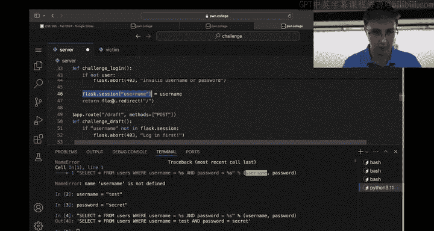

### 关键代码分析

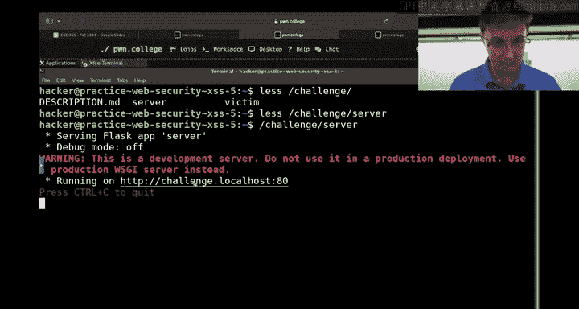

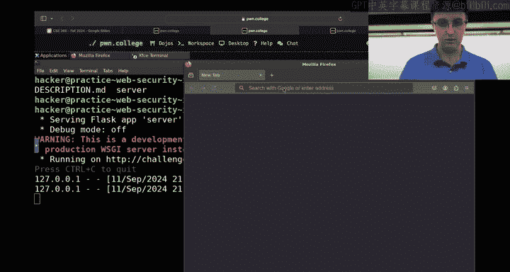

在根路径 `/` 的处理函数中，应用程序会查询并显示所有帖子。对于每个帖子，它会直接输出 `author` 和 `content` 到HTML页面中，而没有对 `content` 进行任何过滤或转义。这就是XSS漏洞的根源。


```python
# 简化示例，展示漏洞点
for post in posts:
    page += f"<div>Author: {post['author']}</div>"
    page += f"<div>Content: {post['content']}</div>" # 危险！直接输出用户控制的content
```

我们可以提交一个帖子，其 `content` 为 `<script>alert(1)</script>`。当任何用户（包括`admin`）查看帖子列表时，这段脚本就会执行。


---

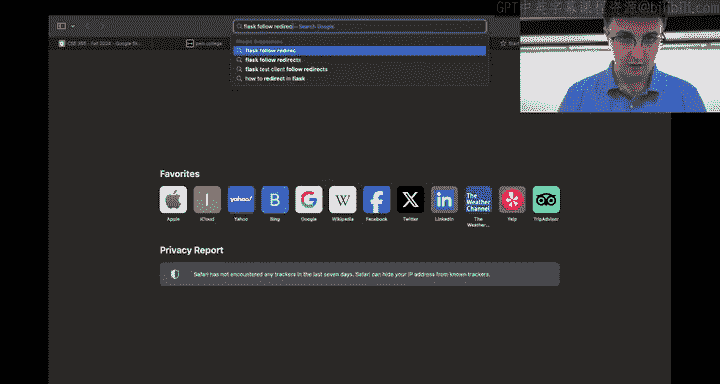

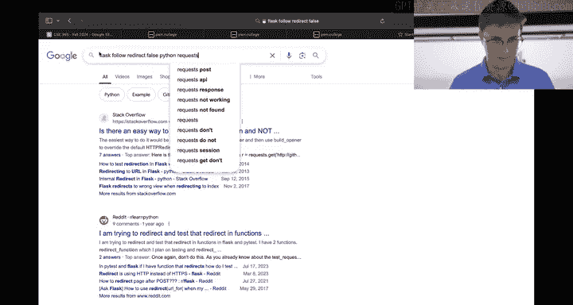

## 开发漏洞利用程序

上一节我们构建了攻击链，本节中我们来看看如何具体实现利用。

我们需要将弹窗的PoC（概念验证）脚本升级为能够发起HTTP请求的脚本。JavaScript的 `fetch()` API 可以用于此目的。

### 使用Fetch API

`fetch()` 函数用于发起网络请求。一个简单的GET请求如下：

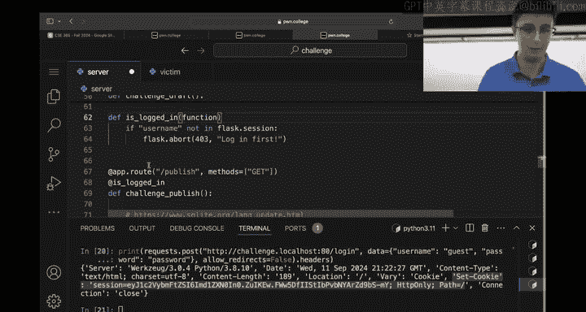

```javascript
fetch('/publish', {
  method: 'POST',
  credentials: 'include' // 关键：确保发送Cookie
})
```

**参数 `credentials: 'include'` 至关重要**。默认情况下，跨域请求不会发送Cookie等凭证信息。虽然我们这里是同源请求，但明确指定 `credentials: 'include'` 可以确保会话Cookie随请求一起发送，这样服务器才能识别出这是 `admin` 用户的请求。

### 整合利用

因此，我们最终提交的帖子内容应该是一个包含 `fetch` 调用的脚本：


```html
<script>
fetch('/publish', {method: 'POST', credentials: 'include'});
</script>
```

当 `admin` 用户通过 `victim` 脚本登录并浏览页面时，这段脚本会自动执行，向 `/publish` 发送一个POST请求，从而发布他所有的草稿（包括包含标志的那一篇）。之后，我们以 `guest` 身份登录，就能看到已发布的完整标志。

---


## 调试与验证


在开发漏洞利用程序时，不断验证你的假设至关重要。以下是一些有效的调试方法：

*   **修改服务器代码**：在 `/publish` 端点添加 `print` 语句，输出当前会话的用户名，以确认请求是否真的以 `admin` 身份到达。
*   **使用浏览者开发者工具**：检查网络请求，确认 `fetch` 请求是否按预期发出，以及Cookie是否被携带。
*   **使用 `curl` 或 Python `requests` 库**：手动模拟请求，理解应用程序的交互流程。使用 `curl -v` 可以查看详细的HTTP请求和响应头。
*   **注意上下文转义**：在Bash命令行、HTTP参数和SQL语句等多个上下文中，特殊字符（如`&`、`?`、引号）的行为不同。确保你的payload在最终执行时是正确的。

---

## 总结

本节课中我们一起学习了Web安全中一个复杂的跨站脚本攻击案例。我们从分析一个Flask应用程序的源代码开始，理解了其数据模型（用户、帖子）和业务逻辑（登录、发帖、发布）。通过代码审计，我们识别出一个存储型XSS漏洞，并发现了一个关键的业务接口 `/publish`。

我们构建的攻击链是：利用XSS在管理员浏览器中执行JavaScript，该脚本会以管理员的身份调用 `/publish` 接口，从而将其私密草稿（内含标志）公开。最后，我们探讨了使用JavaScript `fetch()` API实现该攻击的具体方法，并强调了携带凭证（`credentials: 'include'`）的重要性，以及在整个过程中进行调试和验证的必要性。

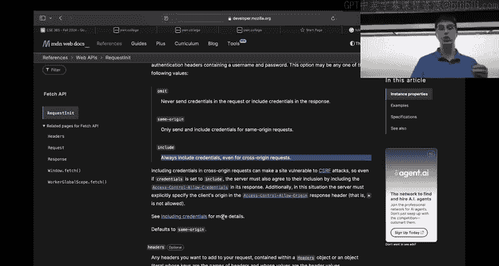

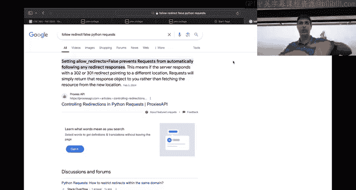

这个挑战综合了代码审计、逻辑推理和漏洞利用开发的能力，是Web安全学习的经典范例。