# 7：拦截通信

在本节课中，我们将学习网络通信的基础层，包括以太网、IP协议和TCP协议。我们将了解数据包的结构，以及如何使用工具如Wireshark和tcpdump来捕获和分析网络流量。特别地，我们将关注ARP协议及其在本地网络中的安全含义。

---

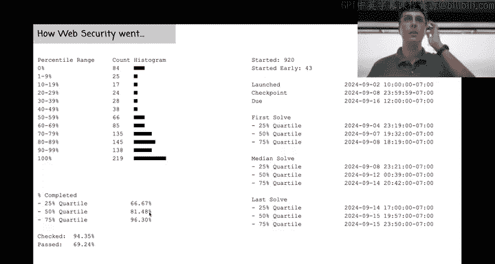

## 网络协议层概述

上一节我们介绍了Web安全，它位于技术栈的较高层。本节中，我们将深入网络层，了解数据如何在网络中传输。

网络通信通常被组织成多个层次，就像一个洋葱。每一层都有其特定的职责：


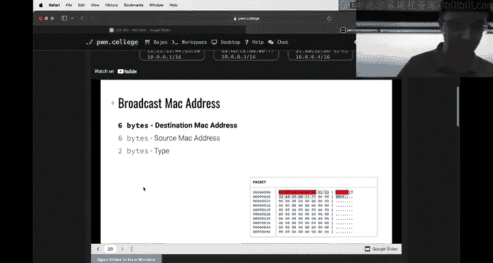

*   **以太网层**：处理与最近邻居（如直接连接的设备）的通信。它使用MAC地址来标识设备。
*   **IP层**：负责在网络间路由数据包，处理跨多个“跳”的通信。它使用IP地址。
*   **TCP层**：在IP之上提供可靠的、面向连接的通信。它使用端口号来区分同一设备上的不同服务。

这些协议都是**二进制协议**，这意味着它们的数据由特定位置的字节组成，而不是像HTTP那样的纯文本。


---

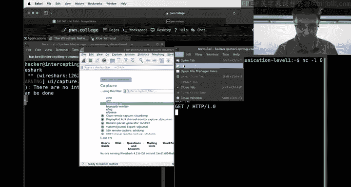

## 网络接口与命名空间

要理解网络通信，首先需要了解网络接口。网络接口是软件对物理或虚拟网络端口的抽象。

以下是查看网络接口信息的命令：
```bash
ip a
```

在我们的实验环境中，运行挑战时会进入一个特殊的**命名空间**。这创建了一个隔离的网络环境。在这个环境中：
*   用户身份变为 `root`。
*   网络接口（如 `lo` 和 `eth0`）是全新的，与外部环境隔离。
*   所有在此命名空间内启动的进程共享同一个网络视图。

**重要提示**：如果你在桌面环境或不同终端中分别启动挑战，它们将处于不同的命名空间，无法直接通信。要在同一命名空间内获得多个终端，可以在挑战启动后的shell中使用 `xfce4-terminal &` 命令。

---

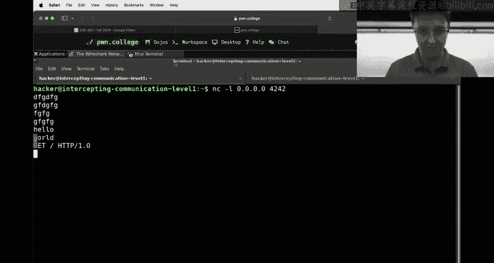

## 使用工具捕获和分析数据包


我们可以使用图形化工具Wireshark或命令行工具tcpdump来查看流经网络接口的原始数据包。

### 使用Wireshark

Wireshark允许我们以图形化方式深入查看数据包的每一层。

1.  在挑战环境的shell中（拥有root权限），运行 `wireshark`。
2.  选择要监听的接口（例如 `lo` 或 `eth0`）。
3.  进行一些网络活动（例如，使用 `netcat` 建立连接并发送消息）。
4.  在Wireshark中，你可以点击任何数据包，并展开查看其以太网帧、IP包头和TCP段的详细信息。
5.  要查看一个完整TCP会话的纯文本内容，可以右键点击相关数据包，选择 **Follow** -> **TCP Stream**。

### 使用tcpdump

tcpdump是一个强大的命令行数据包分析器。

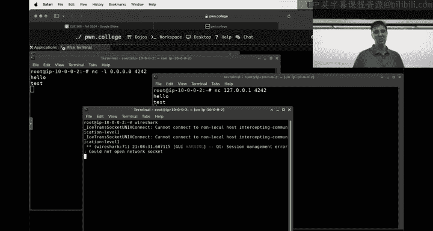

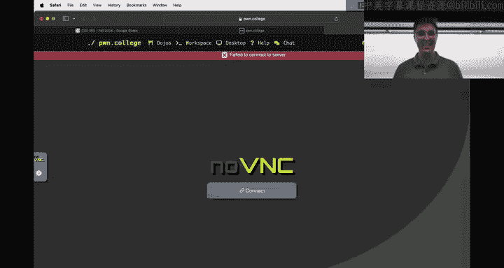

以下是tcpdump的一些常用命令示例：
```bash
# 监听所有接口的流量
tcpdump -i any


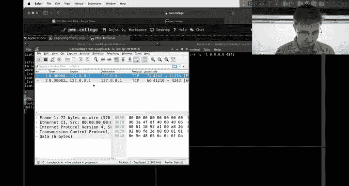


# 显示IP地址而非主机名
tcpdump -n


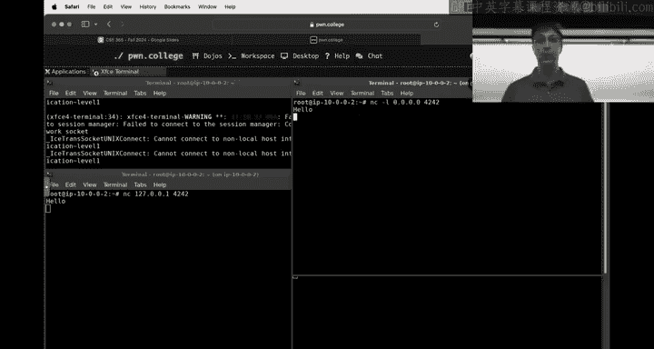

# 以十六进制和ASCII格式显示数据包内容
tcpdump -XX
```

运行tcpdump后，它会在终端实时显示捕获的数据包，包括协议类型、源/目的IP和端口、标志位等信息。

---

## 理解数据包结构：一个Netcat示例

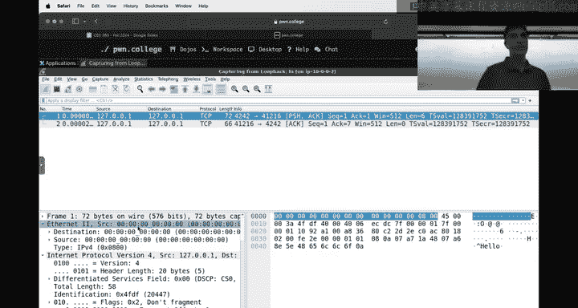


让我们通过一个简单的 `netcat` 通信示例，来观察数据包的各层。

1.  在终端A中启动一个监听服务器：
    ```bash
    nc -l 0.0.0.0 4242
    ```
2.  在终端B中连接到该服务器：
    ```bash
    nc 127.0.0.1 4242
    ```
3.  在终端B中输入 `hello` 并回车。


现在，在Wireshark或tcpdump中，你可以看到类似以下内容的数据包：

*   **以太网层**：包含源和目的MAC地址（在回环接口`lo`上可能全为0）。末尾的 `Type` 字段（如 `0x0800`）指明下一层是IPv4。
*   **IP层**：包含源IP（如 `127.0.0.1`）和目的IP（如 `127.0.0.1`）。`Protocol` 字段（如 `0x06`）指明下一层是TCP。
*   **TCP层**：包含源端口（如 `4242`）和目的端口（由内核随机分配，如 `49182`）。还有**标志位**，例如 `PSH` (Push) 表示应立即将数据传递给应用，`ACK` 表示确认，`FIN` 表示连接终止。
*   **数据部分**：最后才是我们发送的实际内容，例如 `hello\n`。

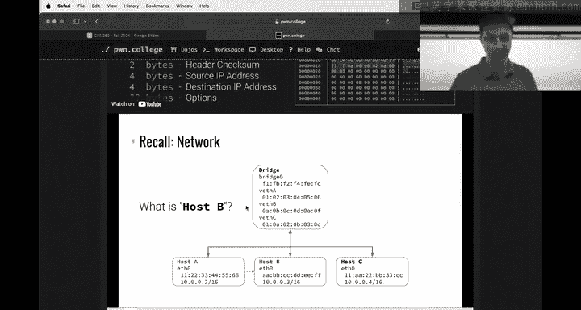

这个结构清晰地展示了协议的封装关系：**TCP段是IP包的数据，IP包是以太网帧的数据**。

---

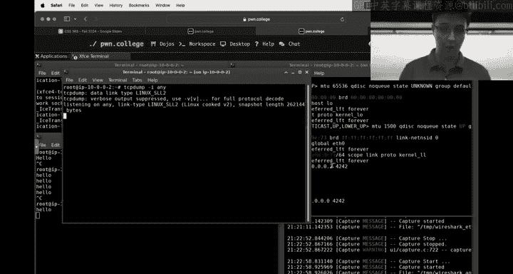

## ARP协议：连接IP与MAC地址

在本地网络中，设备需要知道目标IP地址对应的MAC地址才能进行以太网通信。**ARP（地址解析协议）** 就是用来完成这个映射的。

ARP的工作方式很简单，但也带来了安全风险：

1.  设备A想与IP地址为 `10.0.0.3` 的设备通信，但不知道其MAC地址。
2.  设备A向局域网内**广播**一个ARP请求：“谁有IP地址 `10.0.0.3`？请告诉 `10.0.0.2`（设备A的IP）。”
3.  拥有该IP的设备（如 `10.0.0.3`）会向设备A发送一个**ARP回复**，告知自己的MAC地址。
4.  设备A将这个IP-MAC映射存入本地ARP缓存，后续通信直接使用此MAC地址。

**安全风险**：任何设备都可以对ARP请求进行回复，声称自己拥有某个IP地址。如果恶意设备声称自己拥有网关或其他重要设备的IP，它就可以**拦截**发往该IP的所有流量，实现“中间人攻击”。这就是本模块“拦截通信”的核心议题之一。

你可以使用 `ping` 命令触发ARP请求，然后在Wireshark中过滤 `arp` 来观察ARP请求和回复数据包。

---

## 总结

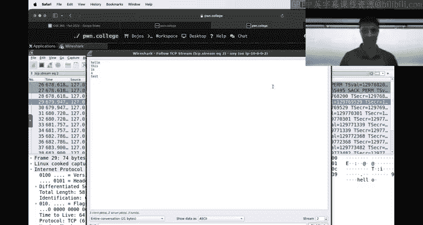

本节课中我们一起学习了网络通信的基础层。我们了解了以太网、IP和TCP协议如何协同工作，封装数据包。我们实践了使用Wireshark和tcpdump工具来捕获和分析网络流量。最后，我们探讨了ARP协议的工作原理及其在本地网络中可能引发的安全风险，即通过欺骗ARP响应来拦截通信。理解这些底层机制是识别和防范网络层攻击的关键第一步。