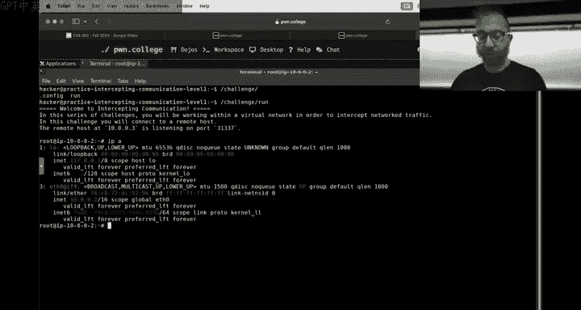

# 8：拦截通信


在本节课中，我们将要学习网络通信的基础知识，包括IP地址、域名解析（DNS）、路由以及如何利用工具进行网络诊断。这些概念是理解后续网络安全挑战的关键。

---


## 课程状态与社区更新

上一节我们介绍了课程的整体进度，本节中我们来看看社区互动和学习工具的使用情况。

课程社区非常活跃，许多同学乐于助人。请记住，在Discord上公开讨论问题有助于所有人学习。**严禁通过私信（DM）讨论课程作业相关内容**，这违反学术诚信规定。所有帮助应在公开频道进行。

关于学习工具，我们观察到一些同学过度依赖AI助手（如Sensei/GPT）。请注意，AI工具应用作快速概念检查或替代谷歌搜索，**不能替代你独立思考和解决问题**。过度依赖会阻碍你真正理解计算机科学知识，长远来看不利于你的发展。

---

## 新模块：拦截通信介绍

在完成了充满挑战的Web安全模块后，我们现在进入“拦截通信”模块。虽然本模块的初始关卡可能看起来直接，但其中涉及的概念，如**ARP**、**IP**、**TCP**以及像**Scapy**这样的Python库，在概念上可能比JavaScript更复杂。

**不要拖延**。尽早完成检查点，避免在最后期限前遇到难以逾越的障碍。请利用“练习模式”来调试和修改挑战，这是深入理解问题的好方法。

---

## 网络基础实战

现在，让我们从实践角度深入了解网络。你每天都在使用网络，但让我们看看其下的运作机制。

### IP地址与本地主机


在Dojo环境中启动挑战时，你会看到类似 `你的IP地址是 10.x.x.x` 的提示。IP地址是网络设备的标识符。

在Linux中，可以使用 `ip addr` 命令查看所有网络接口的IP地址。
```bash
ip addr
```
输出会显示如 `eth0`（以太网接口）和 `lo`（环回接口）的信息。环回接口的地址通常是 **127.0.0.1**，其主机名是 **localhost**。这意味着计算机可以通过这个地址与自己通信。


当你使用Netcat监听时：
```bash
nc -lvp 1337
```
它默认监听 `0.0.0.0`，这表示监听**所有可用的网络接口**。如果连接来自本机，日志会显示 `connection received on localhost`。

### 主机名解析：/etc/hosts 与 DNS


计算机如何知道 `localhost` 对应 `127.0.0.1`？它首先检查 **/etc/hosts** 文件。这个文件将主机名映射到IP地址。
```bash
cat /etc/hosts
```
你可以在这里添加条目，例如 `127.0.0.1 mywebsite.local`。

如果主机名不在 `/etc/hosts` 文件中，系统会使用**域名系统（DNS）**进行查询。工具 `dig` 可以用于DNS查询。
```bash
dig google.com
```
这个命令会向DNS服务器查询，并返回 `google.com` 对应的IP地址（例如 `142.250.69.14`）。



### 本地网络通信：ARP


在本地网络中（例如Dojo容器网络），设备通过**ARP（地址解析协议）**来发现彼此的硬件（MAC）地址。这允许它们在物理（或虚拟）链路上直接通信。

使用 `arp` 命令可以查看当前已知的邻居及其MAC地址。
```bash
arp -a
```
你会发现只能看到同一本地网络（如 `10.0.0.0/24` 或 `172.18.0.0/16`）中的设备。对于像Google这样的外部IP，它不会出现在ARP表中。

### 与外部网络通信：路由

那么，如何与不在同一本地网络的IP（如 `142.250.69.14`）通信呢？这时就需要**路由**。

使用 `ip route` 命令查看路由表。
```bash
ip route
```
路由表告诉系统：对于目标网络X，通过网关Y发送数据。默认网关（通常标记为 `default via ...`）负责处理所有发往未知网络的数据包。

数据包通过网络跳转到达目的地。可以使用 `traceroute` 工具可视化这个路径。
```bash
traceroute google.com
```
输出显示数据包从你的机器出发，经过本地网关、ISP的路由器，最终到达目标服务器的路径。每一跳都代表一个路由决策点。

### 网络诊断工具包

以下是几个实用的网络诊断命令：
*   **`ping`**：测试与目标主机的连通性。
    ```bash
    ping -c 4 google.com
    ```
*   **`dig`**：查询DNS信息。
*   **`arp`**：查看本地ARP缓存。
*   **`traceroute`**：追踪数据包路径。
*   **`nc (netcat)`**：网络界的“瑞士军刀”，可用于建立TCP/UDP连接和监听。

当网站无法访问时，按顺序使用 `ping` 和 `traceroute` 可以帮助你定位问题是出在本地网络、中间链路还是目标服务器。

---

## 总结与下一步

本节课中我们一起学习了网络通信的核心基础。我们了解了**IP地址**和**localhost**的概念，知道了系统如何通过 **/etc/hosts** 文件和 **DNS** 将主机名解析为IP地址。我们探讨了本地网络如何使用 **ARP** 进行设备发现，以及数据包如何通过**路由**和网关穿越网络到达外部主机。最后，我们介绍了一套实用的网络诊断工具。

请记住，**“拦截通信”模块的检查点将于周日晚上截止**。这些基础概念是理解后续关卡（如网络嗅探、中间人攻击）的基石。建议你尽早开始，充分利用练习模式，并在公开社区讨论中解决问题。


祝你学习顺利，我们下次课见！