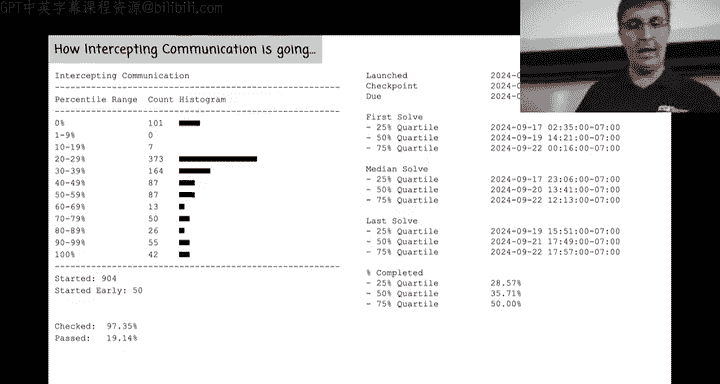
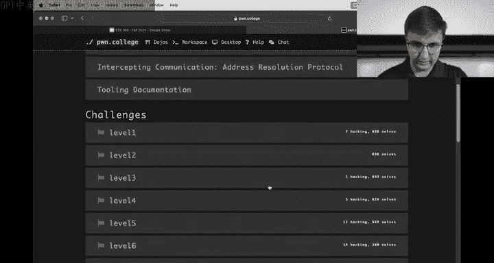
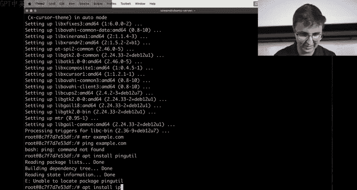
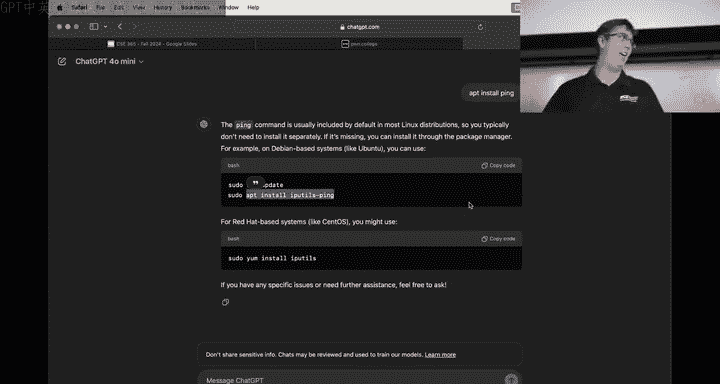
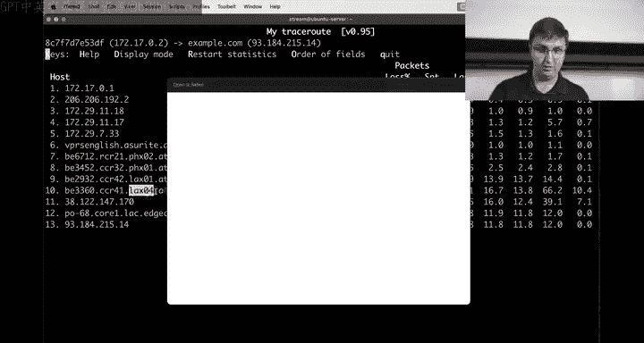

# 9：拦截通信实践



在本节课中，我们将学习网络通信的基础概念，并通过实际操作演示如何利用网络协议的特性来拦截通信。我们将重点关注ARP协议的工作原理及其潜在的安全风险。



## 课程概述

网络通信依赖于一系列分层协议，如以太网、IP和TCP。在这些协议中，ARP负责将IP地址解析为物理MAC地址。理解这些协议的工作方式是识别和防御网络攻击的关键。本节我们将通过搭建实验环境，演示ARP欺骗的基本原理。

## 网络基础回顾

上一节我们介绍了网络分层模型。本节中，我们来看看如何在实践中观察和分析网络流量。

我们首先使用Docker创建一个隔离的网络环境。Docker容器可以看作轻量级的虚拟网络命名空间，非常适合模拟网络实验。

以下是启动一个Python服务器容器的命令：
```bash
docker run -it --rm --name server python:latest bash
```

在容器内，我们安装必要的网络工具并启动一个简单的HTTP服务器：
```bash
apt update && apt install -y iproute2 net-tools
python -m http.server 8000
```

现在，我们从宿主机或其他容器访问这个服务器。通过`curl`命令，我们可以测试连通性并观察背后的网络过程。

## 观察网络流量

为了理解数据包如何传输，我们使用`tcpdump`工具来捕获和分析网络流量。

在另一个终端进入同一个Docker网络命名空间，并运行`tcpdump`：
```bash
docker exec -it server bash
apt install -y tcpdump
tcpdump -i any -n
```

当我们从宿主机执行`curl 172.17.0.2:8000`时，可以在`tcpdump`的输出中看到TCP三次握手的过程：
1.  **SYN**：客户端发送同步包。
2.  **SYN-ACK**：服务器回复同步-确认包。
3.  **ACK**：客户端发送确认包，连接建立。






## ARP协议与安全风险




TCP/IP通信建立在IP地址之上，但在局域网内，实际的数据传输依赖于MAC地址。ARP协议就是用来查询“某个IP地址对应的MAC地址是什么”的。

以下是ARP请求的核心过程：
1.  主机A想与IP地址为`172.17.0.2`的主机B通信。
2.  主机A广播一个ARP请求：“谁有`172.17.0.2`？请告诉`172.17.0.1`。”
3.  主机B收到请求后，单播回复一个ARP应答：“`172.17.0.2`的MAC地址是`aa:bb:cc:dd:ee:ff`。”
4.  主机A将这条映射关系存入本地ARP缓存，后续通信将使用这个MAC地址。

**安全风险在于**：ARP协议本身没有认证机制。任何连接到网络的主机都可以对ARP请求进行应答，甚至可以主动发送ARP应答（即“ gratuitous ARP”），声称自己拥有某个IP地址。

## 演示ARP欺骗

现在，我们演示一个攻击者如何通过ARP欺骗来拦截通信。

首先，我们启动一个名为“攻击者”的Docker容器，并赋予其特权以执行网络操作：
```bash
docker run -it --rm --privileged --name attacker python:latest bash
```

在攻击者容器中，我们安装`scapy`工具，它是一个强大的数据包操作库。
```bash
apt install -y scapy
```

攻击者的目标是“毒化”受害者（宿主机或其他容器）的ARP缓存，让受害者误以为攻击者的MAC地址对应着目标服务器（`172.17.0.2`）的IP地址。

以下是使用`scapy`发送欺骗性ARP应答的一种方法：
```python
from scapy.all import *
# 构造一个ARP数据包，操作码2表示“应答”
# 声称IP地址 172.17.0.2 在攻击者的MAC地址上
arp_response = ARP(op=2, pdst="172.17.0.1", hwdst="受害者MAC", psrc="172.17.0.2", hwsrc="攻击者MAC")
send(arp_response)
```

执行此操作后，当受害者试图访问`172.17.0.2`时，网络流量实际上会被发送到攻击者的MAC地址。如果攻击者进一步开启IP转发，并监听或修改流量，就能实现中间人攻击。

## 防御措施简介

了解攻击原理后，我们可以探讨一些防御策略：
*   **静态ARP条目**：在关键设备上配置静态的IP-MAC地址映射，但维护成本高。
*   **网络监控**：使用IDS/IPS系统检测局域网内异常的ARP流量。
*   **端口安全**：在交换机上启用端口安全功能，限制每个端口学习的MAC地址数量。
*   **加密通信**：使用HTTPS、SSH、VPN等加密协议，即使流量被拦截，攻击者也无法轻易解密内容。


## 课程总结

本节课中我们一起学习了网络通信的基础，特别是ARP协议的工作原理。我们通过Docker搭建实验环境，演示了如何利用`tcpdump`观察网络流量，并深入探讨了ARP协议缺乏认证机制所导致的安全风险——ARP欺骗。通过`scapy`工具，我们模拟了攻击者如何发送虚假ARP应答来劫持网络流量。理解这些底层机制是构建安全网络、识别潜在威胁的第一步。在后续课程中，我们将学习如何利用密码学来保护通信内容，即使在不安全的信道中也能保障安全。