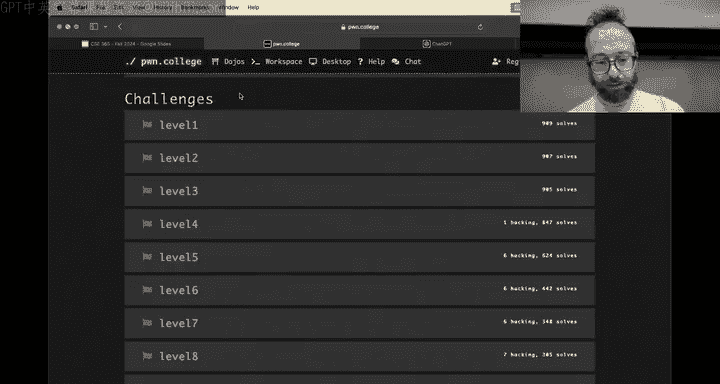
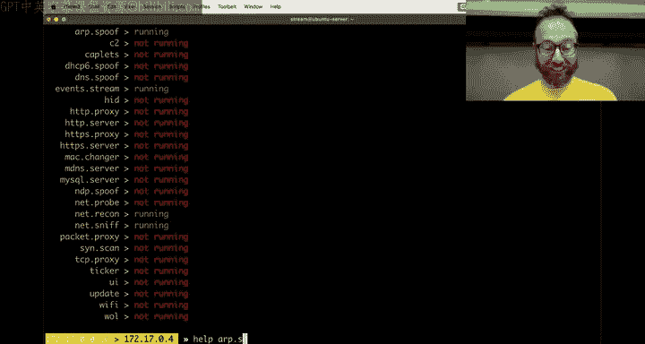
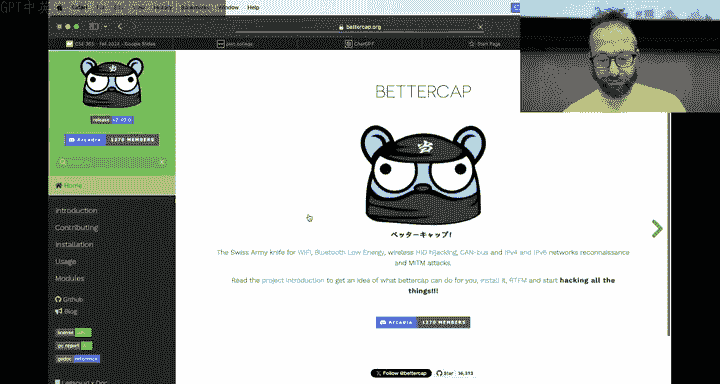
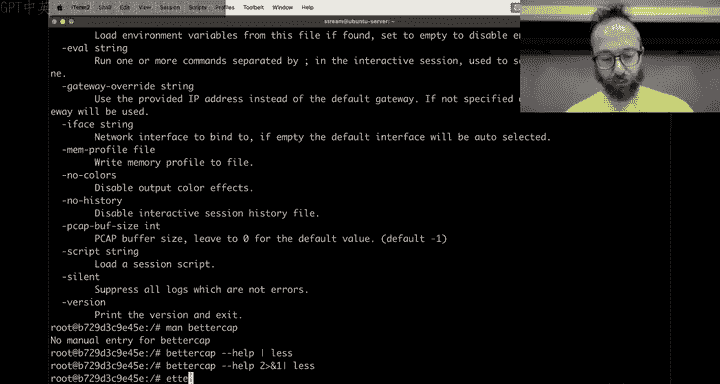
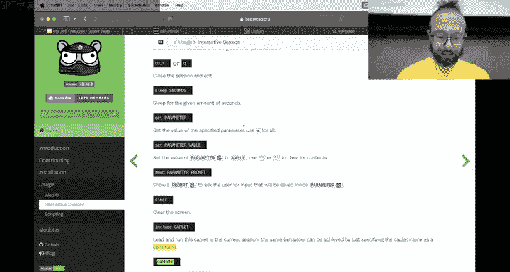
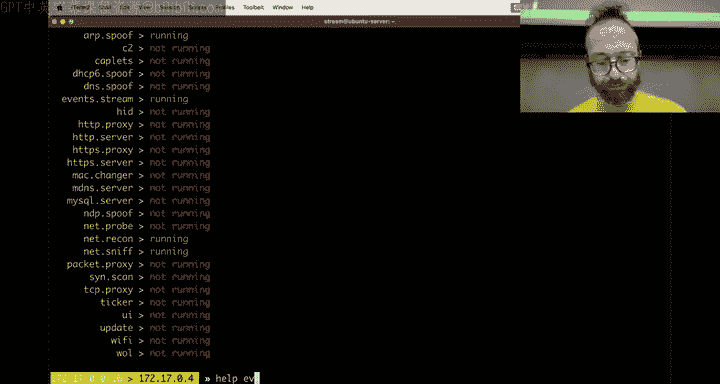
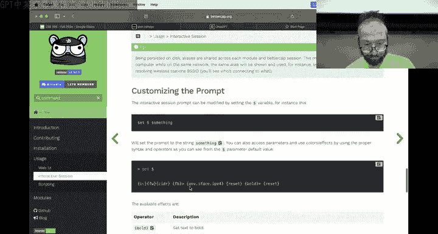

# 10：拦截通信实战教程


## 概述
在本节课中，我们将学习网络攻击中的一个核心概念：中间人攻击。我们将通过实际操作，演示如何拦截并篡改两台主机之间的网络通信。课程将涵盖从基础概念到使用自动化工具进行攻击的完整流程，并解释其背后的网络原理。

## 网络设置与目标
首先，我们需要搭建一个简单的实验环境。这个环境包含三个角色：
*   **服务器**：持续发送包含“flag”的数据。
*   **客户端（受害者）**：不断向服务器请求数据。
*   **攻击者**：位于服务器和客户端之间，目标是拦截通信并将服务器返回的真实“flag”替换为伪造的信息。

以下是服务器和客户端的设置命令：

**服务器端命令**：
```bash
yes "PwnCollege{some_flag}" | nc -l -k 1337
```
这个命令使用 `yes` 持续输出字符串，并通过 `netcat` 在1337端口进行监听。`-k` 参数使服务器在接受一个连接后继续保持监听。

**客户端命令**：
```bash
while read flag; do echo $flag | nc -q0 172.17.0.3 1337; done
```
这个 Bash 循环持续从标准输入读取（这里实际上是一个占位符），然后通过 `netcat` 连接到服务器（IP: 172.17.0.3）的1337端口。`-q0` 参数使客户端在发送完数据后立即关闭连接。


## 手动攻击与自动化工具
上一节我们介绍了基本的网络环境。本节中我们来看看两种发起中间人攻击的方法：手动使用Scapy和利用自动化工具。

手动使用Scapy等工具构造ARP欺骗数据包，虽然能加深对协议的理解，但步骤繁琐。因此，安全研究人员和攻击者通常会使用自动化工具。

以下是两种主流工具的对比：
*   **Ettercap**：一款历史悠久的综合网络攻击工具套件，功能全面但界面相对陈旧。
*   **BetterCap**：一个更现代、功能强大的网络攻击与监控框架，支持模块化扩展。




本次演示将主要使用BetterCap，因为它提供了更友好的交互体验和强大的功能。


## 使用BetterCap实施攻击
BetterCap功能强大，但需要正确配置。以下是实施ARP欺骗并启动代理拦截流量的关键步骤。


首先，我们需要启动BetterCap并设置网络嗅探与主机发现：
1.  启动BetterCap交互界面：`bettercap`
2.  开启网络嗅探：`net.sniff on`
3.  开启主机发现：`net.recon on`
4.  查看发现的网络主机：`net.show`



接下来，配置并启动ARP欺骗，这是将攻击者插入通信路径的关键：
1.  设置ARP欺骗的目标（服务器和客户端IP）：`set arp.spoof.targets 172.17.0.3,172.17.0.5`
2.  开启ARP欺骗功能：`arp.spoof on`









此时，攻击者的机器会向网络不断发送伪造的ARP响应包，欺骗服务器和客户端，让它们误以为攻击者的MAC地址是对方的MAC地址，从而将所有流量发送到攻击者这里。



最后，为了拦截并修改流量，我们需要设置一个代理：
1.  设置代理将流量重定向到本地的某个端口（例如8080）：`set any.proxy.address 172.17.0.4; set any.proxy.port 8080; set any.proxy.srcport 1337`
2.  启动任意协议代理：`any.proxy on`

启动代理后，发往服务器1337端口的流量会被重定向到攻击者本地的8080端口。攻击者可以在此端口运行一个自定义的程序（例如一个简单的Python HTTP服务器）来接收请求，将其转发给真实服务器，并在返回给客户端前将响应内容中的真实flag替换为伪造的flag。

## 故障排除与核心概念
在使用工具的过程中，可能会遇到各种问题。例如，ARP欺骗不生效、代理未正确拦截流量等。大部分网络问题，90%可能由DNS引起，但在此类中间人攻击场景中，更常见的原因是：
*   **系统ARP缓存**：目标机器的ARP缓存未被更新。可以尝试在目标机器上手动清除ARP缓存（例如在Linux上使用 `arp -d *`）。
*   **防火墙或安全软件**：可能阻止了伪造的ARP包或代理端口的通信。
*   **工具配置错误**：例如IP地址设置错误、代理端口冲突等。

理解以下核心概念对于调试至关重要：
*   **ARP协议**：一个无状态的协议，主机可以接受未经请求的ARP回复（即“免费ARP”），并据此更新自己的ARP缓存表。这正是ARP欺骗得以实现的基础。
*   **TCP流与数据包转发**：在成功进行ARP欺骗后，攻击者主机需要开启内核的IP转发功能（`sysctl net.ipv4.ip_forward=1`），才能将截获的数据包正确地转发到目的地，否则网络连接会中断。


## 总结
本节课中我们一起学习了中间人攻击的完整流程。我们从搭建实验环境开始，了解了服务器与客户端的通信模式。然后，我们对比了手动攻击与使用自动化工具的优劣，并重点演示了如何使用BetterCap工具实施ARP欺骗和流量代理拦截。最后，我们探讨了实战中可能遇到的常见问题及其背后的网络原理（如ARP协议的工作方式）。通过本课，你不仅掌握了一种具体的攻击技术，更重要的是理解了网络通信的底层机制以及如何利用协议特性实现攻击，这是构建坚实网络安全知识基础的关键一步。