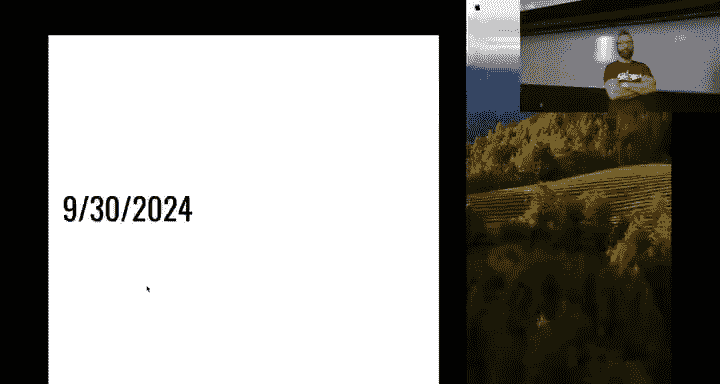
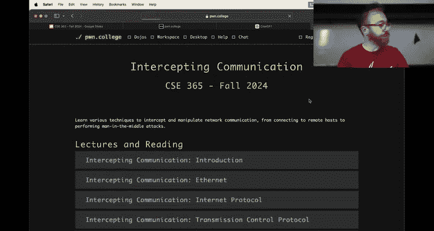
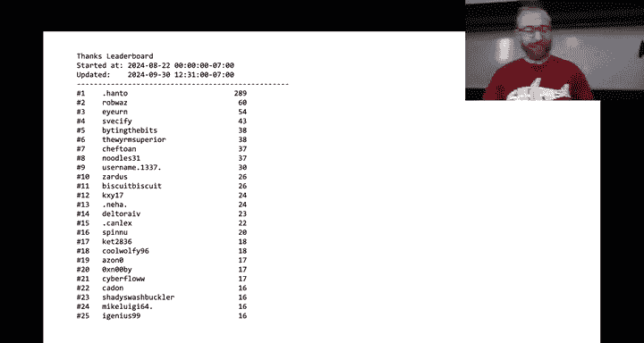
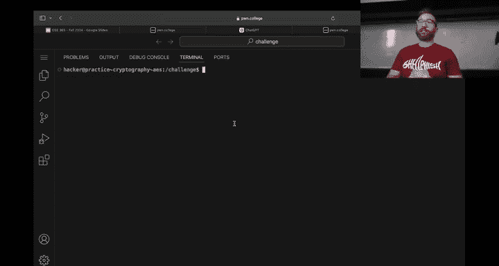
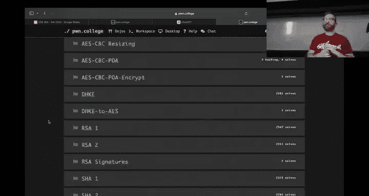

# 11：密码学基础



在本节课中，我们将要学习密码学的基础知识。密码学是网络安全的核心，它通过数学方法保护信息的机密性、完整性和真实性。我们将从简单的概念入手，逐步理解现代密码系统是如何工作的。

上一节我们介绍了网络通信拦截，了解到网络本身并不安全。本节中我们来看看如何利用密码学在公开的、不安全的信道上保护我们的通信。

## 概述：密码学的重要性

我们的社会严重依赖密码学算法的安全性。例如，SHA-256哈希算法直接负责比特币的安全。如果SHA-256被攻破，整个比特币系统将崩溃。同样，从HTTP到HTTPS的转变，依赖于TLS协议中的加密算法（如AES）来保护网络通信。与可以修复漏洞的应用程序不同，基础加密算法的漏洞可能带来灾难性、无法修补的后果。




## 密码学算法家族



现代密码学主要建立在几个核心算法家族之上，本模块将涵盖其中最重要的几个：

*   **AES（高级加密标准）**：一种对称加密算法，使用相同的密钥进行加密和解密。其核心是复杂的矩阵数学运算。
*   **Diffie-Hellman密钥交换**：一种允许双方在不安全的信道上协商出一个共享密钥的算法，为后续的对称加密（如AES）提供密钥。
*   **RSA**：一种非对称加密算法，使用公钥和私钥对。公钥可以公开，用于加密信息；只有持有私钥的一方才能解密。
*   **SHA（安全哈希算法）**：用于生成数据的唯一“指纹”（哈希值），保证数据完整性。

这些算法共同构成了TLS等安全协议的基础，保护着我们的日常网络活动。

## 数学基础：有限域与模运算



许多密码算法（如Diffie-Hellman和RSA）的数学基础是**有限域**和**模运算**。理解这些概念对学习本模块至关重要。

模运算可以理解为“时钟算术”。在一个模为 `p` 的系统中，数字范围是 `0` 到 `p-1`。任何超过 `p-1` 的计算结果都会“绕回”到这个范围内。

**公式**：`a mod p` 表示 `a` 除以 `p` 后的余数。

例如，在模 `31` 的世界里：
*   `17 + 15 = 32`，而 `32 mod 31 = 1`，所以结果是 `1`。
*   `1 - 15 = -14`，而 `-14 mod 31 = 17`（因为 `-14 + 31 = 17`）。

加法和减法在模运算下依然成立。我们可以利用这个性质构建简单的加密系统，例如凯撒密码的变种：

**代码**：简单的模运算加密示例
```python
def encrypt(letter, key, p=26):
    alphabet = 'ABCDEFGHIJKLMNOPQRSTUVWXYZ'
    index = alphabet.index(letter.upper())
    new_index = (index + key) % p # 应用模运算实现循环
    return alphabet[new_index]

def decrypt(letter, key, p=26):
    # 解密是加密的逆过程
    alphabet = 'ABCDEFGHIJKLMNOPQRSTUVWXYZ'
    index = alphabet.index(letter.upper())
    new_index = (index - key) % p
    return alphabet[new_index]

# 示例
key = 13
cipher = encrypt('Z', key) # 输出 'M'
plain = decrypt(cipher, key) # 输出 'Z'
```

然而，这种简单替换密码可以通过分析字母频率轻易破解。现代密码学需要更强大的数学工具。

## Diffie-Hellman 密钥交换原理

Diffie-Hellman 算法的巧妙之处在于，它允许双方（假设为Alice和Bob）在不安全的信道上，仅通过公开对话就能生成一个只有他们俩知道的共享秘密密钥，即使窃听者听到了所有公开信息也无法计算出该密钥。



其核心运算在模 `p` 的有限域中进行，其中 `p` 是一个很大的质数，`g` 是它的一个生成元（通常取2）。

**算法步骤**：
1.  Alice 选择一个私有数字 `a`，计算 `A = g^a mod p`，并将 `A` 发送给 Bob。
2.  Bob 选择一个私有数字 `b`，计算 `B = g^b mod p`，并将 `B` 发送给 Alice。
3.  Alice 收到 `B` 后，计算共享密钥 `s = B^a mod p`。
4.  Bob 收到 `A` 后，计算共享密钥 `s = A^b mod p`。

根据幂运算的性质 `(g^a)^b = g^(a*b) = (g^b)^a`，双方计算出的 `s` 是相同的：`s = g^(a*b) mod p`。

**安全性**：窃听者只能看到公开的 `p`, `g`, `A`, `B`。想从 `A = g^a mod p` 反推出私有密钥 `a`，需要解决“离散对数问题”。对于大质数 `p`，这在计算上是不可行的。因此，双方可以在公开场合协商出一个秘密密钥。

## 从Diffie-Hellman到RSA

Diffie-Hellman 在质数模 `p` 下运作良好。RSA 算法则更进一步，它使用一个合数 `n` 作为模数，`n` 是两个大质数 `p` 和 `q` 的乘积。

RSA 的安全性基于“大数分解难题”：将公开的 `n` 分解为 `p` 和 `q` 极其困难。

RSA 的密钥生成涉及欧拉函数 `φ(n) = (p-1)*(q-1)`。公钥是一个数对 `(e, n)`，私钥是一个数对 `(d, n)`，它们满足 `e * d ≡ 1 (mod φ(n))`。

**加密**：对于消息 `m`，计算密文 `c = m^e mod n`。
**解密**：对于密文 `c`，计算明文 `m = c^d mod n`。

因为 `(m^e)^d = m^(e*d) = m^(1 + k*φ(n)) ≡ m (mod n)`（根据欧拉定理），所以解密可以恢复原始消息。

关键在于，只有知道 `p` 和 `q`（从而知道 `φ(n)`）的人，才能计算出私钥 `d`。这就实现了非对称加密：任何人都可以用公钥 `(e, n)` 加密，但只有持有私钥 `(d, n)` 的人才能解密。

## 模块挑战指南


本模块包含31个挑战，旨在帮助你实践这些概念。

以下是挑战的大致阶段：
1.  **数据表示**：前几个挑战涉及十六进制、Base64等数据编码方式，这是与密码系统交互的基础。
2.  **一次性密码本与XOR**：理解XOR操作和理想的一次性密码本模型及其局限性。
3.  **初代密码分析**：开始实施一些基础的密码攻击。
4.  **核心算法实战**：深入AES、Diffie-Hellman、RSA的实际应用和攻击场景。

**建议**：努力在第一个星期完成到第9个挑战左右（即第一个检查点）。这将为你理解后续更复杂的攻击（如填充预言攻击）打下良好基础，并使你有充足时间探索模块后半部分的内容。

## 总结与警告

本节课中我们一起学习了密码学的基础地位、核心算法家族（AES， Diffie-Hellman， RSA， SHA），以及支撑它们的数学原理——有限域和模运算。我们看到了Diffie-Hellman如何实现安全的密钥交换，以及RSA如何利用大数分解难题实现非对称加密。


最重要的启示是：**密码学非常脆弱且容易误用**。即使算法本身坚固，实现上的微小失误（例如泄露一个比特的信息）也可能导致整个系统被完全攻破。因此，在现实世界中，除非你是专家，否则应该使用经过严格审查的密码学库，而不是自己发明或实现加密算法。

本模块的挑战将让你亲身体验攻击这些系统的各种方法，从而深刻理解正确使用密码学的重要性。现在，是时候开始你的密码学探索之旅了。