# 12：密码学进阶

在本节课中，我们将继续深入学习密码学。我们将详细探讨RSA加密算法的原理与实现，并介绍高级加密标准（AES）及其分组密码工作模式。课程内容将涵盖从非对称加密到对称加密的关键概念。

## 回顾：Diffie-Hellman密钥交换

上一节我们介绍了Diffie-Hellman密钥交换协议。它允许通信双方在不安全的信道上安全地协商出一个共享密钥。其核心在于离散对数问题的计算困难性。

以下是Diffie-Hellman的基本步骤：
1.  双方公开约定一个大素数 **P** 和一个原根 **g**。
2.  通信方A选择一个私密数字 **a**，计算 `A = g^a mod P` 并发送给B。
3.  通信方B选择一个私密数字 **b**，计算 `B = g^b mod P` 并发送给A。
4.  A计算共享密钥 `s = B^a mod P`。
5.  B计算共享密钥 `s = A^b mod P`。

由于离散对数问题，攻击者即使截获了 `A` 和 `B`，也难以计算出 `a` 或 `b`，从而无法得到共享密钥 `s`。

## 深入RSA加密算法

Diffie-Hellman主要用于密钥交换。如果我们希望直接加密和传输数据，并且无需双方事先交互，就需要非对称加密算法，例如RSA。

RSA的安全性基于大整数分解的困难性。接下来，我们详细拆解RSA的各个部分。

### RSA的数学基础：欧拉函数


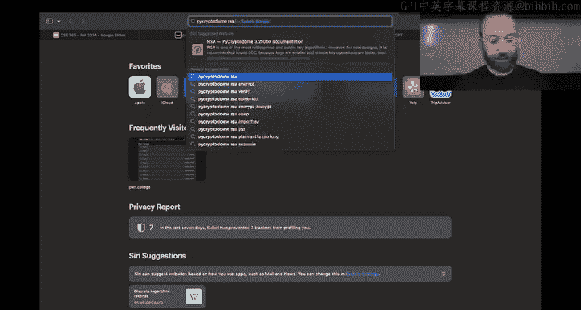

RSA运算涉及模指数运算。在一个模 **n** 的运算中，指数部分的运算实际上是在模 **φ(n)** 下进行的，其中 **φ** 是欧拉函数。
*   对于一个素数 **p**，其欧拉函数值为 **φ(p) = p - 1**。
*   对于两个不同素数 **p** 和 **q** 的乘积 **n = p * q**，其欧拉函数值为 **φ(n) = (p-1)*(q-1)**。


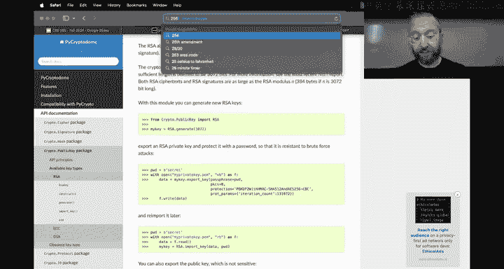


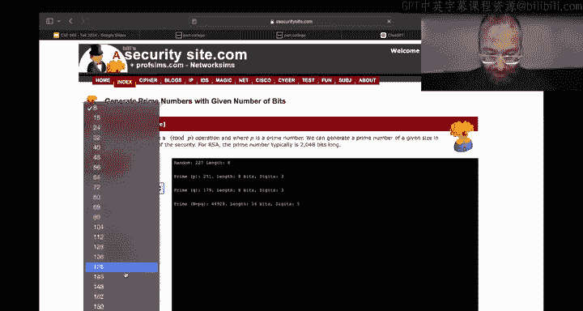

这个性质是RSA加解密能够成立的关键。

### RSA密钥生成与加解密过程

以下是RSA算法的核心步骤：

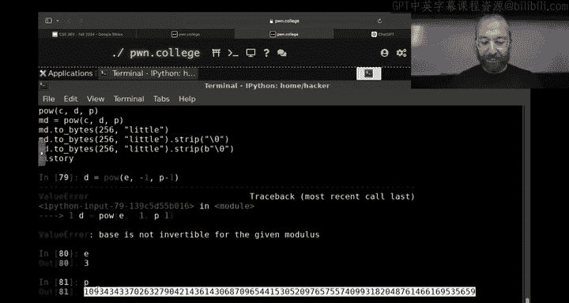


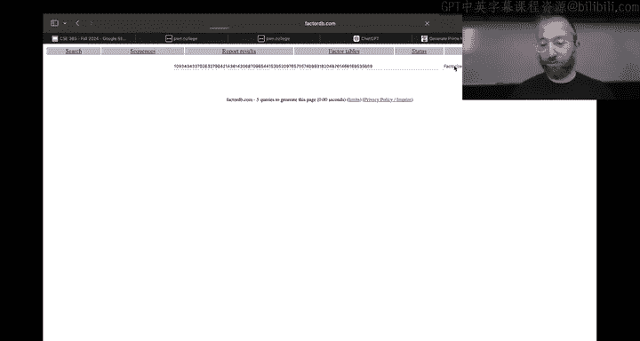

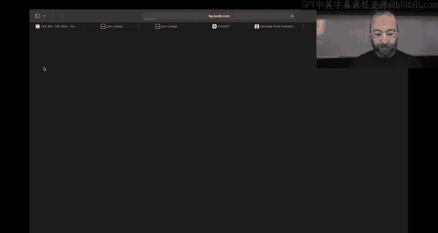

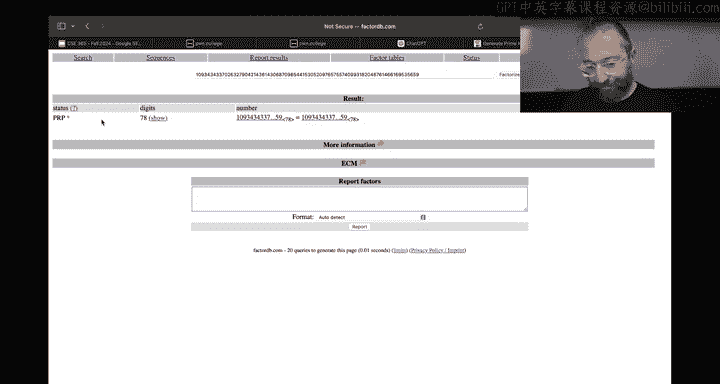

**1. 密钥生成**
*   选择两个大素数 **p** 和 **q**。
*   计算 **n = p * q** 和 **φ(n) = (p-1)*(q-1)**。
*   选择一个整数 **e**，满足 `1 < e < φ(n)` 且 **e** 与 **φ(n)** 互质（通常取65537）。
*   计算 **d**，使得 `(d * e) mod φ(n) = 1`，即 **d** 是 **e** 在模 **φ(n)** 下的乘法逆元。
*   公钥为 **(n, e)**，私钥为 **(d)** 或 **(p, q, d)**。

**2. 加密过程**
若要对消息 **M**（需转换为小于 **n** 的整数）加密，使用公钥 **(n, e)** 计算密文 **C**：
`C = M^e mod n`

**3. 解密过程**
使用私钥 **d** 解密密文 **C**，恢复原始消息 **M**：
`M = C^d mod n`

数学原理保证了 `(M^e)^d mod n = M^(e*d) mod n = M^(k*φ(n)+1) mod n = M`。

### RSA实践与注意事项

在实践中，直接使用RSA加密长消息效率很低。通常的做法是：
1.  使用RSA加密一个随机生成的对称密钥（如AES密钥）。
2.  使用该对称密钥加密实际的数据。

此外，必须使用标准的、安全的库来生成RSA密钥对，切勿自己实现或使用来源不可靠的素数。

## 对称加密与AES简介

与计算密集型的非对称加密（如RSA）相比，对称加密算法速度更快，适合加密大量数据。高级加密标准（AES）是目前最常用的对称加密算法。

AES是一种分组密码，它将固定长度的明文块（128位，即16字节）转换为相同长度的密文块。密钥长度可以是128位、192位或256位。

在Python中，我们可以使用 `pycryptodome` 库进行AES加密：

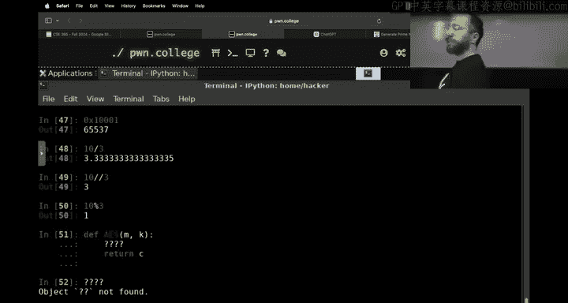

```python
from Crypto.Cipher import AES
from Crypto.Util.Padding import pad, unpad
import os

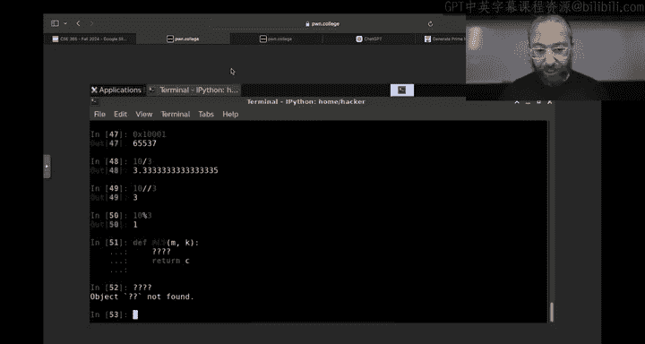


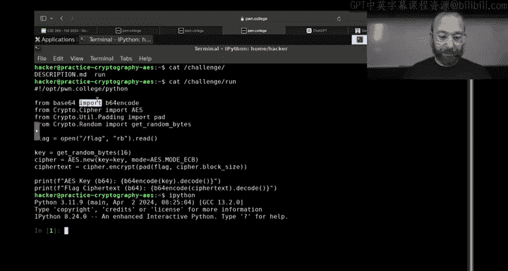

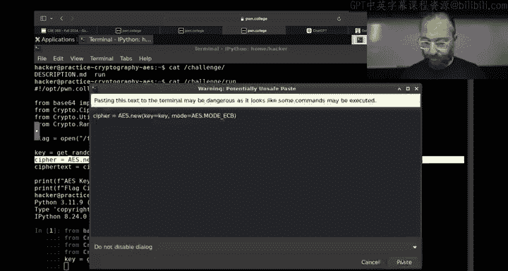

key = os.urandom(16) # 生成一个128位（16字节）的随机密钥
cipher = AES.new(key, AES.MODE_ECB) # 创建一个AES加密器对象（使用ECB模式，仅作演示）

plaintext = b“Hello, AES World!”
padded_data = pad(plaintext, AES.block_size) # 填充数据至块大小的整数倍
ciphertext = cipher.encrypt(padded_data) # 加密

# 解密
decrypted_padded_data = cipher.decrypt(ciphertext)
decrypted_data = unpad(decrypted_padded_data, AES.block_size)
print(decrypted_data) # 输出：b“Hello, AES World!”
```

### 分组密码的工作模式

由于AES一次只能处理一个固定大小的数据块，为了加密任意长度的消息，需要定义“工作模式”。电子密码本模式是最简单的一种。

**ECB模式**
ECB模式直接对每个明文块独立加密。其最大问题是，相同的明文块会产生相同的密文块，这会泄露数据的模式信息（例如，加密一张图片后，轮廓依然可见）。因此，**ECB模式在实际中不应被使用**。


为了解决ECB模式的问题，引入了更安全的工作模式，如密码分组链接模式。

**CBC模式**
在CBC模式中，每个明文块在加密前，会先与前一个密文块进行异或操作。第一个块则与一个随机生成的“初始化向量”进行异或。这样，即使明文相同，加密后的密文也会不同，从而隐藏了数据模式。


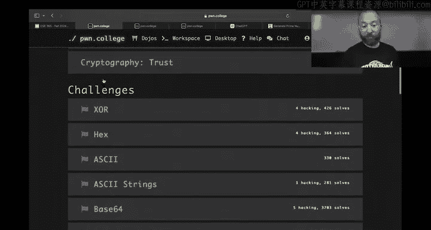

异或操作是许多加密模式中的基础操作。它的特性是：如果 `A xor B = C`，那么 `C xor B = A`。这种可逆性被巧妙地用于链接加密块。

## 总结


本节课我们一起深入学习了现代密码学的两个核心组成部分。
*   我们首先回顾了Diffie-Hellman密钥交换协议。
*   然后，我们详细剖析了RSA非对称加密算法的数学原理、密钥生成以及加解密过程，理解了其基于大数分解困难性的安全性。
*   接着，我们介绍了对称加密算法AES，了解了其作为分组密码的基本特性，并探讨了不同的工作模式，特别是ECB模式的缺陷和CBC模式的改进原理。

掌握这些基础知识，是理解如何构建安全通信系统、分析密码学挑战的关键。在接下来的实践中，你将应用这些概念来解决具体问题。