# 13：密码学进阶

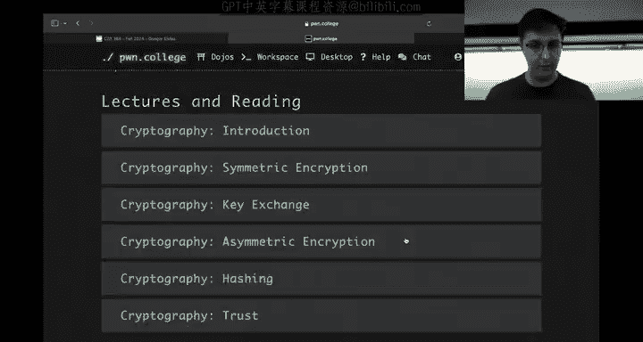

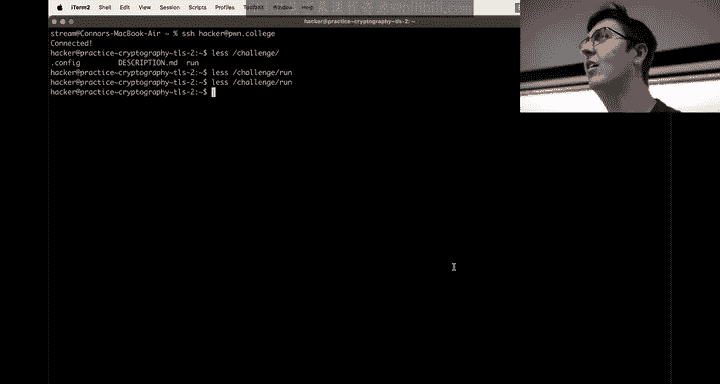

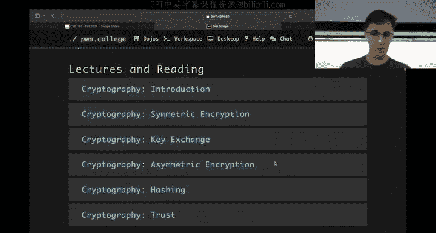

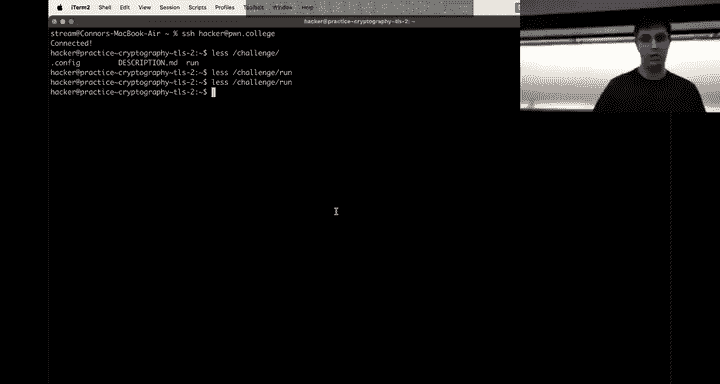

在本节课中，我们将继续学习密码学模块，重点探讨哈希函数、暴力破解的概念，以及如何通过巧妙的方法将原本不可行的搜索空间变得可行。我们将通过具体的例子和代码来理解这些核心概念。

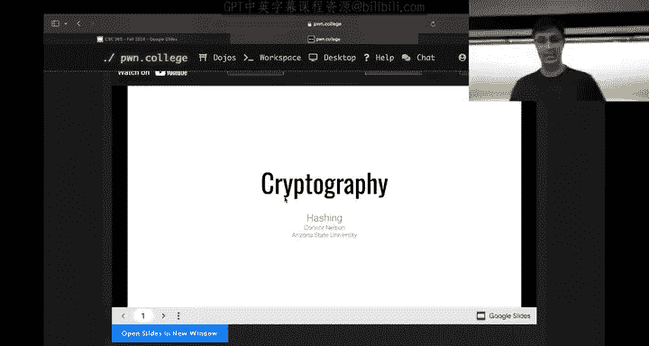

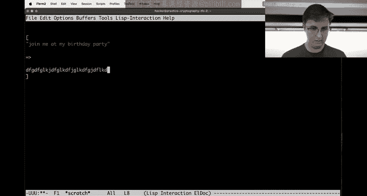


---

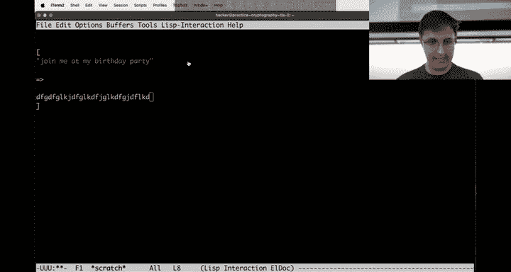

## 哈希函数：单向加密

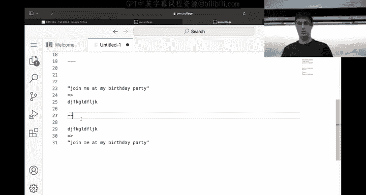

上一节我们介绍了对称和非对称加密，它们都允许数据在密钥的作用下进行双向转换。本节中，我们来看看密码学中的另一个基础概念：哈希。

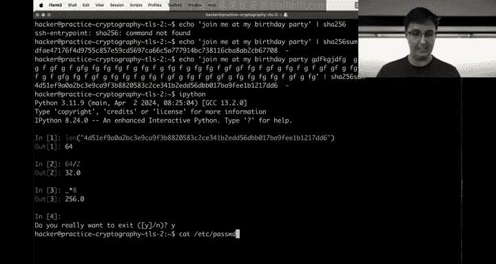

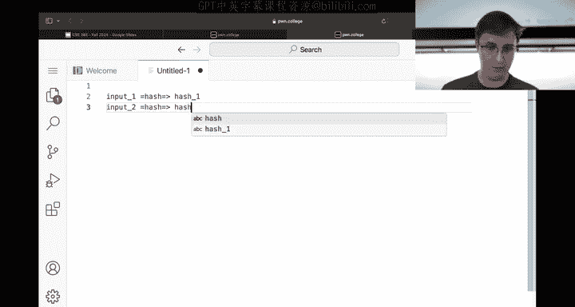

哈希函数是一种单向函数。它将任意长度的输入数据（如一段文本）转换成一个固定长度的输出，通常称为“哈希值”或“摘要”。其核心特性是**不可逆性**：给定哈希值，你无法（在计算上不可行）推导出原始的输入数据。这与加密有本质区别。

一个流行的哈希算法是 SHA-256。它总是产生一个 256 位（即 64 个十六进制字符）的输出。

```python
import hashlib
hash_object = hashlib.sha256(b"Join me at my birthday party")
hex_digest = hash_object.hexdigest()
print(hex_digest) # 输出固定长度的哈希值
```

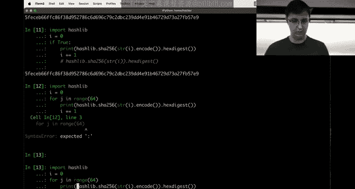

哈希函数还有另一个重要特性：**雪崩效应**。即使输入数据发生微小的改变，产生的哈希值也会变得截然不同，看起来毫无关联。这个特性对于保证数据的完整性至关重要。

---

## 工作量证明与暴力破解

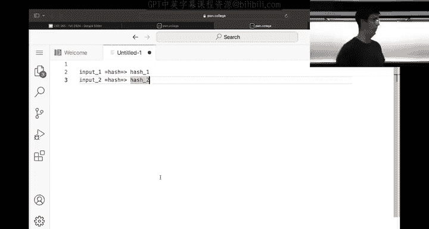


哈希函数的不可预测性使其成为“工作量证明”机制的理想选择，例如在比特币等区块链技术中应用。其核心思想是要求计算机完成大量计算工作来证明其投入。

一个典型的工作量证明问题是：“找到一个输入，使其 SHA-256 哈希值以特定数量的零开头”。由于无法预测输出，唯一的解决方法就是**暴力破解**——即系统地尝试所有可能的输入，直到找到符合条件的那个。

以下是实现该思路的简化代码：

```python
import hashlib
import itertools


def find_hash_with_leading_zeros(target_zeros):
    prefix = "happy birthday "
    for i in itertools.count():
        guess = f"{prefix}{i}".encode()
        hash_output = hashlib.sha256(guess).hexdigest()
        if hash_output.startswith('0' * target_zeros):
            print(f"Found! Input: {guess}, Hash: {hash_output}")
            return guess, hash_output
    return None


# 尝试寻找哈希值以3个零开头的输入
find_hash_with_leading_zeros(3)
```

这个过程本质上是**枚举整个搜索空间**。虽然可以通过并行计算加速，但如果搜索空间本身过于巨大，单纯增加计算核心也无济于事。

---

## AES加密与搜索空间的难题


现在，让我们将暴力破解的思路应用到加密上。假设我们有一个使用 AES-ECB 模式加密的密文，我们不知道密钥，也不知道明文（比如“happy birthday”），但知道明文长度和可能的字符集（例如小写字母加空格）。

如果我们想通过暴力破解恢复明文，将面临两个巨大的搜索空间：
1.  **密钥空间**：对于 16 字节的 AES 密钥，有 `256^16` 种可能。
2.  **明文空间**：对于 14 字符、27 种可能字符的明文，有 `27^14` 种可能。

这两个数字都大到无法在合理时间内通过枚举完成。因此，在这种“黑盒”场景下，暴力破解 AES 加密是**不可行的**。这恰恰是加密算法应该具备的安全性。

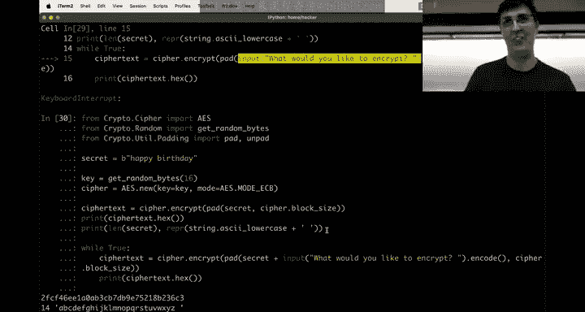


---

## 预言机攻击：缩小搜索空间

然而，在某些实际场景中，攻击者可能获得一个“加密预言机”。例如，一个 Web 服务器可能使用固定密钥加密用户提供的数据（如前缀）拼接上秘密数据（如密码），然后将结果返回给用户。攻击者可以控制输入的前缀，并观察对应的加密输出。

这改变了攻击局面。攻击者不再需要猜测密钥，密钥被隐含在预言机中。现在，攻击目标缩小为仅破解明文。

但 `27^14` 的明文空间仍然太大。这时，AES-ECB 模式的分块特性（将数据分成独立的 16 字节块进行加密）和可控制的输入前缀，为我们提供了突破口。

---

### 利用ECB模式进行逐字节破解

以下是攻击的核心步骤，我们通过一个例子来说明：

1.  **确定块大小与对齐**：首先，发送不同长度的输入，观察输出密文长度的变化，确定块大小为 16 字节。目标是让秘密数据的最后一个字节单独占据一个块的第一个字节位置。
    *   假设秘密 `SECRET` 为 14 字节。发送 13 个 ‘A’ 作为前缀，则第一个加密块为 `13*A + S[0]`，第二个块为 `S[1-14] + 填充`。这没有帮助。
    *   发送 14 个 ‘A’，则第一个块为 `14*A`，第二个块为 `S[0-13] + 填充`。仍然不理想。
    *   发送 15 个 ‘A’，则第一个块为 `15*A + S[0]`，第二个块为 `S[1-13] + 填充`。此时，秘密的第一个字节 `S[0]` 位于第一块的末尾。

2.  **破解最后一个字节**：发送 15 个 ‘A’ 后，我们得到两个密文块。我们关注**第二个密文块**，它对应 `S[1-13] + 填充`。但我们暂时不直接攻击它。
    *   更有用的是，我们可以发送 14 个 ‘A’ + 15 个已知字节（例如 15 个 `0xFF`）。这样，第一个块是 `14*A + S[0] + 0xFF[0]`，第二个块是 `0xFF[1-14] + 填充`。
    *   我们不知道 `S[0]`，但我们可以**暴力枚举**所有 256 种可能值（如果知道字符集，则枚举更少），替换上面结构中的 `S[0]`，并请求预言机加密。
    *   当某个枚举值产生的密文的**第二个块**与我们之前得到的“第二个密文块”匹配时，我们就破解了 `S[0]`，即秘密的第一个字节。

3.  **迭代破解**：知道 `S[0]` 后，我们可以调整前缀长度（例如发送 13 个 ‘A’），构造包含 `S[0]（已知）+ S[1]（未知）+ 14个已知字节` 的块，然后暴力枚举 `S[1]`。如此反复，每次只需枚举 256 次（或更少），即可逐个破解秘密的所有字节。

通过这种“选择前缀攻击”，我们将搜索空间从 `27^14`（不可行）降低到了 `27 * 14`（完全可行）。这演示了如何通过密码学原语的误用和巧妙的攻击思路，将理论上的安全弱点转化为实际的攻击路径。

---

## 总结

本节课中我们一起学习了：
1.  **哈希函数**的单向性和雪崩效应，及其在工作量证明中的应用。
2.  面对 AES 等加密算法时，**暴力破解**原始密钥或明文搜索空间在计算上是不可行的。
3.  当存在一个**加密预言机**时，攻击局面可能发生变化。结合 AES-ECB 模式的分块特性，通过精心构造输入并控制数据对齐，可以发起**选择前缀攻击**。
4.  该攻击的核心是**将指数级大的搜索空间，通过逐字节破解的方式，降维成线性可解的多个小搜索空间**，从而使破解成为可能。

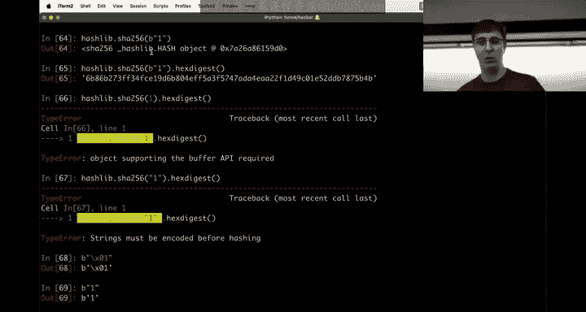

理解这些概念的关键在于始终思考搜索空间的大小，并寻找将大问题分解为可管理的小问题的方法。在解决相关挑战时，添加调试信息以可视化数据块是如何对齐和加密的，将非常有帮助。