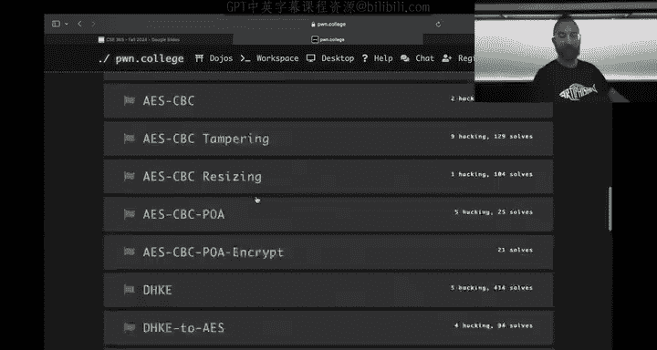
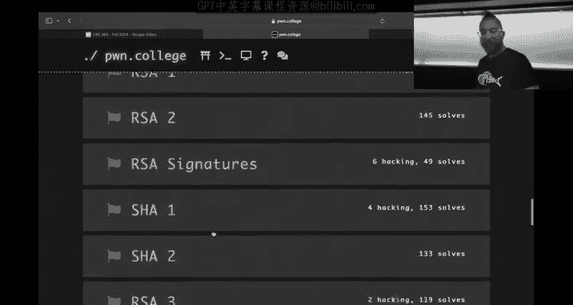
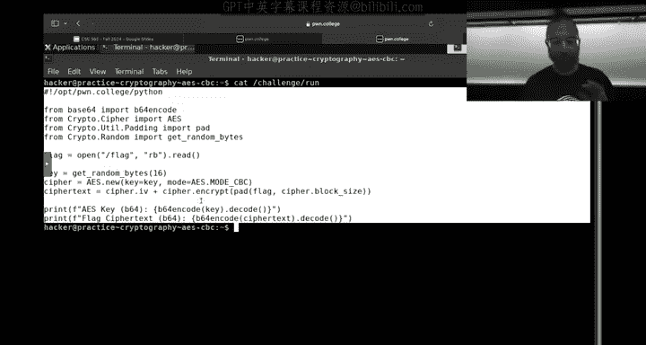
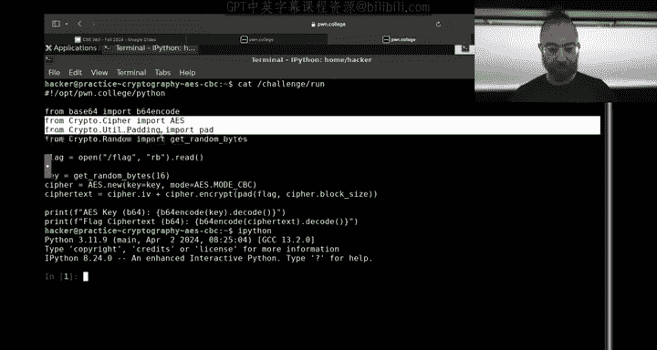
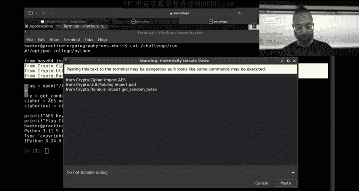
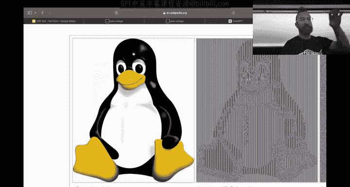
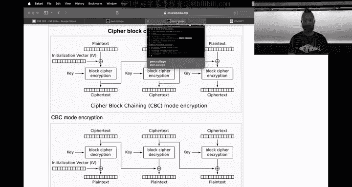
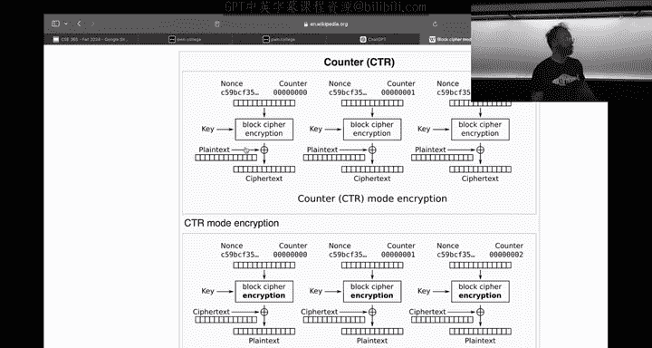
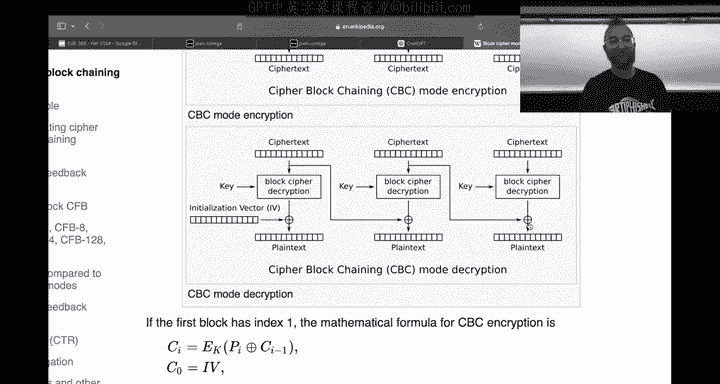
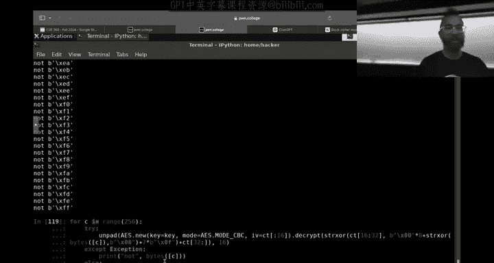

# 14：密码学深入 - Cipher Block Chaining (CBC) 与 Padding Oracle 攻击




在本节课中，我们将深入学习密码块链接模式及其一个关键的安全漏洞。上一节我们介绍了AES-ECB模式及其局限性，本节中我们来看看更安全的CBC模式是如何工作的，以及攻击者如何利用其解密过程中的一个特性来发起攻击。




## CBC模式的工作原理








CBC模式通过引入一个初始化向量和将前一个密文块与当前明文块进行异或操作，来解决ECB模式中相同明文块产生相同密文块的问题。


以下是CBC加密的核心公式描述：



*   **加密过程**：`Ciphertext[i] = Encrypt(Plaintext[i] XOR Ciphertext[i-1], Key)`。对于第一个块，`Ciphertext[i-1]` 由 **初始化向量** 替代。
*   **解密过程**：`Plaintext[i] = Decrypt(Ciphertext[i], Key) XOR Ciphertext[i-1]`。同样，第一个块使用IV。

在代码中，使用PyCryptodome库创建CBC模式密码器的示例如下：
```python
from Crypto.Cipher import AES
from Crypto.Util.Padding import pad
import os

key = os.urandom(16) # 生成随机密钥
iv = os.urandom(16)  # 生成随机初始化向量





cipher = AES.new(key, AES.MODE_CBC, iv)
plaintext = b"Happy Birthday Students"
padded_plaintext = pad(plaintext, AES.block_size)
ciphertext = cipher.encrypt(padded_plaintext)

# 完整的密文通常将IV预置在真正的密文前
full_ciphertext = iv + ciphertext
```

## CBC模式的比特翻转攻击



CBC模式的一个特性是，攻击者可以通过修改密文（或IV），可控地影响解密后的明文。这是因为在解密过程中，密文块在解密后会被与前一个密文块进行异或。

攻击原理如下：如果攻击者将密文块 `C[i]` 修改为 `C[i] XOR X`，那么解密后对应的明文块 `P[i+1]` 将变为 `P[i+1] XOR X`。而前一个明文块 `P[i]` 则会因为AES解密过程被破坏而变成乱码。


这意味着，攻击者可以在不知道密钥的情况下，通过精心构造的异或值 `X`，使特定位置的明文变成他们想要的值，代价是破坏前一个明文块。如果前一个块的内容不重要（例如图片数据、注释），这种攻击就可能生效。



## Padding Oracle 攻击详解

Padding Oracle攻击是CBC模式一个更严重的漏洞。它利用了当解密后填充格式不正确时，服务器可能会返回一个错误信息（如“填充错误”）这一特性。

以下是攻击的核心步骤：

1.  **设定目标**：攻击者截获了一段CBC加密的密文，并希望解密它，但不知道密钥。
2.  **利用Oracle**：攻击者能够向一个使用相同密钥的解密服务（Oracle）发送修改后的密文，并观察其响应是“填充正确”还是“填充错误”。
3.  **逐字节解密**：攻击者从最后一个密文块开始，通过暴力尝试修改倒数第二个密文块的最后一个字节，并发送给Oracle。当Oracle返回“填充正确”时，攻击者就能推导出最后一个明文字节的值。
4.  **迭代过程**：在解密了最后一个字节后，攻击者可以调整目标，去解密倒数第二个字节，如此反复，直到解密整个块。这个过程可以向前迭代，解密所有密文块。

以下是一个简化的Padding Oracle攻击中，暴力破解单个字节的代码概念演示：
```python
def decrypt_last_byte(ciphertext_block, previous_block, oracle):
    # 假设我们正在解密 ciphertext_block 的最后一个字节
    # 我们通过修改 previous_block 的对应字节来试探
    for guess in range(256):
        modified_prev_block = bytearray(previous_block)
        # 在相应位置异或我们的猜测值
        modified_prev_block[-1] ^= guess
        test_ciphertext = bytes(modified_prev_block) + ciphertext_block
        if oracle(test_ciphertext) == "PADDING_OK":
            # 通过猜测值和填充值（例如0x01）计算出明文字节
            plaintext_byte = guess ^ 0x01
            return plaintext_byte
    return None
```



本节课中我们一起学习了CBC加密模式的工作原理，认识了其相对于ECB模式的改进。然而，我们也深入探讨了CBC模式存在的安全风险：比特翻转攻击和致命的Padding Oracle攻击。理解这些漏洞强调了在实现密码学协议时，不仅需要选择强算法，还必须谨慎处理错误和边界情况。在后续的挑战中，你将有机会亲自实践这些概念。