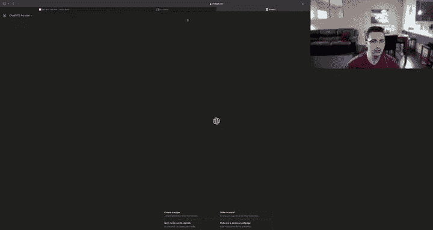
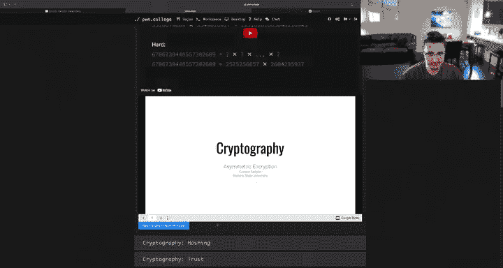
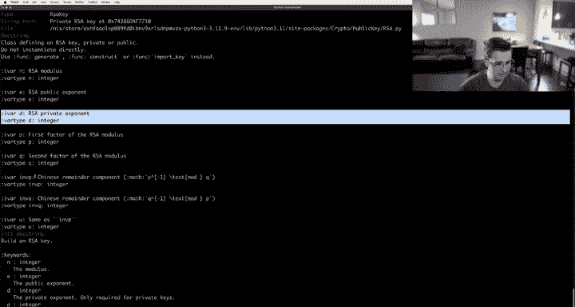
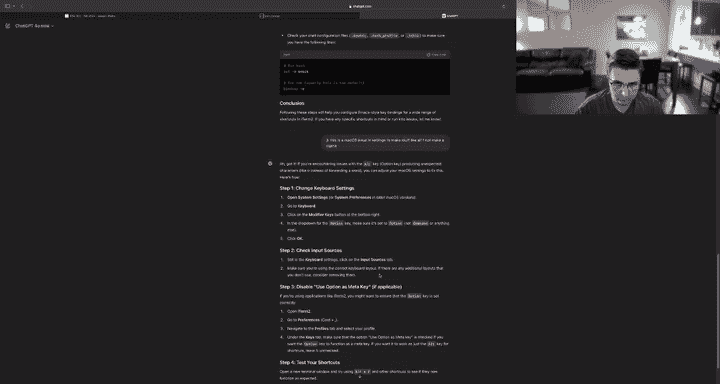
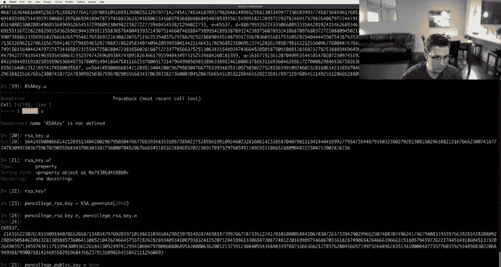
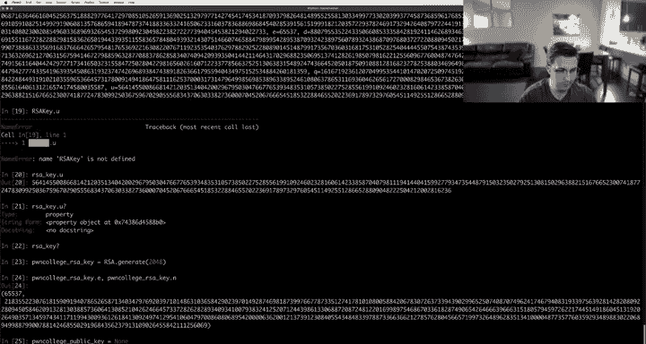
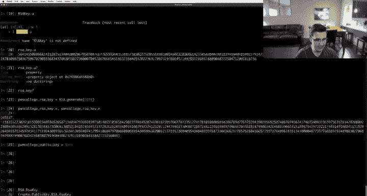
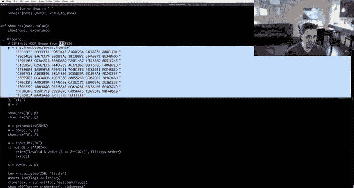
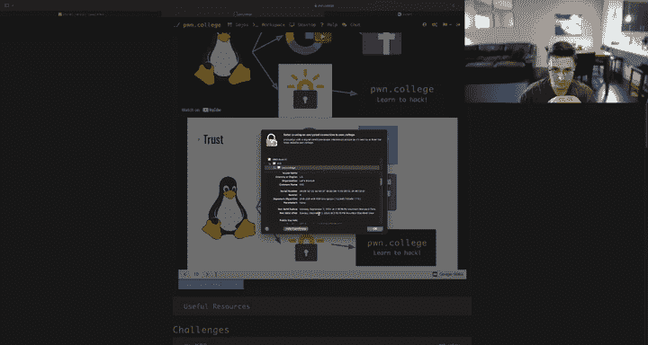
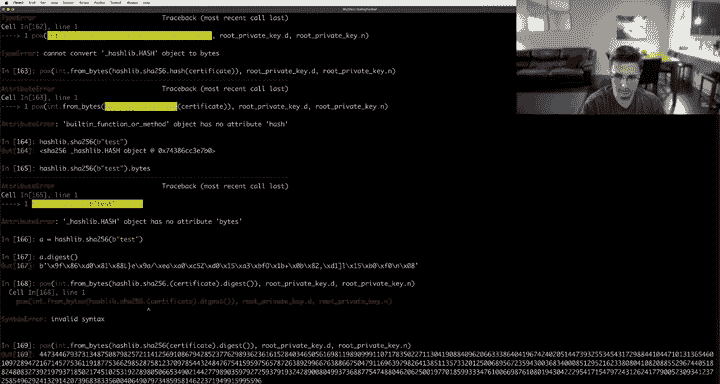

# 15：密码学基础教程



## 📚 课程概述

在本节课中，我们将学习密码学的基本概念，并构建一个简化的TLS（传输层安全）握手协议。我们将结合对称加密、非对称加密、密钥交换和数字签名等核心概念，理解现代网络安全通信的基础。

---

## 🔐 对称加密与非对称加密

上一节我们介绍了课程的整体目标，本节中我们来看看密码学的两大基石：对称加密和非对称加密。


对称加密使用相同的密钥进行加密和解密。其核心属性是，没有密钥就无法读取密文。AES（高级加密标准）是一个典型的对称加密算法。



**公式**：`C = E(K, P)` 和 `P = D(K, C)`，其中 `C` 是密文，`P` 是明文，`K` 是密钥，`E` 是加密函数，`D` 是解密函数。



非对称加密使用一对密钥：公钥和私钥。公钥可以公开，用于加密；私钥必须保密，用于解密。反之，用私钥加密（即签名），则可用公钥解密（即验证）。RSA是典型的非对称加密算法。










**公式**：`C = P^e mod n`（加密）和 `P = C^d mod n`（解密），其中 `(e, n)` 是公钥，`(d, n)` 是私钥。


我们的目标是建立一个加密的通信信道。虽然对称加密（如AES）速度快，适合加密大量数据，但它面临一个关键问题：如何安全地交换密钥？

---

## 🤝 密钥交换与中间人攻击

上一节我们了解了加密的基础，本节中我们来看看如何安全地交换密钥，以及可能面临的威胁。

Diffie-Hellman密钥交换协议允许双方在不安全的信道上共同建立一个共享密钥。

**公式**：双方公开交换 `g^a mod p` 和 `g^b mod p`，然后各自计算共享密钥 `(g^b)^a mod p = (g^a)^b mod p = g^(ab) mod p`。



然而，如果攻击者Mallory不仅能监听，还能主动篡改网络流量（主动攻击者），她可以进行中间人攻击。Mallory可以分别与通信双方Alice和Bob建立独立的Diffie-Hellman交换，从而获得两个密钥，并解密所有经过她的通信。

为了抵御主动攻击者，我们需要引入信任机制。

---

## 🏛️ 引入信任与RSA

上一节我们看到了主动攻击的威胁，本节中我们通过RSA和信任机制来解决这个问题。

我们假设客户端已经通过某种可信方式获得了服务器（例如Pwn College）的RSA公钥 `(e, n)`。客户端可以生成一个随机的AES密钥，并用服务器的公钥加密后发送过去。

**代码示例**：
```python
# 客户端生成并加密会话密钥
session_key = get_random_bytes(16)
key_as_int = int.from_bytes(session_key, 'big')
encrypted_key = pow(key_as_int, e, n)  # 使用服务器公钥加密
# 发送 encrypted_key 给服务器
```

只有拥有对应私钥 `d` 的服务器才能解密获得这个会话密钥。这样，即使Mallory截获了数据，她也无法解密。随后，双方可以使用这个会话密钥进行快速的AES加密通信。

但这个方案有一个缺陷：如果服务器的私钥在未来某天泄露了，那么Mallory就可以解密她所记录的所有历史通信。这被称为缺乏“前向保密性”。

---

## 🔄 实现前向保密性

上一节我们构建了一个基础系统，但存在长期风险。本节中我们通过结合Diffie-Hellman和RSA来实现前向保密性。

我们不直接发送用RSA加密的AES密钥，而是发送用RSA加密的Diffie-Hellman公开值。

**流程简述**：
1.  客户端生成临时私钥 `a`，计算 `g^a mod p`。
2.  客户端用服务器的RSA公钥加密 `g^a mod p`，然后发送给服务器。
3.  服务器用私钥解密，得到 `g^a mod p`。
4.  服务器生成临时私钥 `b`，计算 `g^b mod p`。
5.  服务器用其RSA私钥对 `g^b mod p` 进行签名（即计算 `(g^b)^d mod n`），然后发送给客户端。
6.  客户端用服务器公钥验证签名，得到 `g^b mod p`。
7.  双方分别计算共享密钥 `g^(ab) mod p`，并将其作为会话密钥。

这个方案的精妙之处在于：
*   **身份验证**：只有真正的服务器（拥有私钥 `d`）才能正确签名 `g^b mod p`。
*   **前向保密性**：临时私钥 `a` 和 `b` 在会话结束后被丢弃。即使未来服务器的长期RSA私钥泄露，攻击者也无法从存储的密文中恢复出过去的会话密钥 `g^(ab) mod p`。

---



## 📜 证书与信任链



上一节我们解决了通信过程中的安全问题，但遗留了一个根本问题：客户端最初是如何获得并信任服务器的公钥的？本节中我们通过数字证书和信任链来解决。

数字证书将实体的身份（如域名）与其公钥绑定在一起，并由一个可信的第三方（证书颁发机构，CA）进行数字签名。

**证书简化结构**：`证书数据 = (域名, 服务器公钥, 有效期等信息)`
**签名**：`signature = (SHA256(证书数据))^d_ca mod n_ca`，其中 `(d_ca, n_ca)` 是CA的私钥。


客户端收到证书后：
1.  使用CA的公钥 `(e_ca, n_ca)` 对签名进行验证：`hash_recovered = signature^e_ca mod n_ca`。
2.  自己计算证书数据的SHA256哈希值。
3.  比较两个哈希值。如果匹配，则证明该证书确实由可信的CA签发，因此可以信任其中的服务器公钥。

那么，我们如何信任CA呢？这形成了一个信任链。操作系统的根证书存储中预置了一些顶级根CA的公钥。这些根CA可以签发中间CA的证书，中间CA再签发服务器证书。客户端通过逐级验证签名，最终信任服务器的公钥。

在实际中，像Let‘s Encrypt这样的CA通过验证申请者对域名的控制权（例如，要求在特定URL下放置指定内容）来签发证书。

---

## 🎯 课程总结


本节课我们一起学习了构建一个安全通信系统所需的核心密码学概念。

我们首先回顾了对称加密和非对称加密的基本原理。然后，我们探讨了密钥交换的挑战以及中间人攻击的威胁。接着，我们通过结合RSA和Diffie-Hellman协议，构建了一个既能验证服务器身份又能实现前向保密性的密钥交换流程。最后，我们解释了数字证书和信任链如何解决公钥的初始信任问题，从而形成了完整的TLS握手协议基础。

理解这些构建模块如何协同工作，是理解现代互联网安全（如HTTPS）的关键。