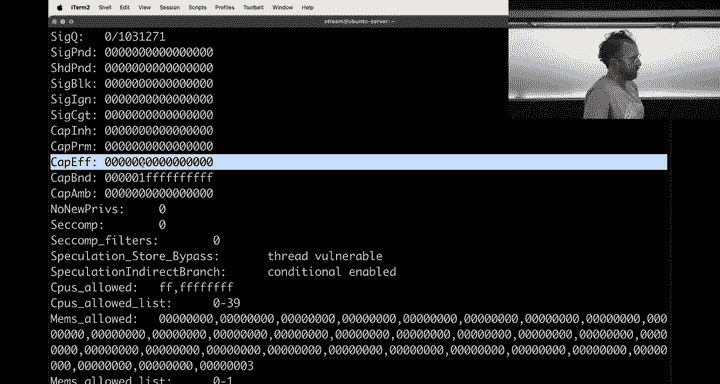
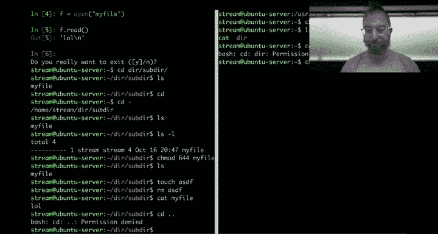

# 165：访问控制与自动化交互教程


## 概述
在本节课中，我们将学习Linux访问控制的核心概念，包括文件权限、Linux能力机制以及如何使用Python的`pwntools`库自动化地与挑战程序进行交互。课程内容将涵盖从基础权限管理到高级进程交互的实用技巧。

## 访问控制基础与Linux能力机制

上一节概述了课程目标，本节中我们来看看Linux文件权限的基本操作。我们创建一个文件，并修改其权限。

```bash
# 创建一个文件并查看其默认权限
touch myfile.txt
ls -l myfile.txt
# 输出类似：-rw-r--r-- 1 user user 0 Oct 16 12:00 myfile.txt

# 移除文件的所有权限
chmod 000 myfile.txt
ls -l myfile.txt
# 输出：---------- 1 user user 0 Oct 16 12:00 myfile.txt


# 尝试读取文件（权限被拒绝）
cat myfile.txt
```

Linux中，`root`用户（用户ID为0）可以覆盖大多数文件权限检查。即使文件没有任何读取权限，`root`用户也能读取其内容。

```bash
# 切换到root用户后，可以读取无权限的文件
sudo cat myfile.txt
```

这种能力并非简单的“用户ID为0即放行”。现代Linux内核使用**能力机制**来实现细粒度的权限控制。每个进程拥有一组**能力**，这些能力决定了它可以执行哪些特权操作。例如，覆盖文件权限检查的能力是`CAP_DAC_OVERRIDE`。

我们可以查看进程的能力集。

```bash
# 获取当前shell进程的能力
cat /proc/$$/status | grep Cap
```

能力分为几个集合：
*   **Effective (E)**： 当前进程实际生效的能力。
*   **Permitted (P)**： 进程被允许使用的所有能力（上限）。
*   **Inheritable (I)**： 可以传递给其子进程的能力。

这种模型是一种**基于角色的访问控制**的实现。我们可以将特定的能力赋予给可执行文件本身，而不是让整个程序以`root`身份运行，这更安全。



```bash
# 将CAP_DAC_OVERRIDE能力赋予给`cat`命令（需要root权限）
sudo setcap cap_dac_override=ep /bin/cat


# 现在，即使用户身份不是root，使用这个cat也能读取无权限的文件
/bin/cat myfile.txt


# 查看已赋予能力的文件
getcap /bin/cat
```

系统中有一些程序已经通过能力机制获得了特权，例如`ping`命令，它拥有`CAP_NET_RAW`能力以发送原始网络数据包，而无需设置为`setuid` root程序。

## Linux文件访问的有趣特性

了解了基础权限和能力后，本节中我们来看看Linux文件访问中两个重要的行为特性。


**1. 权限检查的时机**
Linux内核通常在**打开资源时**进行一次权限检查。一旦获得文件描述符，后续操作可能不再重复检查。

```python
# 示例：在Python中打开一个文件后，即使文件权限被更改，仍可通过已打开的描述符读取
import os
import time

# 首先，创建一个有内容的可读文件
with open(“test.txt”, “w”) as f:
    f.write(“Secret Flag\n”)

# 在另一个终端或进程中，运行以下命令移除读取权限
# chmod 000 test.txt

# 然而，如果在此Python脚本中先打开文件
f = open(“test.txt”, “r”)
# 此时再在外部执行 `chmod 000 test.txt`
print(f.read()) # 仍然可以成功读取内容
f.close()
```

**2. 目录权限与文件权限**
对目录的`写`权限允许你在该目录内**创建、删除或重命名文件**，即使你对目标文件本身没有写权限。`/tmp`目录通常设置了**粘滞位**，这可以防止用户删除或重命名其他用户的文件。

```bash
# 创建一个目录并设置粘滞位
mkdir shared_dir
chmod 1777 shared_dir
ls -ld shared_dir
# 输出中权限部分包含 ‘t’， 例如：drwxrwxrwt

# 在设置了粘滞位的目录中，用户只能删除或重命名自己拥有的文件。
```

## 使用Pwntools进行自动化交互



访问控制挑战通常需要与一个正在运行的程序自动交互。本节中我们将学习使用`pwntools`库来完成这个任务。`pwntools`是网络安全领域常用的Python库，它简化了进程创建、数据发送和接收的过程。

以下是使用`pwntools`的基本步骤和常见模式。

首先，导入库并启动一个进程。

```python
from pwn import *


# 启动目标程序
p = process(‘./challenge_binary’)
```

与进程交互的核心是发送数据和接收数据。

```python
# 接收数据，直到遇到指定的字符串（例如提示符）
output = p.recvuntil(b“Enter your name: “)
print(“Received:”, output)

# 发送一行数据（自动添加换行符）
p.sendline(b“Yan”)

# 接收一行数据
response = p.recvline()
print(“Response:”, response)

# 接收所有剩余输出，直到进程结束
final_output = p.recvall()
print(“Final:”, final_output)
```

在开发自动化脚本时，调试至关重要。`pwntools`提供了方便的调试模式。

```bash
# 在命令行运行脚本时启用调试输出，可以看到所有发送和接收的字节
python3 -m pdb your_script.py
# 或者，在脚本中通过环境变量启用（需在导入pwntools前设置）
import os
os.environ[‘PWNLIB_DEBUG’] = ‘1’
from pwn import *
```

以下是处理一个典型“密码验证”挑战的完整示例。

```python
#!/usr/bin/env python3
from pwn import *

# 启动进程
p = process(‘./password_checker’)

# 1. 接收初始提示，直到出现“Password:”
p.recvuntil(b“Password: “)

# 2. 发送密码
p.sendline(b“MySecretPassword123”)

# 3. 接收并打印结果（例如包含flag的行）
result = p.recvall()
print(result.decode())

# 确保进程结束
p.close()
```

使用`pwntools`时，务必管理好进程生命周期，避免资源泄漏。使用`with`语句是推荐的做法。

```python
with process(‘./challenge_binary’) as p:
    p.sendline(b“input”)
    print(p.recvall().decode())
```

虽然Python标准库的`subprocess`模块也能创建子进程，但其交互接口更为繁琐，缺乏`pwntools`为CTF挑战设计的便捷功能（如`recvuntil`、模式匹配、调试输出等）。对于网络安全任务，`pwntools`是更高效的选择。


## 总结
本节课中我们一起学习了Linux访问控制的深入知识，包括`root`用户如何通过能力机制超越普通权限，以及文件描述符和目录粘滞位对安全的影响。更重要的是，我们掌握了使用`pwntools`库自动化与命令行程序交互的核心技能，这是完成后续许多实践挑战的关键工具。请记住在开发脚本时积极使用调试功能，并妥善管理进程资源。