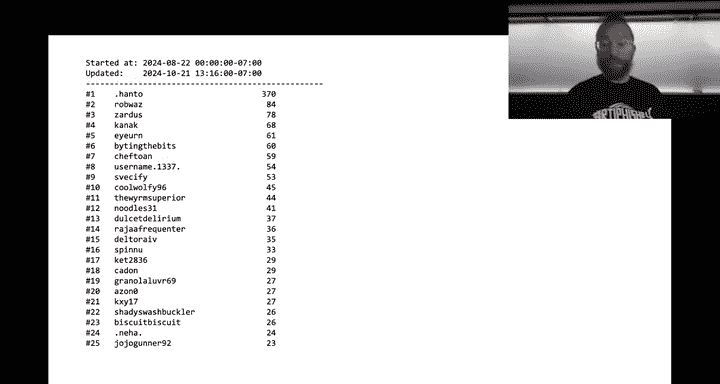
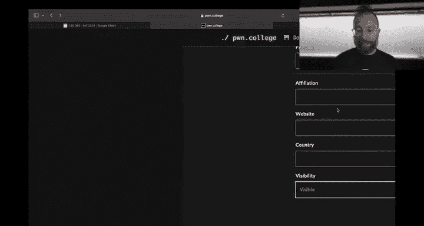
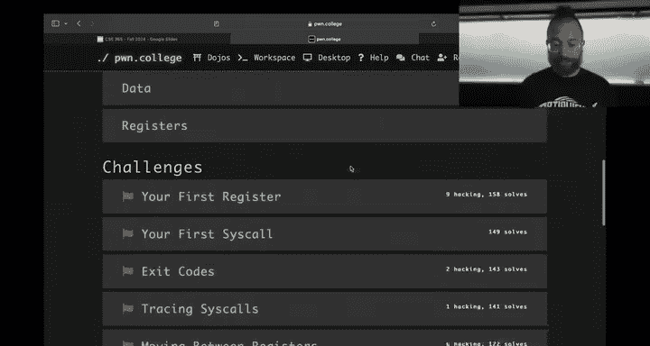
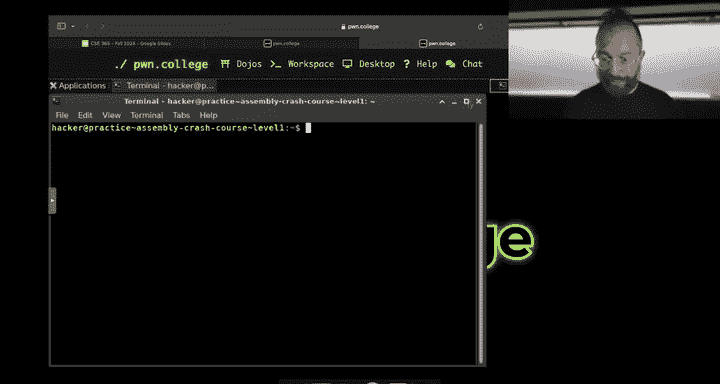
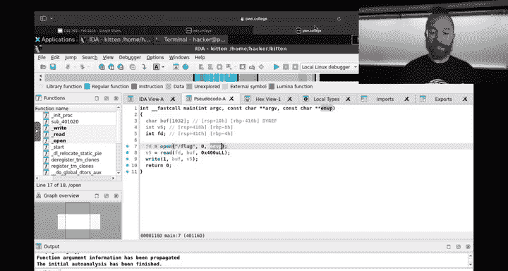
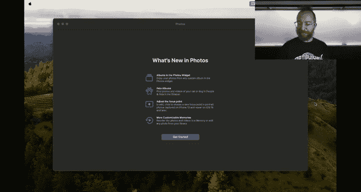

# 17：计算基础 101 🖥️

在本节课中，我们将回顾前两个模块（密码学与访问控制）的成绩情况，并正式开启“计算基础 101”模块的学习。我们将了解计算机程序在底层是如何工作的，特别是汇编语言的基础知识，为后续的软件逆向工程和漏洞利用打下坚实基础。

## 课程回顾与成绩分析

上一节我们完成了密码学和访问控制模块。现在，我们来快速回顾一下这两个模块的情况。



密码学模块的难度超出了预期，中位成绩为54分。不过，93%的学生都达到了检查点要求。考虑到该模块占总成绩的10%，实际中位成绩更接近7.5分。为了鼓励大家复习，本学期我们将密码学模块的迟交惩罚从扣50%调整为扣25%（截止日期为12月16日）。



访问控制模块的情况则截然不同，中位成绩高达94.74分，说明难度可能偏低了。我们将在下学期对这两个模块的难度进行调整。

以下是当前班级的成绩分布概况：
*   大约16-17%的学生成绩为D或E（不及格），这在三年级课程中是预期范围内的。
*   其余学生（A、B、C等级）分布良好。
*   目前所有成绩均未计入额外加分，我们正在努力实现加分自动化。



## 引入计算基础 101 🚀

上一节我们回顾了过往成绩，本节中我们来看看新的学习内容：“计算基础 101”。这个模块将涵盖汇编语言和计算机内部工作原理的基础知识。

理想情况下，这些知识应在《计算机组成原理》课程中学到。但由于种种原因，我们需要在本课程中提供一个速成班，以便大家能顺利学习后续的软件逆向工程、内存错误利用等高级主题。

“计算基础 101”模块包含6个子模块，共65个挑战。检查点设在完成21个挑战。我们有两周时间来完成它。我的建议是尽早开始推进，不要拖到最后一个周末，否则可能会像密码学模块那样遇到困难。

以下是该模块的六个部分：
1.  **你的第一个程序**：引导你编写第一个汇编程序。
2.  **汇编速成课**：练习各种汇编指令和逻辑实现。
3.  **调试复习**：学习当汇编代码出错时如何调试。
4.  **构建一个Web服务器**：一个完整的期末项目，用汇编语言实际构建一个能提供网页的服务器。

## 深入汇编语言：从高级语言到底层 🔍

上一节我们介绍了“计算基础 101”的概况，本节中我们来深入探讨汇编语言本身，理解程序在底层是如何运行的。

我们都熟悉 `cat /flag` 命令。`cat` 是一个程序，其核心功能是读取文件并输出到终端。我们可以用Python简单地实现它：

```python
#!/usr/bin/env python3
import sys
print(open(sys.argv[1]).read())
```

但程序最终是如何与操作系统交互的呢？我们可以使用 `strace` 工具查看 `cat` 与操作系统的交互（系统调用），例如 `open`、`read`、`write`。

程序内部的逻辑是由一系列**计算机指令**构成的。我们可以用 `objdump` 工具将 `cat` 程序**反汇编**，查看其底层的汇编指令。这些指令直接映射到CPU执行的二进制代码。

为了更清晰地理解，我们可以用C语言写一个简化版的 `cat`（我们称之为 `kitten`），直接使用系统调用：

```c
#include <unistd.h>
int main() {
    int fd = open("/flag", 0); // 只读模式打开文件
    char buf[1024];
    int n = read(fd, buf, 1024);
    write(1, buf, n); // 1 是标准输出的文件描述符
    return 0;
}
```

编译 `kitten.c` 后，再反汇编它，我们可以看到比完整版 `cat` 少得多的汇编指令。这些指令（如 `mov`, `call`）直接对应着我们C代码中的操作。CPU就是逐条读取并执行这些由二进制字节表示的指令。

无论运行的是Python、JavaScript还是其他语言，最终你的CPU都是在疯狂地读取内存中的字节，将其解释为汇编指令并执行。

## 编写与运行汇编代码 💻

上一节我们了解了程序如何被分解为汇编指令，本节中我们来看看如何实际编写和运行汇编代码。

汇编指令操作的是CPU内部的**寄存器**。寄存器可以看作是CPU的“工作记忆”，数量有限（x86架构下通用寄存器约15-16个），用于临时存储和操作数据。




汇编指令（如 `mov rax, 60`）在文件中以二进制形式存储（例如字节序列 `BF 01 00 00 00`）。汇编器（如 `as`）负责将人类可读的汇编文本转换成机器可执行的二进制代码。

这里需要注意**汇编语法**。主要有两种：
*   **AT&T 语法**：由GCC默认产生，操作数顺序为“源，目的”，寄存器前加`%`。
*   **Intel 语法**：本课程推荐使用，操作数顺序为“目的，源”，更清晰易读。

在“计算基础 101”的前几个挑战中，你只需直接在挑战界面输入汇编代码（如 `mov rax, 60`），系统会帮你完成汇编和执行。

对于后续需要自己生成二进制文件的挑战（如“汇编速成课”），步骤会稍微复杂一些。以下是基本流程：
1.  用Intel语法编写汇编代码（`solution.s`），开头使用 `.intel_syntax noprefix` 指令。
2.  使用汇编器 `as` 生成目标文件：`as solution.s -o solution.o`
3.  使用 `objcopy` 提取纯二进制代码：`objcopy -O binary --only-section=.text solution.o solution.bin`
4.  将二进制文件传递给挑战程序：`cat solution.bin | ./challenge`

## 调试与学习路径总结 🛠️

上一节我们学会了如何生成和运行汇编二进制文件，本节中我们来看看当代码出错时如何调试，并对本模块的学习路径进行总结。

在“汇编速成课”中，如果代码未按预期运行，可以使用 `int3` 指令进行调试。当程序执行到 `int3` 时，挑战环境会暂停并输出当前所有寄存器和部分内存的状态，帮助你定位问题。

“调试复习”模块则会教你使用更强大的调试器 **GDB**，这将成为你后续课程中不可或缺的工具。


最后，“构建一个Web服务器”项目将综合运用你在本模块学到的所有汇编知识，从零开始构建一个可运行的程序，深刻理解从汇编到可执行程序的完整链条。

**那么，我们为什么需要学习汇编？**
在网络安全领域，我们经常需要分析没有源代码的二进制程序（逆向工程），或者理解漏洞的底层原理并编写利用代码。虽然高级语言可以轻松编译成汇编，但从二进制完美还原回高级语言是极其困难的。因此，**阅读和理解汇编代码的能力至关重要**。本模块的目标就是让你尽快掌握这项能力。

---





本节课中我们一起学习了“计算基础 101”模块的引入背景、汇编语言的基本概念（寄存器、指令、语法）、编写与运行汇编代码的实践方法，以及模块内的学习路径。我们了解到，理解汇编是进行软件逆向工程和漏洞分析的基础。请务必观看所有相关视频讲座，并尽早开始完成模块中的挑战。