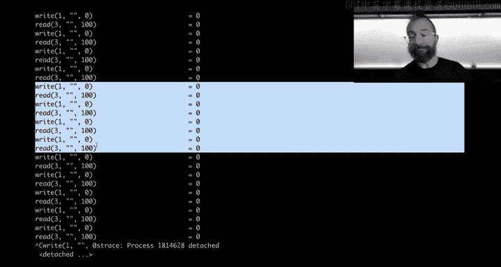
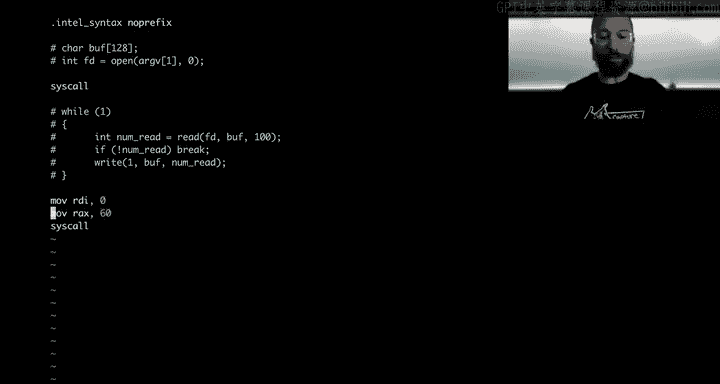
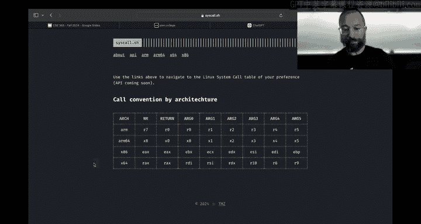
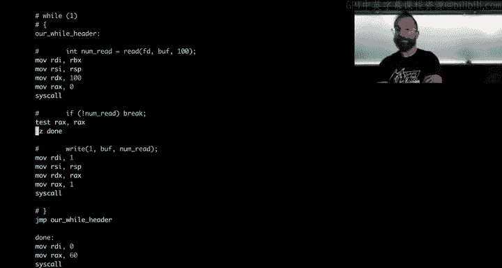

# 18：编写真实汇编程序

在本节课中，我们将深入学习汇编语言，从零开始编写一个能实际工作的程序。我们将把之前用C语言编写的“kitten”程序（一个简化版的`cat`命令）翻译成汇编语言，并学习在此过程中如何调试和解决问题。

上一节我们介绍了如何将C程序编译成汇编代码并进行分析。本节中，我们将亲自动手编写汇编程序。

## 课程管理与反馈

首先，有几个课程管理事项需要说明。

关于密码学和访问控制模块的问卷调查仍在进行中。从数据来看，密码学模块的难度明显超出了预期，学生花费的中位时间达到了25小时，这比我们希望的要高。未来我们计划调整课程内容，例如将“填充预言攻击”这类较复杂的主题移至后续课程。

另一方面，访问控制模块的内容需要适当加强，特别是Linux权限管理部分，很多内容是复习性质。感谢大家的反馈，尚未填写问卷的同学请记得完成，所有问卷总计可获得0.3%的额外学分。

此外，计算101模块新增了一个挑战关卡，专门练习如何构建可执行文件。这对于后续的汇编学习至关重要。请注意，这个新挑战不计入检查点评分，完成原有19个关卡的要求不变。

## 从C程序到汇编程序

现在，让我们进入今天的核心内容：编写真实的汇编程序。我们将从回顾上周用C语言编写的`kitten.c`程序开始。


以下是`kitten.c`程序的基本逻辑，它尝试每次读取100个字符并输出：



```c
// kitten.c 基础版本
// 打开文件，读取100字节，写入标准输出
```

然而，这个基础版本只能读取文件的前100个字节。为了读取整个文件，我们需要一个循环。在C语言中，我们通常使用`while`循环，并根据`read`系统调用的返回值来判断是否已到达文件末尾。

`read`系统调用在成功时返回读取的字节数。当返回0时，表示已到达文件末尾（EOF）。因此，正确的循环逻辑是：

```c
// kitten.c 完整版本
// 循环读取，直到 read 返回 0
while (1) {
    num_read = read(fd, buffer, 100);
    if (num_read == 0) {
        break; // 到达文件末尾，退出循环
    }
    write(1, buffer, num_read); // 将读取的内容写入标准输出
}
```

使用`strace`工具跟踪系统调用，可以清晰地看到程序读取文件、遇到EOF（返回0）然后退出的过程。

## 从零开始编写汇编程序

接下来，我们的目标是将上述C程序逻辑用汇编语言实现。我们将这个汇编程序命名为`poppy.s`。

首先，我们从最简单的部分开始：让程序正确退出。这能验证我们的工具链和基本流程是否正常。






```assembly
; poppy.s - 基础退出程序
global _start
section .text
_start:
    mov rdi, 0          ; 退出状态码为 0
    mov rax, 60         ; 系统调用号 60 代表 exit
    syscall             ; 调用内核
```

使用以下命令汇编和链接：
```bash
nasm -f elf64 poppy.s -o poppy.o
ld poppy.o -o poppy
```
运行`./poppy`，程序将安静地退出，返回状态码0。使用`strace ./poppy`可以验证它只调用了`exit`系统调用。

## 实现文件打开与读取

现在，我们为程序添加打开和读取文件的功能。这需要用到`open`和`read`系统调用。

我们需要查阅系统调用表。对于64位x86架构（x86-64），`open`的系统调用号是2，`read`的是0。

首先，我们硬编码要打开的文件名（例如`/flag`）。在汇编中，我们需要将文件名字符串的地址作为参数传递给`open`。

```assembly
; poppy.s - 添加打开和读取功能
global _start
section .text
_start:
    ; 打开文件
    lea rdi, [rel filename] ; 文件名地址 -> 第一个参数 (rdi)
    mov rsi, 0              ; 标志位：O_RDONLY (0) -> 第二个参数 (rsi)
    mov rdx, 0              ; 模式 (mode) -> 第三个参数 (rdx)，open通常忽略
    mov rax, 2              ; 系统调用号：open
    syscall

    ; 此时 rax 中保存了 open 返回的文件描述符 (fd)
    mov rbx, rax            ; 将 fd 保存到 rbx 寄存器，避免被后续 syscall 覆盖

    ; 读取文件 (第一次，循环稍后添加)
    mov rdi, rbx            ; 文件描述符 fd -> 第一个参数 (rdi)
    lea rsi, [rsp]          ; 栈顶地址作为缓冲区 -> 第二个参数 (rsi)
    mov rdx, 100            ; 读取 100 字节 -> 第三个参数 (rdx)
    mov rax, 0              ; 系统调用号：read
    syscall

    ; 写入标准输出
    mov rdi, 1              ; 文件描述符：1 (标准输出)
    lea rsi, [rsp]          ; 缓冲区地址 (同样是栈顶)
    mov rdx, rax            ; 写入的字节数 = read 返回的字节数 (rax)
    mov rax, 1              ; 系统调用号：write
    syscall

    ; 退出
    mov rdi, 0
    mov rax, 60
    syscall

section .data
filename: db "/flag", 0    ; 以空字符结尾的文件名字符串
```

**关键点说明：**
1.  **`lea` (Load Effective Address)**：用于获取标签（如`filename`）的地址。`[rel filename]`是一种与位置无关的寻址方式，在注入代码等场景中更可靠。
2.  **保存文件描述符**：`open`返回的`fd`存储在`rax`中。因为后续的`syscall`（如`read`, `write`）也会使用并覆盖`rax`寄存器，所以我们必须立即将其保存到另一个通用寄存器（如`rbx`）中。
3.  **使用栈作为缓冲区**：我们简单地将栈指针`rsp`指向的地址用作读取缓冲区。这是一种简化的做法，在实际程序中需要更谨慎地管理栈空间。

此时，运行`./poppy`可以成功读取并输出`/flag`文件的前100个字节。

## 实现循环控制

为了让程序能读取整个文件，我们需要添加循环。在汇编中，没有高级的`while`或`for`关键字，只有跳转指令。

基本思路是：
1.  在读取代码前设置一个标签（如`read_loop`），作为循环开始点。
2.  在读取操作后，检查`read`的返回值（`rax`）。
3.  如果`rax == 0`，说明到达文件末尾，跳转到程序结束标签（如`done`）。
4.  否则，执行写入操作，然后无条件跳转回`read_loop`标签。

我们使用`test rax, rax`指令来设置标志位，然后使用条件跳转指令`jz`（Jump if Zero）在结果为0时跳转。

```assembly
; poppy.s - 添加循环逻辑
global _start
section .text
_start:
    ; ... (打开文件的代码与之前相同) ...
    mov rbx, rax            ; 保存 fd 到 rbx

read_loop:
    ; 读取文件
    mov rdi, rbx            ; fd
    lea rsi, [rsp]          ; 缓冲区
    mov rdx, 100            ; 读取大小
    mov rax, 0              ; syscall: read
    syscall

    ; 检查是否读到文件末尾 (rax == 0)
    test rax, rax
    jz done                 ; 如果 rax 为 0，跳转到 done

    ; 写入标准输出
    mov rdi, 1              ; fd: stdout
    lea rsi, [rsp]          ; 缓冲区
    mov rdx, rax            ; 写入大小 = 读取的字节数
    mov rax, 1              ; syscall: write
    syscall

    ; 跳回循环开始
    jmp read_loop

done:
    ; 退出
    mov rdi, 0
    mov rax, 60
    syscall

section .data
filename: db "/flag", 0
```

现在，`./poppy`程序已经能够完整地读取并输出整个`/flag`文件的内容，并在完成后正常退出。

## 处理命令行参数

目前，文件名是硬编码在程序数据段（`.data`）中的。一个更实用的`cat`版本应该能从命令行参数中获取文件名。在C语言中，`main`函数的`argv`参数包含了这些信息。在汇编中，我们需要从进程启动时的栈上获取这些参数。

当Linux执行一个程序时，它会将参数信息压入新进程的栈中。布局大致如下（地址从高到低增长）：
*   `argc`（参数个数，8字节）
*   `argv[0]`（程序自身路径的地址，8字节）
*   `argv[1]`（第一个命令行参数的地址，8字节）
*   `argv[2]`（第二个命令行参数的地址，8字节）
*   ...
*   环境变量指针数组

因此，在`_start`标签处，栈指针`rsp`指向的是`argc`的值。`argv[1]`的地址就存储在`rsp + 16`的位置（跳过`argc`的8字节和`argv[0]`的8字节）。

我们需要通过两次间接寻址来获取实际的参数字符串：
1.  从`rsp + 16`获取一个地址（这个地址指向参数字符串）。
2.  再从这个地址读取内容，得到真正的文件名。

```assembly
; poppy.s - 支持命令行参数
global _start
section .text
_start:
    ; 获取第一个命令行参数 (argv[1]) 的地址
    mov rdi, [rsp + 16]     ; rsp 指向 argc, +8 是 argv[0], +16 是 argv[1]

    ; 现在 rdi 中存储的是 argv[1] 字符串的地址
    ; 打开文件 (使用命令行参数)
    ; rdi 已经是文件名地址，无需改变
    mov rsi, 0              ; O_RDONLY
    mov rdx, 0
    mov rax, 2              ; syscall: open
    syscall

    ; ... (后续的保存fd、循环读取写入、退出代码与之前完全相同) ...

; 注意：我们不再需要 .data 段中的硬编码 filename
```

现在，我们可以像使用普通`cat`命令一样使用`poppy`：
```bash
./poppy /etc/passwd
```


## 调试技巧：strace 与 gdb

在编写汇编程序时，调试至关重要。我们主要使用两个工具：

1.  **strace**：跟踪程序执行的所有系统调用及其参数、返回值。这是理解程序与操作系统交互的宏观视图。
    ```bash
    strace -o trace.log ./poppy /etc/passwd
    ```

2.  **gdb**：GNU调试器。可以单步执行汇编指令，检查寄存器、内存内容。当程序行为异常（如无限循环、崩溃）时，`gdb`是必不可少的。
    ```bash
    gdb ./poppy
    (gdb) starti /etc/passwd   # 启动程序并停在第一条指令
    (gdb) layout regs          # 显示寄存器窗口
    (gdb) ni                   # 执行下一条指令 (next instruction)
    (gdb) x/s $rdi             # 以字符串形式检查 rdi 寄存器指向的内存
    (gdb) info registers       # 显示所有寄存器值
    ```

在今天的课程中，我们就是通过`strace`发现程序错误地使用了文件描述符，并通过`gdb`单步执行，观察到`rax`寄存器在`write`系统调用后被意外覆盖，从而定位了必须保存`fd`到其他寄存器的根本原因。

## 总结



本节课中我们一起学习了如何从零开始编写一个功能完整的汇编程序。我们首先用C语言明确了程序逻辑，然后将其逐步翻译成汇编语言，依次实现了退出、打开文件、读取文件、写入输出、循环控制以及处理命令行参数等功能。在整个过程中，我们重点掌握了系统调用的使用、寄存器的管理、循环与条件跳转的实现，以及如何使用`strace`和`gdb`工具进行调试。通过动手实践这个“简化版cat”程序，你对汇编语言如何与操作系统交互，以及如何构建底层软件有了更深入的理解。这些技能是后续学习软件漏洞与利用的基础。