# 19：计算基础与Web服务器构建 🖥️

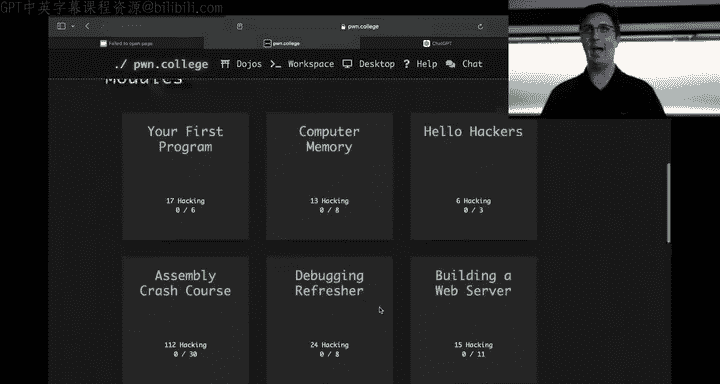

在本节课中，我们将学习如何通过系统调用来构建程序，并重点探讨构建一个Web服务器所需的核心概念。我们将使用汇编语言和GDB调试器，通过实际操作来理解程序如何与操作系统内核交互。


---

## 系统调用：程序与内核的桥梁

上一节我们回顾了`puppy`程序的基本结构。本节中，我们来看看程序如何通过系统调用与操作系统内核进行通信。

系统调用是用户空间程序请求内核服务的接口。在汇编程序中，我们通过设置寄存器并执行`syscall`指令来发起调用。

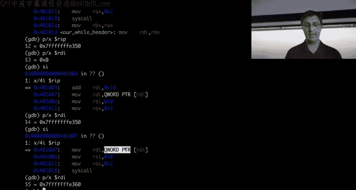


*   **选择系统调用**：`RAX`寄存器存放系统调用号。例如，`open`的系统调用号是`2`。
*   **传递参数**：前三个参数分别存放在`RDI`、`RSI`、`RDX`寄存器中。
*   **接收返回值**：系统调用的结果通常返回到`RAX`寄存器中。返回一个负数（如`0xfffffffffffffffe`）通常表示调用失败。

以下是一个`open`系统调用的汇编代码框架：
```assembly
mov rax, 2        ; syscall number for 'open'
mov rdi, filename ; pointer to the filename string
mov rsi, 0        ; flags (0 for read-only)
mov rdx, 0        ; mode (ignored for opening existing files)
syscall           ; invoke the kernel
; After syscall, check rax for the file descriptor or error
```

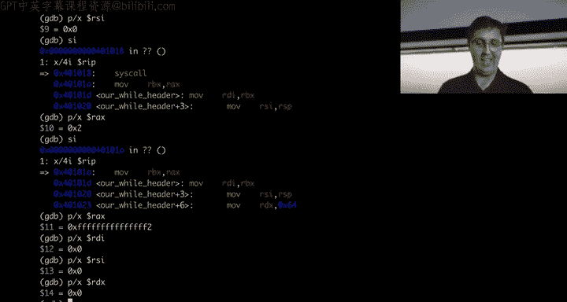

---


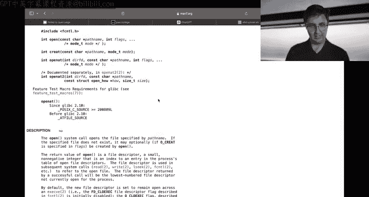

## 使用GDB进行动态调试 🔍

在编写和调试汇编程序时，GDB是一个不可或缺的工具。它允许我们实时检查程序状态、内存内容和寄存器值。

以下是使用GDB的一些基本命令：
*   `starti`：启动程序并停在第一条指令。
*   `display/4i $rip`：持续显示即将执行的4条指令。
*   `stepi` (`si`)：执行一条指令。
*   `print $rax` (`p $rax`)：打印`RAX`寄存器的值。
*   `x/8bx $rdi`：以十六进制格式显示`RDI`指向内存地址的8个字节。
*   `x/s $rdi`：将`RDI`指向的内存解释为以空字符结尾的字符串并显示。

通过GDB，我们可以验证程序逻辑是否正确，例如检查传递给系统调用的参数是否正确设置。

---

## 内存与指针：数据的两种表示方式

程序中的数据通常存储在内存中，并通过指针来引用。处理内存数据时，有两种常见范式：

1.  **显式长度**：同时传递数据的起始地址和大小（字节数）。例如，`read`和`write`系统调用使用这种方式。
2.  **隐式终止**：只传递起始地址，数据以一个特定的终止符（如空字节`\0`或空指针`NULL`）结束。C语言字符串和命令行参数数组`argv`就采用这种方式。

例如，`argv`是一个指向指针数组的指针，它同时包含了元素数量（`argc`）和以空指针结尾的标记，提供了双重信息。

---

## 查找系统调用常量的值

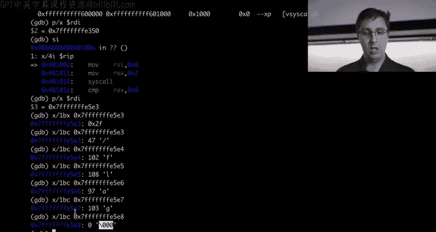


在汇编中使用系统调用时，我们需要知道各种标志（如`O_RDONLY`）对应的具体数值。这些常量定义在系统的头文件中。

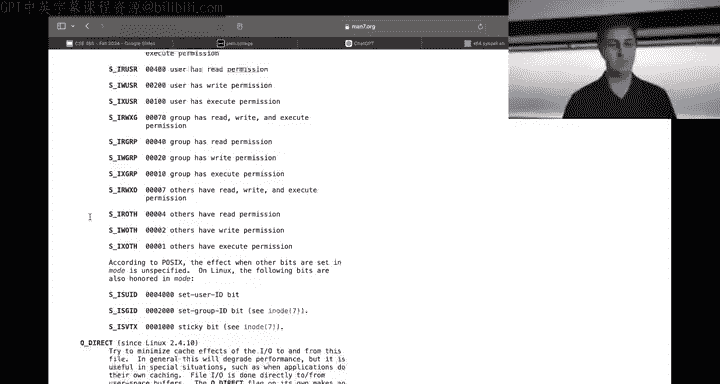


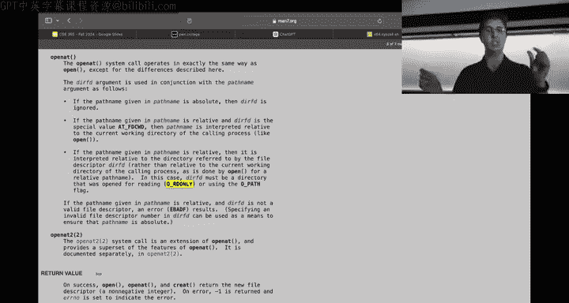

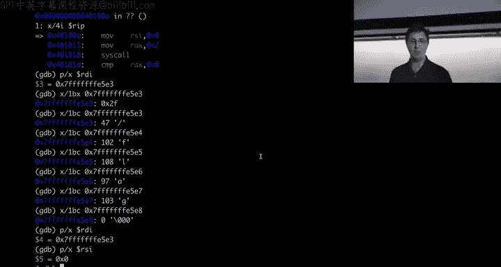


查找`O_RDONLY`值的方法如下：
```bash
grep -r "#define O_RDONLY" /usr/include/
```
输出通常会显示类似`#define O_RDONLY 0`的内容，表明`O_RDONLY`的值为0。对于其他常量（如`O_RDWR`、`O_CREAT`），也可用同样方法查找。


---


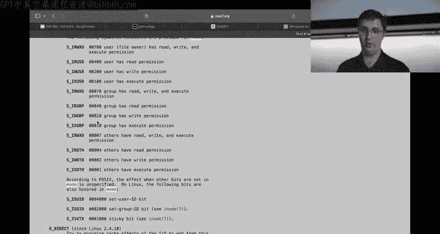

## 文件描述符：统一的操作句柄

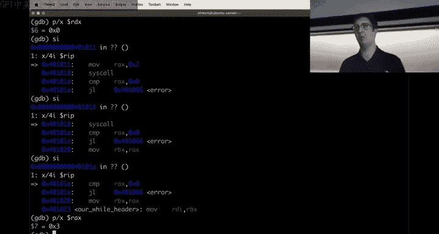

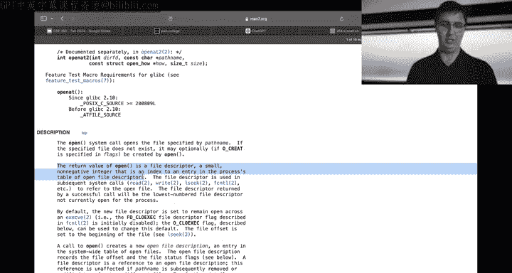

许多系统调用成功后会返回一个**文件描述符**。它是一个小的非负整数，作为内核中某个对象的句柄。


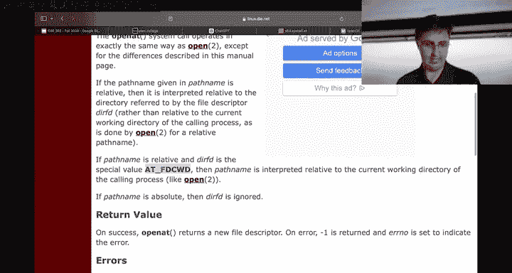


以下系统调用都会返回文件描述符：
*   `open`：打开一个文件。
*   `socket`：创建一个网络通信端点。
*   `accept`：接受一个网络连接。

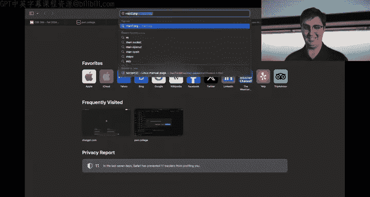


一旦获得文件描述符，就可以使用像`read`和`write`这样的通用系统调用来操作它，无论它背后代表的是普通文件、网络套接字还是其他资源。这种设计提供了简洁统一的抽象。

---

## 实现循环：处理多个命令行参数

我们的`puppy`程序目前只能处理一个文件参数。为了模拟`cat`命令的拼接功能，我们需要添加循环逻辑来处理`argv`中的所有文件名参数。

通过GDB检查内存布局，我们可以确定：
*   `argc`（参数计数）位于`$rsp`指向的内存地址。
*   第一个真正的参数`argv[1]`的指针位于`$rsp + 16`的位置。`argv`数组以空指针结束。

实现循环的基本思路如下：
1.  从栈中加载`argc`到寄存器（如`R10`）。
2.  递减`R10`以跳过程序名（`argv[0]`）。
3.  设置另一个寄存器（如`R11`）指向`argv[1]`的地址（`$rsp + 16`）。
4.  循环开始：如果`R10`为0，则跳转到退出。
5.  在循环体内：使用`R11`指向的指针作为文件名，执行打开、读取、写入操作。
6.  处理完一个文件后，`R11`增加8（指向下一个参数指针），`R10`减1，然后跳回循环开始。

在实现过程中，很可能会遇到错误（例如指针计算错误），这正是需要运用GDB进行调试的时候。

---

## 总结与下节预告

本节课中我们一起学习了：
1.  系统调用的机制及其在汇编中的使用方式。
2.  如何利用GDB动态调试程序，观察寄存器与内存。
3.  内存数据的两种管理范式：显式长度与隐式终止。
4.  如何查找系统调用中使用的常量值。
5.  文件描述符作为统一资源句柄的概念。
6.  通过分析栈布局，为程序添加处理多个命令行参数的循环逻辑。


我们尝试修改了`puppy.s`以支持多个文件，但在首次尝试中遇到了错误。**调试是编程的核心技能**。下节课（周三），我们将继续使用GDB来诊断和修复这个循环中的错误，并更深入地学习GDB脚本等调试技巧。请务必在构建Web服务器模块中积极应用这些调试技术。