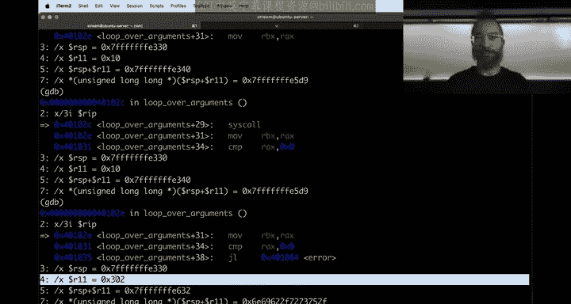
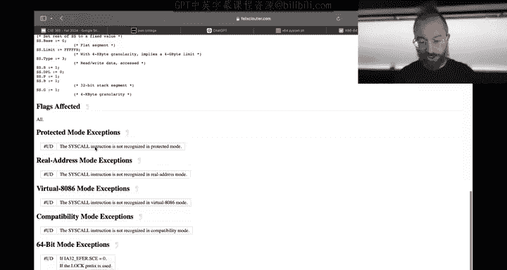
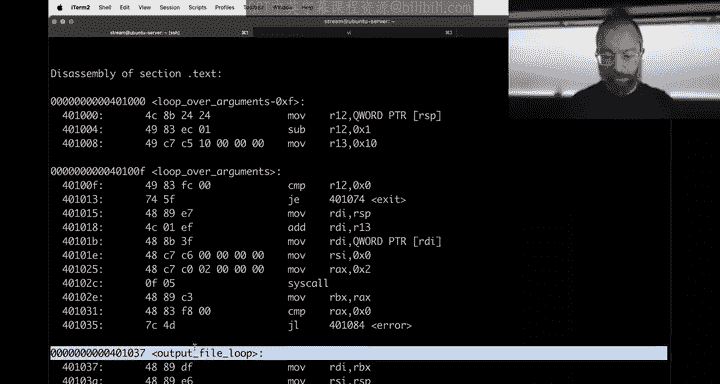
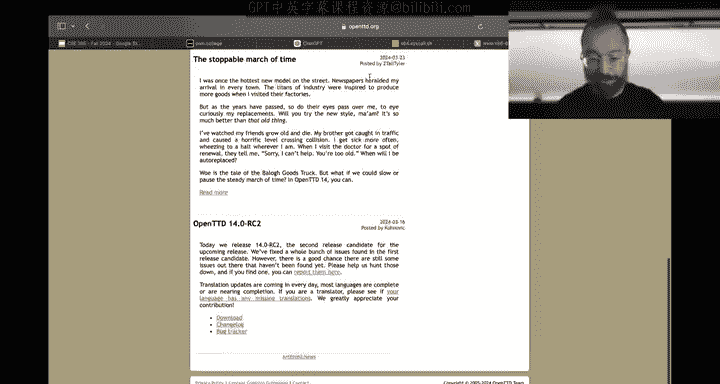
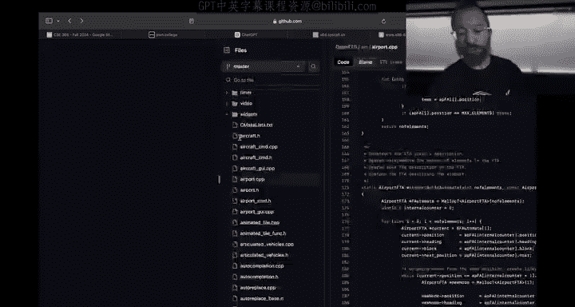
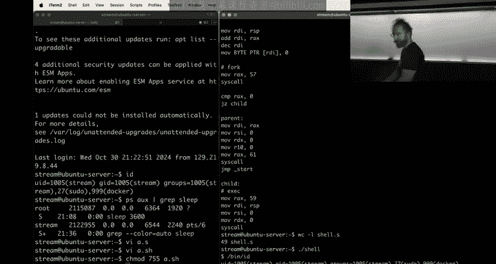

# 20：调试与进程创建 🐛

在本节课中，我们将学习如何调试一个存在缺陷的汇编程序，并深入理解Linux系统中进程是如何通过`fork`和`exec`系统调用被创建和执行的。我们将从一个名为`puppy`（模拟`cat`命令）的程序开始，修复其多文件处理错误，并最终编写一个极简的shell。

## 概述与问题引入

上一节我们介绍了如何用汇编语言编写基础程序。本节中，我们来看看一个实际案例：一个存在缺陷的、用汇编编写的`cat`命令变体`puppy`。该程序在读取单个文件时工作正常，但在处理多个命令行参数（例如 `./puppy flag1 flag2`）时，只会输出第一个文件的内容。

我们的任务是定位并修复这个bug，同时理解其背后的根本原因——系统调用对寄存器的破坏。修复完成后，我们将探讨进程的创建机制，并动手编写一个简单的shell。

## 调试汇编程序：定位寄存器破坏问题

首先，我们需要理解`puppy`程序的逻辑。它本应循环遍历所有命令行参数，依次打开每个文件并输出其内容。

以下是程序的核心逻辑结构（伪代码表示）：
```c
num_args = argc - 1; // 忽略程序名本身
offset = 16; // 栈上第一个参数（argv[1]）的地址偏移量

while (num_args > 0) {
    file_path = *(RSP + offset); // 获取文件路径地址
    fd = open(file_path, O_RDONLY);
    if (fd < 0) exit(1);
    // ... 读取并输出文件内容 ...
    num_args--;
    offset += 8; // 移动到下一个参数地址
}
```

通过使用GDB进行调试，我们在`open`系统调用后设置断点，观察关键寄存器的值。我们发现，在第一次成功打开文件后，用于计算参数地址偏移量的寄存器`R11`的值被意外修改了。

这引出了我们的核心假设：**`open`系统调用破坏了`R11`寄存器的值**。



## 理解调用约定与寄存器易失性


为了验证假设，我们需要查阅x86-64 Linux下的系统调用约定。根据约定，在系统调用中：
*   **参数传递**：使用`RDI`, `RSI`, `RDX`, `R10`, `R8`, `R9`寄存器。
*   **返回值**：存放在`RAX`寄存器中。
*   **寄存器保存责任**：系统调用（被调用者）**保证**不会破坏`RBP`, `RBX`, `R12`, `R13`, `R14`, `R15`寄存器的值。而其他寄存器，如`R11`, `RCX`等，则**不被保证**会被保存，调用者需要自行保护它们。


因此，我们的bug根源在于：程序使用了易失性寄存器`R11`来存储重要的偏移量，而`open`系统调用合法地覆盖了它。







## 修复Bug：使用被保留的寄存器

解决方案很简单：将用于存储关键数据的寄存器从易失性寄存器（如`R10`, `R11`）改为非易失性寄存器（如`R12`, `R13`）。这些寄存器由系统调用保证不会被破坏。





以下是修改的核心部分：
```assembly
; 将参数计数和偏移量存入被保留的寄存器
mov r12, [rsp]      ; r12 = argc
mov r13, 16         ; r13 = 参数地址偏移量
dec r12             ; r12 = 剩余文件数 (argc - 1)



loop_over_args:
    cmp r12, 0
    je exit
    ; 使用 r13 计算文件路径地址
    mov rdi, rsp
    add rdi, r13
    ; ... 打开文件 ...
    ; 循环末尾更新偏移量和计数器
    add r13, 8
    dec r12
    jmp loop_over_args
```
进行此修改后，`puppy`程序成功实现了多文件读取功能。

## 进程的诞生：`fork`与`exec`系统调用

修复了`puppy`的bug后，我们转向一个更基础的问题：在Linux中，像`puppy`这样的新进程是如何产生的？

当我们输入`./puppy`并按下回车时，shell（例如`bash`）会执行以下步骤：
1.  **`fork`**：Shell调用`fork`系统调用，创建一个几乎是自身精确副本的新进程（子进程）。两个进程的唯一区别是`fork`的返回值：在父进程中返回子进程的PID，在子进程中返回0。
2.  **`exec`**：在子进程中，Shell调用`exec`系统调用（如`execve`）。这个调用会用一个新的程序（`puppy`）的代码和数据完全替换当前进程（子shell）的地址空间，但保留其PID、文件描述符（如stdin/stdout）等属性。
3.  **`wait`**：父进程（原shell）通常会调用`wait`系统调用，暂停自己直到子进程（`puppy`）执行完毕，然后回收资源并继续显示提示符。

## 实践：编写一个极简Shell

理解了`fork`和`exec`后，我们可以尝试编写一个功能极其简单的shell。它只支持不带参数的命令，并且没有内置路径查找。

以下是其核心逻辑的汇编伪代码：
```assembly
start:
    ; 1. 显示提示符 “$ ”
    write(stdout, “$ “, 2);

    ; 2. 读取用户输入（例如 “cat”）
    len = read(stdin, buffer, max_len);
    buffer[len-1] = ‘\0’; // 去掉换行符

    ; 3. 创建子进程
    pid = fork();
    if (pid == 0) {
        // 子进程：变成用户输入的程序
        execve(buffer, NULL, NULL);
        // 如果execve失败，子进程退出
        exit(1);
    } else {
        // 父进程：等待子进程结束
        waitpid(pid, NULL, 0);
        // 循环回到 start
        jmp start;
    }
```
这个简单的shell演示了进程创建的基本模型。更复杂的shell（如`bash`）会在此基础上添加参数解析、管道、重定向、作业控制等大量功能。

## 总结

本节课中我们一起学习了两个关键主题：
1.  **汇编调试与调用约定**：我们通过GDB调试，发现并修复了因忽视系统调用对易失性寄存器的破坏而导致的bug。关键在于理解并遵守ABI调用约定，将需要跨调用保存的数据存放在被调用者保留的寄存器（如`R12`-`R15`）中。
2.  **进程创建机制**：我们深入了解了Linux进程创建的“分裂-变身”模型：父进程通过`fork`复制自身，子进程通过`exec`加载新程序。这是所有命令行程序启动、也是网络服务器（如Web服务器）处理并发连接的基础模型之一。我们通过编写一个极简shell实践了这一过程。



掌握这些底层机制，对于理解软件行为、分析安全漏洞（如利用进程内存布局）以及构建高效可靠的系统软件至关重要。