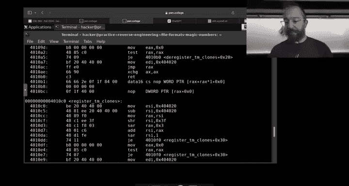
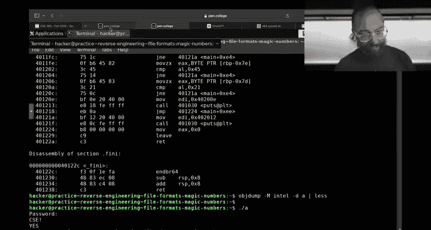
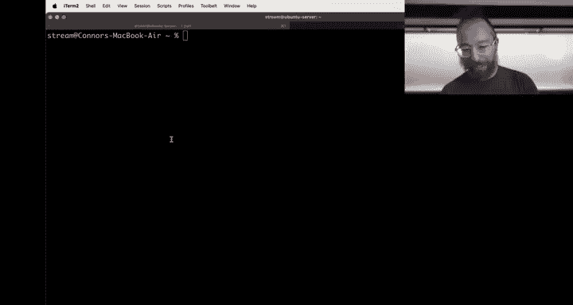
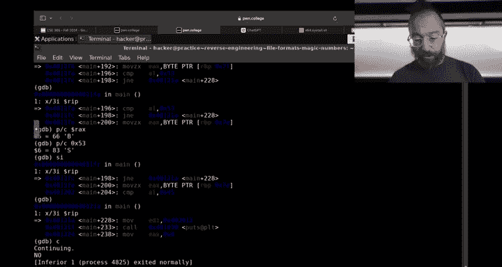
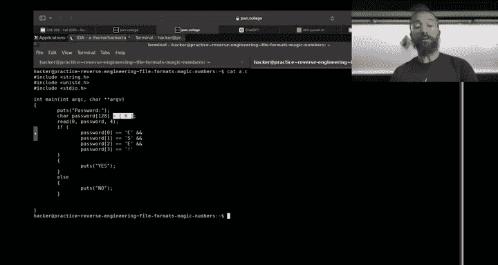
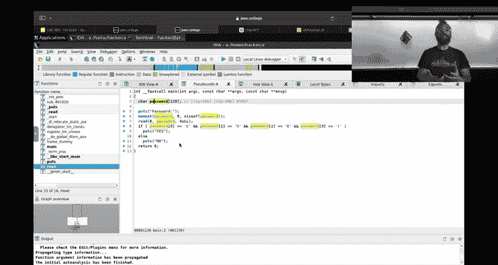
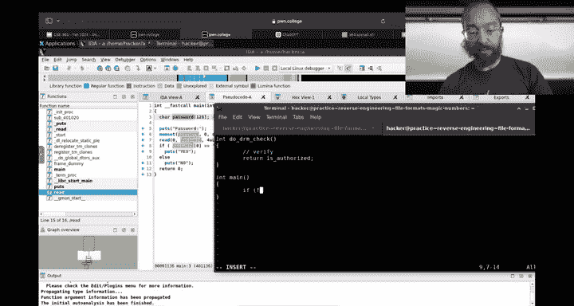
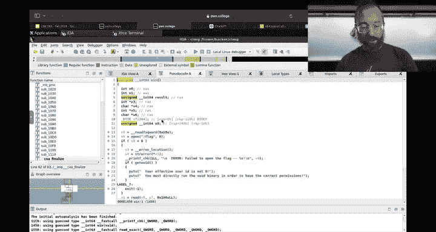
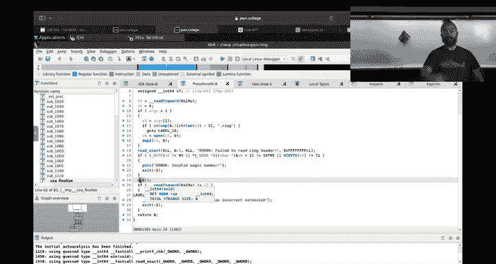

# 21：二进制逆向工程入门教程

在本节课中，我们将学习二进制逆向工程的基础知识。我们将从最简单的例子开始，逐步了解如何分析一个编译后的程序，理解其内部逻辑，甚至修改其行为。我们将使用多种工具和方法，包括命令行工具、调试器和专业的反汇编器。


---


## 概述：什么是逆向工程？

逆向工程是指在没有源代码的情况下，通过分析程序的二进制文件（即可执行文件）来理解其工作原理的过程。这就像侦探调查犯罪现场，通过留下的证据（机器指令）来推断原始事件（源代码逻辑）。在网络安全领域，逆向工程师常用于分析恶意软件、发现软件漏洞或绕过软件保护机制。

上一节我们介绍了逆向工程的基本概念，本节中我们来看看具体的分析方法和工具。

---

## 第一步：使用基础工具进行初步分析

在深入复杂的反汇编之前，我们可以先使用一些简单的工具来获取程序的初步信息，这有时能直接揭示关键数据。

### 使用 `strings` 命令查找字符串

`strings` 是一个命令行工具，它可以扫描二进制文件并提取出所有可打印的字符序列（即“字符串”）。这对于快速查找程序中的硬编码密码、错误信息或URL等非常有用。



以下是使用 `strings` 命令的示例：
```bash
strings ./my_program
```
运行后，你可能会在输出中看到类似 `password:` 或 `CSE!` 这样的字符串，这可能是程序用于比较的密码。

**注意**：如果程序不是直接比较字符串，而是逐字符进行比较，`strings` 命令可能就找不到明显的密码字符串了。这时，我们需要更深入的分析。



---




## 第二步：使用反汇编器查看汇编代码

当简单的字符串搜索无效时，我们需要查看程序的机器指令。反汇编器可以将二进制代码转换回人类可读的汇编语言。

### 使用 `objdump` 进行反汇编

`objdump` 是一个强大的命令行工具，可以显示目标文件的各种信息，包括反汇编代码。

以下是反汇编 `main` 函数的命令：
```bash
objdump -d ./my_program | grep -A 20 "<main>:"
```
或者直接反汇编整个程序：
```bash
objdump -d ./my_program
```
在输出中，你会看到类似下面的汇编代码片段，它对应着C语言中的字符比较逻辑：
```assembly
cmp    al, 0x43   ; 比较 AL 寄存器中的值是否等于 ‘C‘ (ASCII 0x43)
jne    失败地址     ; 如果不相等，则跳转到失败处理代码
```
通过阅读这些汇编指令，我们可以手动推导出程序期望的输入。例如，连续比较 `0x43`、`0x53`、`0x45`、`0x21` 就对应着字符串 `"CSE!"`。

然而，手动阅读大量汇编代码非常耗时。对于更高效的分析，我们需要图形化工具。

---



## 第三步：使用交互式反汇编器（IDA）进行高级分析

IDA Pro（Interactive Disassembler）是一款功能强大的商业逆向工程软件，其免费版本也提供了核心功能。它能以图形化方式展示程序的控制流，并尝试将汇编代码“反编译”成更易读的伪C代码。

### IDA 的核心功能

1.  **图形化控制流图**：IDA 可以将函数内的跳转逻辑可视化为流程图，让你一眼看清程序的分支结构。
2.  **反编译功能**：按下 `F5` 键，IDA 会尝试将当前函数的汇编代码反编译成高级语言（类似C语言）的伪代码。这极大提升了分析效率。
3.  **交互式修改**：你可以重命名变量、修改数据类型、添加注释，帮助IDA更好地理解代码，也使你的分析笔记得以保存。

### 逆向工程中的“语义锚点”


在分析伪代码时，一个重要的技巧是寻找“语义锚点”。这些是程序中具有明确含义的字符串或行为，能帮助我们理解周边代码的用途。



例如：
*   如果程序输出 `“Password: “`，那么紧随其后的读取操作很可能就是在读取密码。
*   如果程序输出 `“Access Denied“`，那么导致这条输出之前的条件判断就是认证失败的关键检查点。

在IDA中，你可以根据这些锚点，右键点击变量或函数，选择“重命名”（`N`键），为其赋予一个有意义的名称（如 `user_password`），这使得后续分析更加直观。

---

## 第四步：动态分析与调试

静态分析（只看代码）有时会遇到瓶颈，特别是当程序逻辑非常复杂或带有反调试技巧时。动态分析则是在程序运行时观察其行为。

### 使用GDB进行动态调试

GNU调试器（GDB）不仅可以调试自己的程序，也可以用来分析未知的二进制文件。

以下是利用GDB分析密码检查程序的步骤：

1.  **在关键函数设断点**：我们可以在 `main` 函数或 `strcmp` 函数处设断点。
    ```bash
    gdb ./my_program
    (gdb) break main
    (gdb) run
    ```
2.  **拦截系统调用**：更精准的方法是拦截读取输入的系统调用。
    ```bash
    (gdb) catch syscall read
    (gdb) run
    ```
3.  **逐步执行与观察**：当程序在 `read` 调用处暂停时，你可以查看它准备读取多少数据、存储到哪个内存地址。继续执行后，可以单步跟踪（`stepi`）指令，观察程序如何比较你输入的字符与预期值。
    ```bash
    (gdb) info registers rdi    # 查看文件描述符
    (gdb) x/s $rsi              # 查看读取数据的缓冲区地址
    (gdb) stepi                 # 单步执行一条汇编指令
    ```
通过动态调试，你可以实时看到内存和寄存器的变化，精确理解程序在每一步所做的决策。

---

## 第五步：修改二进制程序（打补丁）

理解了程序逻辑后，我们不仅可以获取正确输入，有时还需要修改程序行为本身。例如，绕过软件的使用期限检查、禁用某些功能，或者像数字保存领域那样，让一个依赖已失效服务器的旧游戏能够运行。

### 使用IDA修改程序


在IDA中，你可以直接修改汇编指令。

1.  找到你想要修改的指令（例如，一个决定跳转到“失败”代码的条件跳转指令 `jne`）。
2.  右键点击该指令，选择“编辑” -> “修补程序” -> “汇编”。
3.  将指令修改为其相反逻辑（例如，将 `jne` 改为 `je`），或者直接改为无条件跳转 `jmp` 到成功代码处。
4.  应用补丁到输入文件。



**重要提示**：修改二进制文件就像外科手术，需要精确了解修改的影响。错误的修改可能导致程序崩溃。在打补丁前，最好备份原始文件。



---

## 现实世界中的应用场景

逆向工程技能在多个领域至关重要：

*   **恶意软件分析**：安全研究员逆向工程恶意软件以了解其感染方式、通信协议和破坏能力。
*   **漏洞挖掘**：通过分析软件二进制代码，寻找潜在的内存损坏漏洞（如下一模块将学习的缓冲区溢出）。
*   **软件互操作性**：让旧软件在新系统上运行。例如，当游戏公司的DRM（数字版权管理）服务器关闭后，爱好者通过修改游戏二进制文件来移除在线验证。
*   **遗留系统维护**：在企业中，有时会遇到源代码丢失的古老关键业务软件。当需要迁移到新硬件时，工程师可能需要通过逆向工程来理解其内部协议或修复兼容性问题。


---



## 总结


本节课中我们一起学习了二进制逆向工程的基础流程：

1.  从使用 `strings` 等简单工具进行初步侦察开始。
2.  然后使用 `objdump` 或 `IDA` 进行静态反汇编分析，阅读汇编代码或反编译出的伪代码。
3.  在分析中，善于利用“语义锚点”来理解代码段的功能。
4.  通过GDB进行动态调试，在运行时观察和验证程序逻辑。
5.  最终，在充分理解的基础上，可以尝试使用IDA等工具对二进制程序进行修改，以改变其行为。



逆向工程是一种需要耐心和细致观察的技能。本模块的挑战将从简单的密码检查逐步过渡到分析复杂的“C图像”文件格式，希望你通过实践，能够掌握这种“通过表象洞察本质”的能力。请务必观看相关的课程视频，并尽早开始动手实践。祝你成功！