# 22：逆向工程模块核心概念与工具使用教程

## 概述
在本节课中，我们将学习逆向工程模块的核心概念，包括如何向程序输入非ASCII数据、如何使用高级逆向工程工具（如IDA、Ghidra）分析二进制程序、以及如何从程序中提取和操作数据。我们将通过具体的示例和演示，帮助你理解这些工具的基本工作流程。

---

## 输入非ASCII数据

在逆向工程中，程序经常需要处理非ASCII字符（如十六进制值`0xFF`、`0x01`等），这些字符无法通过键盘直接输入。本节将介绍几种向程序输入二进制数据的方法。

### 使用`echo`命令和管道
`echo`命令默认输出文本字符串。为了输出特定的字节值，需要使用`-e`选项来启用转义字符解释。

**示例：**
```bash
echo -e "hello\xff\x01\x02" | ./test
```
此命令会将字符串"hello"后跟字节`0xFF`、`0x01`、`0x02`输入到程序`./test`中。`-e`选项使得`\xff`等序列被解释为单个字节，而不是字面字符。


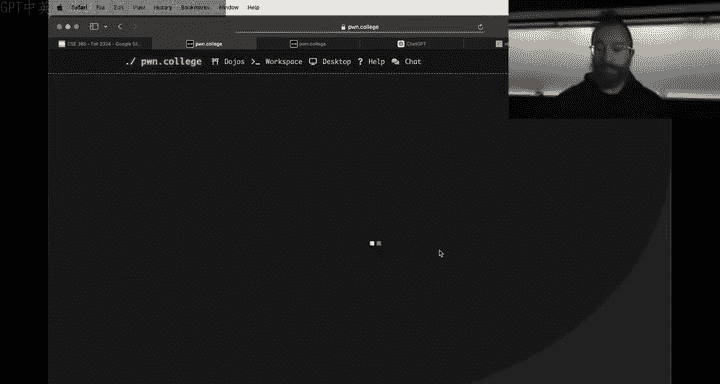

### 使用Python脚本生成二进制文件
对于更复杂或大量的二进制数据，编写Python脚本是更高效的方法。

**示例：**
```python
with open('output.bin', 'wb') as f:
    f.write(b'\x7fELF')  # 写入ELF文件魔数
    f.write(b'\x50\x18') # 写入其他数据
```
此脚本会创建一个包含特定字节序列的二进制文件`output.bin`。你可以通过`cat output.bin | ./program`或`./program < output.bin`将文件内容输入程序。

### 使用`xxd`验证文件内容
`xxd`工具可以以十六进制形式查看文件内容，用于验证生成的二进制文件是否正确。

**示例：**
```bash
xxd output.bin
```
这将显示`output.bin`文件的十六进制和ASCII表示。

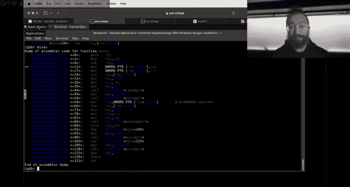

---

## 使用逆向工程工具分析程序

上一节我们介绍了如何输入数据，本节中我们来看看如何分析一个接收这些数据的程序。当面对一个需要逆向的二进制程序时，使用图形化工具远比直接阅读汇编代码高效。

### 为何需要高级工具（IDA/Ghidra）
使用`objdump`或`gdb`直接阅读汇编代码对于理解高级程序逻辑来说效率低下且容易出错。图形化逆向工程工具（如IDA、Ghidra）提供了反编译功能，能将汇编代码转换为更易读的类C代码，极大地简化了分析过程。

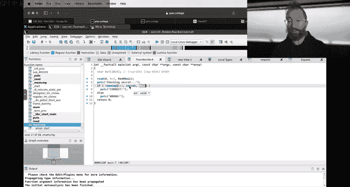

### IDA Pro 基本工作流程
以下是使用IDA分析一个简单程序（例如名为`secret`的程序）的基本步骤：


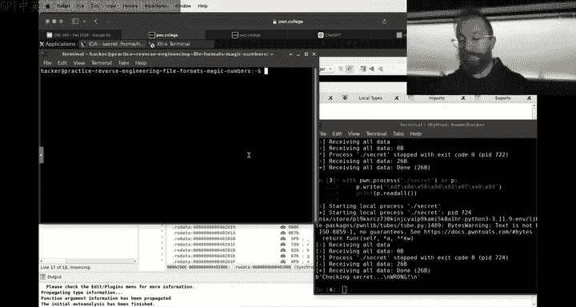

1.  **加载程序**：使用默认设置打开二进制文件。
2.  **定位主函数**：IDA通常会自动识别并定位到`main`函数。
3.  **反编译**：在汇编视图下，按下`Tab`键即可切换到反编译视图（伪代码视图）。
4.  **分析逻辑**：在反编译视图中，你可以清晰地看到程序的控制流、函数调用（如`memcmp`）和关键数据比较。
5.  **查看数据**：双击反编译代码中的变量（如`secret`），可以跳转到该变量在内存（如`.data`段或`.rodata`段）中的定义位置。

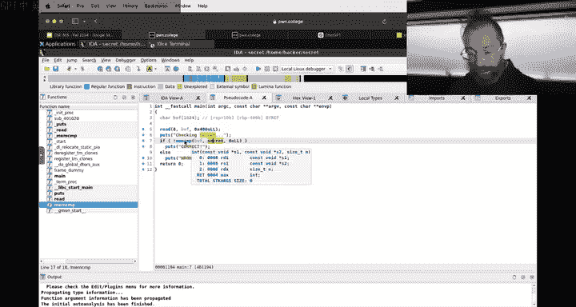

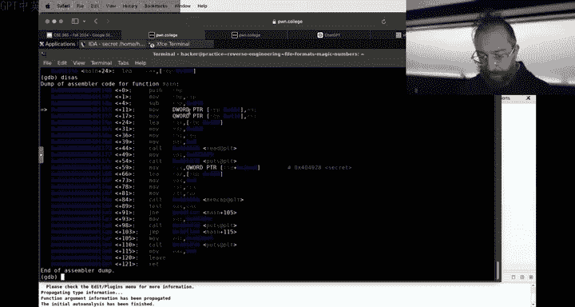

### 从IDA中提取静态数据
如果程序将密钥等数据静态存储在二进制文件中，可以直接从IDA中导出。

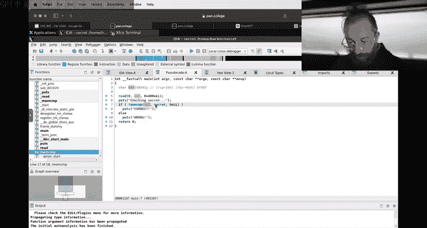

**操作步骤：**
1.  在反编译或汇编视图中，找到对关键数据（如`secret`）的引用并双击。
2.  在数据视图中，选中该数据区域。
3.  右键点击，选择 `Edit -> Export data`。
4.  选择输出格式为`Raw binary`并指定文件名，即可将数据导出为二进制文件。


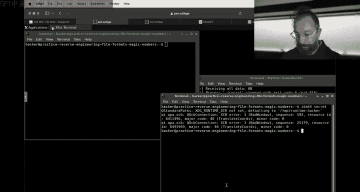

---

## 动态分析与调试（GDB）

当程序在运行时对输入数据或内部数据进行修改（例如解密、变换）时，静态分析可能不足以获得最终需要匹配的数据。这时就需要使用调试器进行动态分析。

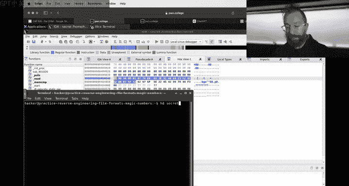

### 使用GDB提取运行时数据
假设我们通过IDA分析，发现程序在地址`0x4011c6`处调用`memcmp`比较数据。

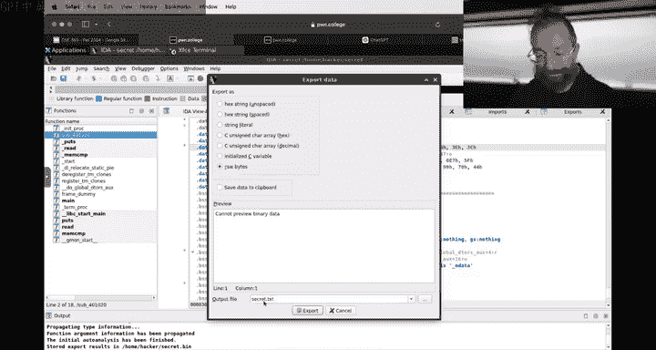

**操作步骤：**
1.  **启动调试**：`gdb ./secret`
2.  **设置断点**：`break *0x4011c6`
3.  **运行程序并提供输入**：`run < input.bin`
4.  **检查寄存器**：在断点处停下后，`memcmp`的参数通常保存在`RDI`（用户输入指针）和`RSI`（程序内部数据指针）寄存器中。
5.  **查看内存**：
    ```bash
    x/8xb $rsi  # 以十六进制查看RSI指向的8个字节
    ```
6.  **导出内存数据**：
    ```bash
    dump binary memory output.bin $rsi $rsi+33 # 将从RSI开始的33个字节导出到文件
    ```
    这样，我们就得到了程序在运行时用于比较的实际数据。

---

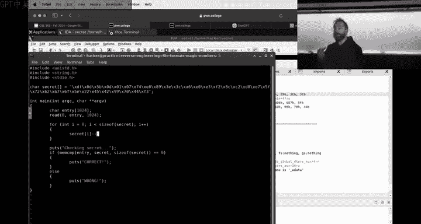

## 其他逆向工具简介

由于IDA免费版依赖云服务反编译，在大量使用时可能受限。以下是其他优秀的替代工具：

### Ghidra
*   **来源**：美国国家安全局（NSA）开源。
*   **特点**：功能强大且完全免费，反编译能力优秀。界面基于Java，可能需要适应。
*   **建议**：如果IDA遇到问题，Ghidra是非常可靠的备选方案。


### Binary Ninja
*   **特点**：商业软件，提供免费的有限功能版。界面现代，反编译效果通常很好。
*   **优势**：对学生相对更实惠。

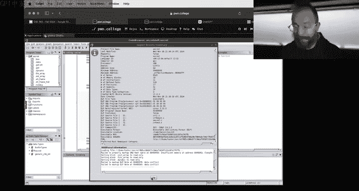

### angr-management
*   **来源**：学术研究项目（例如ASU的SES实验室）。
*   **特点**：不仅是一个反编译器，更是一个强大的二进制分析框架，可用于符号执行等高级分析。

**工具选择建议**：初学者可以主要使用**Ghidra**，因为它免费且功能完整。也可以尝试**IDA免费版**，如果其云服务稳定的话。根据任务需求和个人偏好选择即可。

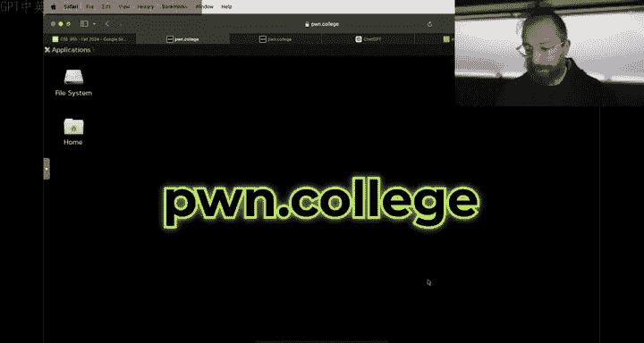

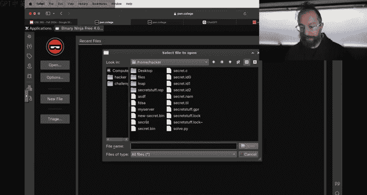

---

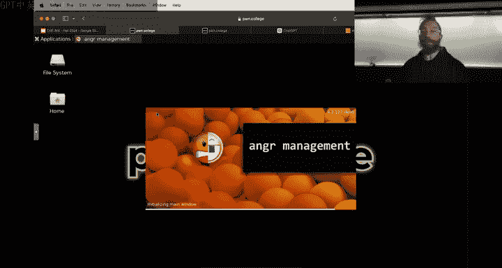

## 处理复杂数据结构（结构体）

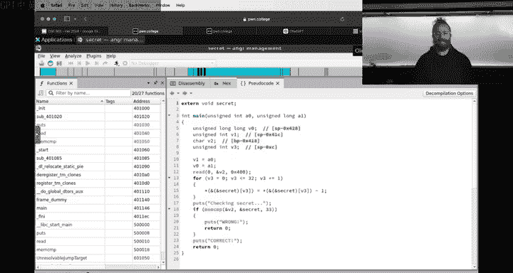


在更复杂的程序中，数据通常以结构体（`struct`）的形式组织。反编译器可能无法自动识别这种布局，将其显示为一系列独立的变量。


### 在IDA中定义结构体
为了提高反编译代码的可读性，我们可以手动定义结构体。

1.  打开 `View -> Open subviews -> Local types`。
2.  添加一个新的结构体类型（例如 `my_struct`），并根据逆向分析的结果定义其字段（如 `char field_0[4]; int field_1;`）。
3.  回到反编译视图，对相应的变量按 `Y` 键，将其类型更改为你定义的 `my_struct`。
4.  反编译代码会随之更新，使用类似 `my_var->field_0` 的语法，使程序逻辑更加清晰。


这能帮助你更好地理解数据布局和程序逻辑。由于时间关系，关于结构体分析的更详细操作将在后续材料中补充。

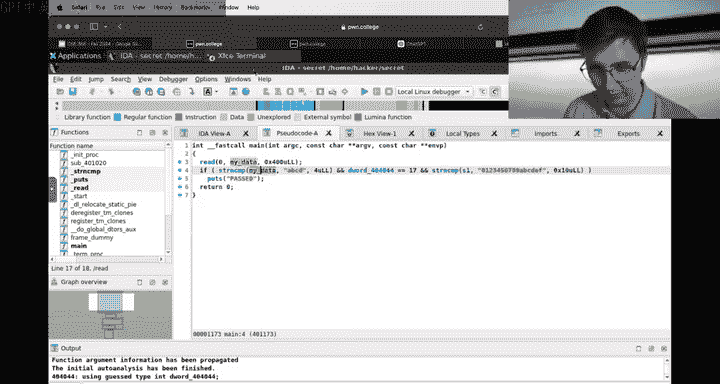


---

## 总结
本节课我们一起学习了逆向工程中的几个关键技能：
1.  **输入二进制数据**：掌握了使用`echo -e`和Python脚本向程序输入非ASCII字节的方法。
2.  **静态分析**：学会了使用IDA/Ghidra加载二进制文件、进行反编译、以及从二进制中导出静态数据。
3.  **动态分析**：了解了如何使用GDB在关键点（如`memcmp`）中断程序，并导出运行时的内存数据。
4.  **工具链**：认识了IDA、Ghidra、Binary Ninja等多种逆向工程工具及其特点。
5.  **数据结构**：初步了解了如何在逆向工具中处理和理解复杂的数据结构（如结构体）。

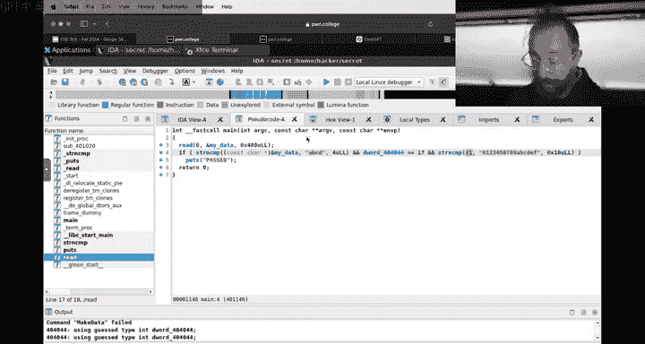

掌握这些基础技能，将为你顺利完成逆向工程模块的挑战奠定坚实的基础。请务必动手实践，并善用课程提供的Dojo环境中的工具。