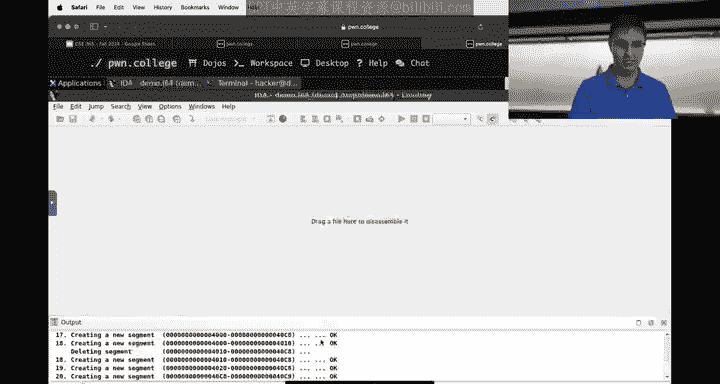
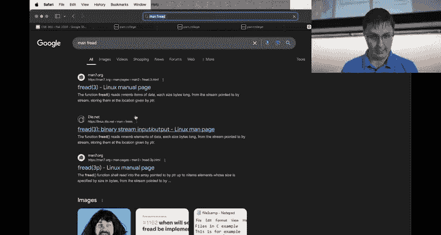
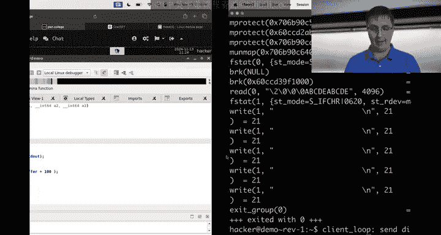
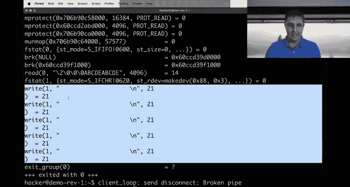
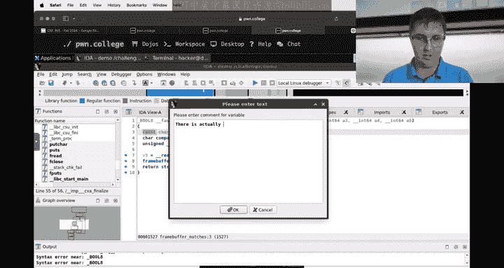
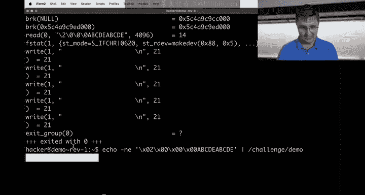

# 23：逆向工程实战演示

在本节课中，我们将通过一个实战演示来深入理解逆向工程的核心概念。这个演示程序的设计灵感来源于当前模块的作业，旨在帮助大家理清分析此类任务的方法。我们将使用IDA等工具，从高层概览到细节分析，逐步拆解一个未知的二进制程序，目标是理解其逻辑并最终获取标志（flag）。

## 课程状态更新

在开始演示之前，我们先了解一下课程近况。

上一模块“密码学”的难度超出了预期，中位成绩为55%。为了平衡成绩，我们采取了以下措施：
*   将密码学模块中所有迟交挑战的分数权重从50%提升至75%。
*   为整个密码学模块增加20%的曲线分，这相当于为每位同学的总成绩额外增加2%的学分。

当前我们正在进行第八个模块“逆向工程”。这是一个新模块，部分同学在完成检查点后的几个挑战上遇到了困难。请务必**尽早开始**，原因如下：
*   这些挑战本身具有一定难度。
*   在截止日期当天，IDA的云端反编译服务可能会因访问量过大而失效。建议考虑使用Ghidra、Binary Ninja或angr等其他反编译工具。

## 演示程序概览

为了更真实地模拟逆向工程过程（即分析没有源代码的程序），我们使用AI生成了一个程序的源代码，编译后直接进行分析。这意味着，即使是讲师，也不完全清楚程序内部的精确逻辑。

我们有一个名为 `challenge_demo` 的Set-UID程序。我们的最终目标是让程序输出 `/flag` 文件的内容。

## 第一步：高层概览与语义锚点

我们首先将程序载入IDA，并切换到反编译视图（按Tab键），以获得一个C语言风格的高层概览。

**逆向工程初期，应优先寻找“语义锚点”**，例如字符串和函数名，它们能为我们提供程序意图的线索。

以下是我们的发现：
*   **关键字符串**：`"failed to read number of rectangles"`, `"failed to read rectangle %d"`, `"/flag"`, `"frame buffer matches"`。
*   **关键函数名**：`render_rectangle`, `print_frame_buffer`, `frame_buffer_matches`。
*   **目标路径**：在代码中看到了 `fopen("/flag", "r")`，这是我们成功时需要触发的路径。

通过分析 `frame_buffer_matches` 函数，我们发现它最终调用 `strcmp` 比较两个字符串。为了让程序执行到读取flag的代码，这个比较必须返回0（即字符串相等）。

## 第二步：分析输入结构与主逻辑

接下来，我们回到 `main` 函数，分析程序如何接收和处理我们的输入。

以下是程序输入结构的关键发现：

1.  **读取矩形数量**：程序首先使用 `fread(&num_rectangles, 4, 1, stdin)` 读取一个**4字节的小端序整数**。这决定了后续循环的次数。如果读取失败，会输出错误信息 `"failed to read number of rectangles"`。
    *   **公式表示**：`num_rectangles = fread(stdin, 4 bytes, little-endian)`

2.  **循环读取矩形数据**：程序进入一个 `for` 循环，循环次数为 `num_rectangles`。
    *   在每次循环中，它使用 `fread(buffer, 5, 1, stdin)` 读取**5字节的数据**。如果读取失败，会输出 `"failed to read rectangle %d"`。
    *   然后，将这5字节的缓冲区作为参数传递给 `render_rectangle` 函数。
    *   **公式表示**：`for i in range(num_rectangles): rect_data[i] = fread(stdin, 5 bytes)`

3.  **验证与总结**：我们通过实际运行程序验证了上述输入结构。例如，输入 `\x01\x00\x00\x00`（表示1个矩形）后跟 `ABCDE`（5字节），程序不再报错，说明我们正确越过了初始的输入检查。

## 第三步：理解核心数据结构与比较

在理解了输入如何被接收后，我们需要弄清楚这些输入如何影响最终决定胜负的字符串比较。

1.  **帧缓冲区（Frame Buffer）**：我们发现一个名为 `frame_buffer` 的全局数组，它位于BSS段（初始化为0），大小为100字节。`render_rectangle` 函数会操作这个缓冲区。

2.  **打印帧缓冲区**：`print_frame_buffer` 函数负责输出 `frame_buffer` 的内容。它将这100字节视为5行，每行20字节，并在每行末尾添加一个换行符输出，总共输出105个字符（5 * 21）。

3.  **帧缓冲区转字符串**：`frame_buffer_to_string` 函数将 `frame_buffer` 转换为一个字符串。它同样处理5行数据，将每行20字节复制到目标缓冲区，并添加换行符，最后在字符串末尾添加一个空字节（`\0`）。因此，最终生成的字符串长度为 `5 * 20 + 5 + 1 = 106` 字节。

4.  **字符串比较的真相**：在 `frame_buffer_matches` 函数中，IDA的反编译起初显得混乱，似乎传递了多个参数。但通过查看汇编代码，我们确定了核心逻辑：
    *   该函数接收**一个参数**，即一个指向预期字符串的指针（我们称之为 `hello_world_buffer`）。
    *   它调用 `frame_buffer_to_string`，将当前的 `frame_buffer` 转换成106字节的字符串。
    *   最后，使用 `strcmp` 比较转换后的字符串与传入的 `hello_world_buffer`。
    *   **核心逻辑公式**：`success_condition = (strcmp(frame_buffer_to_string(frame_buffer), hello_world_buffer) == 0)`

5.  **目标字符串**：我们在程序的只读数据段（.data段）找到了 `hello_world_buffer` 的内容。它是一个106字节的特定模式字符串，包含了“hello world”文本和星号等字符。**我们的目标就是通过输入，操纵 `render_rectangle` 函数，使得最终的 `frame_buffer` 在转换成字符串后，与这个目标字符串完全一致。**

## 第四步：分析 `render_rectangle` 函数（关键）

这是我们尚未深入分析的部分，也是解决问题的关键。`render_rectangle` 函数接收我们输入的5字节矩形数据，并根据这些数据修改 `frame_buffer`。

根据反编译代码的初步观察，这5字节数据很可能代表了一个“矩形”的属性，例如：
*   位置（X, Y坐标）
*   尺寸（宽度、高度）
*   填充字符

函数内部包含循环和条件判断，逻辑相对复杂。要完成挑战，我们需要：
1.  逆向分析出这5字节数据的具体格式和含义。
2.  计算出需要多少个矩形（以及每个矩形的具体数据），才能将 `frame_buffer` “绘制”成与 `hello_world_buffer` 匹配的图案。

## 总结与后续

本节课中，我们一起完成了一次逆向工程实战演示的初步分析。

我们首先通过寻找字符串和函数名建立了高层理解，然后逐步分析了程序的输入结构、核心数据流（帧缓冲区）以及决定程序成功与否的关键字符串比较逻辑。我们明确了最终目标：通过精心构造的输入序列，控制 `render_rectangle` 函数，使 `frame_buffer` 的内容匹配预设的目标图案。

目前，我们已经掌握了程序的整体框架和输入格式，但最关键的一步——理解 `render_rectangle` 如何根据5字节数据修改缓冲区——尚未完成。这将是下一阶段分析的重点。掌握这种由目标倒推输入、并逐步验证假设的分析方法，是解决逆向工程挑战的核心技能。请记住，尽早开始作业，并善用多种工具进行探索和测试。