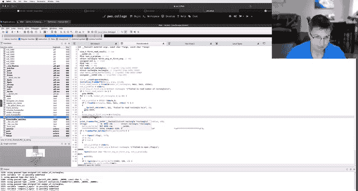
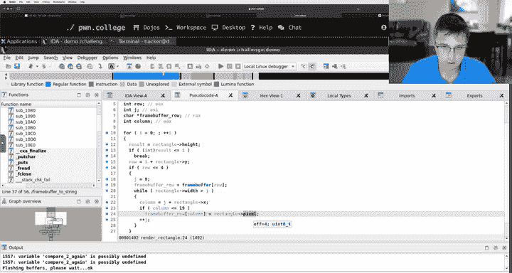
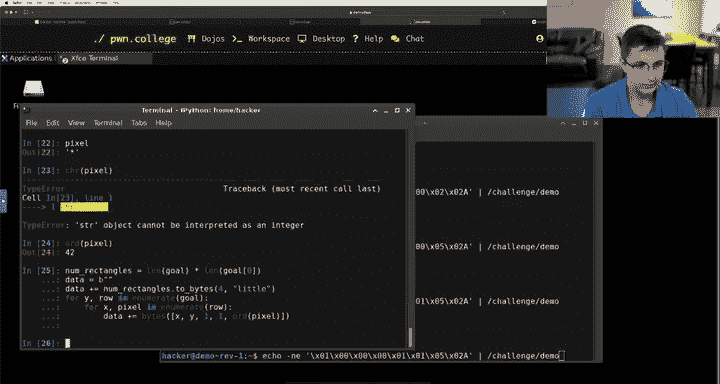
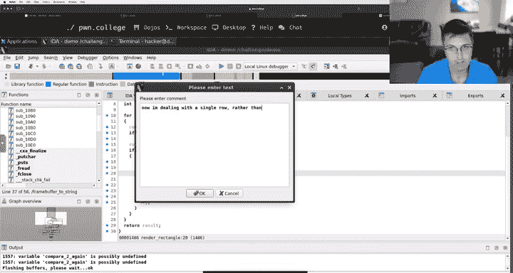

# 24：逆向工程实战（续） 🧩

在本节课中，我们将继续深入分析一个演示程序，通过逆向工程来理解其内部逻辑，并最终生成特定的输出以获得标志（flag）。我们将学习如何使用IDA Pro等工具分析函数、重构数据结构，并编写脚本来控制程序行为。

---

## 逆向工程分析流程回顾

上一节我们分析了程序的主要函数，并确定了我们的目标输出是一个“HELLO WORLD”图案。本节中，我们将深入分析负责渲染矩形的关键函数，并理解其数据结构。

### 修正函数参数与返回类型

在分析 `frame_buffer_matches` 函数时，我们发现IDA错误地识别了多个参数。实际上，该函数只接受一个参数。通过将返回类型从 `BOOL8` 改为 `int`，我们成功删除了多余的参数，使反编译代码更清晰。

**关键操作：**
1.  在函数名上按 `Y` 键，修改函数原型。
2.  将返回类型改为 `int`。
3.  删除错误的参数定义。
4.  按 `F5` 刷新反编译视图。


### 定义矩形数据结构

我们观察到程序使用一个5字节的结构来表示矩形。为了提升代码可读性，我们在IDA中定义了一个对应的结构体。

**操作步骤：**
1.  打开 **Local Types** 窗口。
2.  右键点击，选择 **Add Type**。
3.  使用C语法定义结构体，包含五个独立的 `uint8_t` 成员。

```c
struct rectangle {
    uint8_t a;
    uint8_t b;
    uint8_t c;
    uint8_t d;
    uint8_t e;
};
```

4.  在 `render_rectangle` 函数中，将相应参数的类型修改为 `struct rectangle *`。
5.  在 `main` 函数中，将局部变量的类型修改为 `struct rectangle`。




通过定义结构体，反编译代码中出现了 `rectangle->d` 这样的访问方式，这比直接使用偏移量（如 `*(v3 + 3)`）更易于理解。

### 分析 `render_rectangle` 函数逻辑

这是核心函数，它根据矩形数据向帧缓冲区（frame buffer）写入字符。我们的目标是理解其参数含义，从而控制输出。

通过分析反编译代码中的循环和条件判断，我们推断出矩形五个字节的含义：

1.  **字节 0 (a)**: 矩形的起始 X 坐标。
2.  **字节 1 (b)**: 矩形的起始 Y 坐标。
3.  **字节 2 (c)**: 矩形的宽度。
4.  **字节 3 (d)**: 矩形的高度。
5.  **字节 4 (e)**: 要写入的像素（字符）。

函数逻辑是：在由 (X, Y) 指定的起始位置，绘制一个宽为 `c`、高为 `d` 的矩形区域，并将该区域内的每个像素都设置为字符 `e`。

帧缓冲区是一个 5行 x 20列 的数组。因此，坐标 (X, Y) 必须满足 `X < 20` 且 `Y < 5`。

### 验证理解并控制输出

为了验证我们的理解，我们通过修改输入数据来测试。

**测试用例：** 绘制一个位于 (0,0)，大小为 1x1，字符为 ‘A’ 的矩形。
对应的字节序列为：`0, 0, 1, 1, ‘A‘`。

运行程序后，成功在输出画面的左上角看到了字符 ‘A’，这证实了我们的分析是正确的。

---

## 生成目标图案并获取标志

现在我们已经完全理解了程序如何工作。目标是让程序输出特定的“HELLO WORLD”图案以通过校验，获得标志。

### 设计生成脚本

我们不需要合并相邻的相同字符来优化矩形数量。最简单的方法是：为图案中每一个需要绘制的点（包括空格）都单独创建一个 1x1 的矩形。



以下是生成最终输入数据的Python脚本思路：

1.  **定义目标图案：** 将“HELLO WORLD”图案定义为一个字符串列表，每行一个字符串。
2.  **计算矩形数量：** 图案中所有字符的总数（包括空格）。
3.  **构建数据头：** 前4个字节（小端序）存储矩形数量。
4.  **遍历图案：** 对于图案中的每一个字符（非换行符），根据其坐标 (x, y) 和字符本身，生成一个 5字节的矩形数据 `[x, y, 1, 1, ord(character)]`。
5.  **输出文件：** 将所有数据写入一个文件，作为程序的输入。

```python
goal = [
    “*   * ***  ***  *   * ***  “,
    “*   * *    *    *   * *  * “,
    “***** ***  ***  * * * ***  “,
    “*   * *    *    ** ** *  * “,
    “*   * ***  ***  *   * *  * “
]

num_rectangles = sum(len(row) for row in goal)
data = bytearray()
data += (num_rectangles).to_bytes(4, ‘little‘) # 小端序头

for y, row in enumerate(goal):
    for x, pixel in enumerate(row):
        # 每个点都是一个 1x1 的矩形: [x, y, width, height, pixel]
        data += bytes([x, y, 1, 1, ord(pixel)])

with open(‘solution.bin‘, ‘wb‘) as f:
    f.write(data)
```

运行此脚本生成 `solution.bin` 文件，将其作为输入提供给挑战程序，程序成功输出了目标图案并返回了标志（flag）。

---



## 总结与技巧

本节课中我们一起学习了逆向工程一个具体程序的完整流程：

1.  **目标定位：** 通过字符串引用找到关键比较函数，确定程序成功条件。
2.  **代码清理：** 修正反编译工具产生的错误类型定义，提升代码可读性。
3.  **数据结构重建：** 根据数据访问模式定义结构体，使逻辑更清晰。
4.  **逻辑分析：** 深入分析核心函数，理解每个参数和变量的实际含义。
5.  **验证与利用：** 编写脚本或手动构造输入，验证分析结果并达成目标。



**核心逆向技巧：**
*   **重命名（N）** 和 **注释（:）** 是你的好朋友。
*   善用 **交叉引用（X）** 来追踪函数或数据的调用关系。
*   类型定义（Y）和结构体定义能极大提升复杂数据流代码的可读性。
*   始终保持“假设-验证”的循环：提出一个关于代码行为的猜想，然后设计输入去测试它。

逆向工程就像解谜，需要耐心、细致的观察和逻辑推理。通过本案例，希望你掌握了从混乱的反编译代码中梳理出清晰逻辑，并最终控制程序行为的基本方法。现在，你可以将这些技巧应用到更多挑战中去。祝你成功！