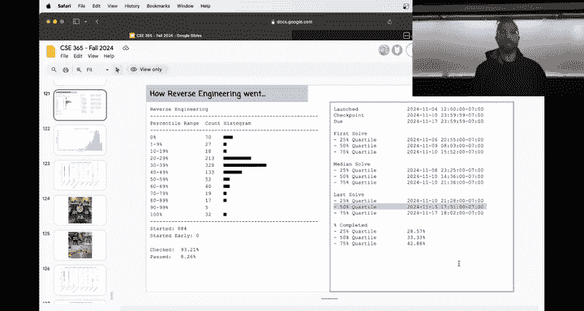
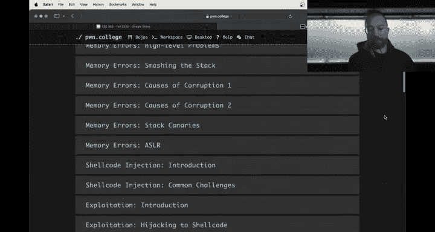
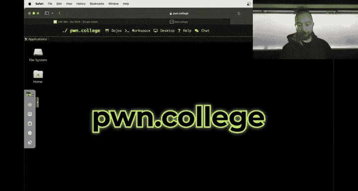
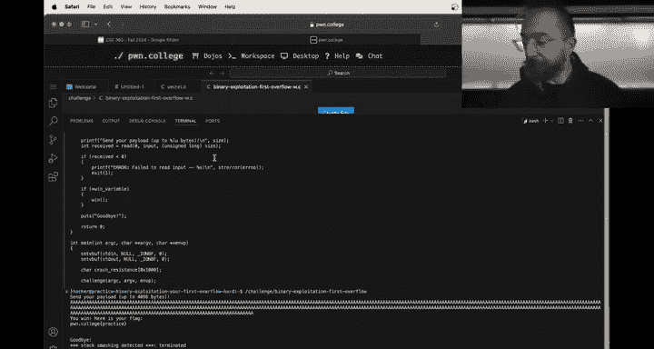
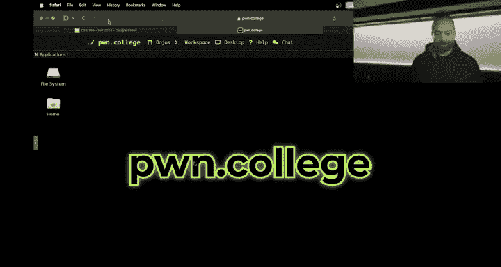
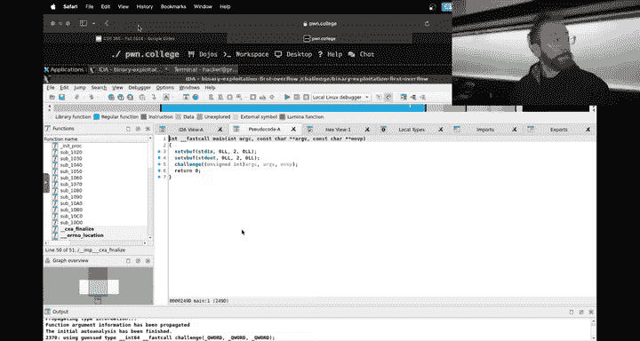
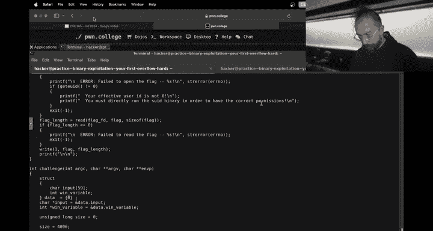

# 25：二进制漏洞利用入门教程

在本节课中，我们将学习二进制漏洞利用的核心概念，包括内存错误和Shellcode注入。我们将通过一个简单的缓冲区溢出示例，理解如何利用程序漏洞控制其执行流程。

---



## 概述



二进制漏洞利用是网络安全中的一个关键领域，它涉及发现并利用程序中的内存错误，从而控制程序的执行。本节我们将重点学习缓冲区溢出漏洞的原理和利用方法。




## 缓冲区溢出漏洞原理

上一节我们介绍了二进制漏洞利用的基本概念，本节中我们来看看最常见的漏洞类型之一：缓冲区溢出。

在C语言等低级编程语言中，程序通常不会检查写入缓冲区的数据是否超出其分配的空间。当程序向一个固定大小的缓冲区写入超过其容量的数据时，多余的数据就会“溢出”到相邻的内存区域。




**代码示例：一个存在漏洞的函数**
```c
void vulnerable_function() {
    char buffer[59]; // 分配59字节的缓冲区
    int win = 0;     // 一个关键变量，初始为0
    read(0, buffer, 4096); // 从标准输入读取4096字节到buffer中
    if (win != 0) {
        give_flag(); // 如果win不为0，则给出flag
    }
}
```
在上述代码中，`read`函数试图将4096字节的数据读入一个仅有59字节的`buffer`。这会导致超出`buffer`范围的数据被写入相邻的内存位置，可能覆盖`win`变量或其他关键数据。




## 利用缓冲区溢出

理解了漏洞原理后，我们来看看如何利用它。我们的目标是覆盖`win`变量，使其值不为零，从而触发`give_flag()`函数。

以下是利用此漏洞的关键步骤：

1.  **确定偏移量**：首先需要计算出从`buffer`起始位置到`win`变量之间的字节距离。这可以通过静态分析（如使用IDA）或动态调试（如使用GDB）来完成。
2.  **构造Payload**：Payload是指我们输入到程序中的恶意数据。它需要包含足够多的填充字符（如‘A’）来填满`buffer`和偏移量之间的空间，然后在`win`变量所在位置写入一个非零值。
3.  **发送Payload**：将构造好的Payload发送给正在运行的程序。




**公式：Payload结构**
```
Payload = [填充字符 * 偏移量] + [非零值（如0x42代表‘B’）]
```





## 实践工具与技巧


在实际利用过程中，手动计算偏移量可能容易出错。我们可以借助一些工具来简化这个过程。

*   **使用`pwntools`的`cyclic`模式**：`pwntools`是一个强大的CTF框架和漏洞利用开发库。它的`cyclic`功能可以生成一个具有特殊模式的字符串。当程序崩溃时，通过检查覆盖了返回地址或关键变量的值，并查询该值在`cyclic`模式中的位置，就能快速确定准确的偏移量。
*   **结合静态与动态分析**：使用IDA Pro进行反汇编和静态分析，了解程序结构和变量布局。同时使用GDB进行动态调试，在关键点（如`read`函数调用后）检查内存状态，验证我们的Payload是否按预期工作。

## 总结


本节课中我们一起学习了二进制漏洞利用的基础——缓冲区溢出。我们了解了其产生的原因：程序向固定大小的缓冲区写入超量数据。我们学习了利用该漏洞的基本步骤：确定偏移量、构造Payload并发送。最后，我们介绍了一些实用工具和技巧，如使用`pwntools`的`cyclic`模式和结合IDA与GDB进行分析，这些都能帮助我们更高效、更准确地完成漏洞利用。在接下来的挑战中，你将有机会亲自实践这些概念。