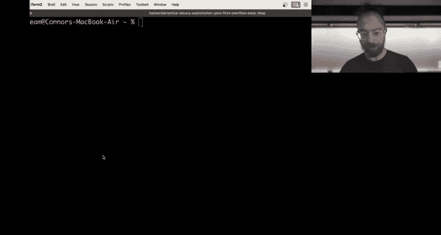
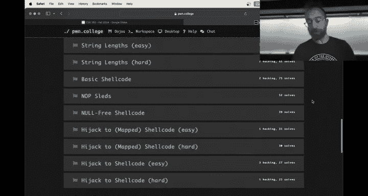
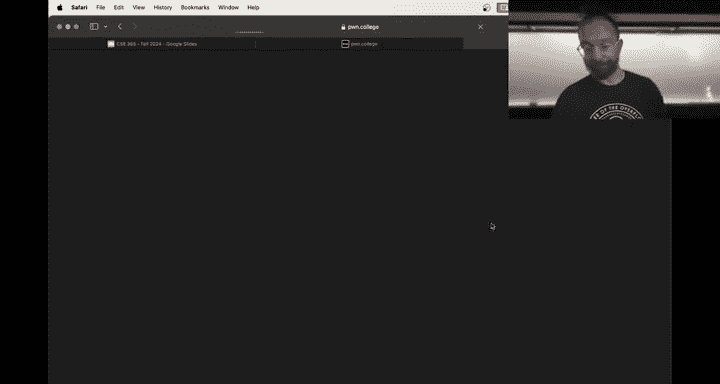
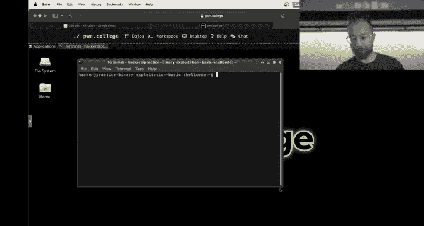
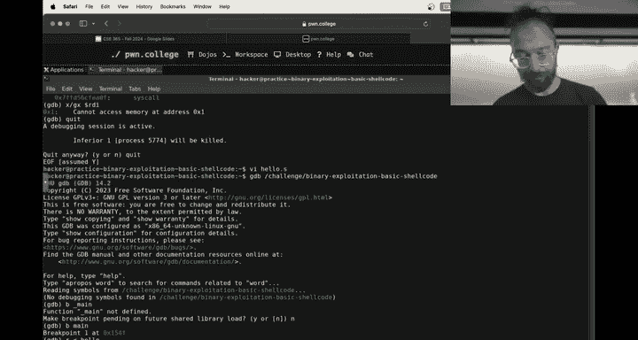
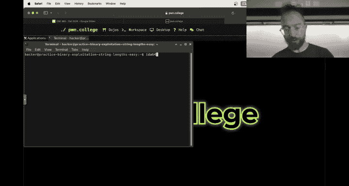
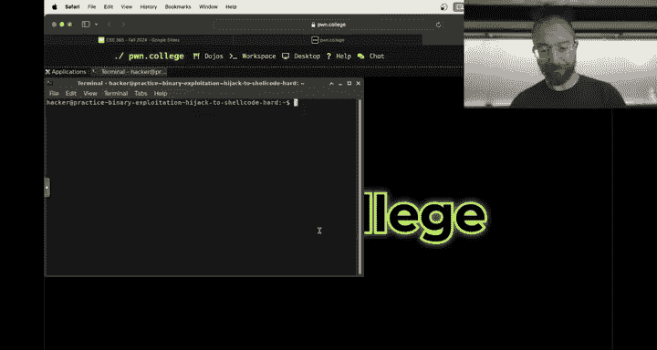
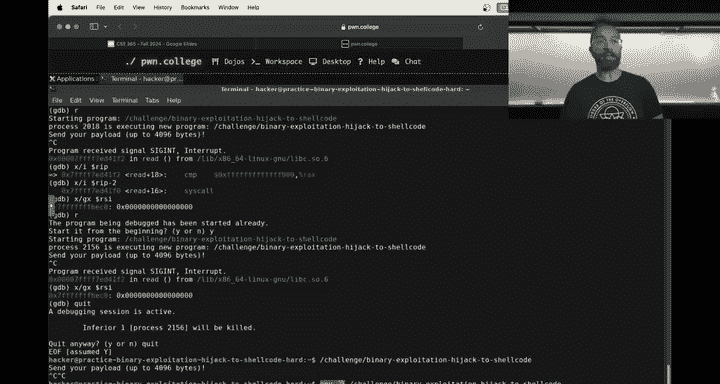

# 27：Shellcode编写与调试 🐚





在本节课中，我们将学习如何编写和调试Shellcode。Shellcode是一小段机器码，通常用于利用软件漏洞，将其注入到目标进程的内存空间并执行。我们将从编写一个简单的“Hello World” Shellcode开始，学习如何提取、注入和调试它。

---

## 概述：Shellcode基础


上一节我们介绍了如何通过缓冲区溢出来劫持程序的返回地址。本节中，我们将更进一步，学习如何将我们自己的代码（Shellcode）注入到进程中并执行。Shellcode的本质是一段可以直接被CPU执行的机器指令序列。






## 从汇编程序到Shellcode

首先，我们从一个简单的汇编程序开始。以下是一个在x86-64架构上打印“Hi”并退出的汇编程序：

```assembly
global _start
section .text
_start:
    ; write(1, message, 3)
    mov rax, 1          ; 系统调用号 1 代表 write
    mov rdi, 1          ; 文件描述符 1 代表标准输出
    mov rsi, rsp        ; 缓冲区地址（我们将数据放在栈上）
    mov byte [rsi], 'H' ; 将字符 ‘H’ 放入缓冲区
    mov byte [rsi+1], 'i' ; 将字符 ‘i’ 放入缓冲区
    mov byte [rsi+2], 0x0a ; 换行符 ‘\n’
    mov rdx, 3          ; 要写入的字节数
    syscall             ; 执行系统调用

    ; exit(0)
    mov rax, 60         ; 系统调用号 60 代表 exit
    xor rdi, rdi        ; 退出码 0
    syscall
```

我们使用汇编器（如`nasm`）和链接器（如`ld`）将其转换为可执行文件：

```bash
nasm -f elf64 hello.asm -o hello.o
ld hello.o -o hello
```

运行`./hello`会输出“Hi”。然而，这个可执行文件（ELF格式）包含大量元数据（如头部、节区信息），而不仅仅是我们的代码。为了将其作为Shellcode注入，我们需要提取出纯指令字节。

## 提取纯指令字节

ELF文件中的代码通常位于`.text`节区。我们需要从这个节区提取出原始的机器码字节。

以下是两种提取方法：

**方法一：使用 `objcopy` 工具**
`objcopy` 可以复制或转换目标文件的部分内容。
```bash
objcopy -O binary --only-section=.text hello hello_shellcode
```
这条命令将`hello`文件的`.text`节区内容以原始二进制格式提取到`hello_shellcode`文件中。


**方法二：使用 `dd` 工具**
如果我们知道代码在文件中的偏移量（例如`0x1000`）和大小（例如`0x2a`字节），可以使用`dd`。
```bash
dd if=hello of=hello_shellcode bs=1 skip=$((0x1000)) count=$((0x2a))
```

现在，`hello_shellcode`文件包含了纯粹的Shellcode字节。我们可以用十六进制查看器验证：
```bash
xxd hello_shellcode
```




## 注入并执行Shellcode

在漏洞利用场景中，目标程序会有一个缓冲区。我们的目标是：
1.  将Shellcode字节放入缓冲区。
2.  覆盖函数的返回地址，使其指向我们Shellcode在内存中的起始地址（通常是缓冲区的地址）。

由于本课程实验环境禁用了**地址空间布局随机化**，栈地址在每次运行中是固定的，这使得计算返回地址变得相对简单。

## 调试Shellcode

Shellcode执行出错时，调试可能比较棘手，因为代码是在运行时动态注入的，而不是原始二进制的一部分。

**技巧：在Shellcode中插入断点指令**
x86架构的`int3`指令（机器码为`0xCC`）会触发一个断点中断。如果程序在调试器（如GDB）中运行，执行到`int3`时会暂停，让我们可以检查寄存器、内存状态。

我们可以在汇编代码中需要调试的位置插入`int3`：
```assembly
; ... 一些指令 ...
int3   ; 调试断点
; ... 后续指令 ...
```
重新汇编、提取Shellcode并注入。当在GDB中运行目标程序并触发Shellcode时，执行到`int3`就会中断，此时我们可以使用GDB命令（如`info registers`， `x/10i $rip`）进行调试。





**附加进程进行调试**
为了获得更精确的内存地址（避免GDB自身环境变量对栈地址的影响），一个更好的方法是：
1.  在“练习模式”下正常运行目标程序。
2.  使用`ps`命令或类似方法找到该进程的PID。
3.  使用GDB附加到该进程：`gdb -p <PID>`。
4.  然后继续执行，当Shellcode中的`int3`断点触发时，即可进行调试。

这种方法能让我们在接近真实的环境下观察Shellcode的行为。

## 应对字符串长度检查





在一些挑战（如“string length”）中，程序可能会使用`strlen`等函数检查输入长度，然后才用`memcpy`复制到栈缓冲区。`strlen`在遇到空字节（`\x00`）时停止计数。

这意味着，如果我们的Shellcode或地址中包含空字节，`strlen`返回的长度会很短，能通过检查。但随后的`memcpy`会复制整个输入（包括空字节之后的内容），从而仍然可以实现溢出。

**策略**：构造Shellcode和地址时，尽量避免使用空字节，或者确保空字节位于`strlen`检查之后才需要被复制的部分。

## 总结

本节课我们一起学习了Shellcode的完整流程：
1.  **编写**：用汇编语言编写功能代码（如系统调用）。
2.  **提取**：从生成的可执行文件中提取出纯指令字节。
3.  **注入**：将字节码作为输入送入存在缓冲区溢出的程序，并覆盖返回地址指向它。
4.  **调试**：利用`int3`指令和GDB附加调试来排查Shellcode问题。



理解并掌握Shellcode是二进制漏洞利用的核心技能之一。它允许我们将任意代码注入到目标进程中，从而完全控制其行为。请务必在实验环境中动手实践这些步骤。