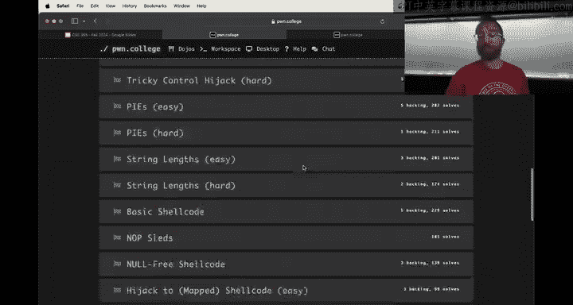
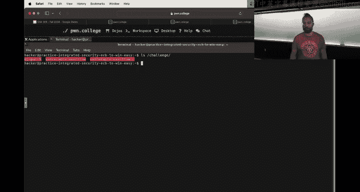
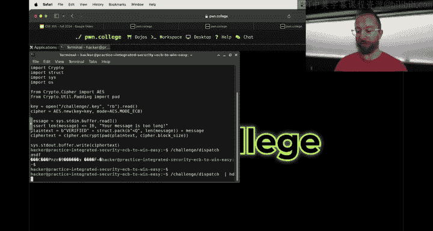
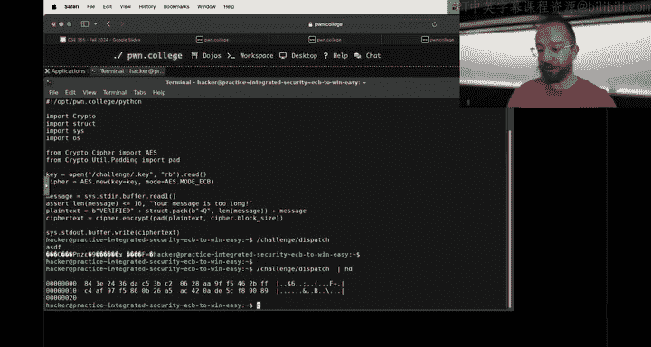
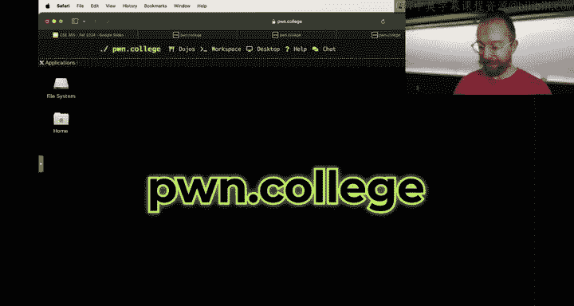
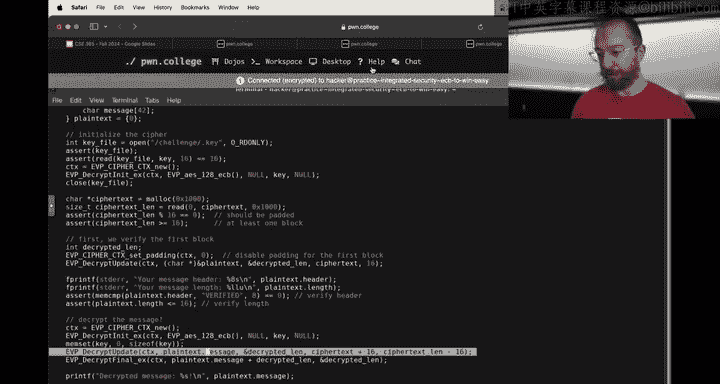
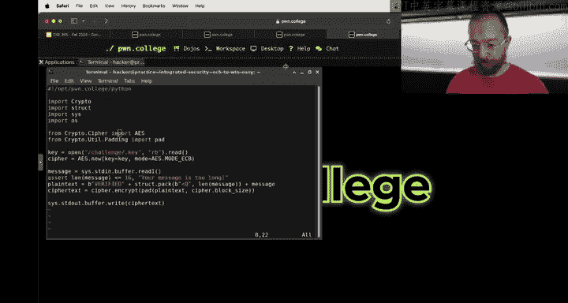
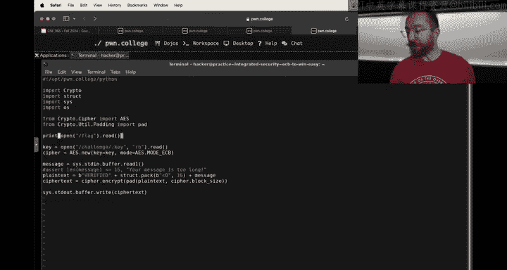

# 28：综合安全

在本节课中，我们将学习如何应对融合了多个安全概念的综合性挑战。我们将以“综合安全”模块的第一个挑战为例，演示如何将复杂问题分解为熟悉的单一概念，并逐步构建解决方案。



## 概述

综合安全模块的挑战融合了之前学过的多个独立概念，例如密码学、二进制漏洞利用、逆向工程和Web安全。解决这些挑战的关键在于，将复杂问题分解回我们熟悉的单一概念，并逐一攻克。

## 挑战结构分析

我们首先遇到的挑战结合了密码学和二进制漏洞利用。程序分为两部分：
1.  **分发器**：一个加密服务，只接受并加密短于16字节的消息。
2.  **漏洞程序**：一个解密服务，存在缓冲区溢出漏洞，但要求输入的消息必须能成功解密，且头部信息需验证通过。





我们的目标是利用漏洞程序中的溢出漏洞，触发一个能打印标志的`win`函数。然而，要与之通信，我们必须先通过其解密和验证检查，而生成有效加密消息的唯一途径是使用有长度限制的分发器。





## 问题分解与逆向推理

我们可以像证明几何题一样，从目标（获取标志）开始逆向推导必要的条件。

1.  **最终目标**：获取标志（`flag`）。
2.  **倒数第二步**：触发`win`函数。分析二进制文件发现，没有直接调用`win`的路径，但存在栈溢出漏洞，且没有栈保护（Canary）和地址随机化（PIE），因此可以通过控制流劫持跳转到`win`函数。
3.  **倒数第三步**：触发栈缓冲区溢出。我们需要找到溢出的点。
4.  **分析溢出点**：通过阅读源代码，我们发现解密函数`EVP_DecryptUpdate`可能存在问题。它解密的数据长度来自用户输入，且没有严格的上限检查，而目标缓冲区`message`在栈上的大小是固定的。因此，如果提供过长的密文，就会导致栈溢出。
5.  **新的需求**：我们需要构造一个长度超过42字节（头部16字节 + 消息缓冲区）的**有效加密消息**。有效意味着其解密后的前16字节必须是`verified`和一个小于16的长度值。

至此，我们遇到了核心矛盾：分发器拒绝加密长消息，但漏洞利用需要长消息。这引入了密码学层面的挑战。

## 利用实践模式进行概念隔离




在真正解决密码学难题前，我们可以使用“实践模式”来暂时隔离问题，专注于验证和利用二进制漏洞本身。

以下是具体步骤：




1.  **修改分发器**：在实践模式下，我们可以修改分发器程序，移除其长度检查，并使其始终使用固定的已知密钥。这样，我们就能自由生成任意长度的“有效”加密消息用于测试。
    ```bash
    # 示例：生成一个长密文用于测试溢出
    python3 -c "from pwn import *; print(cyclic(128))" | ./dispatcher_patched
    ```


2.  **验证溢出**：将生成的密文喂给漏洞程序。为了绕过其头部验证检查，我们可以使用调试器（GDB）在运行时修改关键寄存器的值。
    *   在`memcmp`比较后，将结果寄存器（如RAX）设为0，使验证通过。
    *   在长度检查处，修改条件，使程序继续执行。
    ```gdb
    break *0x401c1d
    commands
    set $rax = 0
    continue
    end
    run < your_encrypted_payload
    ```


3.  **计算偏移量**：当程序因我们的长输入而崩溃时，查看崩溃时的返回地址（RIP）。使用`cyclic`工具可以计算出从输入缓冲区开始到覆盖返回地址的确切偏移量。
    ```bash
    # 假设崩溃时RIP的值为0x6161616161616168
    cyclic -l 0x6161616161616168
    ```

4.  **构造利用载荷**：在获得偏移量后，我们就可以构造标准的漏洞利用载荷了：偏移量长度的填充数据 + `win`函数的地址。
    ```python
    from pwn import *
    offset = 104 # 假设计算出的偏移量
    win_addr = 0x401216 # win函数的地址
    payload = b'A' * offset + p64(win_addr)
    ```




5.  **测试利用**：用修改后的分发器加密这个载荷，然后发送给漏洞程序。如果一切顺利，应该能成功触发`win`函数，在实践模式下获得假标志。


通过以上步骤，我们在“作弊”的环境下完成了一次从构造输入到触发漏洞的完整链条验证。这证明了二进制漏洞利用部分是可行的。


## 回归综合挑战

在实践模式中验证了漏洞利用路径后，剩下的核心挑战就是：**如何在不修改分发器的情况下，构造出一个能通过漏洞程序所有检查的长加密消息？**

这需要运用密码学知识来“欺骗”系统。例如，可能需要研究AES-ECB加密模式的特征，利用其块独立性，通过精心构造的输入，使加密后的密文在解密后能产生我们想要的`verified`头部和虚假的长度值，同时后续部分又能包含我们的溢出载荷。

这正是“综合安全”挑战的精髓——你需要将密码学的攻击手法（如选择明文攻击）与二进制漏洞利用的精准偏移计算结合起来。

## 总结

本节课中，我们一起学习了应对多概念融合安全挑战的方法：



1.  **逆向推理**：从最终目标出发，反向推导必要条件链。
2.  **分解问题**：将复杂挑战拆解为独立的、已学过的概念（如密码学、溢出利用）。
3.  **利用实践模式**：在可控环境中隔离并验证单个概念的攻击路径（例如，先专注于验证溢出是否可行）。
4.  **逐步集成**：在验证各部分可行后，再研究如何在不“作弊”的情况下，满足所有前置条件，将攻击链完整串联起来。


综合安全模块是对本学期所学技能的一次全面检验。请善用实践模式进行探索和实验，并享受将不同领域知识融会贯通的乐趣。