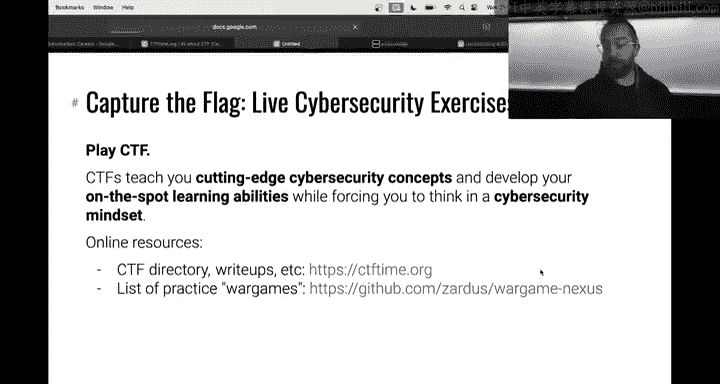
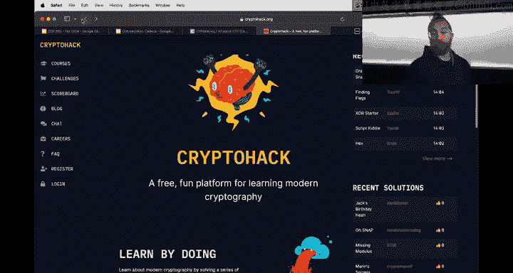
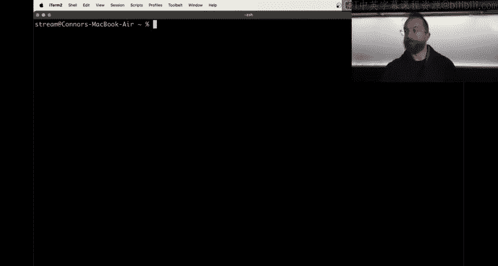

# 29：课程总结与未来展望

在本节课中，我们将回顾本学期的精彩瞬间，探讨完成CSE 365课程后的学习路径，并深入了解网络安全领域的职业发展方向。我们将告别本学期的学习，并为未来的探索做好准备。

## 表情包回顾 🎭

上一节我们介绍了课程的整体安排，本节中我们来看看本学期社区中产生的精彩表情包。这些内容反映了大家在学习过程中的共同经历。

以下是本学期根据互动数量评选出的部分热门表情包：

*   **密码学太难**：一个经典表情，表达了面对密码学挑战时的普遍感受，并伴随着对成绩曲线的期盼。
*   **荣誉教授Hanto**：来自社区的热心成员Hanto长期占据排行榜首位，为课程提供了巨大帮助。为表感谢，我们将为他制作一个奖杯。
*   **学期心态变化**：表情包展示了随着课程内容变难，同学们从充满希望到只能依赖表情包和求成绩曲线的心态转变。
*   **服务器问题**：学期初平台遭遇的服务器稳定性问题，这体现了构建可扩展教学平台的挑战。
*   **实习机会**：有同学凭借在本课程中学到的网络安全知识获得了暑期实习。这证明了课程所授技能的实用性。
*   **表情包监狱**：本学期被关入“表情包监狱”次数最多的一个表情包，内容关于经典的QA测试。
*   **网络通信与数据包注入**：一个关于网络通信模块的优秀表情包。该模块因技术原因未能全面升级，但计划在下学期进行改进。
*   **CSE 466 相关**：关于后续课程CSE 466的表情包，提示了连续网络安全学习的挑战与乐趣。
*   **逆向工程与漏洞利用**：展示了从逆向工程到二进制漏洞利用的技能进阶过程。
*   **密码学模块**：密码学模块的难度可能设置过高，尤其是填充预言攻击部分，未来会考虑调整。
*   **综合安全模块**：关于最后一个综合安全模块的表情包，该模块融合了多项技能。

## 后续学习路径 🛤️

在回顾了本学期的趣味瞬间后，我们来看看如何将在这里学到的基础知识转化为持续的技能成长。

### 持续练习与实践

课程教授了许多基础知识，但这只是一个开始。你可以通过以下方式继续深入学习：

*   **CTF档案库**：在Pwn College上，我们存档了过去10-12年间超过541个来自各类网络安全竞赛的挑战。你可以继续挑战它们。
*   **参加实时CTF比赛**：访问 `ctftime.org` 查看即将举行的比赛，与朋友组队参加。这非常有趣，也是融入安全社区的好方法。
*   **其他学习平台**：我维护了一个包含各种练习和教育性题目的网站列表，可以通过 `wargame.nexus` 访问。例如，对密码学感兴趣可以访问 `cryptohack`，对AI安全感兴趣也有相应的资源站。

通过不断参与CTF，你可以积累知识、声誉和热情，最终目标是参与网络安全界的“奥运会”——Defcon CTF。

### 发现并报告真实漏洞

你可以开始将所学技能应用于实际的网络安全问题，而不仅仅是挑战题目。

*   **漏洞赏金计划**：许多组织都有漏洞赏金计划。如果你在其产品中发现漏洞并按照规则报告，可能会获得从数百到数万美元不等的奖金。
*   **负责任的披露**：发现漏洞后，当前公认的伦理做法是进行负责任的披露，即直接告知厂商。这通常比完全公开披露更受认可。厂商可能会为你分配一个CVE编号，这对你的简历很有帮助。
*   **零日漏洞竞赛**：例如Pwn2Own竞赛，针对特定设备或软件，成功在现场利用漏洞可获得预定奖金，同时漏洞会提交给厂商修复。

**重要提醒**：发现漏洞后，切勿利用它攻击他人。这不仅是非法的，也会在职业生涯开始前就终结它。务必在法律和伦理框架内行动。

### 继续学习相关课程

如果你希望在学校课程体系中继续深造，ASU提供了许多网络安全相关课程：

*   **CSE 466**：本课程的直接延续，深入探讨高级缓解措施、绕过技术以及整个系统的安全性。
*   **CSE 598 软件漏洞利用**：一门研究生课程，深入探讨尖端的缓解措施和漏洞利用技术。
*   **应用漏洞研究**：学习逆向工程和分析大型真实程序（数百万行代码级别），而不仅仅是课程中的小型演示程序。
*   **其他课程**：还包括数据安全与隐私、软件质量与测试、网络取证等。请多关注课程目录中与安全相关的课程。
*   **密码学课程**：CSE 539密码学课程将在下学期进行改进。

### 参与研究

如果你对深入研究网络安全感兴趣，可以考虑加入我们的研究实验室。

*   **本科生研究**：任何在Pwn College中获得腰带（特别是橙色腰带）的同学，如果对研究感兴趣，我们都欢迎你来交流。我们有很多适合本科生的项目，涉及教学平台开发、自动化程序分析、网络犯罪分析等。
*   **全球参与者**：此邀请也适用于全球范围内非ASU的课程跟随者。

## 网络安全职业道路 💼

掌握了技能之后，让我们看看如何在网络安全领域开创职业生涯。这里有一些主要的方向可供选择。

### 渗透测试员

受雇从外部像攻击者一样评估公司系统的安全性。

*   **优点**：工作内容多样、有趣，有时甚至涉及物理安全测试。
*   **缺点**：日常工作有时会变得重复（例如扫描未打补丁的系统），需要撰写大量报告，时间压力可能较大。

### 企业内部安全工程师

在大公司内部负责确保关键系统的安全。

*   **优点**：工作通常稳定，有充足的资源和时间。
*   **缺点**：可能长期专注于少数几个系统，容易感到枯燥；也可能需要处理公司内部政治。

### 漏洞研究员

专注于寻找软件中的新型漏洞。

*   **优点**：技术性极强，与优秀的同事共事，探索目标广泛。
*   **缺点**：收入可能与漏洞发现直接挂钩，压力大；存在将漏洞出售给非原厂商的诱惑，可能引发伦理和法律问题。有些团队隶属于大公司（如Cisco Talos），环境相对稳定。

### 独立研究员/竞赛参与者

完全自由职业，参加像Pwn2Own这样的竞赛。

*   **优点**：自由度高，成功回报丰厚。
*   **缺点**：收入不稳定，压力大；容易陷入对单一高回报产品的持续研究，可能失去兴趣。

### 网络安全教授/研究员

从事网络安全学术研究和教学工作。

*   **优点**：学术自由，可以研究自己感兴趣的课题；职位稳定（获得终身教职后）；能与优秀的学生一起推动前沿研究。
*   **缺点**：薪酬通常低于工业界；获得终身教职前工作强度极大；需要处理教学管理事务。

### 其他职业路径

网络安全领域还有许多其他角色，不一定需要像课程后期那样的高强度技术能力：

*   **安全运营中心分析师/威胁分析师**：监控公司网络安全状态，分析安全事件。
*   **安全管理**：结合技术知识和管理技能，领导安全团队。最终可能成为首席信息安全官。

## 如何进入网络安全领域 🚪

最后，我们来谈谈如何迈出进入网络安全领域的第一步。

网络安全领域存在巨大的技能缺口，全球有数百万个职位空缺，前景广阔。

*   **直接申请**：如果你觉得技能足够，可以直接搜索并申请网络安全职位。你可能比自己想象的更 ready。
*   **克服冒名顶替综合征**：如果你觉得自己还没准备好，那可能是冒名顶替综合征在作祟。勇敢尝试。
*   **学历与认证**：
    *   最重要的“认证”仍然是你的学士学位。它通常是求职时最重要的区分因素。
    *   专业认证（如CISSP, CEH等）在通过HR筛选时可能有帮助，但技术能力强的面试官通常更看重实际技能。
*   **建立声誉**：持续参与CTF，在社区中建立你的声誉和网络，工作机会可能会主动找上门。

## 总结与告别 👋

本节课中我们一起回顾了本学期的学习历程，探讨了从CTF竞赛、漏洞研究到学术深造等多种后续学习路径，并概述了渗透测试、安全工程、漏洞研究、学术研究等多元化的网络安全职业发展方向。

学习网络安全是一段持续的旅程。本课程为你打开了大门，并提供了基础工具。真正的掌握来自于坚持不懈的实践、探索和解决真实世界的问题。

感谢大家本学期的辛勤付出与陪伴。我们将在下个学期以改进后的面貌回归。对于获得了腰带的同学，请关注Discord上关于周二下午3点授带仪式的通知。

再见，黑客们！祝你们在未来的探索中一切顺利。