# 1：课程介绍与教学大纲 🛡️

在本节课中，我们将学习CSE 466《计算机系统安全》课程的整体结构、要求、评分方式以及成功完成课程的关键策略。课程采用翻转课堂模式，强调实践操作和自主学习。

---

## 🧑‍🏫 讲师与先修知识

我是Robert Wassinger，是你们本学期的讲师。我在ASU的网络安全实验室（Secom Lab）攻读博士学位，并已在此领域工作多年。

本课程假定你已具备以下先修知识：
*   **Linux熟练度**：能够熟练使用终端和Linux工具。
*   **调试与反汇编**：熟悉使用GDB进行调试，并了解如何使用反汇编工具（如IDA、Ghidra、Binary Ninja）。
*   **x86汇编语言**：能够阅读并编写x86汇编代码。
*   **自主研究能力**：知道如何查阅文档，例如使用 `man` 命令阅读手册页。

如果你对以上任何一点不熟悉，课程初期可能会遇到困难。

---

## ⚠️ 课程难度与期望

这门课是ASU计算机科学本科课程中最具挑战性的课程之一。课程节奏快，内容密集。

*   历史数据显示，大约只有一半的注册学生能完成课程。
*   课程没有期末的“救急”曲线评分。如果你在学习中遇到困难，我会在相应主题的教学期间提供额外帮助，但不会在课程最后进行整体分数调整。
*   你的成绩会实时更新，你可以随时查看。
*   如果你在课程初期感到非常吃力，请认真考虑调整你的选课计划。

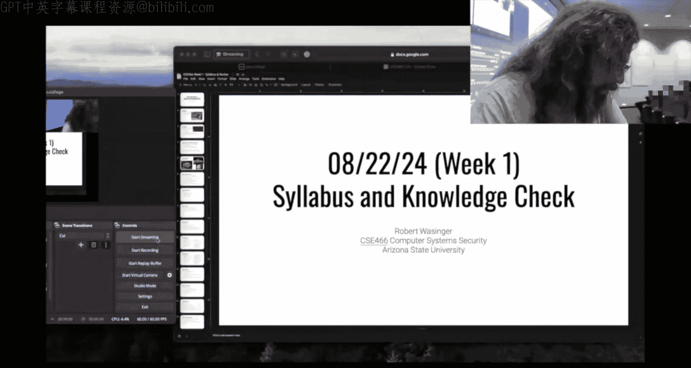

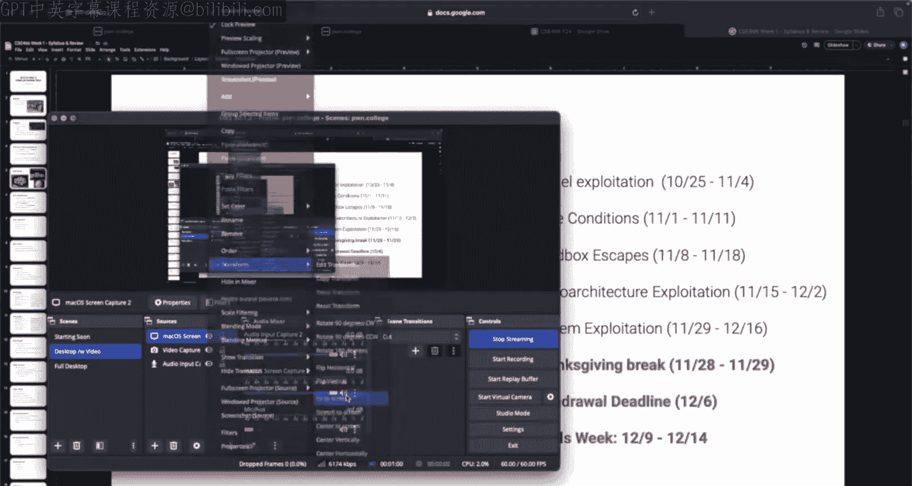

---

## 🔄 课程结构与运行模式

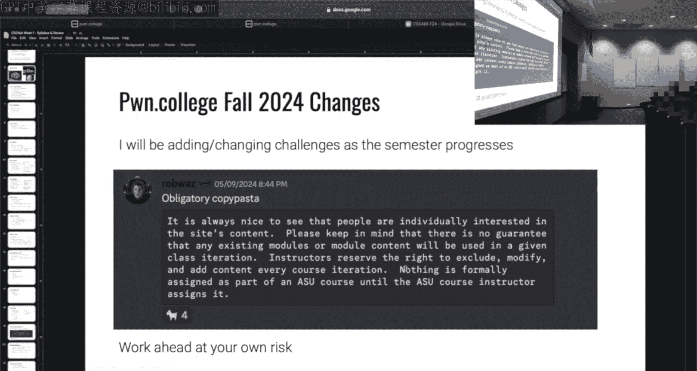

课程采用“翻转课堂”模式，运行在Pwn.College平台上。

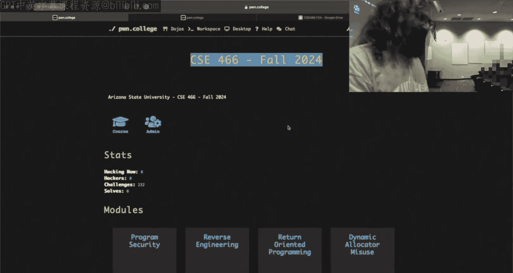

**每周流程如下：**
1.  **周五**：新模块的内容在Pwn.College上线。内容包括录播讲座视频和一系列挑战题目（每个模块约30个）。
2.  **周末与下周**：你的任务是观看讲座视频，并尝试解决挑战。**不要求**你全部完成。
3.  **课堂时间（周二/周四）**：课堂时间用于解答疑问。请带着你在学习过程中遇到的问题来上课，我会通过现场演示等方式帮助你解决。

课程是混合模式，有周二和周四两个班次。内容不会重复，但你可以参加任意一节。课程也会在Twitch直播，并稍后上传至YouTube。

---

## 📅 课程模块与时间表

课程包含约10个模块。以下是计划中的模块主题与大致时间安排：

| 模块主题 | 发布日期 | 截止日期 |
| :--- | :--- | :--- |
| 程序安全 | 2024-08-27 | 2024-09-09 |
| 逆向工程 | 2024-09-06 | 2024-09-23 |
| 高级逆向工程 | 2024-09-13 | 2024-09-30 |
| ROP利用 | 2024-09-20 | 2024-10-07 |
| 堆利用 | 2024-09-27 | 2024-10-14 |
| 内核利用 | 2024-10-04 | 2024-10-21 |
| 竞争条件 | 2024-10-18 | 2024-11-04 |
| 沙盒逃逸 | 2024-10-25 | 2024-11-11 |
| 微架构利用 | 2024-11-01 | 2024-11-18 |
| 系统利用 | 2024-11-15 | 2024-12-02 |

**请注意：**
*   模块之间有重叠，新模块会在旧模块截止前发布，给你充足的时间（通常包含两个周末）。
*   截止日期是严格的。
*   **所有挑战在截止后仍可提交，但只能获得50%的分数**，直到学期结束（2024-12-16）。

---

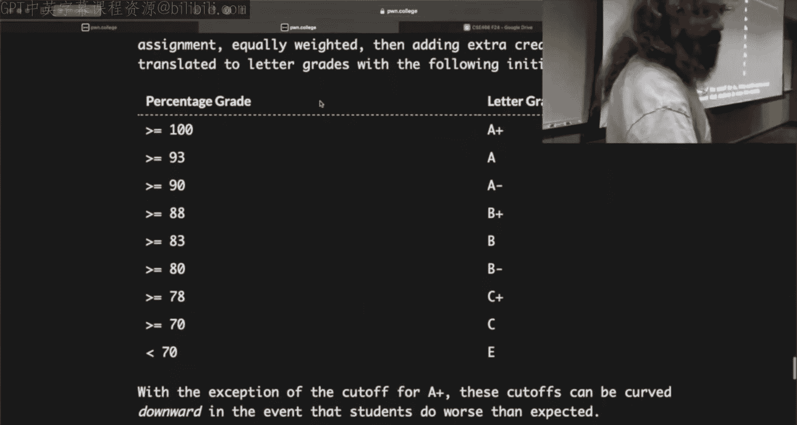

## 📊 评分细则

课程没有考试，成绩完全基于模块挑战的完成情况。

**单个模块的分数构成如下：**
*   **挑战完成度（80%）**：计算公式为 `（完成的挑战数 / 总挑战数） * 80%`。
*   **早鸟检查点（20%）**：在模块的“检查点”日期前完成至少50%的挑战，即可获得这20%的分数。这是为了鼓励你尽早开始。

**课程总评分为所有模块的平均分。**

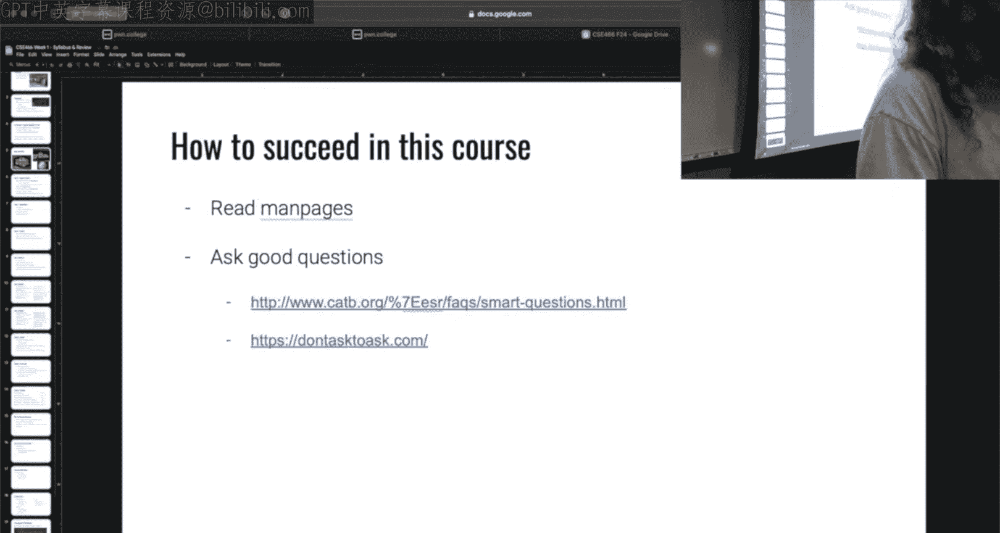

---

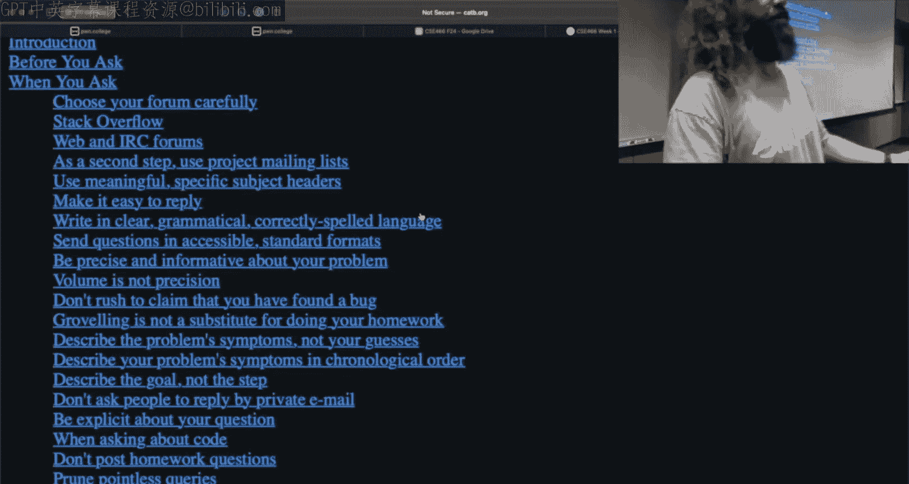

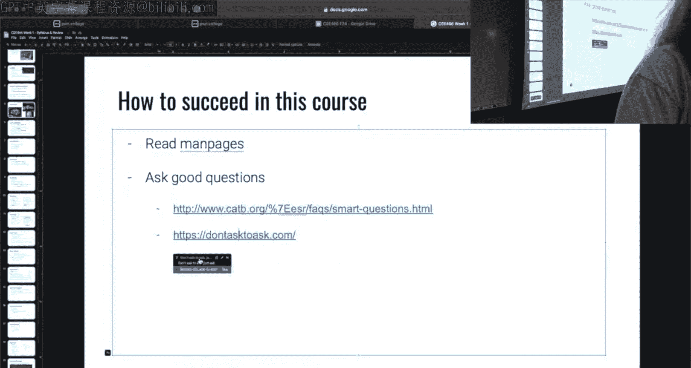

## 🎁 额外学分

为了帮助你通过课程，提供了丰厚的额外学分机会：

1.  **Discord Meme（8%）**：每周在课程Discord频道发布与网络安全或课程内容相关的有趣内容（Meme）。如果Pwn.College机器人或其他讲师点赞了你的帖子，你就能获得0.5%的课程额外学分，16周总计8%。
2.  **Discord互助（5%）**：在Discord上帮助其他同学解答问题。当其他同学通过“Apps > Thanks”功能感谢你的帮助时，你会获得积分。积分按对数曲线计算，上限为5%。

**重要提示**：Discord的历史记录将被清理，以鼓励实时互动和互助，而不是搜索旧答案。

---

## 🏆 成功策略与成绩模拟

结合评分规则和额外学分，以下是几种可能的情况：

*   **情况A**：完成每个模块的 **49%**，无额外学分。总成绩约为 **39.2%**（不及格）。
*   **情况B**：完成每个模块的 **50%**，并获得了早鸟检查点分数，无额外学分。总成绩约为 **60%**（D）。
*   **情况C**：完成每个模块的 **50%**，获得早鸟检查点，并获得全部13%额外学分。总成绩约为 **73%**（C）。
*   **情况D**：完成每个模块的 **75%**，获得早鸟检查点，并获得全部额外学分。总成绩约为 **88%**（B+）。
*   **情况E**：完成每个模块的 **84%**，获得早鸟检查点，并获得全部额外学分。总成绩约为 **97%**（A+）。

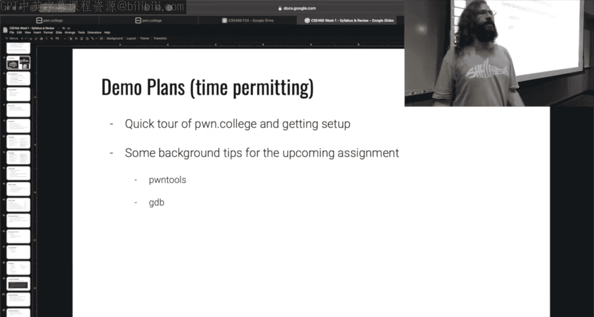

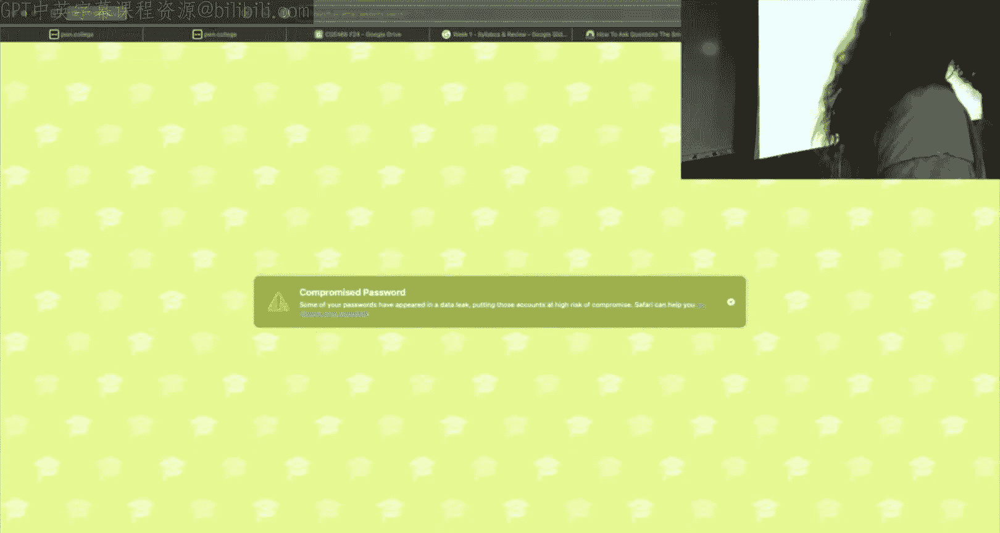

**关键策略总结：**
1.  **尽早开始**：这是获得早鸟检查点20%分数的关键。
2.  **积极参与Discord**：这是获取额外学分的主要途径。
3.  **遇到问题及时提问**：利用课堂时间和Discord获取帮助。

---

## ❓ 如何有效提问

在Discord或课堂上提问是学习的重要部分。请遵循以下原则：

*   **不要问“能不能问”**：直接提出你的具体问题。
*   **提供上下文**：不要只说“挑战5不工作”。请说明你尝试了什么、看到了什么错误信息、查阅了哪些手册页（`man`）。
*   **不要公开粘贴解题代码**。
*   推荐阅读文章《[提问的智慧](http://www.catb.org/~esr/faqs/smart-questions.html)》，学习如何提出有效的技术问题。

---

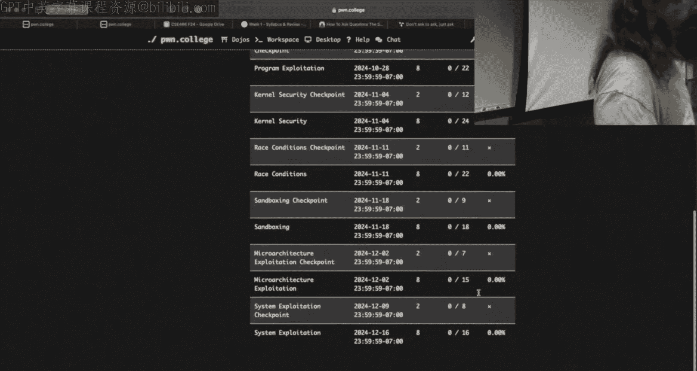

## 🛠️ 支持资源

*   **讲师（Robert）**：邮箱 `Al.Wasinger@asu.edu`，Discord用户名 `RobWz`。计划在周五中午开设线上/线下混合的办公时间。
*   **助教**：三位研究生助教将在周一、周三、周五的课堂时间于BYENG 209提供线下帮助。
*   **Pwn.College平台**：所有课程资料、挑战和成绩都在此平台。你需要：
    1.  在 [pwn.college](https://pwn.college) 注册账号。
    2.  在设置中关联你的ASU学生ID和Discord账号，以解锁课程专属频道和角色。
    3.  通过课程页面（CSE 466 Fall 2024）访问材料，而不是公共的“道场”模块，因为内容可能不同。
*   **挑战环境**：每个挑战都提供一个在线的VS Code工作区或完整的桌面环境。你也可以通过SSH连接到挑战环境（用户名 `hacker`）。

---

## 🎯 课程目标示例

为了让你对课程最终目标有所了解，这里有一个来自课程后期“系统利用”模块的挑战示例：

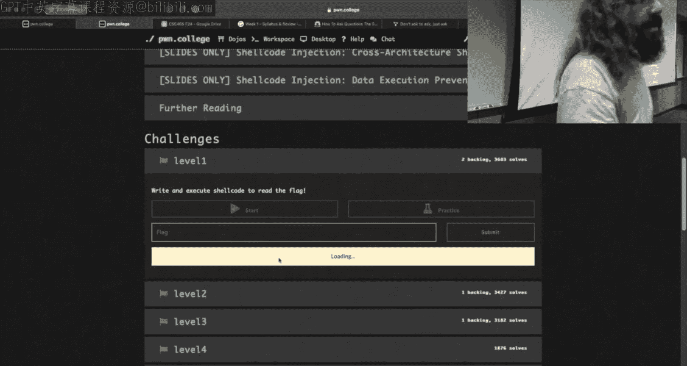

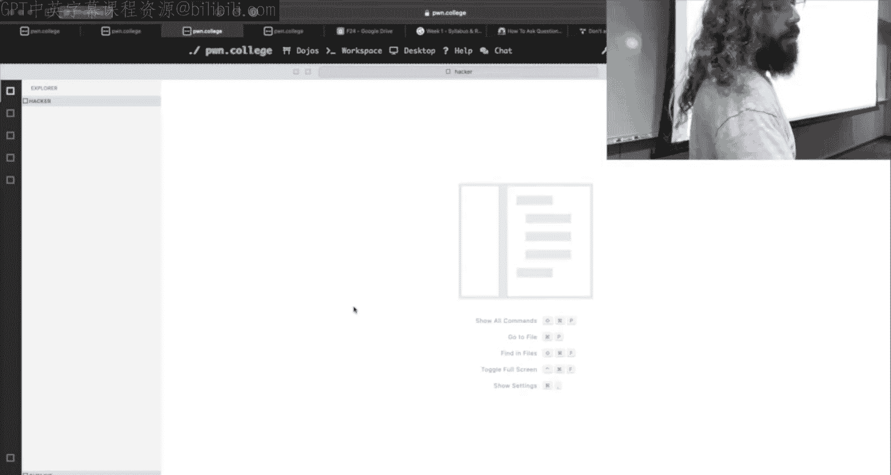

**挑战环境包含：**
1.  一个Linux虚拟机（VM）。
2.  一个内核模块（`.ko`文件）。
3.  一个设置了SUID权限的用户态二进制文件。

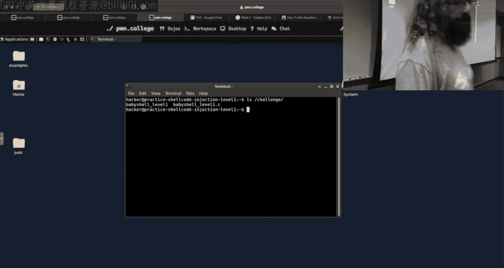

**你的目标**：读取一个只有`root`用户才能访问的`flag`文件。

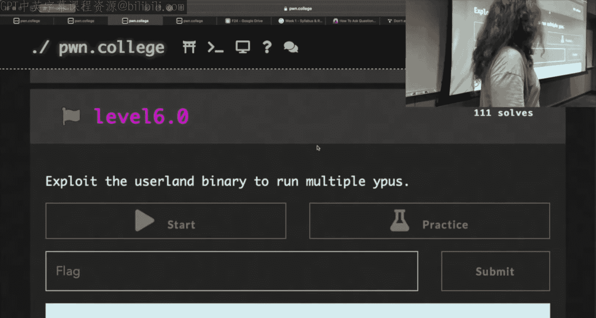

**可能的思路**：
*   分析SUID二进制文件，尝试利用其漏洞获得`root`权限。
*   或者，通过该二进制文件与内核模块暴露的设备进行交互。
*   寻找内核模块中的漏洞，在内核态执行代码，再返回用户态读取`flag`。

这听起来复杂，但通过整个学期的循序渐进的学习，你将有能力解决此类问题。

---

## 📝 总结

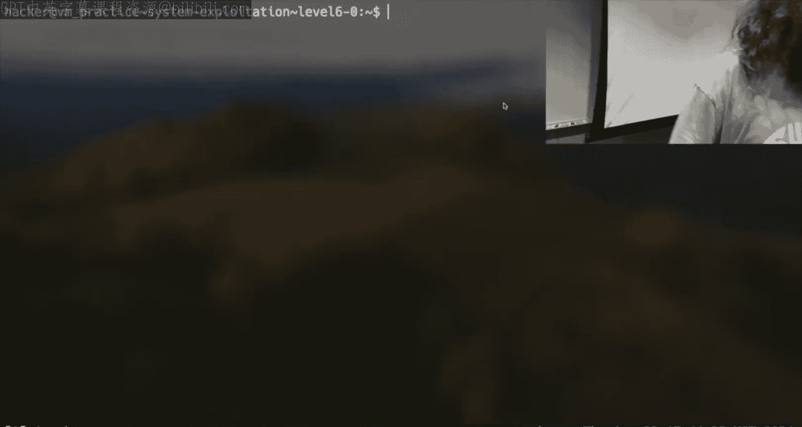

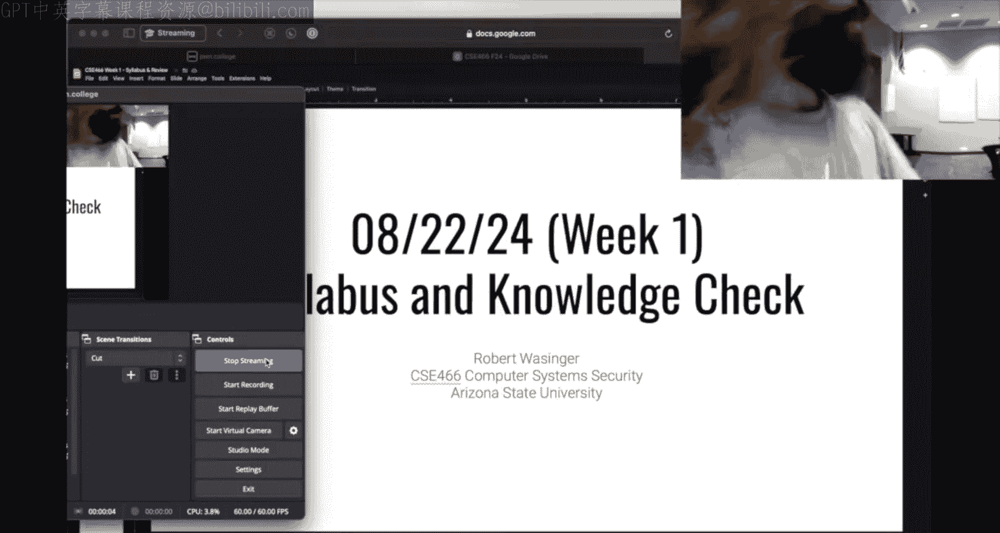

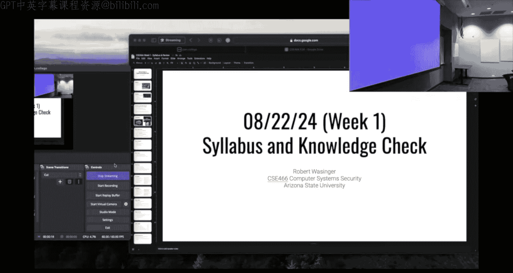

本节课我们一起学习了CSE 466《计算机系统安全》的课程框架。我们了解了课程的挑战性、翻转课堂的运行模式、严格的评分标准以及通过额外学分和早鸟检查点来平衡难度的策略。记住成功的关键是：**尽早开始、积极利用Discord社区、遇到困难时清晰有效地提问**。下节课，我们将正式进入第一个技术模块——“程序安全”的学习。