# 2：课程介绍与教学大纲详解 🎓

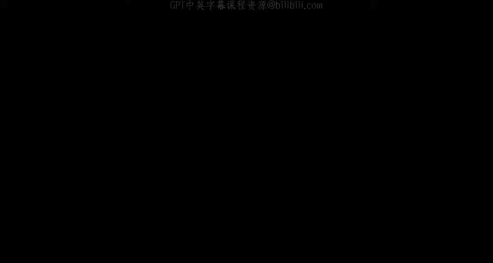

在本节课中，我们将学习CSE466《计算机系统安全》课程的整体结构、学习目标、评分方式以及成功完成课程的关键策略。本节内容是对开学第一周内容的快速回顾和补充说明，旨在帮助大家明确课程要求并顺利开始学习。

---

## 课程基本信息与期望 📋

上一节我们介绍了课程的基本情况，本节中我们来看看对学生的具体技能期望。

我的名字是Robert Walsinger，我将是你们的讲师。我是ASU网络安全实验室SeFcom的博士生。如果你对网络安全研究感兴趣，可以随时联系我。

如果你在这门课上，我们对你的知识背景有一些基本假设。这些技能大部分应该在CSE365课程中学过。这门课程将建立在CSE365中教授的Linux二进制漏洞利用概念之上。

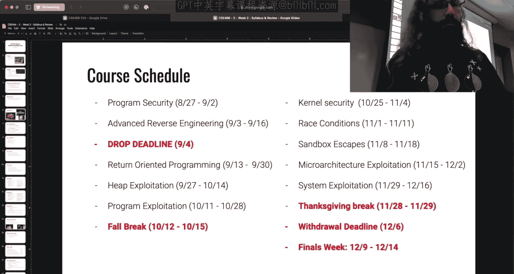

以下是期望你具备的技能：
*   **熟悉Linux工具**：不畏惧终端，至少能执行一些基本命令。
*   **熟悉常见的逆向工程工具**：知道如何使用GDB、IDA、Ghidra、Binary Ninja等工具之一。
*   **理解x86汇编**：本课程几乎不提供任何源代码。所有挑战和作业都是直接提供原始二进制文件，需要你通过逆向工程工具解读汇编代码来开始。
*   **具备独立研究和解决问题的能力**：知道如何查阅Linux系统调用手册（man page）或研究库函数的功能。当答案在手册页中时，我可能会直接让你去查阅。

这门课程非常具有挑战性。在我本科第一次开设时，退课率高达60%。课程节奏快，内容密集，需要投入大量时间。如果你同时选修了其他高要求的课程，可能需要慎重考虑。

## 课程价值与激励 🏆

既然课程如此艰难，为什么还要选修呢？

如果你对网络安全感兴趣，这是必选的课程。即使你对网络安全毫无兴趣，但想了解计算机的实际工作原理，这门课也极具价值。你在本课程中学到的技能，虽然我们可能将其用于漏洞利用，但作为通用计算机科学程序员，这些技能在理解程序行为、工作原理以及排查问题时具有无限的力量。

我们还会用一些“闪亮的奖励”来激励大家。课程运行在Pwn College平台上，完成平台上所有材料（不一定是课程内的所有内容）的学生将获得“腰带”作为成就认证。在上个月的DEF CON大会上，我们就在现场为完成者颁发了腰带。我们还有闪亮的纪念币。

## 课程运作模式 🔄

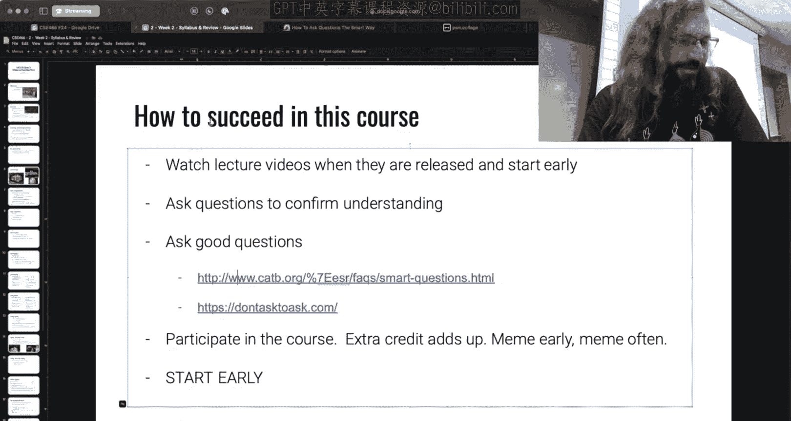

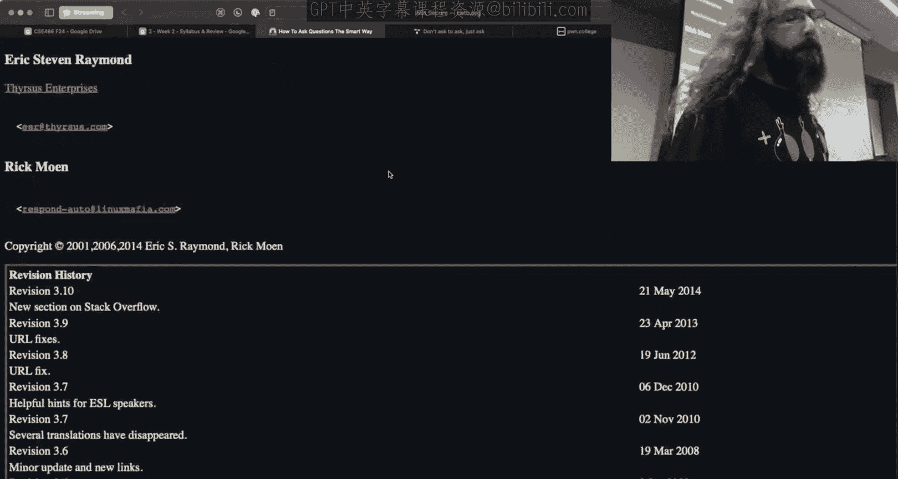

上一节我们了解了课程的难度和价值，本节中我们来看看课程是如何具体运行的。

这门课采用“翻转课堂”模式。以下是具体流程：

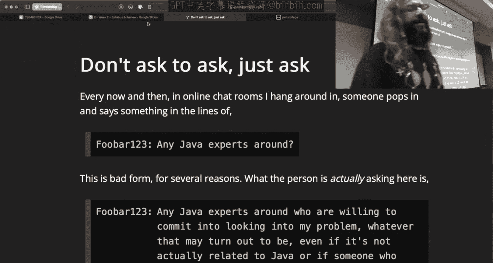

*   **模块发布**：模块通常在周五晚上6点左右发布。每个模块包含几个预先录制的讲座视频和一系列难度递增的挑战（目标约30个）。
*   **课前准备**：你需要在周末（周五到周一）观看视频并开始尝试解决挑战。不需要完全掌握所有视频内容，但需要开始动手实践。
*   **课堂互动**：周二和周四的课堂将完全以答疑和实时演示为主。我会根据你们在挑战中遇到的问题进行现场演示和讲解。课堂幻灯片将只有5-7页，主要内容是你们提出的问题和我计划演示的内容。
*   **课程形式**：周二和周四的课程被列为混合课程，有线上和线下部分。从今天起，我将两个部分视为同一个班级。课程会在Twitch上直播，录像也会很快上传到YouTube。**出勤不是强制性的，但高度鼓励**，因为更多的现场互动能让课堂更有趣，我也能更及时地解答问题。
*   **考核方式**：**没有考试**。整个学期计划有10个模块，课程成绩是这些模块成绩的平均值。

## 学期安排与评分细则 📅

了解了课程模式后，我们来看看本学期的具体时间安排和详细的评分规则。

以下是暂定的学期安排（我会尽力严格遵守）：
*   **8月27日（今日课后）**：发布“程序安全”模块，截止日期为9月2日（周一）午夜（亚利桑那时间23:59:59）。
*   **后续模块**：涵盖高级逆向工程、ROP（面向返回的编程）、堆利用、程序利用（综合性挑战，类似期中考试）、内核安全、竞态条件、沙箱逃逸、微架构利用（如Spectre和Meltdown）、系统利用（综合性挑战，类似期末考试）。

一个模块的成绩由两部分组成：
1.  **挑战完成度（占80%）**：解决挑战的百分比。
2.  **早鸟检查点（占20%）**：在模块页面标注的检查点截止日期前，完成该模块一半的挑战。这是“全有或全无”的奖励，旨在鼓励大家尽早开始。

所有挑战在截止日期后仍可提交以获得50%的分数，直到学期结束。

## 额外学分与成功策略 💡

上一节我们介绍了核心评分方式，本节中我们来看看如何通过额外努力提升成绩，以及成功的策略。

我们提供相当可观的额外学分：
*   **发布表情包（占8%）**：在课程Discord的Memes频道，每发布一个被课程AI或任何Pwn College讲师点赞的表情包，可获得0.5%额外学分。每周最多一个，理想情况下应与课程内容相关。
*   **帮助他人（占5%）**：在Discord上帮助同学解答问题，获得他人的“感谢”。这是一个对数尺度，上限为50次感谢。

**总计可获得13%的额外学分。**

以下是不同完成度结合额外学分的成绩示例：
*   完成每个模块的49%，无额外学分：总成绩39.2%（不及格）。
*   完成每个模块的50%，并达到早鸟检查点，无额外学分：总成绩60%（D）。
*   完成每个模块的50%，达到早鸟检查点，并获得全部13%额外学分：总成绩73%（C）。
*   完成每个模块的75%，达到早鸟检查点，并获得全部额外学分：总成绩93%（A）。

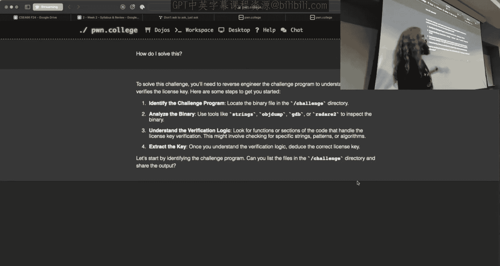

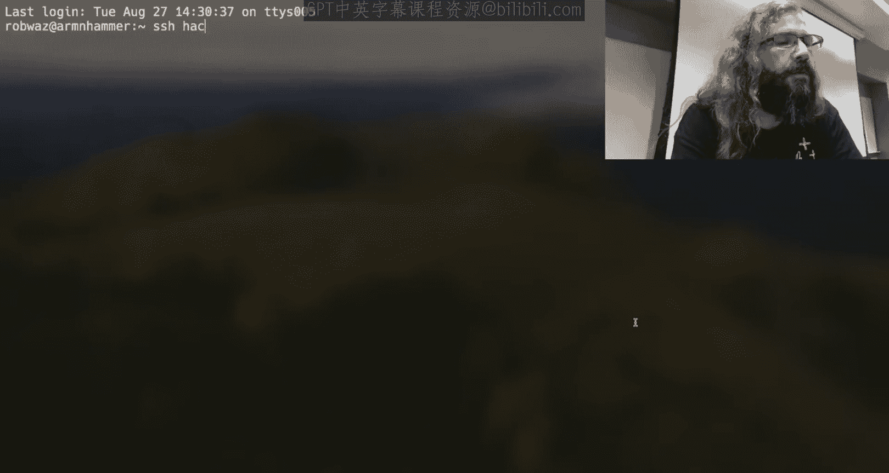

要获得A+，需要完成每个模块的84%，达到早鸟检查点，并获得全部额外学分。完成平台上所有材料（腰带材料）的学生将获得Pwn College腰带，这是一个全球范围内的高荣誉。

## 沟通、工具与学术诚信 💬

最后，我们来了解课程沟通渠道、所需工具以及重要的学术诚信规定。

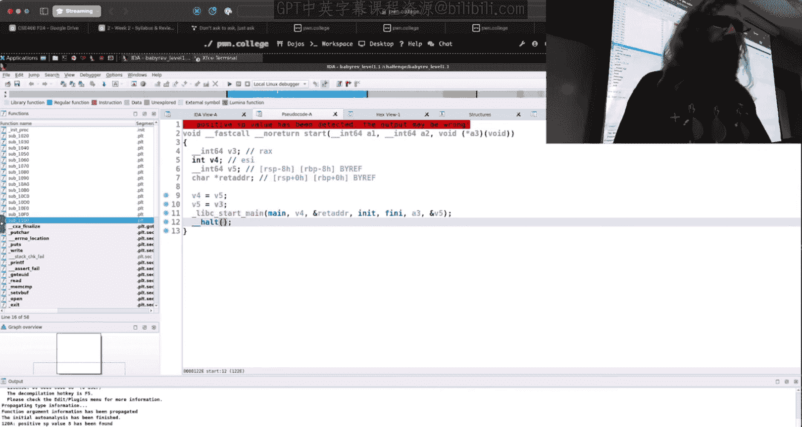

**沟通与帮助**：
*   **主要沟通平台**：Discord（我的账号是RobWz）。尽量避免私信，除非事态紧急。
*   **邮件**：如有正式事务，可联系 `rwalsinger@asu.edu`。
*   **办公时间**：研究生助教（TA）的办公时间为周一、三、五的16:30-17:20，地点在BYENG 209。我个人的办公时间待定，可能会安排在周五中午。
*   **提问的艺术**：在Discord提问时，请提供详细的技术背景。避免类似“第二关卡住了”这样模糊的问题。可以参考《How To Ask Questions The Smart Way》和《Don‘t Ask To Ask》这两篇文章来提升提问技巧。

**工具与环境**：
*   **平台**：所有挑战都在Pwn College平台上完成。你可以通过SSH终端、基于浏览器的VS Code或完整的Linux桌面环境来访问挑战环境。
*   **核心工具**：**GDB调试器**将是课程中几乎每天都会用到的关键工具。你还需要熟悉一种反汇编工具（如IDA、Ghidra）。
*   **生成式AI**：平台内置了AI助手，可以基于你的终端上下文提供帮助。**允许使用生成式AI**，包括第三方工具。但请注意，复杂的漏洞利用问题AI可能无法直接解决。平台会记录所有与内置AI的交互。如果大量学生提交完全相同的由第三方AI生成的代码，可能会引发学术诚信审查。

**学术诚信**：
*   请勿作弊。平台服务器记录所有行为。
*   目标是增进理解，而非惩罚。我会假定善意，但如果越界，我会进行提醒。
*   在Discord上分享问题细节时，请运用你的判断力。如果分享过多，我会私下联系你并删除消息。

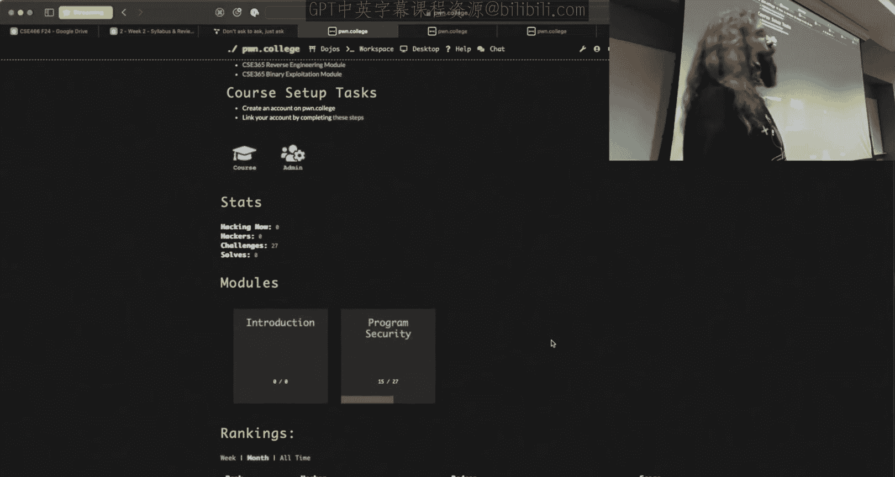

**工作量提示**：
*   试图100%完成所有内容的学生，每周投入30-40小时是现实的。
*   仅以通过为目标，可能也需要一半的时间。
*   这是一门要求极高的课程，请做好心理准备。

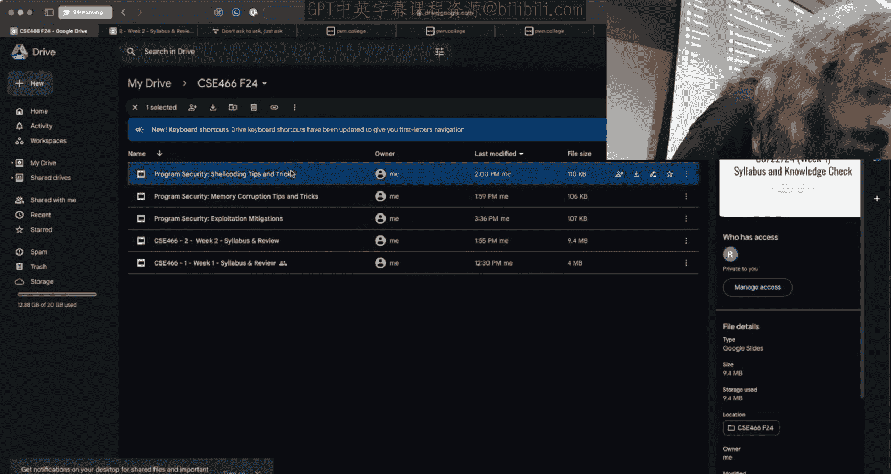

**初始设置**：
课程开始后，请访问Pwn College网站，注册账号，找到“CSE 466 Fall 2024”课程，点击“Setup”链接，并完成其中的五个步骤以同步你的ASU学生信息并加入课程专属Discord频道。

---

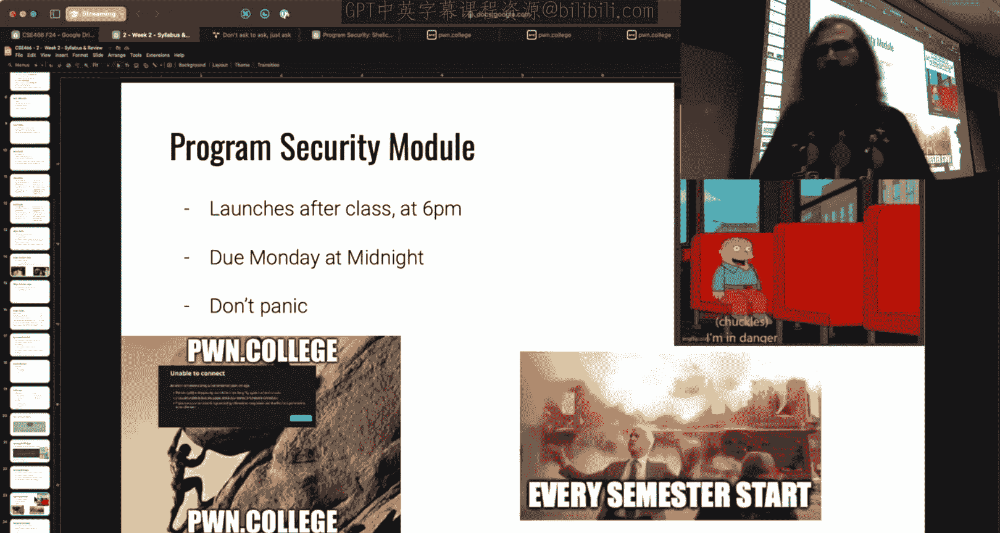

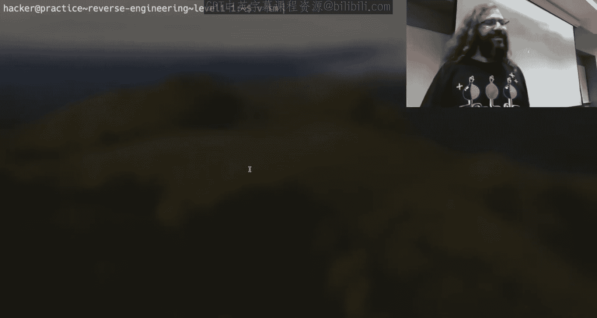

本节课中我们一起学习了CSE466《计算机系统安全》课程的总体框架、高强度的学习预期、翻转课堂的运作模式、具体的评分标准（包括早鸟检查点和额外学分）、成功的学习策略以及重要的沟通与学术诚信准则。请记住，**尽早开始、积极参与、勤于提问**是应对这门挑战性课程的关键。第一个模块即将发布，祝大家好运！