# 5：第05-06讲 - 逆向工程

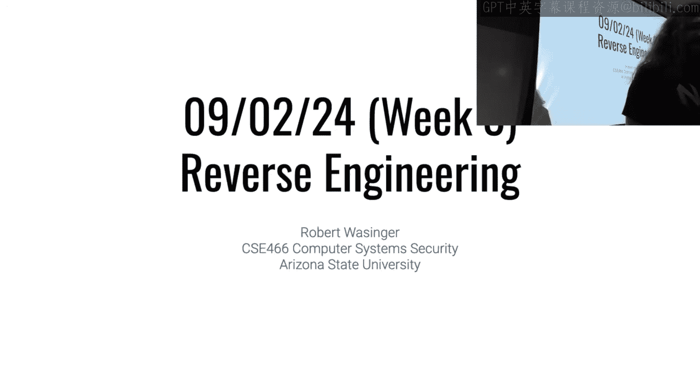

## 概述
在本节课中，我们将要学习逆向工程的基础概念、工具使用以及如何分析一个模拟器程序。课程内容涵盖了对上一模块的回顾、逆向工程模块的介绍，以及通过一个8086模拟器实例来讲解逆向分析的基本方法。

---

## 上一模块回顾与成绩分析
上一节我们介绍了缓冲区溢出、栈金丝雀（Canary）和地址空间布局随机化（ASLR）等概念。本节中，我们来看看大家在第一个模块中的表现，并讨论一些常见问题的解决方案。

以下是第一个模块的成绩分布概况：
*   班级平均分（含未参与者）约为54%。
*   排除未解决任何挑战的学生后，平均分约为64%。
*   排除解决少于3个挑战的学生后，平均分约为77%。

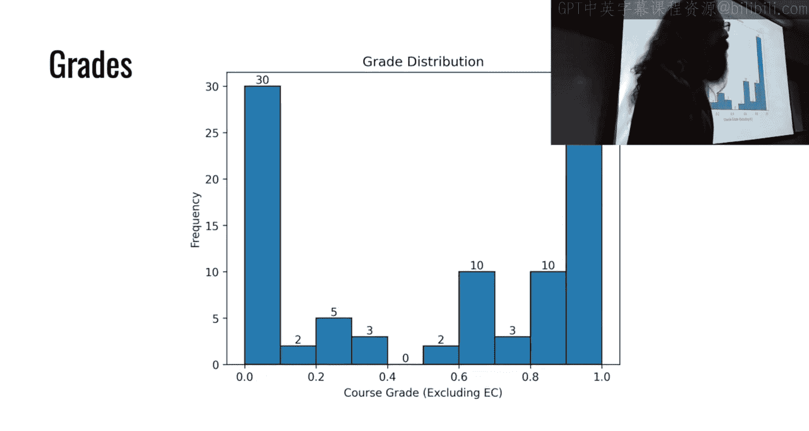

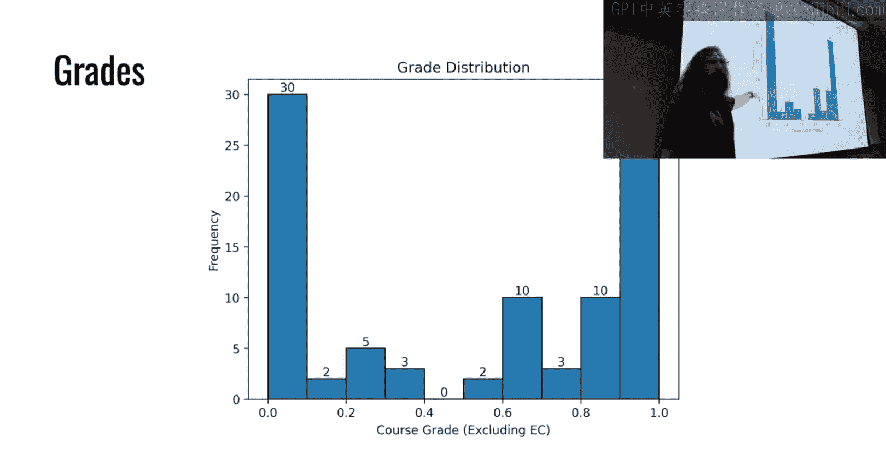

成绩分布呈U型，表明学生在掌握先修知识方面存在明显差异。本课程进度较快，内容具有累积性，因此尽早开始并投入时间至关重要。

---

## 逆向工程模块介绍
上一节我们回顾了内存安全相关概念，本节中我们来看看即将开始的逆向工程模块。这通常是课程中最具挑战性的模块之一。

该模块将围绕一个名为 **Yan85** 的虚构CPU架构展开。Yan85是一个模拟器，它用软件实现了一个自定义指令集的CPU。你的任务是逆向分析这些运行Yan85代码的程序。

**核心概念**：模拟器是在软件中模拟硬件功能的程序。例如，一个CPU模拟器会在内存中维护寄存器状态，并解释执行目标架构的指令。

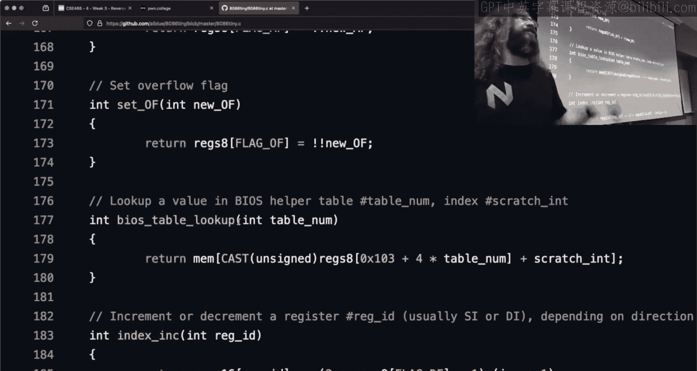

---

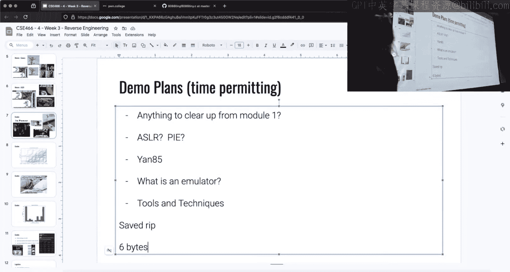

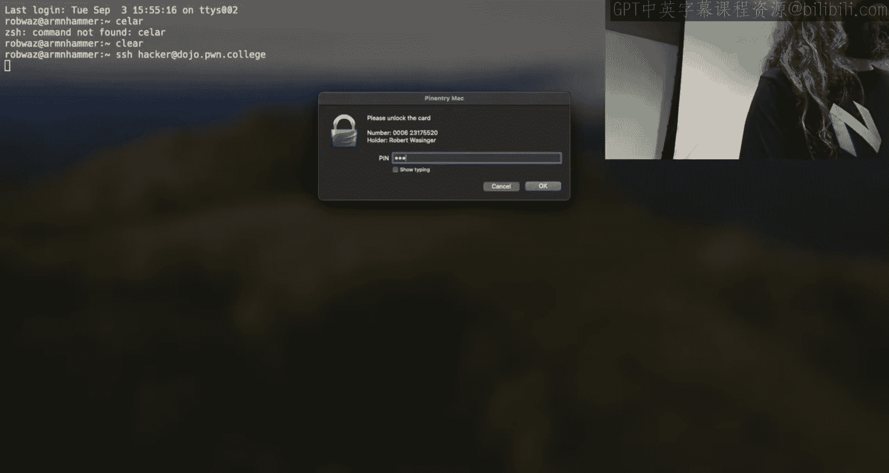

## 逆向工程工具与策略
在开始分析具体目标之前，我们需要了解并选择合适的工具。高效的逆向工程依赖于强大的工具和正确的策略。

以下是推荐的逆向工程工具：
*   **IDA Pro**：功能强大的反汇编器和反编译器，能生成易于理解的类C伪代码。
*   **GDB**：动态调试器，用于运行时分析程序行为。
*   **Binary Ninja / Ghidra**：其他优秀的反汇编和反编译工具。

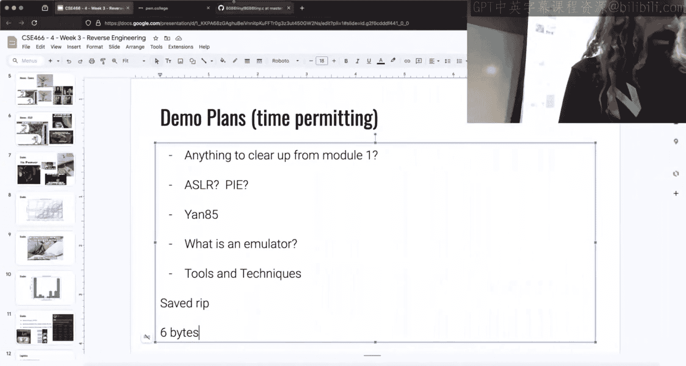

**核心策略**：对于Yan85挑战，建议采用“模式识别”和“由简入繁”的策略。首先仔细分析带有符号信息的 `.0` 挑战，理解程序结构和Yan85指令集的大致逻辑，然后将这些模式应用到无符号的 `.1` 挑战中。

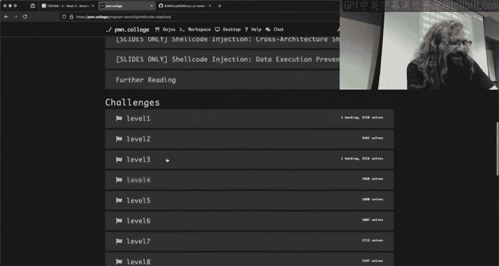

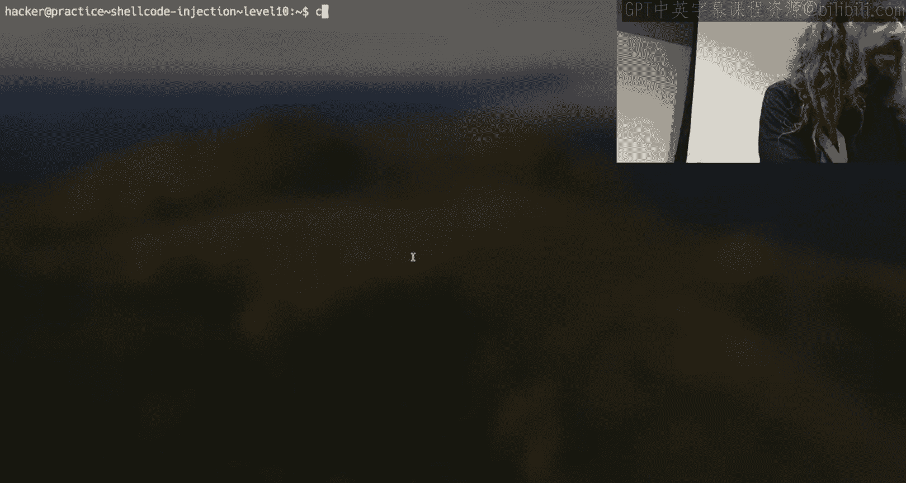

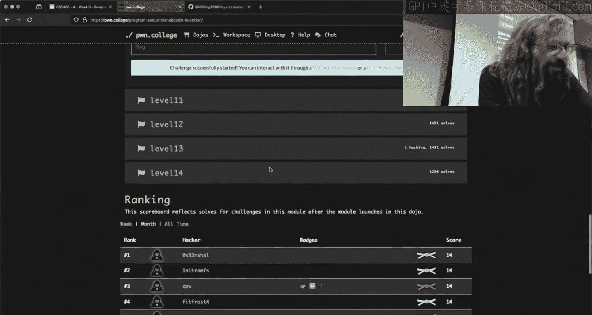

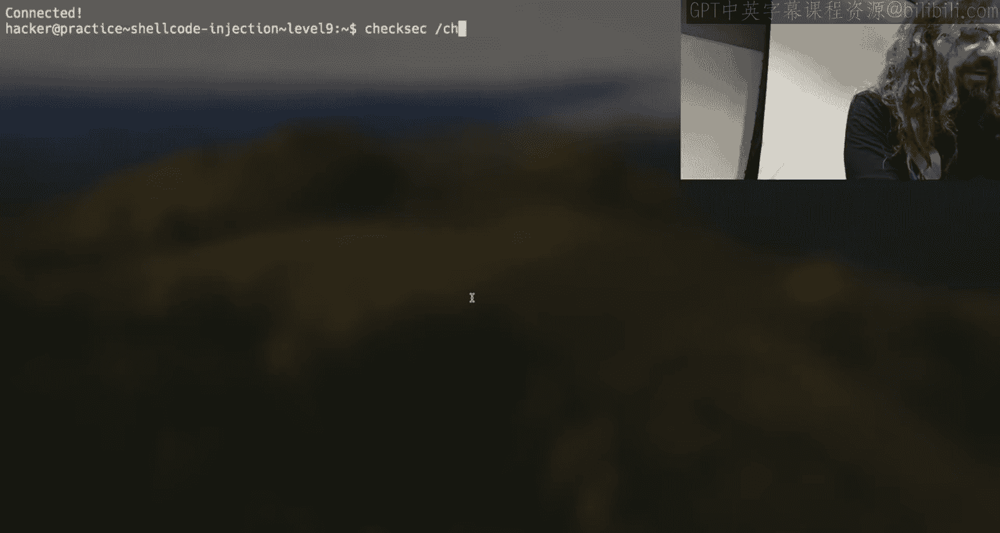

---

## 通过实例学习：分析8086模拟器
为了让大家对分析模拟器有一个直观的认识，我们以一个简单的8086模拟器为例。虽然它与Yan85不同，但核心思想相似。

我们使用IDA打开这个模拟器程序。初始视图是汇编代码，按下 `Tab` 键可以切换到反编译的伪代码视图。伪代码更易于理解高级逻辑。

**关键步骤**：
1.  **定位入口点**：程序通常从 `main` 函数开始执行。
2.  **识别关键函数**：寻找像 `interpret`、`execute` 或 `run` 这样的函数，它们通常是模拟器的核心执行循环。
3.  **理解数据结构**：在伪代码中查找代表模拟CPU寄存器、内存等的数据结构。
4.  **交叉引用**：使用IDA的交叉引用功能（快捷键 `X`）查看某个函数或变量在何处被调用或使用。

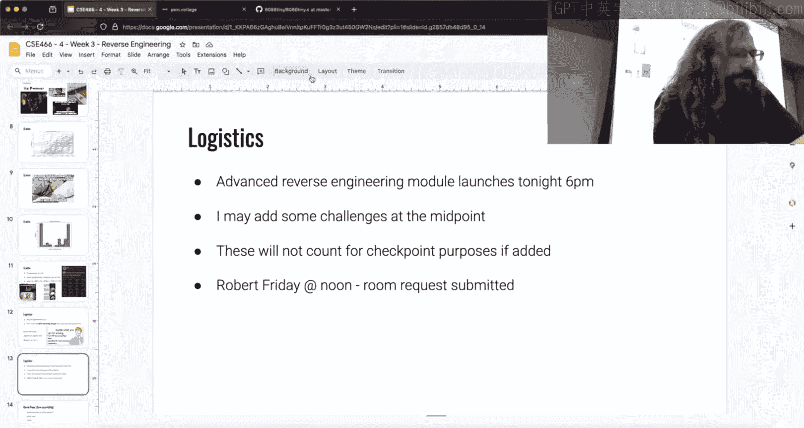

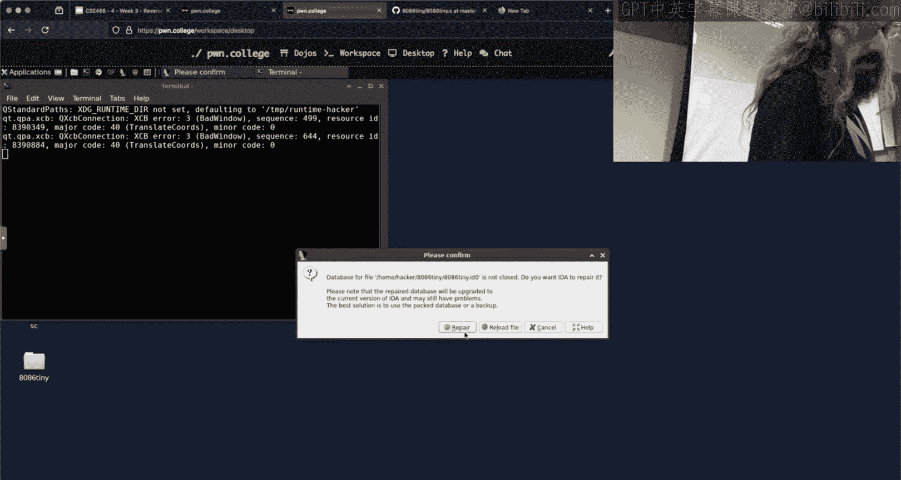

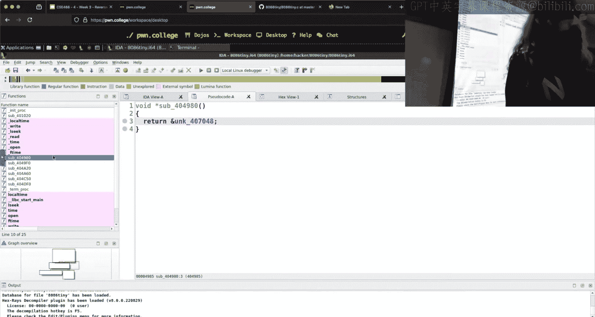

在分析Yan85挑战时，你会看到类似的结构：一个主循环读取Yan85指令字节，根据编码查找对应的处理函数（如处理 `ADD`、`MOV`、`IMM` 等指令），然后更新模拟的寄存器状态。

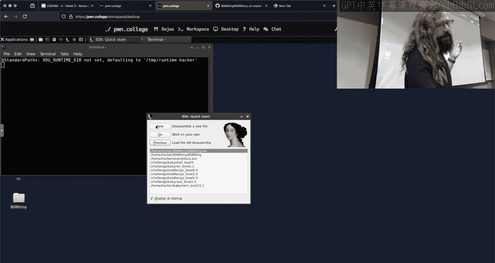

---

## 常见问题解答（Q&A）
在课程最后，我们针对学生提出的一些具体问题进行了解答。

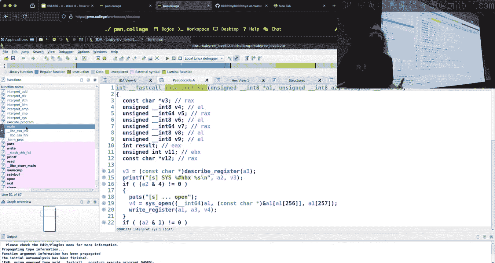

**关于栈金丝雀（Canary）**：
*   **如何定位**：在GDB中，使用 `info frame` 命令可以查看当前栈帧信息，其中包含保存的 `RBP` 和 `RIP` 地址。金丝雀值通常位于保存的 `RBP` 之前。其特征是值看起来随机，且最低有效字节常为 `\x00`。
*   **如何绕过**：某些挑战提供了“后门”函数，允许递归调用自身。如果在一次调用中覆盖了金丝雀，但通过后门递归而非正常返回，则不会立即触发金丝雀检查，这为完成利用提供了窗口。

**关于模块挑战**：
*   **`.0` 和 `.1` 挑战的区别**：`.0` 挑战保留了符号信息（函数名、变量名），更易于分析，是学习模式的最佳起点。`.1` 挑战剥离了符号，是真正的“逆向”目标。
*   **目标是什么**：前期挑战通常是“crackme”，即需要你输入特定字符串通过验证。后期挑战可能要求你提供Yan85字节码，使模拟器执行特定操作（如调用 `read`/`write`）。
*   **编码是否一致**：Yan85的指令**语义**（如 `ADD` 是加法）在整个模块中一致，但指令的**字节编码**在每个挑战中都是随机化的，需要你从当前二进制文件中逆向得出。

**关于课程安排**：
*   **补做旧挑战**：在学期结束前，任何未完成的挑战都可以以50%的权重补交。但从时间效率看，优先完成当前模块的挑战（尤其是检查点之前的部分）对总成绩更有利。

---

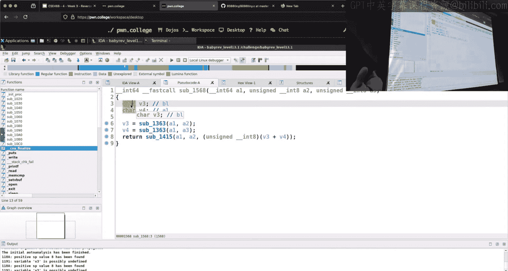

## 总结
本节课中我们一起学习了逆向工程模块的概况。我们回顾了上一模块的成绩，介绍了逆向工程的基本概念和将要用到的Yan85模拟器，探讨了使用IDA等工具进行分析的策略，并通过一个8086模拟器的例子进行了演示。逆向工程的核心在于**模式识别**和**逻辑推理**。请务必从带有符号的 `.0` 挑战开始，花时间理解其结构，这将为后续挑战打下坚实基础。