# 6：逆向工程工具与实战技巧

在本节课中，我们将学习逆向工程模块的核心工具、实战技巧以及如何高效地处理二进制数据。我们将重点介绍几种主流反编译工具、编写汇编器/反汇编器的思路，以及使用GDB进行动态分析的实用方法。

## 工具选择与比较

上一节我们介绍了逆向工程的基本概念，本节中我们来看看完成这些挑战时可以选择哪些工具。每种工具都有其优缺点，了解它们能帮助你根据场景做出最佳选择。

以下是几种主流反编译工具的对比：


*   **IDA Pro**
    *   **优点**：业界黄金标准，通常能生成最清晰、最易读的伪C代码（按`Tab`键在汇编与C视图间切换）。
    *   **缺点**：
        *   免费版使用云端反编译器，在截止日期前可能因请求过多而超时。
        *   商业版价格昂贵，主要面向企业用户。
*   **Ghidra**
    *   **优点**：
        *   由NSA开发，开源免费。
        *   基于Java，跨平台体验一致。
        *   反编译在本地进行，无云端限制。
        *   插件生态丰富，可扩展性强。
    *   **缺点**：界面为并排显示（汇编与伪C代码分列），工作流与IDA不同。
*   **Binary Ninja**
    *   **优点**：
        *   界面现代美观。
        *   具有强大的脚本和插件API，适合编程式分析。
        *   商业版定价对个人用户更友好。
    *   **缺点**：同样是商业软件。
*   **angr management**
    *   **优点**：
        *   集成了`angr`框架，支持符号执行等高级分析。
        *   由ASU的SEFCOM实验室开发维护。
        *   免费开源。
    *   **缺点**：作为研究原型，可能不够稳定，功能处于前沿实验阶段。

## 处理非打印字符与字节操作

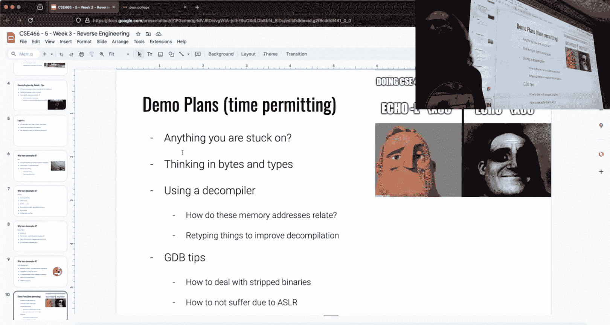


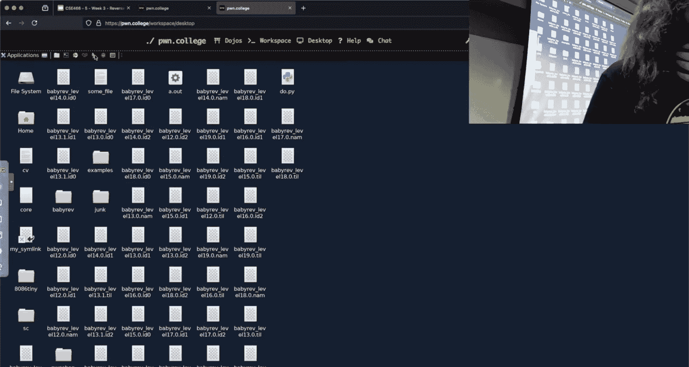


在使用工具进行静态分析后，我们常常需要与程序进行动态交互。一个常见难点是如何向程序输入无法直接通过键盘键入的字节（如空字节`0x00`）。


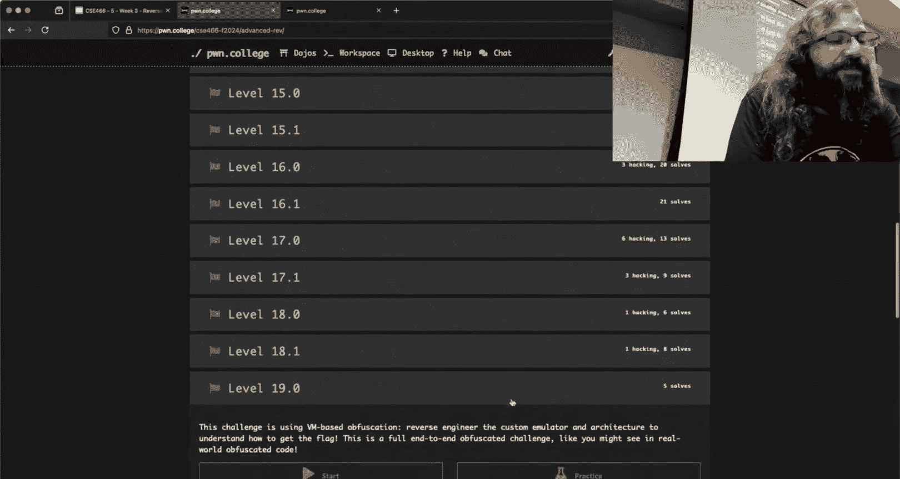

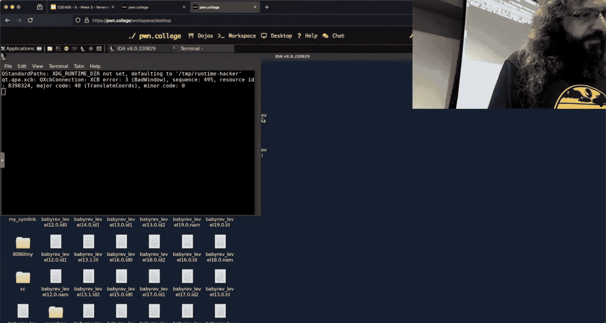

以下是几种输入原始字节的方法：

*   **推荐方法：使用`pwntools`（Python）**
    *   可以创建字节串（`bytes`）来精确控制输入。
    *   **示例代码**：
        ```python
        from pwn import *
        context.arch = 'amd64'
        p = process('./challenge')
        # 发送字节 0x01, 0x02, 0x03
        payload = b'\x01\x02\x03'
        p.send(payload)  # 使用 send 发送原始字节
        # p.sendline(payload)  # sendline 会在末尾添加换行符 \n
        ```
*   **不推荐：使用`echo`命令（Bash）**
    *   容易出错，例如默认会添加换行符。
    *   **示例**：`echo -ne '\x00\x01'` 可以发送两个字节，但需注意参数。
*   **绝对避免：使用不明确的在线计算器或工具**
    *   你无法确认这些工具底层的计算逻辑（如默认处理8字节字而非单字节），可能导致错误。

**核心概念**：字节是内存中的原始数据，类型（如整数、字符串）是我们赋予这些字节的解释方式。在逆向时，你需要根据程序如何使用这些字节（例如，是进行有符号还是无符号比较）来推断其“类型”。

## 编写汇编器/反汇编器


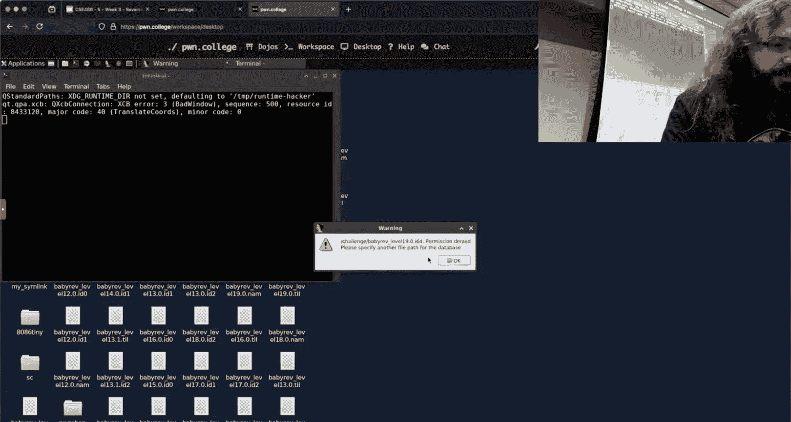

对于本模块中反复出现的`Yan85`虚拟机挑战，编写一个简单的汇编器或反汇编器能极大提升效率。其核心思想是建立映射关系。

*   **汇编器**：将人类可读的指令文本（如 `"add A B"`）映射成原始的`Yan85`操作码字节。
*   **反汇编器**：将原始的`Yan85`操作码字节映射回人类可读的文本。

**实现思路**：
1.  通过逆向分析`Yan85`解释器，找出操作码、寄存器与对应字节值的映射关系。
2.  使用Python字典存储这些映射。
    ```python
    opcode_map = {
        "IMM": b'\x40\x00\x00\x00',  # 假设的映射
        "ADD": b'\x40\x00\x00\x00',
        # ... 其他指令
    }
    register_map = {
        "A": b'\x01',
        "B": b'\x02',
        # ... 其他寄存器
    }
    ```
3.  编写解析函数，读取文本指令，查找映射表，拼接成最终的字节序列。
4.  反汇编器则实现相反的过程。

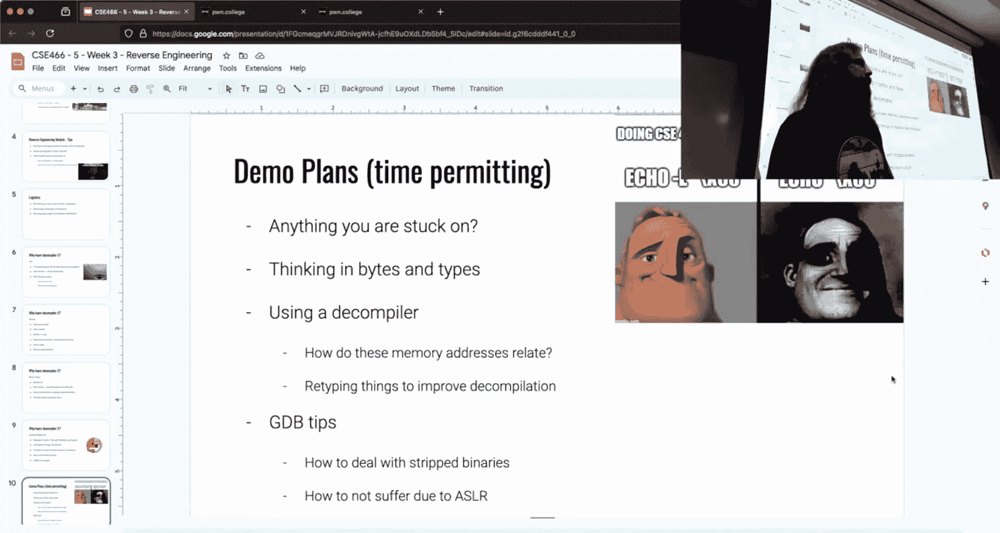


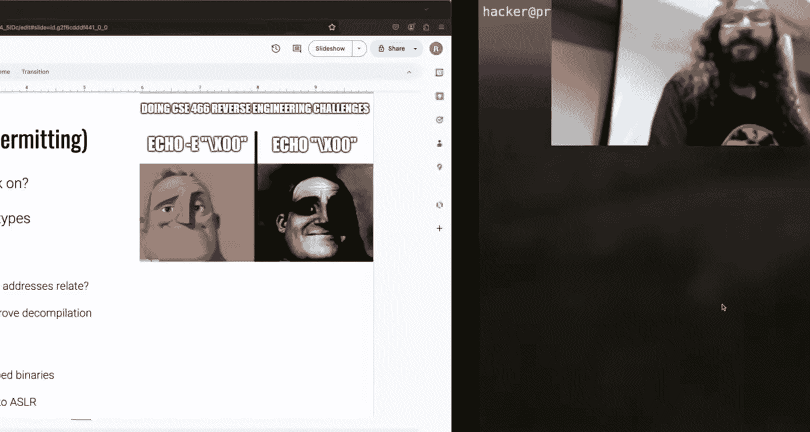


这样做的好处是，即使后续挑战中映射关系发生变化，你也只需更新字典中的值，而无需重新进行繁琐的手动转换。

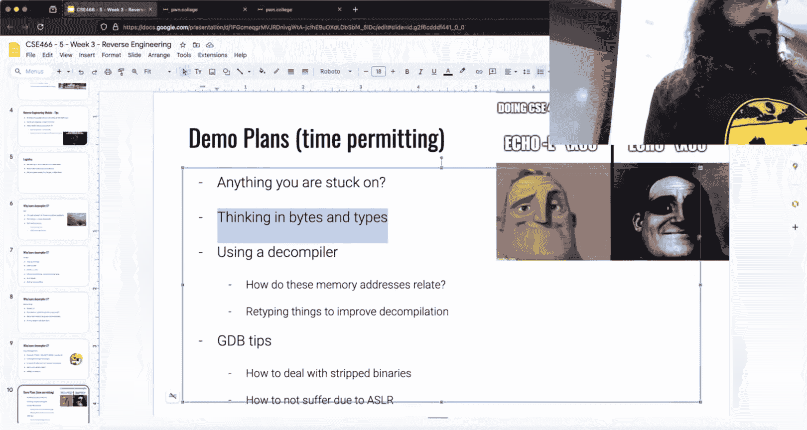


## 结合静态与动态分析：使用GDB调试

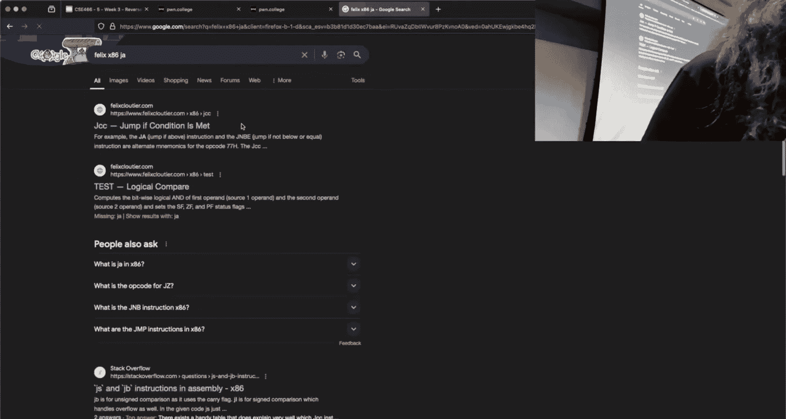


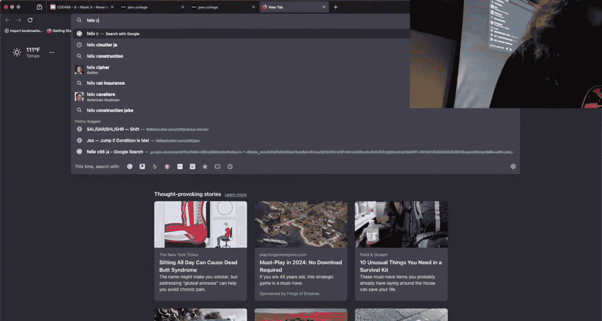

有时反编译器的输出可能不准确或难以理解。这时，结合GDB进行动态调试至关重要。

**挑战**：现代Linux系统启用ASLR，且挑战程序通常设置了`SUID`位，导致每次运行地址随机化，难以设置断点。


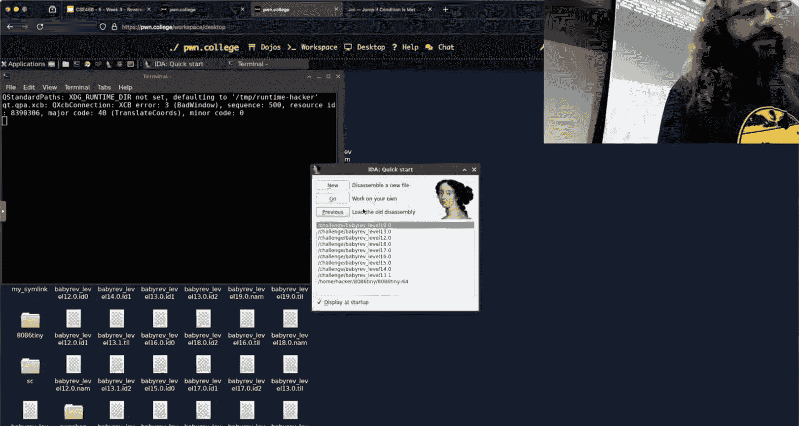


**解决方案**：
1.  **复制文件**：将挑战文件复制到临时位置（如`/tmp`），副本通常不再具有`SUID`属性。
    ```bash
    cp /path/to/challenge /tmp/my_challenge
    ```
2.  **获取加载基址**：在GDB中运行副本，使用`info proc mappings`或`vmmap`（如果安装了`pwndbg`/`gef`）找到ELF文件的加载基址（例如`0x555555554000`）。
3.  **设置`.gdbinit`**：在`~/.gdbinit`中添加一行，定义一个变量存储这个基址。
    ```
    set $base = 0x555555554000
    ```
4.  **计算断点地址**：在IDA/Ghidra中查看你感兴趣的指令的**文件偏移地址**（如`0x1BA7`）。在GDB中，断点地址为 `$base + 偏移`。
    ```gdb
    break *($base + 0x1BA7)
    run
    ```


这样，你就可以将静态分析中找到的关键位置，快速转换为GDB中可用的断点，进行精确的动态观察。

## 总结与额外信息

本节课中我们一起学习了逆向工程中的实用技能：比较了不同反编译工具的优劣，掌握了向程序输入原始字节的正确方法，理解了编写简易汇编器/反汇编器的思路，并学会了如何结合静态分析工具与GDB进行动态调试。

**额外机会**：ASU黑客俱乐部将组织面向本科生的CTF比赛。参与并认真尝试的同学可获得本课程**1%**的额外学分。详情请查看课程Discord公告。为方便大家参与，原定于下周一的检查点将推迟到与本模块截止日期相同。

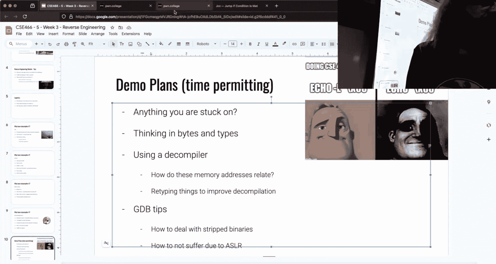

请记住，逆向工程是一项需要耐心和实践的技能。利用好这些工具和方法，你就能更有效地解开挑战。