# 7：第4周 - 逆向工程

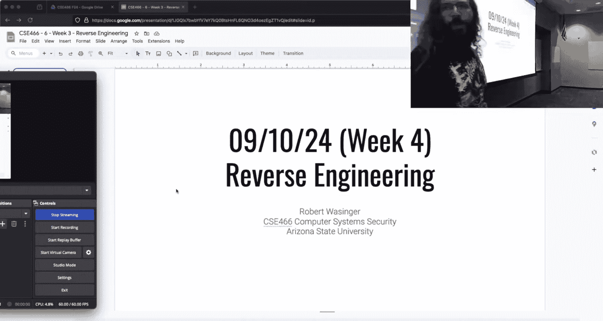


在本节课中，我们将学习如何利用GDB脚本和IDA Pro等工具，将没有符号信息的二进制程序（如 `17.1`）变得像其有符号信息的版本（如 `17.0`）一样易于分析。我们将通过动态调试和静态分析，揭示程序内部逻辑，并学习如何自动化逆向工程中的重复性任务。

---

## 概述与挑战现状

上一节我们介绍了逆向工程的基本概念。本节中，我们来看看如何应用工具解决实际挑战。


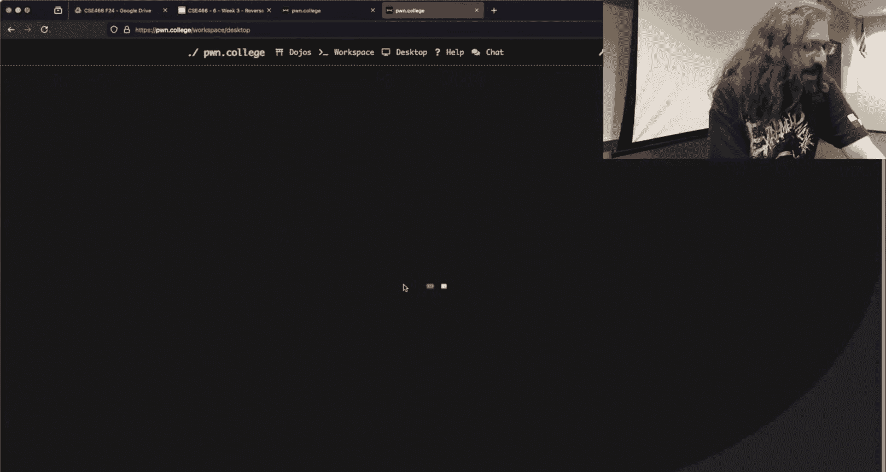


目前，许多同学在挑战 `17.1` 和 `22.1` 上遇到了困难。`17.1` 缺少 `17.0` 中提供的调试输出，而 `22.1` 则需要通过观察程序行为来动态推断指令编码。我们将以 `17.0` 和 `17.1` 为例，演示如何克服这些困难。

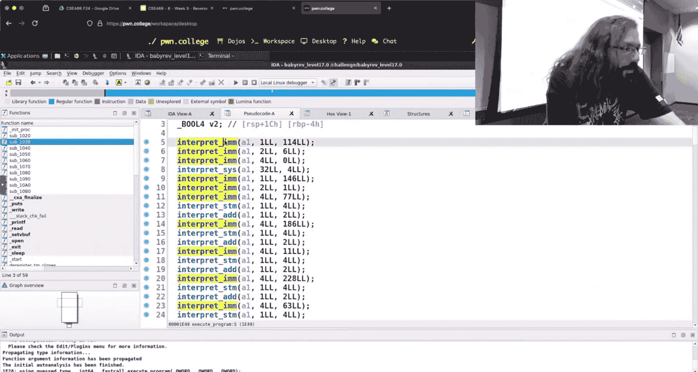

---


## 利用GDB脚本模拟调试输出

首先，我们看看如何让 `17.1` 像 `17.0` 一样打印出清晰的指令信息。核心思路是使用GDB的断点命令自动化功能。


以下是实现步骤：

1.  **在 `17.0` 中定位关键函数**：使用IDA打开 `17.0`，我们可以找到名为 `interpret_immediate` 的函数，它负责处理立即数指令并打印信息。
2.  **编写GDB脚本**：我们创建一个脚本（例如 `do.gdb`），在 `interpret_immediate` 函数入口设置断点，并定义断点触发时自动执行的命令。
    ```gdb
    break interpret_immediate
    commands
        printf "calling interpret_immediate "
        printf "reg=%llx val=%llx ", $rsi, $rdx
        continue
    end
    run
    ```
    这个脚本会在每次执行 `interpret_immediate` 时，打印出寄存器编码（`$rsi`）和立即数值（`$rdx`）。
3.  **运行脚本**：使用命令 `gdb -x do.gdb ./challenge_17.0` 运行，即可获得与程序原生输出类似的动态信息。

---

## 将技术应用于无符号程序（`17.1`）

现在，我们将上述方法应用到没有符号的 `17.1` 上。

1.  **定位函数地址**：由于 `17.1` 没有符号，我们需要先找到目标函数在内存中的地址。可以使用 `objdump -d -M intel ./challenge_17.1` 进行反汇编，但更高效的方法是在IDA中查看。
2.  **在IDA中分析**：打开 `17.1`，虽然函数名丢失，但通过对比 `17.0` 的逻辑或分析代码结构，我们可以推断出特定函数（如设置寄存器的函数）的位置。记下其起始地址（例如 `0x1464`）。
3.  **修改GDB脚本**：将脚本中的断点地址替换为实际地址，并使用GDB的 `$base` 变量（代表ELF加载基址）进行修正。
    ```gdb
    break *($base + 0x1464)
    commands
        printf "calling interpret_immediate "
        printf "reg=%llx val=%llx ", $rsi, $rdx
        continue
    end
    run
    ```
4.  **执行效果**：运行此脚本后，`17.1` 也会开始输出类似 `17.0` 的指令信息，极大地简化了分析过程。


---

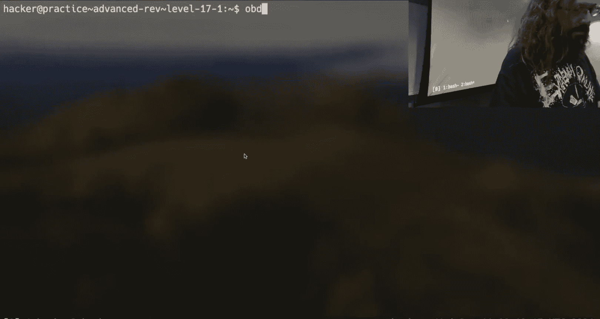

## 使用IDA增强代码可读性

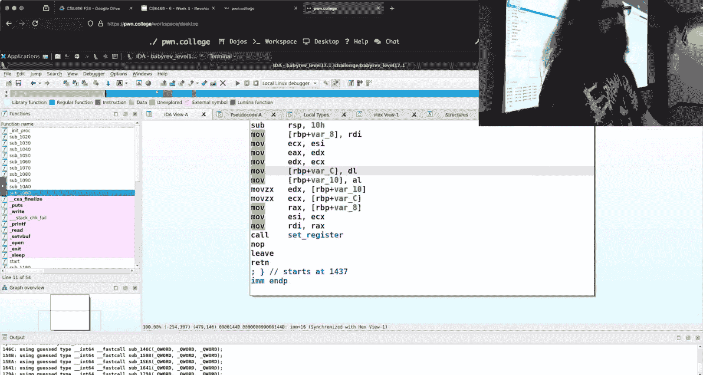

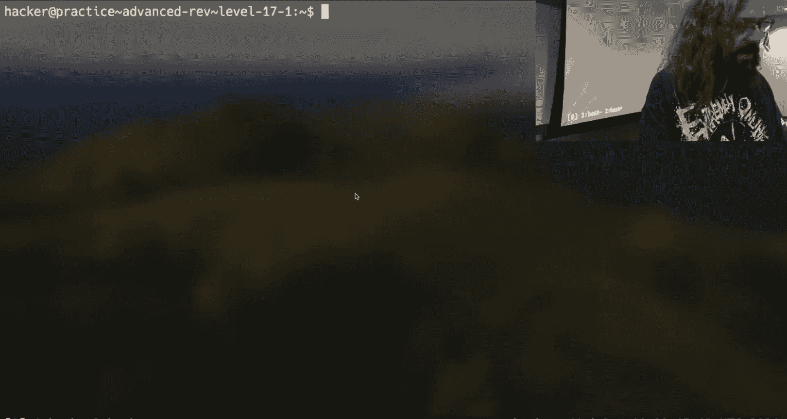

上一节我们使用GDB进行动态分析。本节中，我们来看看如何利用IDA的静态分析功能来理解程序结构。

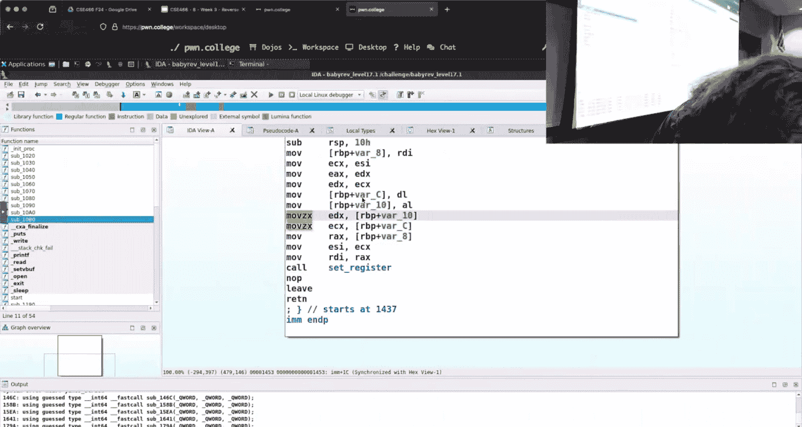

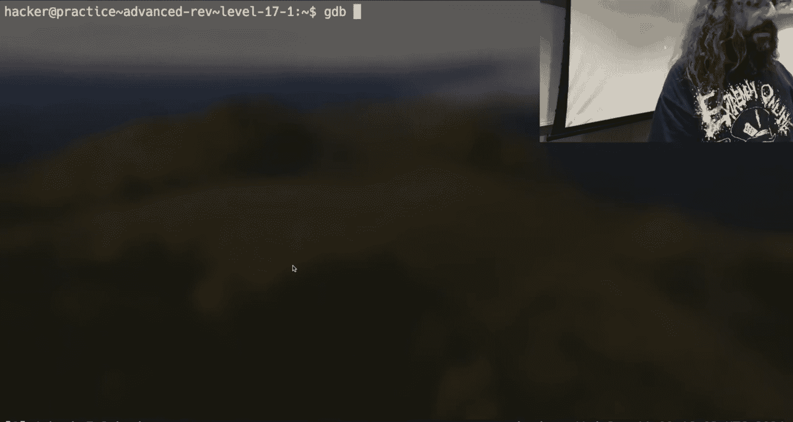

对于 `17.1`，我们可以通过定义结构体（struct）来让反编译代码更清晰。


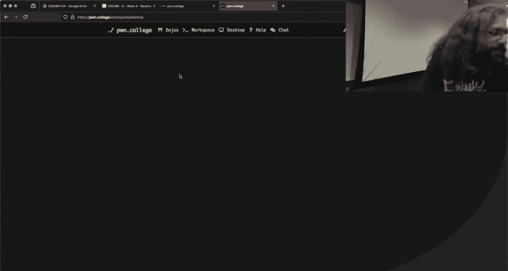


以下是操作流程：

1.  **识别内存布局**：分析代码发现，一个指针（我们称之为 `yawn85_memory`）被频繁传递，偏移 `256` 字节后是模拟的寄存器区域。
2.  **定义结构体**：在IDA的“Local Types”窗口中，创建一个新的结构体类型。
    ```c
    struct yawnstruct {
        char buff[256];
        char reg_a;
        char reg_b;
        char reg_c;
        char reg_d;
        char reg_s;
        // ... 其他寄存器
    };
    ```
3.  **应用类型**：将 `yawn85_memory` 指针的类型从普通的 `char*` 修改为 `struct yawnstruct*`。
4.  **效果**：反编译窗口中的代码会立即更新。原本晦涩的指针偏移计算（如 `*(a1 + 256 + reg_index)`）会变成清晰的成员访问（如 `a1->reg_a`），显著提升了代码的可读性，并帮助理解数据流。

---


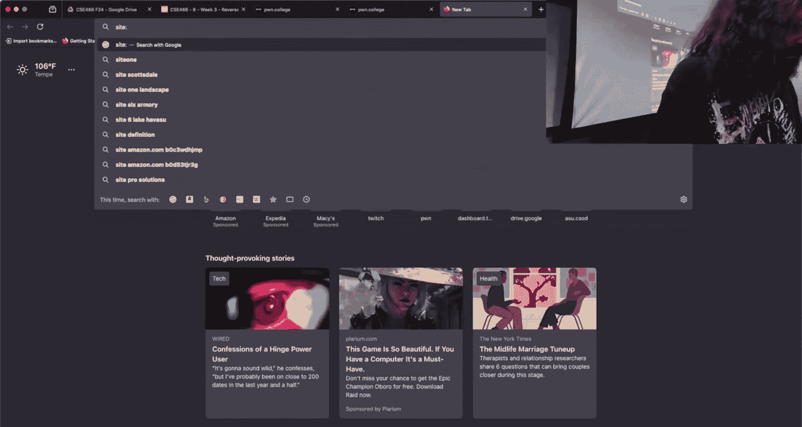


## 深入分析：比较指令与动态取值


为了理解程序如何检查输入是否正确，我们需要分析比较指令。


1.  **定位比较逻辑**：在 `17.0` 的IDA中，找到 `interpret_compare` 函数。它调用 `read_register` 获取两个寄存器的值进行比较。
2.  **使用GDB检查比较值**：我们可以在 `interpret_compare` 函数中，`read_register` 调用之后的位置设置断点，以捕获实际参与比较的数值。
    ```gdb
    break *($base + 0x1480) # 假设这是比较操作前的地址
    commands
        # 假设本地变量v7, v8在栈上的位置是 RSP+0x1e 和 RSP+0x1f
        printf "comparing: %x vs %x\n", *(unsigned char*)($rsp+0x1e), *(unsigned char*)($rsp+0x1f)
        continue
    end
    ```
3.  **动态观察**：通过运行并输入不同测试数据，可以观察这些比较值如何变化，从而逆向出输入被处理（或“混淆”）的逻辑。

---


## 总结与建议

本节课中我们一起学习了逆向工程中的几个核心技巧：

*   **GDB脚本自动化**：通过 `break` 和 `commands` 将动态调试过程自动化，为无符号程序“添加”调试输出。
*   **IDA结构体定义**：通过定义和应用结构体类型，让模糊的反编译代码变得语义清晰。
*   **结合动静态分析**：使用GDB观察运行时数据，结合IDA的静态视图，全面理解程序逻辑。

对于更复杂的混淆逻辑（如 `22.1`），建议编写Python脚本进行模糊测试（Fuzzing），系统地生成和测试输入，而非手动计算。请避免过度依赖手写推算或Excel表格，充分利用这些工具能极大提升效率。

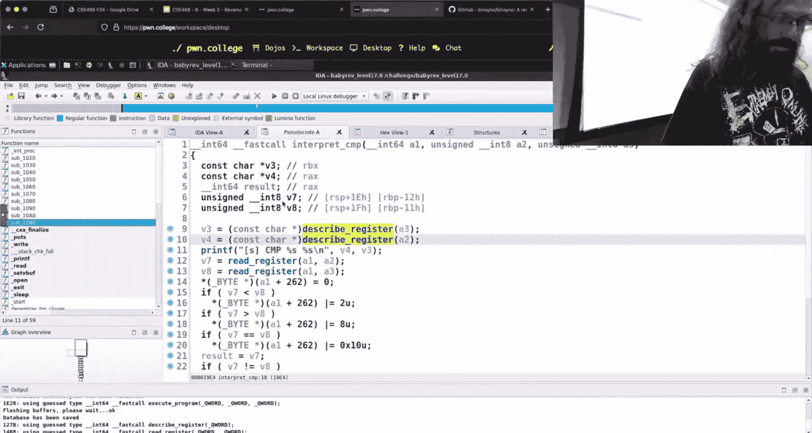

记住，逆向工程是一个“提出假设-验证假设”的循环过程。利用好工具，可以让你在这个循环中走得更快、更稳。