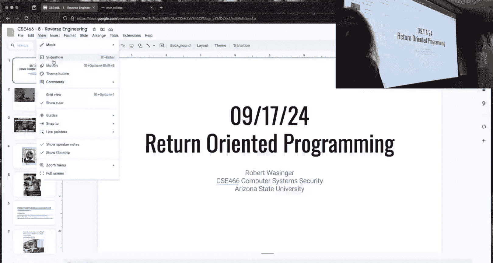
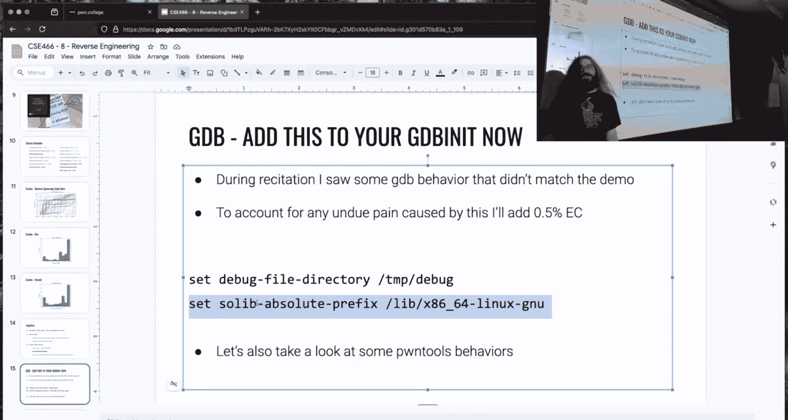
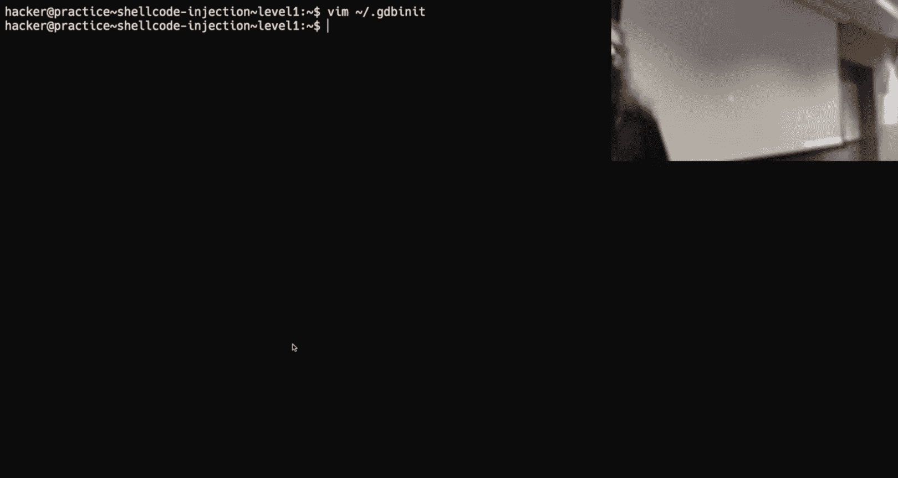
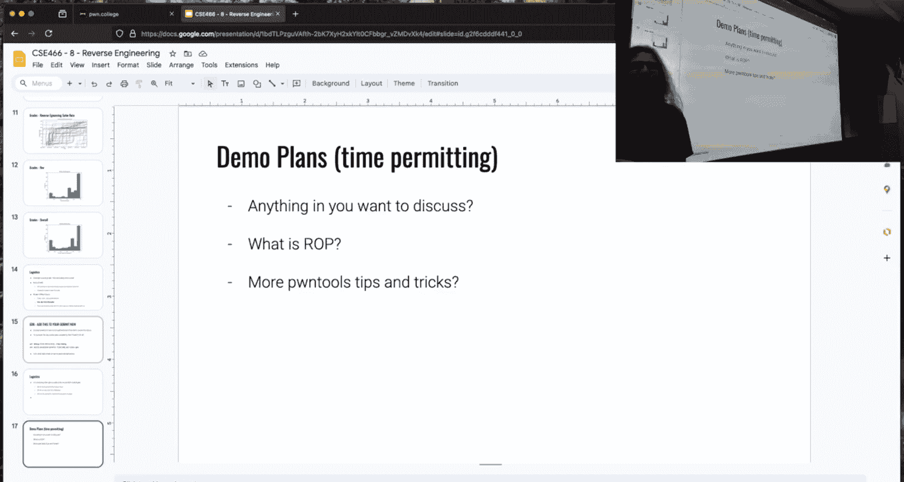
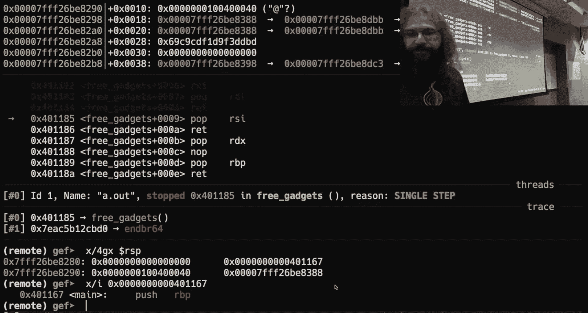
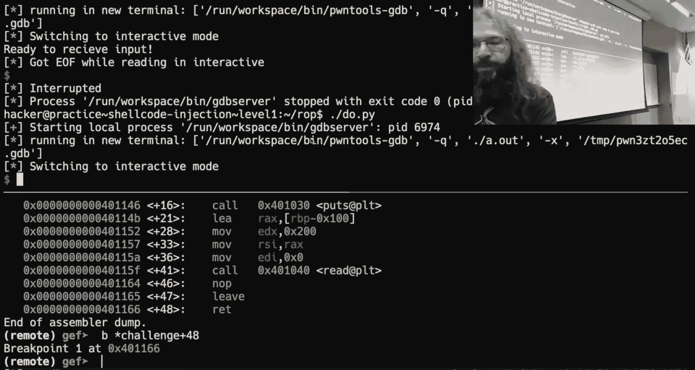

# 9：面向返回的编程




在本节课中，我们将要学习面向返回的编程（ROP）的基本概念。ROP是一种高级的内存利用技术，它允许攻击者在存在安全防护（如不可执行栈）的情况下，通过复用程序中已有的代码片段（称为“gadget”）来构建恶意逻辑。我们将从回顾基础的栈溢出开始，逐步理解ROP的原理和构建方法。

## 回顾：栈溢出与函数调用

上一节我们介绍了逆向工程和缓冲区溢出。本节中，我们来看看如何利用这些知识作为ROP的基础。

一个简单的C程序展示了经典的缓冲区溢出漏洞：
```c
void challenge() {
    char buff[256];
    read(0, buff, 512); // 允许读取超过缓冲区大小的数据
}
```
该程序将512字节的数据读入一个256字节的缓冲区，造成了栈溢出。攻击者可以覆盖保存在栈上的函数返回地址。

为了成功利用，我们需要知道覆盖返回地址所需的偏移量。通过调试分析，可以确定从缓冲区起始到返回地址的偏移是264字节（256字节缓冲区 + 8字节保存的RBP）。


如果程序中存在一个`win`函数，我们可以通过溢出将返回地址覆盖为`win`函数的地址，从而劫持程序流。



## 地址空间布局随机化与位置无关可执行文件



在深入ROP之前，我们需要理解两个关键的安全机制：ASLR和PIE。



*   **ASLR**：一种运行时配置，由操作系统内核控制。它随机化进程内存空间中各区域（如栈、堆、库）的基地址。可以通过`/proc/sys/kernel/randomize_va_space`文件查看和配置。
*   **PIE**：一种编译时选项（`-fPIE -pie`）。它使可执行文件本身（ELF）的代码段（.text）和数据段能够被加载到内存中的任意地址。PIE是ASLR对主二进制文件生效的前提。

一个重要概念是，即使启用了ASLR，内存中连续映射的区域（如ELF的各个段或共享库的各个段）之间的相对偏移是固定的。这意味着，如果你泄露了某个区域中的一个地址，就可以计算出同一区域或其他相邻区域中任何目标的地址。

## ROP核心概念：从“小函数”到Gadget

如果目标二进制中没有像`win`这样的理想函数，传统的跳转方法就失效了。ROP的核心思想由此产生：**我们能否利用程序中已有的、以`ret`指令结尾的短小指令序列来拼凑出我们想要的逻辑？**

一个函数的最小形式可以是一条指令后接`ret`。`ret`指令相当于`pop rip`，它会将栈顶的值弹出并设置为下一条要执行的指令地址。在栈溢出中，我们控制了栈上的内容，因此也间接控制了`ret`后程序要跳转的地址。

考虑以下指令序列：
```
pop rdi
ret
```
如果我们能将这个序列的地址覆盖到返回地址，那么当函数返回时：
1.  执行`pop rdi`，将当前栈顶的值（由我们控制）放入`rdi`寄存器。
2.  执行`ret`，再次从栈顶弹出下一个地址并跳转。

通过精心安排栈上的数据（一系列gadget地址和所需参数），我们可以让程序像执行一个“由`ret`指令串联起来的自定义程序”一样，依次执行多个gadget。这就是“面向返回的编程”——我们通过控制返回地址链来编程。

## 寻找与利用Gadget

手动在二进制中搜索有用的gadget非常繁琐。以下是常用的自动化工具：

*   `ROPgadget`
*   `rp++`
*   `ropper`（更侧重于内核ROP）

以`ROPgadget`为例，在二进制上运行它，会列出所有找到的以`ret`（或类似指令）结尾的短指令序列。

以下是可能找到的一些gadget示例：
```
0x000000000040111a : pop rdi ; ret
0x000000000040111c : pop rsi ; pop r15 ; ret
0x0000000000401016 : ret
```
在选择gadget时，必须考虑其副作用。例如，一个`pop rsi ; pop r15 ; ret`的gadget在设置`rsi`的同时也会从栈中弹出一个值到`r15`。在构建ROP链时，需要为这些额外的`pop`操作提供“填充”数据。

## 构建一个简单的ROP链

假设我们需要调用`open(“flag”, 0)`。在x86-64 Linux调用约定中，第一个参数由`rdi`传递，第二个由`rsi`传递。

我们可以这样构建ROP链：
1.  **Gadget 1**: `pop rdi ; ret` – 用于设置文件名地址。
2.  **参数 1**: 指向字符串`”flag”`的地址（需要提前在内存中布置或找到）。
3.  **Gadget 2**: `pop rsi ; ret` – 用于设置标志位。
4.  **参数 2**: `0`（表示只读打开）。
5.  **目标函数地址**: `open`函数在内存中的地址（如通过PLT表调用`open@plt`）。

最终的栈布局（从低地址到高地址，即溢出方向）如下：
```
[垃圾数据填充偏移量] + [Gadget1地址] + [“flag”字符串地址] + [Gadget2地址] + [0] + [open@plt地址] + ...
```
当溢出发生后，函数返回到Gadget1，开始执行我们的ROP链。

## 调试技巧与注意事项

调试ROP比调试Shellcode更复杂，因为代码不是连续注入的。你需要：
1.  在关键`ret`指令处设置断点。
2.  单步执行，观察每次`ret`后跳转的地址是否符合预期。
3.  检查每次`pop`操作后，寄存器的值是否被正确设置。

在使用`pwntools`进行漏洞利用开发时，可以通过以下设置禁用ASLR以便调试：
```python
context.aslr = False
```
但请注意，这通常要求进程不是由`sudo`启动的。




## 总结




本节课中我们一起学习了面向返回编程的基础。ROP是一种强大的代码复用攻击技术，它通过串联程序中现有的、以`ret`结尾的短指令序列（gadget）来构建任意逻辑，从而绕过不可执行栈等防护。理解栈布局、函数调用约定以及ASLR/PIE机制是成功实施ROP攻击的关键。在接下来的实践中，你将学习如何利用工具寻找gadget，并组合它们来完成复杂的任务，例如调用系统函数或绕过更高级的防护。