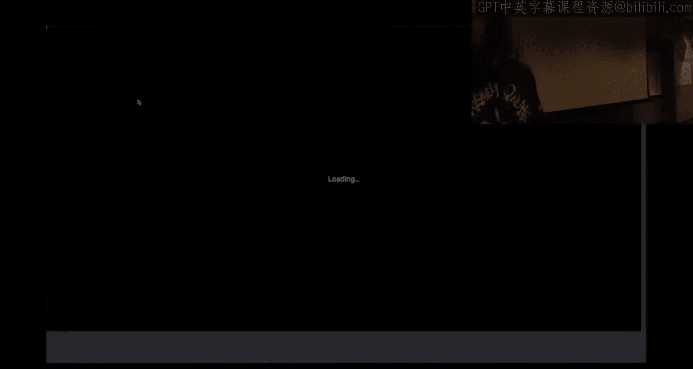
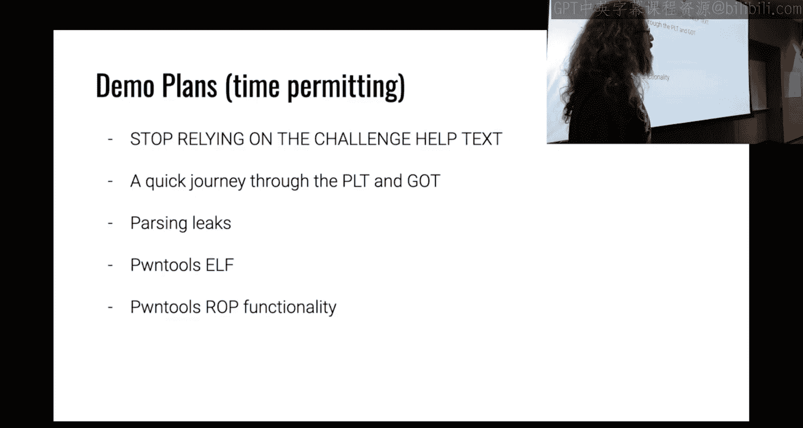
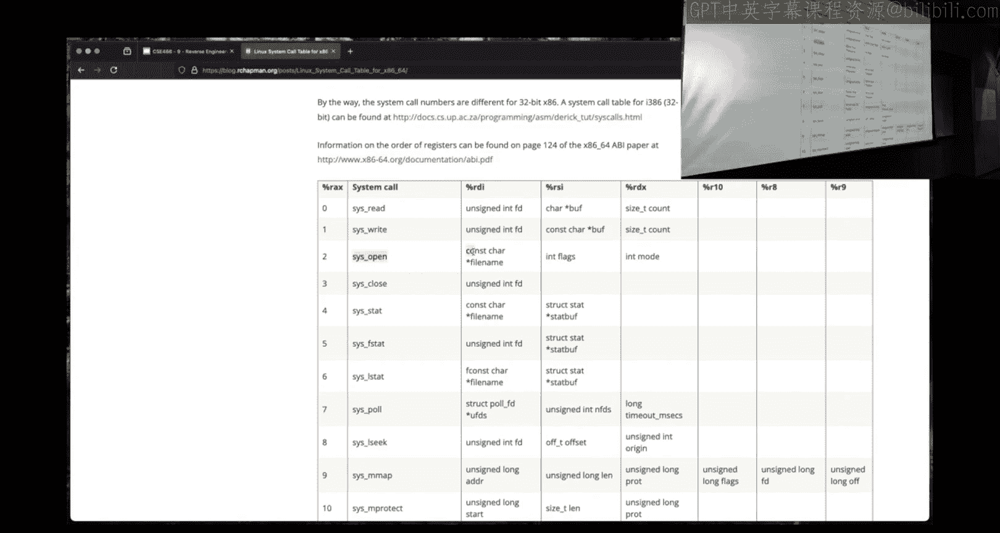

# 10：返回导向编程教程




在本节课中，我们将要学习返回导向编程的基本概念、工作原理以及如何利用它来执行任意代码。我们将通过一个简单的示例来演示如何构建ROP链，并解释相关的核心概念。

## 概述

返回导向编程是一种利用程序中已有的代码片段来执行任意操作的技术。通过控制程序的返回地址，我们可以将多个代码片段连接起来，形成一个完整的攻击链。本节将详细介绍ROP的基本原理和实际应用。

## ROP的基本原理



上一节我们介绍了缓冲区溢出和栈溢出的基本概念，本节中我们来看看如何利用ROP技术来执行任意代码。ROP的核心思想是利用程序中已有的代码片段，通过控制返回地址来连接这些片段，从而执行我们想要的操作。

### 核心概念

以下是ROP中的几个核心概念：

1.  **Gadget（代码片段）**：Gadget是程序中以`ret`或`jmp`指令结尾的一小段代码。我们可以通过控制返回地址来跳转到这些Gadget，并执行其中的指令。
2.  **ROP链**：通过将多个Gadget的地址按顺序排列在栈上，我们可以形成一个ROP链。每个Gadget执行完毕后，会通过`ret`指令跳转到下一个Gadget，从而连续执行多个操作。
3.  **控制流劫持**：通过溢出缓冲区覆盖返回地址，我们可以劫持程序的控制流，使其跳转到我们指定的Gadget。

### Gadget的查找与使用

为了构建ROP链，我们需要找到程序中的可用Gadget。以下是查找Gadget的几种方法：

*   **使用工具**：可以使用`ROPgadget`等工具来自动搜索程序中的Gadget。
*   **手动查找**：通过反汇编程序，手动查找以`ret`或`jmp`结尾的代码片段。
*   **利用现有函数**：除了Gadget，我们还可以直接跳转到程序中的现有函数，如`system`或`execve`，来执行更复杂的操作。

### 构建ROP链的步骤

构建ROP链通常包括以下几个步骤：




1.  **确定偏移量**：首先，我们需要确定缓冲区到返回地址的偏移量。这可以通过发送特定模式的数据并观察程序崩溃时的状态来实现。
2.  **查找Gadget**：使用工具或手动查找程序中的可用Gadget，特别是那些可以设置寄存器或执行系统调用的Gadget。
3.  **构建Payload**：将Gadget的地址按顺序排列在Payload中，并在需要时插入数据（如字符串地址或系统调用号）。
4.  **发送Payload**：将构建好的Payload发送给目标程序，触发缓冲区溢出并执行ROP链。

## 示例演示

下面我们通过一个简单的示例来演示如何构建ROP链。假设我们有一个没有PIE保护的二进制文件，并且我们已经找到了以下Gadget：

*   `pop rax; ret` - 地址：`0x1187`
*   `pop rdi; ret` - 地址：`0x1185`
*   `pop rdx; pop rbp; ret` - 地址：`0x1189`
*   `syscall` - 地址：`0x1180`

我们的目标是调用`open`系统调用来打开一个文件。以下是构建ROP链的Python代码示例：

```python
from pwn import *

context.arch = 'amd64'

# Gadget地址
pop_rax = 0x1187
pop_rdi = 0x1185
pop_rdx_pop_rbp = 0x1189
syscall_addr = 0x1180

# 字符串地址（例如：指向"!"的地址）
string_addr = 0x201a

# 系统调用号：open = 2
syscall_num = 2

# 构建Payload
payload = b'A' * 264  # 填充到返回地址
payload += p64(pop_rax) + p64(syscall_num)  # 设置rax为2
payload += p64(pop_rdi) + p64(string_addr)  # 设置rdi为字符串地址
payload += p64(pop_rdx_pop_rbp) + p64(0) + p64(0)  # 设置rdx为0，rbp为0
payload += p64(syscall_addr)  # 调用syscall

# 发送Payload
p = process('./demo')
p.send(payload)
p.interactive()
```

## 总结

本节课中我们一起学习了返回导向编程的基本原理和实际应用。通过控制返回地址，我们可以利用程序中已有的代码片段来执行任意操作，从而绕过各种安全机制。ROP技术虽然复杂，但它是现代漏洞利用中的重要手段，理解其原理对于深入理解计算机系统安全至关重要。