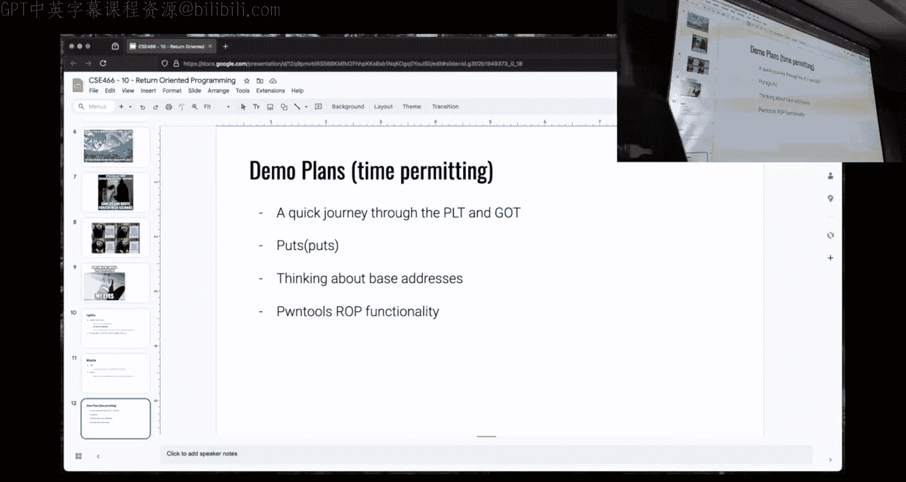
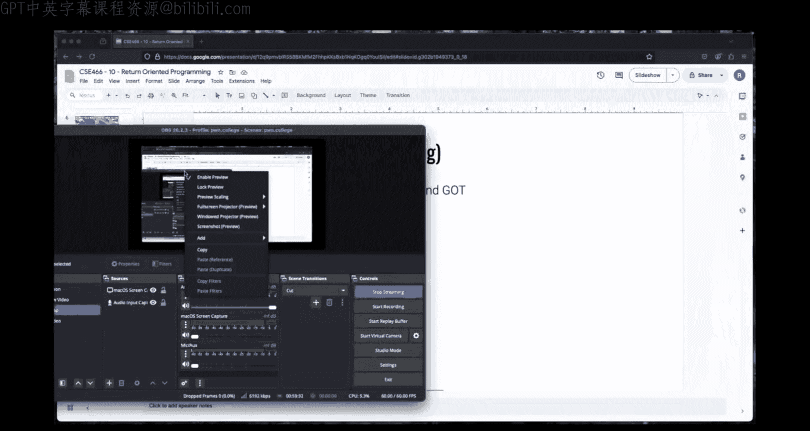
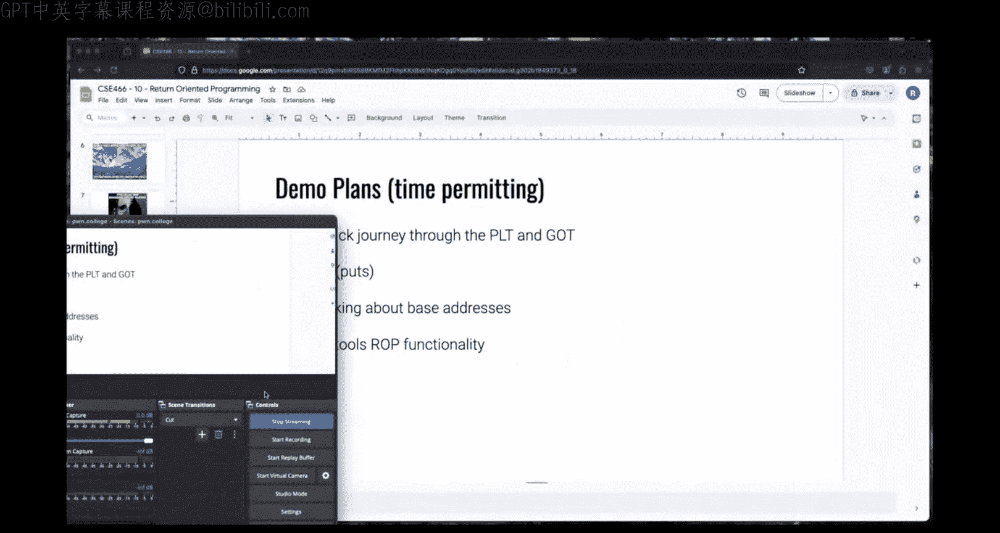
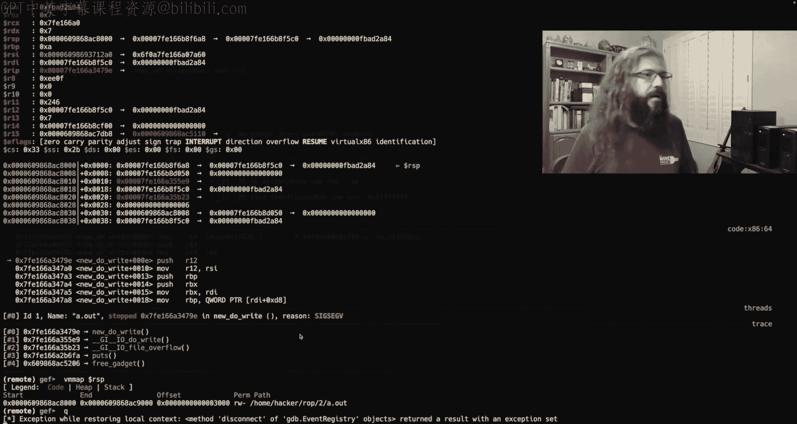

# 11：ROP与栈转移技术详解 🚀


## 概述
在本节课中，我们将深入学习**面向返回的编程**技术，特别是如何利用ROP链进行内存破坏攻击，并探讨**栈转移**这一高级技巧。课程内容基于实际挑战，旨在帮助初学者理解核心概念。

---

## 课程内容回顾与ROP基础



上一节我们介绍了内存破坏的基本原理。本节中，我们来看看如何通过覆盖保存的返回地址来构建更复杂的攻击链，即ROP。

ROP是内存破坏攻击的自然延伸。其核心在于，我们不仅覆盖初始的保存返回地址，还进一步破坏栈上的其他数据，从而控制程序执行流。

### ROP的核心机制
当程序存在缓冲区溢出漏洞时，我们可以向栈中写入超出预定长度的数据。通过精心构造这些数据，我们可以将返回地址指向程序中已有的、以`ret`指令结尾的短指令序列（称为“gadget”）。通过串联多个gadget，就能实现复杂的逻辑，例如调用系统函数。

**关键公式**：`溢出数据 = 填充数据 + gadget1地址 + gadget2地址 + ... + 目标函数地址`

### 初识ROP挑战
早期的ROP挑战通常较为简单，二进制文件中可能直接包含`system`调用，方便练习。但随着挑战深入，限制会增多，例如限制可用的gadget数量，或引入地址空间布局随机化。

---

## 利用工具构建ROP链 🔧

上一节我们手动计算gadget地址。本节中，我们来看看如何使用`pwntools`等工具自动化构建ROP链，提高效率。

`pwntools`是一个强大的Python库，它提供了`ROP`模块，可以自动搜索gadget并计算其在运行时内存中的正确地址。

以下是使用`pwntools`构建ROP链的基本步骤：

1.  **设置上下文与加载二进制文件**：
    ```python
    from pwn import *
    context.arch = ‘amd64’
    e = ELF(‘./challenge_binary’)
    ```

2.  **创建ROP对象并设置基址**（对于PIE二进制文件至关重要）：
    ```python
    # 假设通过泄露获得了main函数的运行时地址 main_leak
    e.address = main_leak - e.symbols[‘main’] # 设置ELF的基地址
    r = ROP(e)
    ```

3.  **构建ROP链**：
    ```python
    r.raw(r.find_gadget([‘pop rdi’, ‘ret’])) # 寻找并添加pop rdi; ret gadget
    r.raw(e.got[‘puts’]) # 将puts在GOT中的地址作为pop rdi的参数
    r.raw(e.plt[‘puts’]) # 调用puts@PLT
    ```

4.  **生成载荷**：
    ```python
    payload = b’A’ * offset_to_rip # 填充数据直到覆盖返回指令指针
    payload += r.chain() # 附加构建好的ROP链
    ```

使用`r.dump()`可以直观地查看构建的ROP链结构。`pwntools`还能自动处理函数调用参数设置等复杂任务，但自动化工具有时可能不稳定，理解其底层原理仍然重要。

---




## 地址泄露与库函数定位 🗺️

仅仅控制执行流还不够。本节中，我们来看看如何利用ROP泄露关键内存地址，特别是LibC库的基址，为后续调用如`system`这样的库函数铺平道路。

### PLT与GOT的区别
*   **PLT**：过程链接表。包含用于延迟绑定的存根代码。调用`puts@PLT`会跳转到动态链接器去解析`puts`的真实地址。
*   **GOT**：全局偏移表。存储已解析函数的实际地址。`puts@GOT`中存放的就是`puts`函数在LibC中的地址。

### 泄露LibC地址的步骤
1.  **利用ROP调用`puts`**：构造ROP链，以`puts@GOT`的地址为参数，调用`puts@PLT`。这会打印出`puts`函数在内存中的实际地址。
2.  **解析泄露的地址**：从程序输出中接收这个地址的字节表示，并将其转换为整数。
    ```python
    # 接收输出，直到特定字符串（如‘input!’）
    leak_bytes = p.recvuntil(b‘input!’)
    # 提取地址字节（例如最后6个字节），并用空字节填充至8字节
    puts_addr = u64(leak_bytes[-6:].ljust(8, b‘\x00‘))
    ```
3.  **计算LibC基址**：用泄露的`puts`地址减去LibC中`puts`函数的固定偏移量，即可得到LibC的基址。
    ```python
    libc_base = puts_addr - libc.symbols[‘puts’]
    libc.address = libc_base # 为pwntools的libc对象设置基址
    ```



### 关于ASLR/PIE的要点
地址随机化并非作用于每个字节。内存页（通常为4096字节，即0x1000）是随机化的最小单位。因此，一个函数地址的最后三个十六进制数字（即页内偏移）在每次运行中是**固定**的。这为部分覆盖等技巧提供了可能。

---

## 栈转移技术详解 🏗️

当栈空间不足以容纳长的ROP链，或我们需要切换到一个完全可控的内存区域时，就需要用到栈转移。

上一节我们学会了泄露地址。本节中，我们来看看如何通过栈转移将栈指针`RSP`指向我们准备好的新区域。

### 什么是栈转移？
栈转移的核心思想是改变栈指针`RSP`的值，使其指向攻击者控制的另一个内存区域（例如BSS段中的全局缓冲区）。随后，`ret`指令将从这片新区域读取并执行后续的ROP链。

### 实现栈转移的常见gadget
理想的gadget是`pop rsp; ret`，它可以直接设置`RSP`。但这类gadget并不常见。更实用的方法是利用函数尾声的`leave; ret`指令。

**`leave`指令等价于**：
```assembly
mov rsp, rbp
pop rbp
```
因此，栈转移的攻击链通常如下构造：
1.  将目标地址（如`global_buf - 8`）放入`RBP`。
2.  执行`leave; ret`。
    *   `mov rsp, rbp`：使`RSP`指向`global_buf - 8`。
    *   `pop rbp`：将`global_buf - 8`处存储的值（可以是任意值）弹出到`RBP`，此时`RSP`指向`global_buf`。
    *   `ret`：从`global_buf`开始执行我们预先放置的第二阶段ROP链。

### 栈转移的挑战与调试
栈转移后，程序会使用新的内存区域作为栈。这可能引发问题：
*   **栈对齐问题**：某些LibC函数要求栈指针16字节对齐。如果不对齐，会导致崩溃。解决方法是在调用前添加一个额外的`ret` gadget来微调`RSP`。
*   **栈空间耗尽**：新的“栈”区域可能大小有限。如果函数调用链过深，`push`操作可能使`RSP`移动到不可写的内存页，导致段错误。解决方法是确保栈指针初始位置足够“深入”可控缓冲区。

调试栈转移攻击需要仔细跟踪`RSP`和`RBP`寄存器的变化，并使用GDB检查内存映射，确保栈操作在合法区域内。

---

## 总结

本节课中我们一起学习了ROP攻击的核心技术。我们从基础的ROP链构建开始，介绍了如何利用`pwntools`工具简化流程。接着，深入探讨了通过泄露GOT表地址来定位LibC库的方法，这是实现高级利用的关键。最后，我们讲解了栈转移这一高级技巧，理解了如何通过`leave; ret`等gadget切换栈空间以部署更复杂的攻击链。



记住，理解底层原理（如栈帧布局、指令执行效果）远比盲目使用自动化工具更重要。遇到问题时，结合GDB进行调试，从“第一性原理”出发进行推理，是解决问题的根本途径。