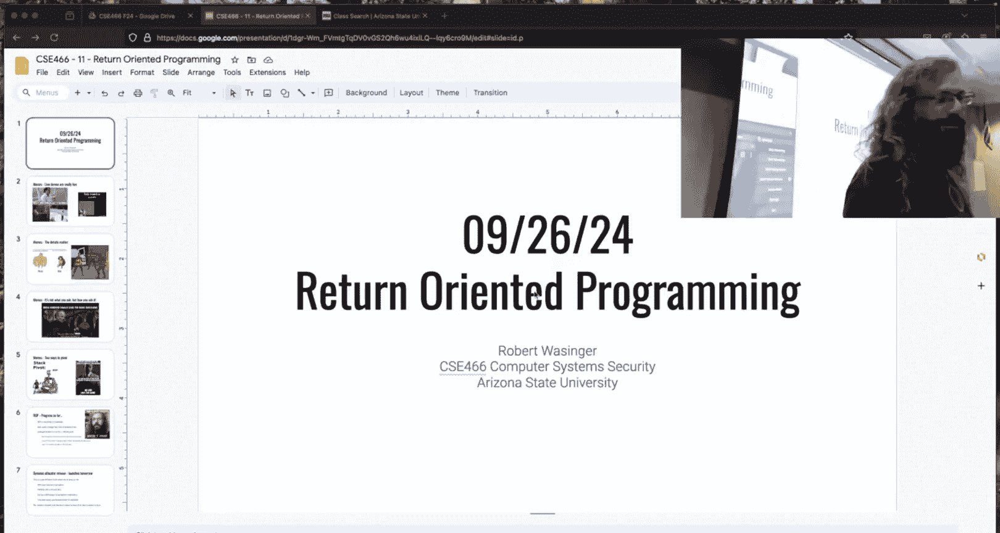
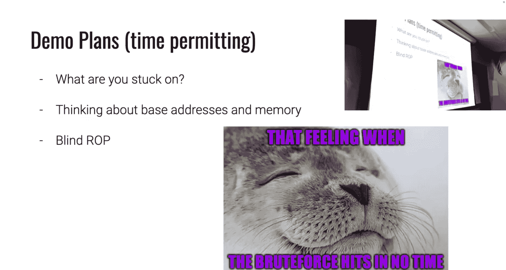

# 12：ROP与堆利用入门




在本节课中，我们将学习面向返回编程（ROP）的基本概念，并初步了解动态内存分配器（堆）的利用。课程内容基于一次课堂演示，涵盖了ROP攻击中的常见问题、堆利用的预备知识以及一些实用的调试技巧。

## 栈地址泄露与数据处理

上一节我们讨论了ROP的基本原理。本节中，我们来看看在利用过程中处理输入数据时的一个关键细节。

从进程读取数据时，我们通常会得到一个字节字符串，末尾可能包含换行符 `\n`（十六进制为 `0x0a`）。我们的目标是获取这些字节本身。

以下是处理这种数据的几种方法及其潜在问题：

*   **`strip()` 方法的问题**：`strip()` 会移除字符串**开头和结尾**的所有指定字符。如果我们要泄露的地址的**最低有效字节**恰好是 `0x0a`，使用 `strip('\n')` 会错误地移除这个属于地址本身的字节，导致数据损坏。
*   **`replace()` 方法的问题**：`replace('\n', '')` 会替换字符串中**所有**的换行符。如果数据内部也包含 `0x0a` 字节，它同样会被移除，这通常也不是我们想要的结果。
*   **推荐的方法**：更可靠的方法是使用Python切片操作，直接丢弃最后一个字节。这样可以确保只移除末尾的换行符，而保留数据部分的所有字节。




```python
# 假设 received_data 是从进程读取的字节串，末尾有换行符
clean_data = received_data[:-1]  # 丢弃最后一个字节（换行符）
```

## 栈迁移（Stack Pivot）概念

在ROP攻击中，我们经常需要将栈指针（RSP）指向一个由我们控制的内存区域，这个过程称为栈迁移或栈旋转。

栈迁移的核心是找到一条能够设置RSP寄存器值的指令（gadget），例如 `mov rsp, rax` 或 `xchg rsp, rax`。成功迁移栈后，后续的ROP链就可以从这个新位置开始执行。上周的课程演示中，我们通过一个具体的二进制程序实践了栈迁移的完整过程。

## 动态内存分配器（堆）利用简介

到目前为止，我们主要利用的是栈缓冲区溢出。从下一个模块开始，我们将重点转向堆利用。

堆是用于动态内存分配的区域，与栈的线性布局不同，堆的管理涉及复杂的元数据结构和指针操作。利用堆的漏洞（如Use-After-Free、堆溢出）可以获取强大的攻击原语，例如任意内存读和任意内存写。

分析堆状态时，使用GDB插件（如`pwndbg`或`gef`）几乎必不可少，它们能以清晰的方式展示堆块、bins等信息，极大简化调试过程。本模块的挑战难度曲线较陡，尤其是涉及`safe-linking`等保护机制的后期关卡，需要投入更多时间。

## 无信息泄露下的ROP（Blind ROP）思路

有时我们面临没有信息泄露的挑战（或称为“盲”攻击）。一种攻击思路是结合分叉服务器（fork server）进行暴力破解。

其核心思想是：在内存布局不变的前提下，我们可以逐字节地尝试覆盖返回地址的最低有效部分。我们寻找一个“预言机”（Oracle）——即某个能被触发并产生可观测行为（如打印特定字符串、改变退出码）的代码地址（例如一个函数或gadget）。

1.  **暴力搜索**：首先，我们猜测目标地址的一部分字节（例如低3个半字节），并观察程序行为。当触发“预言机”行为时，我们就知道命中了目标地址的这部分。
2.  **逐字节泄露**：接着，我们固定已命中的部分，开始暴力猜测下一个字节。当再次触发“预言机”行为时，我们就泄露了下一个字节的值。
3.  **计算基址**：重复此过程，最终可以泄露出一个完整的libc中的地址。结合libc的版本，我们就能计算出libc的基址，从而构建完整的ROP链。

这种方法成功的关键在于存在一个稳定的分叉服务器和可观测的“预言机”行为。

## 关于帧指针（RBP）的说明

在调试时，你可能会发现某些函数（如`libc`中的`read`）的栈帧中没有保存的RBP值。

这是因为编译器可以使用 `-fomit-frame-pointer` 选项进行优化。启用该选项后，函数将使用RSP而非RBP来引用局部变量，从而省略了保存和恢复RBP的指令。虽然这增加了手动分析栈帧的难度，但并不影响ROP攻击的本质。

## 总结


本节课中我们一起学习了ROP攻击中数据处理的重要性、栈迁移的概念，并初步了解了堆利用和盲ROP攻击的基本思路。我们还介绍了一些实用的工具和调试技巧。理解这些基础概念对于后续更复杂的内存漏洞利用至关重要。