# 13：动态分配器滥用


在本节课中，我们将要学习动态分配器（堆）的滥用与利用。我们将重点关注堆的第一层——Tcache，并学习如何通过内存损坏来操纵它，从而实现利用。内容将涵盖堆的基本概念、Tcache的工作原理以及一个简单的“释放后使用”漏洞示例。

---

## 堆与动态内存概述

上一节我们介绍了ROP攻击。本节中，我们来看看另一种常见的内存损坏攻击面——堆。

程序运行时需要内存来存储数据。栈内存用于局部变量，其生命周期与函数调用绑定。当我们需要在函数调用间持久保存数据，或者需要的内存大小在编译时无法确定时，就需要使用动态内存，即堆内存。

在C语言中，我们使用 `malloc` 函数在堆上申请内存，使用 `free` 函数释放不再需要的内存。

```c
void *ptr = malloc(20); // 申请20字节内存
free(ptr); // 释放内存
```

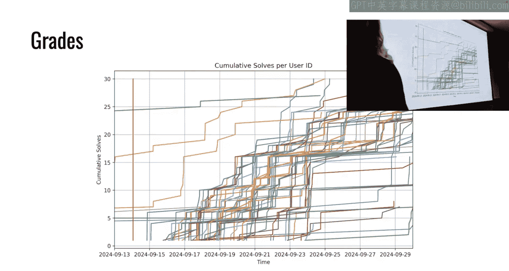

`malloc` 返回一个指向堆内存区域的指针。`free` 则告诉堆分配器：“这块内存我不再使用了，你可以回收它以备后用”。但 `free` 操作**不会**自动将程序中的指针变量置为 `NULL`。如果程序之后错误地继续使用这个“已释放”的指针，就会导致“释放后使用”漏洞。

---

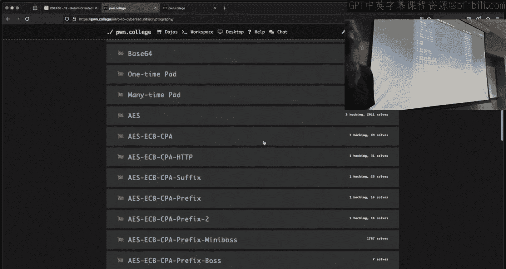

## Tcache 简介

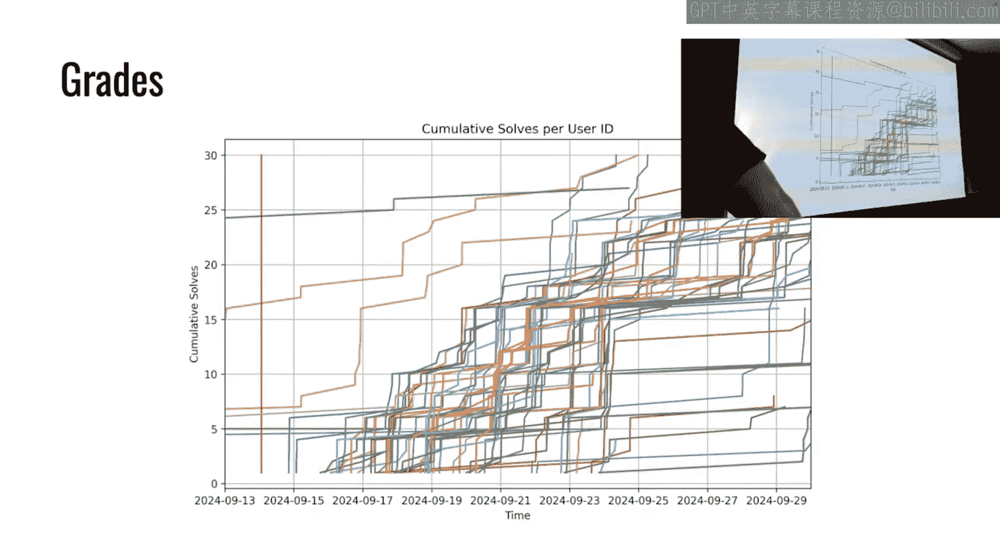

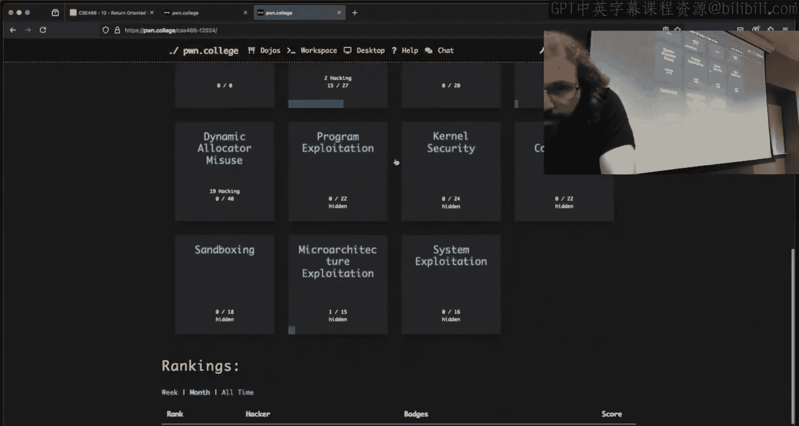

为了提升性能，现代堆分配器（如 glibc 的 ptmalloc）引入了 Tcache。Tcache 是线程本地缓存，用于快速分配和释放较小尺寸的内存块。

Tcache 的核心是一个**单向链表**结构，其行为类似于栈（后进先出）。每个特定大小的内存块（例如 32 字节）在释放后，会被放入对应大小的 Tcache bin 中。当再次申请相同大小的内存时，分配器会优先从 Tcache 链表中取出最近释放的块，而不是向操作系统申请新的内存。

以下是 Tcache 链表操作的简化描述：
*   **释放内存**：将被释放的块插入链表头部。
*   **分配内存**：从链表头部取出一个块返回给程序。

---


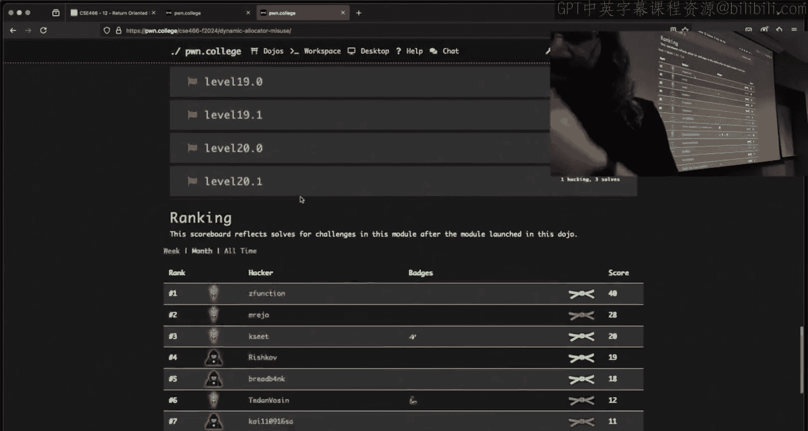

## 利用思路：释放后使用

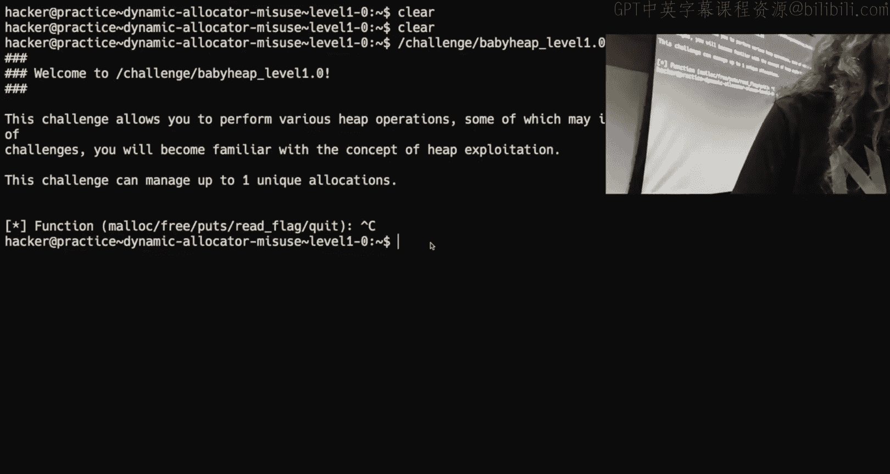

“释放后使用”漏洞的核心在于：程序释放了一块内存，但未能清空指向它的指针，后续又通过这个“悬垂指针”访问了该内存。而此时，这块内存可能已经被重新分配并存放了其他数据。

一个典型的利用场景如下：
1.  程序分配一块内存 A，并用指针 `ptr` 指向它。
2.  程序释放 A，`ptr` 未置空，成为悬垂指针。A 被放入 Tcache。
3.  程序（或其他函数）申请一块与 A 大小相同的内存 B。由于 Tcache 机制，B 很可能就是刚刚释放的 A。
4.  程序通过悬垂指针 `ptr` 读取或写入。此时它操作的实际是内存 B 的内容。
5.  如果 B 中存放了敏感数据（如标志），那么通过 `ptr` 就能泄露它；如果能向 `ptr` 写入数据，就能篡改 B 的内容。


---

## 实战分析：挑战关卡示例

让我们结合一个简单的挑战关卡来理解这个过程。以下是关卡可能提供的操作菜单：


```
1. malloc
2. free
3. puts (打印某个分配块的内容)
4. read_flag (申请内存并将标志读入其中)
5. quit
```


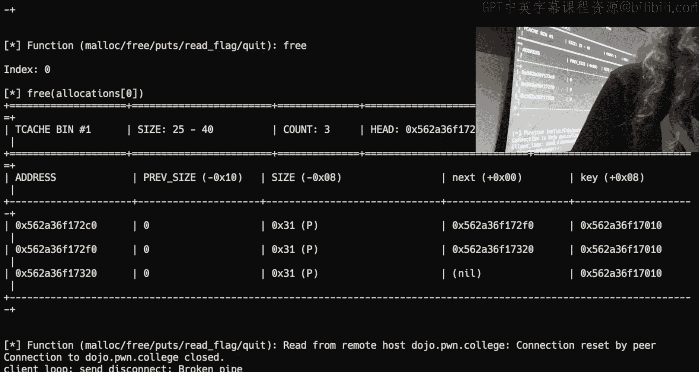

**利用步骤：**

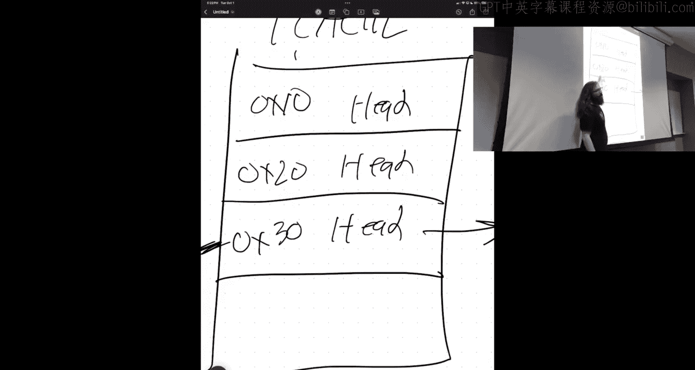

1.  **分配并释放**：首先，使用 `malloc` 申请一块特定大小的内存（例如 32 字节），然后立即 `free` 它。这个块现在位于 Tcache 中，但程序中指向它的指针仍然有效。
2.  **触发重分配**：调用 `read_flag` 函数。该函数会申请内存来存储标志。**关键点**：确保 `read_flag` 申请的内存大小与你第一步释放的块大小相同（或属于同一 Tcache bin 的大小范围）。这样，`read_flag` 就会从 Tcache 中拿到你刚刚释放的那块内存。
3.  **读取标志**：最后，使用 `puts` 功能，传入你第一步保存的那个悬垂指针。由于该指针指向的内存现在已被 `read_flag` 用于存放标志，因此 `puts` 会打印出标志内容。


**核心逻辑公式**：
`malloc(A) -> free(A) -> malloc(B) == A -> use dangling pointer to A (which now holds B‘s data)`

---

## 调试与可视化

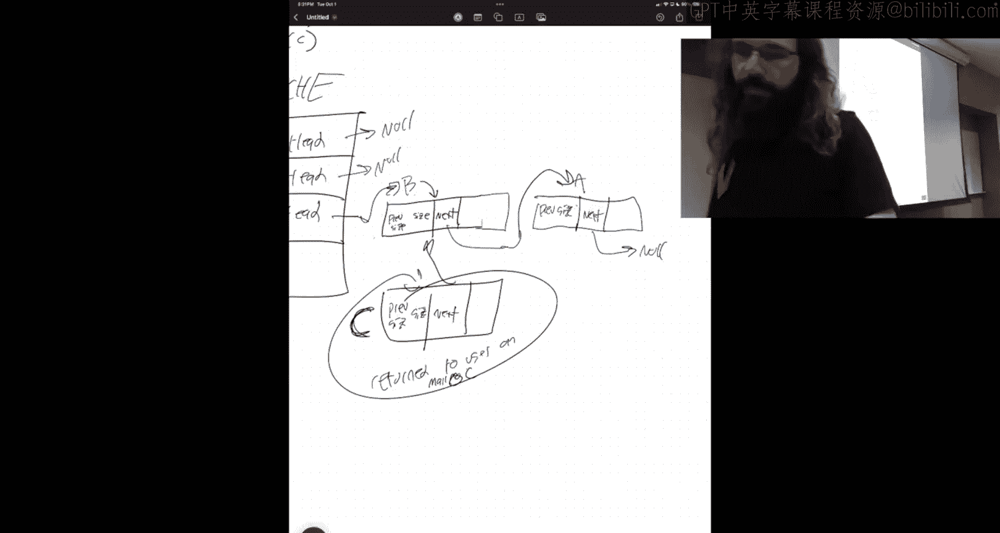

在利用堆漏洞时，观察内存状态至关重要。GDB 配合 `pwndbg` 或 `gef` 插件可以提供强大帮助。

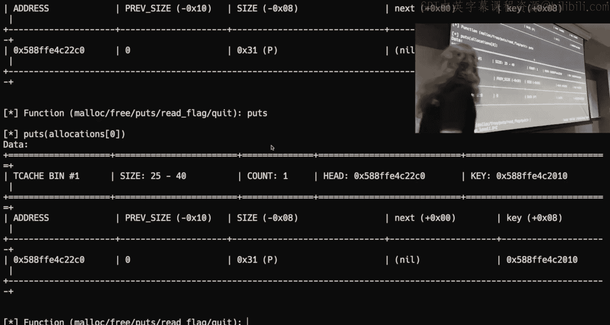

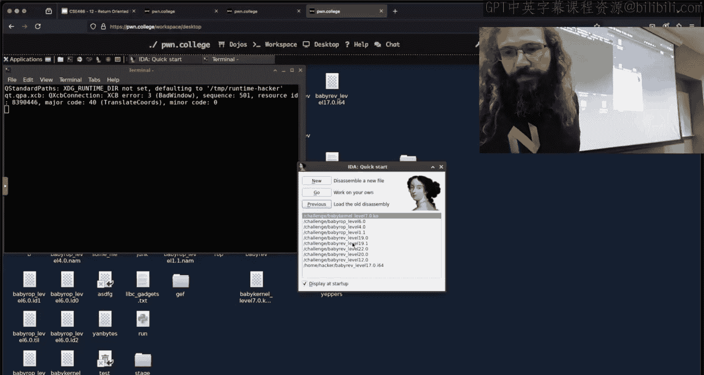

以下是两个常用命令：
*   `heap bins`：查看 Tcache 等各类 bins 的状态，包括链表头指针和链表中的块。
*   `heap chunks`：以更直观的方式显示堆中所有块（chunk）的布局、大小和相邻关系，帮助你判断哪些块在内存中是连续的，从而规划溢出等攻击。

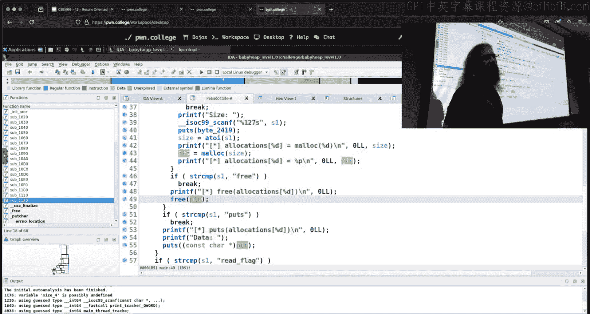

通过调试，你可以验证块是否按预期进入 Tcache，以及内存布局是否符合你的利用假设。

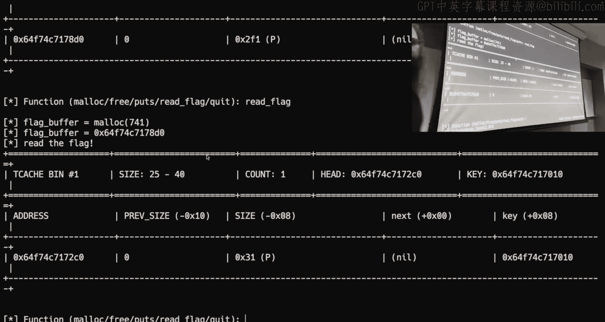

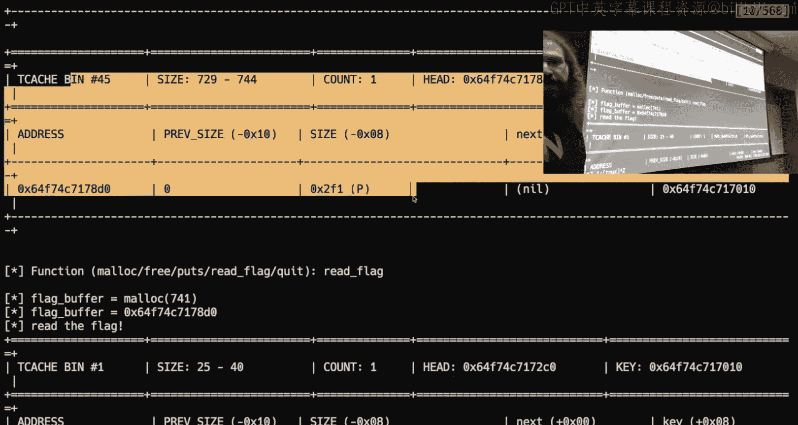

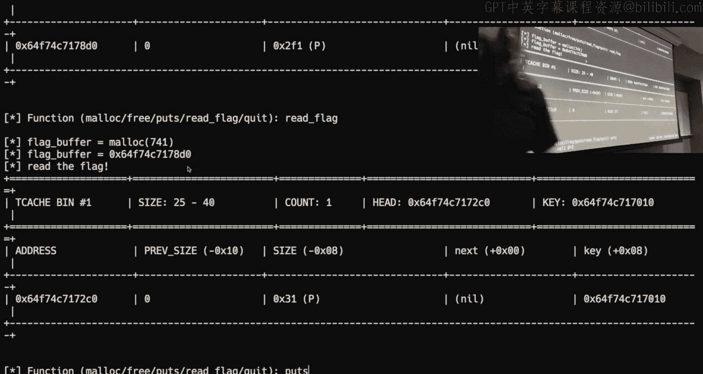


---


## 总结

本节课中我们一起学习了堆利用的基础知识。我们了解了动态内存和 Tcache 的基本概念，重点剖析了“释放后使用”漏洞的原理和利用方法。关键在于理解 `free` 不会清空指针，以及 Tcache 的“后进先出”分配机制如何让攻击者控制重新分配的内存内容。

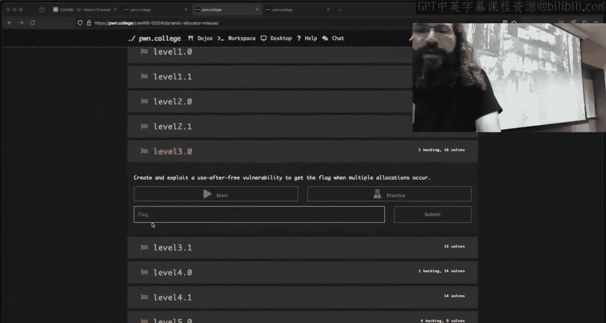

记住，本模块的所有挑战都围绕 Tcache 展开。不要过早深入更复杂的堆结构（如 small bins、large bins），专注于掌握如何欺骗 Tcache 链表即可。接下来的挑战将在此基础上，引入更多的内存损坏技巧。