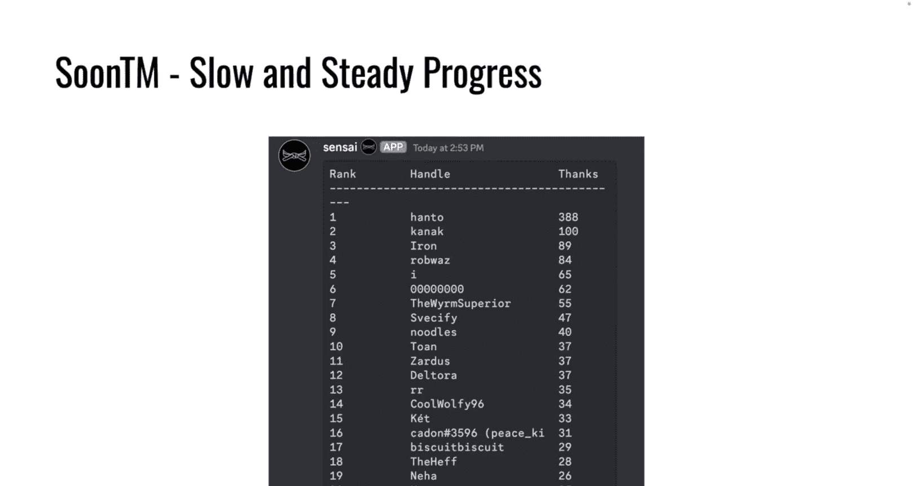
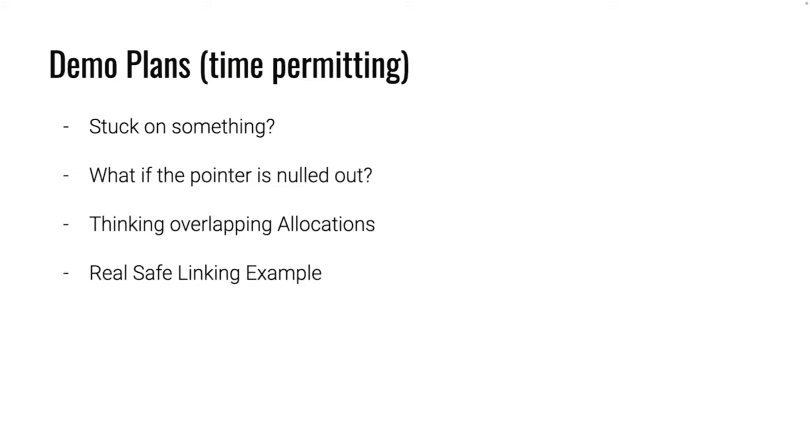
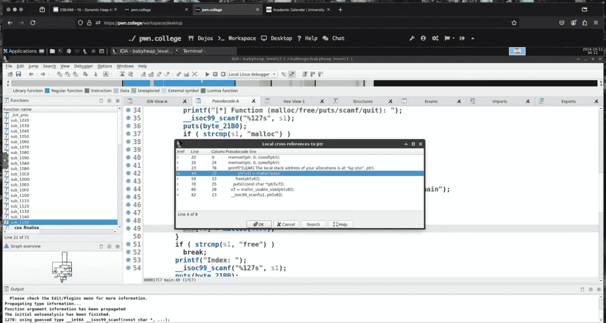
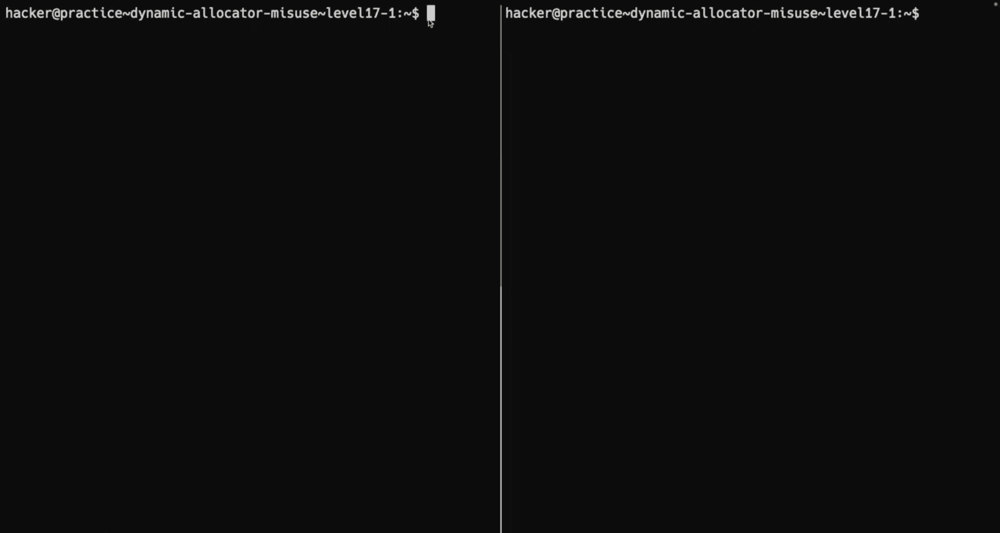

# 16：动态分配器误用

## 概述
在本节课中，我们将学习如何利用堆内存的动态分配器（如malloc/free）的漏洞。我们将探讨如何通过操纵堆的元数据和布局来创建重叠的内存块，从而泄露或控制程序数据。课程内容包括堆元数据的基本结构、如何通过单字节溢出修改块大小，以及如何利用这些修改来创建重叠分配，最终实现信息泄露。

---




## 课程内容

### 堆元数据与块大小
上一节我们介绍了堆的基本结构。本节中我们来看看堆块（chunk）的元数据是如何组织的。

一个堆块在内存中的布局包括其自身的元数据和用户可用的“分配区域”。对于`malloc`返回的指针`ptr`，其前16个字节（在64位系统上）通常包含元数据。具体来说：
*   `ptr - 16` 或 `ptr - 8` 的位置存放着**前一块的大小**（`prev_size`）。
*   `ptr - 8` 或 `ptr - 0` 的位置存放着**当前块的大小**（`size`）。

这个`size`字段不仅包含块的总大小，其最低的几个比特位还用作标志位（例如，指示前一个块是否在使用中）。

**核心概念公式：**
对于一个由 `p = malloc(n)` 返回的指针，其相关元数据地址可以近似表示为：
*   当前块大小地址： `size_addr = p - 8` （具体偏移可能因实现而异）
*   前一块大小地址： `prev_size_addr = p - 16`
*   下一个堆块的起始地址： `next_chunk = p + (size & ~0xF)` （对齐后的大小）

### 单字节溢出与大小篡改
理解了元数据的位置后，我们来看看一个常见的漏洞场景：单字节溢出。




假设我们有一个分配，允许写入`分配大小 + 1`字节。如果我们分配了40字节（`malloc(40)`），我们实际上可以写入41字节。这多出的1字节会溢出到紧邻分配区域之后的内存。

这块内存是什么？根据堆的布局，它很可能是**下一个堆块的`size`字段的最低有效字节**。通过精心控制这个字节，我们可以**修改下一个堆块的大小**。例如，将其改大，使其在释放后被放入一个更大的`tcache`或`bin`中。

以下是这个过程的简化描述：
1.  分配块A（例如40字节）。
2.  分配块B（例如40字节），它紧邻块A之后。
3.  向块A写入41字节，其中最后一个字节覆盖了块B的`size`字段的LSB。
4.  现在块B的元数据大小被改变了（例如从0x40变成了0xf0）。


### 创建重叠分配
修改了块B的大小后，我们可以利用它来创建重叠的内存区域。



1.  **释放被篡改的块B**：当我们`free(B)`时，分配器会根据我们篡改后的大小（如0xf0）将其放入对应的`tcache`或`fastbin`。
2.  **重新分配大块**：随后，我们请求分配一个大小为`篡改后大小 - 元数据大小`（例如0xf0 - 0x10 = 0xe0）的内存块。分配器很可能将刚刚释放的块B返回给我们。
3.  **重叠发生**：现在我们通过这个新分配的大块（称为块C），可以访问的内存区域远远超出了原始块B的边界。如果块B之后有一个我们感兴趣的“受害者”块（块V），那么块C的内存区域就会与块V**重叠**。我们通过块C读写数据，会直接影响块V的内容。

### 利用重叠进行信息泄露
创建了重叠分配后，我们如何利用它呢？一个直接的利用是**信息泄露**。




假设受害者块V中存储着一个秘密值（如`secret = “ASI”`）。我们的块C与它重叠。虽然我们可能不知道秘密值的精确偏移，但我们可以：
1.  向块C填充大量可打印字符（如`‘A’`）。
2.  使用像`puts`这样的输出函数打印块C的内容。
3.  `puts`会一直打印直到遇到空字节（`\x00`）。由于我们填充了整个块C，打印会继续进入重叠的受害者块V区域，从而将秘密值一起打印出来。

**核心概念代码（逻辑描述）：**
```python
# 假设操作原语
malloc(idx, size)
free(idx)
write(idx, data)
read_leak(idx) # 例如通过 puts

# 利用步骤
malloc(0, 40)   # 块A
malloc(1, 40)   # 块B (紧邻A之后)
malloc(2, 100)  # 受害者块V (紧邻B之后)

# 1. 单字节溢出，修改块B的size
payload_to_A = b‘A‘*40 + b‘\xf0‘ # 溢出1字节，将B的size改为0xf0
write(0, payload_to_A)

# 2. 释放被篡改的块B
free(1)

# 3. 分配一个大块，与B重叠，并覆盖到V
malloc(3, 0xf0 - 0x10) # 分配块C，大小对应篡改后的size


# 4. 向块C写入数据，覆盖到V的部分区域
write(3, b‘B‘*0xe0)


# 5. 泄露信息：通过打印块C，连带读出V中的秘密数据
leak = read_leak(3)
secret = extract_secret_from_leak(leak) # 从输出中解析出秘密值
```

### 关于Safe-Linking的说明
在上述利用中，我们主要操作的是`size`字段，而不是堆块指针。**Safe-Linking**是一种保护机制，它对`tcache`和`fastbin`中的`fd`（前向指针）进行异或混淆，以防止直接篡改。然而，在我们演示的重叠分配利用中，并未涉及直接篡改`fd`指针，因此Safe-Linking并未构成障碍。这说明了安全机制的有效性具有针对性。

---


## 总结
本节课中我们一起学习了堆利用中的一项关键技术：通过单字节溢出篡改堆块大小，进而创建重叠的内存分配，最终实现信息泄露。我们回顾了堆元数据的布局，理解了如何通过溢出修改`size`字段，并演示了如何利用被篡改的、释放后的块来获得一个更大的重叠分配区域。最后，我们利用`puts`等字符串函数的特性，通过这个重叠区域泄露了相邻内存中的敏感数据。掌握这些堆操作的原理，是理解更复杂堆漏洞利用的基础。