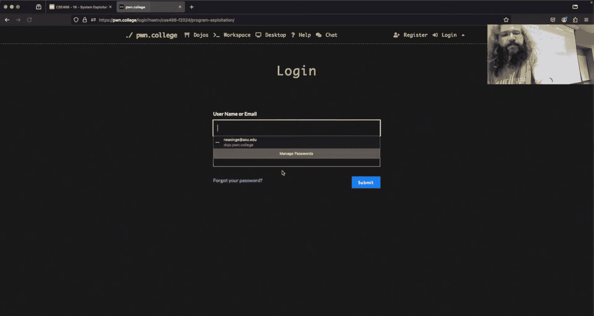
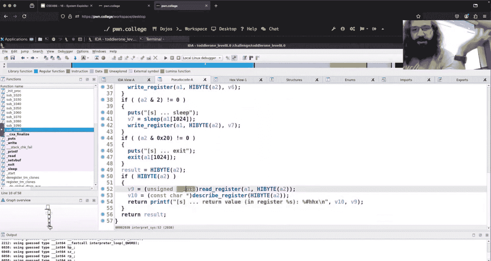
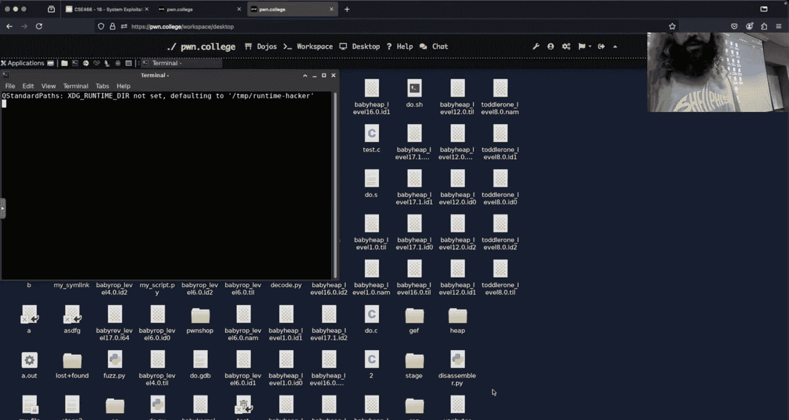
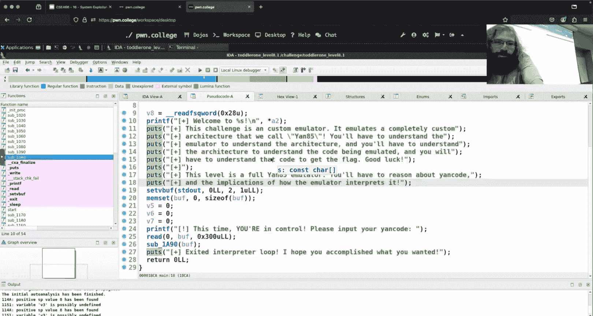

# 17：程序利用

## 概述
在本节课中，我们将探讨程序利用模块的核心概念。这是一个综合性模块，旨在应用之前学过的知识，例如逆向工程、内存破坏和堆利用。我们将学习如何在没有明确提示的情况下识别漏洞，并利用它们实现目标。


---

## 课程进度与成绩
上一节我们介绍了课程的整体结构，本节中我们来看看当前模块的进度和班级的整体表现。

课程已进行到一半，这是第五个模块。程序利用模块是一个累积性评估，不应包含太多全新的概念，主要是对已学知识的巧妙应用。

成绩分布显示，大多数学生在该模块中取得了60%或更高的分数，整体表现良好。关于“周”的定义和截止时间，已调整为从每周一午夜开始重置，以保持公平和一致。

关于额外学分，班级平均参与度较低。鼓励大家利用论坛发帖和帮助他人等机会获取额外学分。

---

## 挑战设计与新内容
关于挑战设计，程序利用和后续的系统利用模块都被标记为“幼儿”级别，因为它们需要综合运用基础概念。

目前程序利用模块包含11个挑战。计划新增更多挑战，这些新挑战将更具难度，类似于在堆模块中添加的额外挑战。

下一个模块原定为内核利用。是否按计划进行取决于新服务器和配套设施的准备情况。如果未准备好，可能会调整为竞态条件或沙箱逃逸模块。

---

## 处理剥离符号的二进制文件
在逆向工程中，我们经常需要分析剥离了符号的二进制文件。本节中我们来看看如何有效地使用调试器来处理它们。

当二进制文件被剥离后，我们无法直接通过函数名（如 `main`）设置断点。我们需要找到目标地址在ELF文件中的偏移量，然后结合运行时的基地址进行计算。





以下是处理剥离二进制文件的步骤：
1.  使用IDA或类似工具分析二进制文件，找到目标指令的偏移量（例如 `0x1bc`）。
2.  在GDB中启动程序后，获取程序的基地址（例如 `0x555555554000`）。
3.  计算绝对地址：`基地址 + 偏移量`。
4.  在GDB中使用该绝对地址设置断点。

对于非SUID二进制文件，GDB默认会禁用地址空间布局随机化，这使得基地址在多次运行中保持一致。对于SUID二进制文件，一种方法是先复制一份副本，在副本上进行调试。在Python脚本中（例如使用`pwntools`），可以通过设置 `aslr=False` 参数来禁用ASLR。

---

## 漏洞发现与利用思路
在累积性模块中，发现漏洞本身是关键挑战。我们需要系统地分析程序，而不是盲目尝试。

面对一个未知的二进制文件，首先应建立其心智模型。
以下是初步分析步骤：
1.  运行程序几次，观察其输入输出行为。
2.  使用IDA等反汇编工具查看程序逻辑。
3.  寻找明显的危险函数（如 `read`， `strcpy`）和缓冲区大小。
4.  思考可能存在的漏洞类型：缓冲区溢出、格式化字符串、整数溢出等。

以课程中讨论的某个 `yawn85` 模拟器挑战为例。虽然程序提示可能存在内存破坏，但直接对输入缓冲区进行溢出尝试并未成功，因为缓冲区大小足够。这迫使我们需要更深入地逆向模拟器逻辑，寻找其他潜在的漏洞点，例如模拟器指令解析或内存访问中的逻辑错误。

---

## 深入探讨：帧内溢出
我们之前讨论过栈溢出通常针对当前函数的返回地址。本节中我们来看看一种更复杂的情况：帧内溢出。



帧内溢出是指溢出数据覆盖了**调用者函数**的栈帧，而非当前函数。例如，函数A调用函数B，漏洞存在于函数B中，但溢出数据影响了函数A的栈帧。




考虑以下栈布局：
```
[函数B的局部变量...][函数B的canary][函数B的保存RBP][函数B的返回地址][函数A的局部变量...][函数A的canary][函数A的保存RBP][函数A的返回地址]
```
如果从函数B发生溢出，并想覆盖函数A的返回地址，就必须越过函数B的canary和返回地址，并确保不破坏函数A的canary和保存RBP，最终精确覆盖函数A的返回地址。

这种技术可能用于更复杂的利用场景，例如当目标数据（如某个关键标志变量）存储在调用者函数的栈帧中时。

---

## 文件描述符与继承
在利用过程中，有时需要调用未提供的系统调用（如 `open`）。本节中我们来看看文件描述符继承如何可能提供替代方案。

文件描述符在进程间可以继承。父进程打开的文件描述符，其子进程默认可以访问。
例如，在bash中：
```bash
# 在bash中打开一个文件描述符
exec 367<> /tmp/secret_file
# 子进程ls将继承描述符367
ls -l /proc/self/fd/
```
在漏洞利用中，如果目标二进制文件没有直接调用 `open`，但它是从另一个进程（例如，通过 `system` 或 `popen`）启动的，并且父进程已经打开了目标文件（如flag），那么子进程可能已经拥有了一个可用的文件描述符。这需要根据具体的程序逻辑和环境来判断。



---

## 总结
本节课中我们一起学习了程序利用模块的总体思路和多个关键技术点。

我们回顾了课程进度，强调了在无符号二进制文件中定位代码的方法。我们深入探讨了如何系统性地进行漏洞挖掘，而非盲目测试。我们还分析了帧内溢出这种更精细的栈利用技术，并讨论了文件描述符继承在特定场景下可能提供的利用途径。


核心在于将逆向工程、内存布局理解和漏洞利用技巧结合起来，在复杂的程序环境中识别并利用安全缺陷。记住，耐心分析和建立对程序的完整理解是成功的关键。