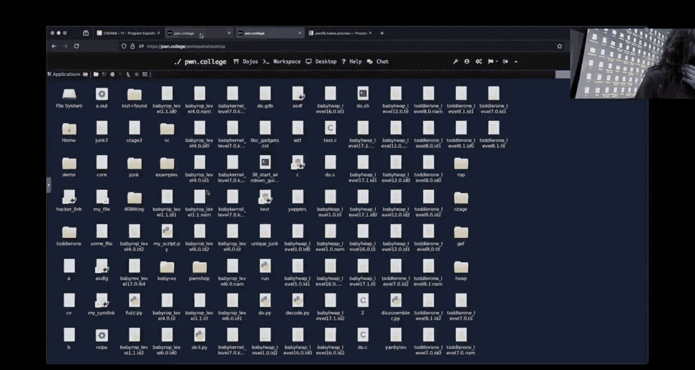
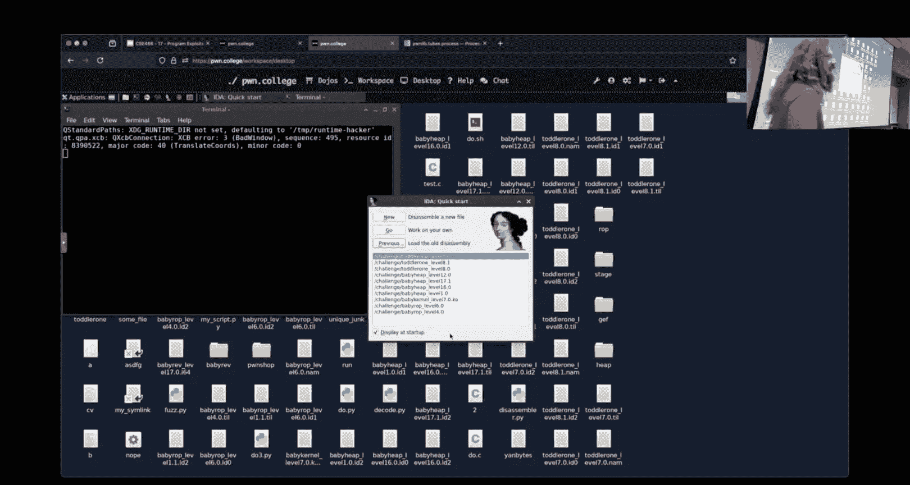

# 18：程序利用


在本节课中，我们将学习程序利用模块的核心概念，这是一个综合性的模块，结合了逆向工程、内存破坏、Python脚本编写和Shellcode等多种技能。我们将通过分析一个Y86-85模拟器中的挑战，来探讨如何识别漏洞、构造利用链并最终控制程序执行流。


## 课程概述与背景


上一节我们介绍了程序利用模块作为期中考试的性质。本节中，我们来看看如何将之前学到的技能综合应用到一个具体的Y86-85挑战中。

这个模块名为“程序利用”，它结合了我们目前讨论过的许多内容。Y86-85架构会反复出现。有人评论说，这些程序利用关卡非常像简化版的逆向工程挑战。它们确实是，但也不完全是。这些挑战需要你处理Y86-85代码，因此这是我们第一次大量接触Y86-85汇编器和反汇编器，希望你已意识到它们本质上是相似的。

如果你不喜欢Y86-85——这似乎是普遍看法——那么这就是你需要面对的。恭喜你坚持到了这门课的这部分内容。在后续关于推测执行和无法调试内容的微架构部分，你还会遇到Y86-85。所以，Y86-85会一直伴随着我们。

虚拟机器（VM）本质上也是一个程序。Y86-85 VM或CPU模拟层是C代码，是一个我们可以逆向工程、理解其工作原理、查看内存状态并推理其行为的二进制文件。虚拟机归根结底也只是一个程序。即使是一个更高级的虚拟机，比如VirtualBox，归根结底也只是一个用户态程序。因此，你可以将相同的概念应用于它。不要因为它是VM就觉得它神秘可怕，希望这门课程能揭示这些东西其实并不那么神秘或可怕。

这个模块就像一个期中考试，我们把很多东西结合在一起：使用Pwntools编写Python脚本、逆向工程、利用内存破坏，这里还有一些Shellcode。我们在这个模块中把所有部分整合在一起，希望完成之后你会觉得：“嘿，这挺巧妙的”，这是一些有趣且新颖的东西。而早期的挑战更像是“按部就班地做”，这个模块则需要更多的批判性思维和应用能力。

挑战的难度是递进的，名称上有“婴儿”和“幼儿”阶段。这不仅仅是本课程的期中考试，你会看到的所有内容都将是“幼儿”级别。这就像是学习爬行、学习走路、学习蹒跚学步。有人问，这些挑战与真实世界的情况匹配度如何？公平地说，这些挑战在某种程度上是人为设计的，因为它们必须如此。它们旨在教你特定的概念，让你练习非常具体的技能。当谈到现实世界的漏洞利用时，它们更接近我们在这个模块中所做的，有更多的活动部件，或者更接近你在堆或系统利用中看到的情况。控制流的获取路径不那么清晰。

## 环境变量与地址空间布局随机化

上一节我们提到了程序利用中的综合技能。本节中，我们来看看一个具体的技术细节：环境变量对栈地址的影响。


环境变量存储在栈上。这是一个需要理解的重要概念。地址空间布局随机化（ASLR）和位置无关可执行文件（PIE）是两个相关但不同的概念：
*   **PIE** 是一个编译选项，决定二进制文件本身在内存中加载时是否随机化。
*   **ASLR** 是一个运行时系统配置，内核或系统会尝试随机化地址。

如果ASLR启用（通常如此），而二进制文件没有编译为PIE，那么**二进制本身的地址**是固定的。但是，**栈地址**仍然会被随机化，因为栈是独立的内存区域，与二进制本身无关。PIE与栈的随机化无关。


当ASLR禁用时，栈地址变得确定。此时，环境变量的变化就会对栈地址产生可预测的影响。在栈上添加或修改环境变量会改变栈的布局，从而影响局部变量和缓冲区的地址。


在利用开发中，特别是在禁用ASLR的挑战环境中，我们需要一个**一致的执行环境**，以确保我们的利用地址每次都能正确命中。使用调试器（如GDB）启动程序可能会引入额外的环境变量（如 `_`），从而改变栈布局。为了避免这种干扰，最佳实践是：
1.  从脚本中启动目标进程（例如使用Pwntools），并控制其环境变量（例如设置为空字典 `env={}`）。
2.  然后附加调试器（`gdb.attach(p)`）到正在运行的进程。这样调试器不会改变进程的初始环境状态。

以下是使用Pwntools控制环境的示例代码：
```python
from pwn import *
p = process('./challenge', env={}) # 启动进程，环境变量为空
# 或者附加调试器
gdb.attach(p)
```


## 文件描述符与进程继承

在讨论了环境变量之后，我们转向另一个系统概念：文件描述符及其在进程间的继承，这在某些挑战中至关重要。




在Linux/C程序中，默认情况下，子进程会继承父进程的文件描述符。你可以通过系统调用（如 `open`）创建文件描述符，并通过 `dup2` 复制它们。

然而，在Python中，使用 `subprocess` 模块（Pwntools底层也使用它）启动新进程时，**默认行为是关闭所有文件描述符**。这与C/Linux的默认行为不同。为了在Python启动的进程中继承文件描述符，需要显式设置 `close_fds=False`。




以下是如何在Python中实现文件描述符继承的示例：
```python
import subprocess
# 默认关闭文件描述符
proc = subprocess.Popen(['./myprogram'])
# 为了继承文件描述符，例如从父进程继承已打开的某个描述符
proc = subprocess.Popen(['./myprogram'], close_fds=False)
```
在Pwntools中，你可以在创建进程时传递相应的参数来达到类似效果。理解这一点对于解决那些依赖于预先打开特定文件描述符（如flag文件）的挑战非常关键。

## 漏洞识别与分析方法论

掌握了环境变量和文件描述符的知识后，我们进入核心环节：面对一个未知的二进制文件，如何系统性地识别和分析漏洞。

我们以程序利用模块的某个Y86-85挑战（例如第7关）为例。首先，不要一头扎进复杂的反汇编代码中。应该遵循一个系统化的分析流程：

1.  **运行与观察**：首先运行程序，输入一些测试数据，观察其行为。使用 `checksec` 工具检查二进制保护机制。
    *   输出显示 `No canary found` 和 `No PIE enabled`。这意味着栈溢出是可能的，并且代码地址是固定的。
    *   输出提到栈是可执行的（`NX disabled`）。这意味着注入Shellcode是一个可行的利用途径。
    *   这些信息勾勒出了利用的大致轮廓：通过栈溢出覆盖返回地址，跳转到注入的Shellcode。

2.  **假设与验证**：尝试进行缓冲区溢出。发送大量数据（例如使用 `cyclic` 模式），观察程序是否崩溃以及崩溃点。如果发现无法直接覆盖到返回地址，那么漏洞点可能不在这里，或者存在长度限制。

3.  **寻找其他输入点**：如果主输入点无法达到目标，问自己：“还有哪里可以输入大量数据？” 这引导我们去寻找程序中的其他读取函数，例如 `read`、`fgets`、`scanf` 等。在Y86-85模拟器中，可能会通过 `read` 系统调用来实现输入。

4.  **逆向工程聚焦**：使用反汇编工具（如IDA）不是从 `main` 开始逐行阅读，而是有目的地搜索。例如，搜索 `read` 函数的交叉引用，查看哪些地方调用了读取功能。重点关注那些可能没有进行严格边界检查的读取点。

5.  **理解关键逻辑**：找到候选的读取函数后，分析其参数控制。在Y86-85中，读取的参数（文件描述符、缓冲区指针、读取长度）可能来自寄存器，而这些寄存器可能受我们输入的Y86-85代码控制。需要分析相关的解码逻辑，弄清楚如何设置这些寄存器。

6.  **构造利用链**：一旦找到可控的读取点，并且可以设置足够大的读取长度和合适的缓冲区指针（指向栈上靠近返回地址的位置），就可以规划利用链：
    *   第一段输入：Y86-85代码，用于设置寄存器并触发可控的 `read` 调用。
    *   第二段输入：通过该 `read` 调用注入的Shellcode和填充数据，旨在覆盖返回地址。
    *   覆盖返回地址，使其指向注入的Shellcode。

这种方法论的关键在于**基于假设进行有目的的调查**，而不是无目的地阅读所有代码。你的目标是回答一个具体的问题：“我如何将足够多的字节写入到返回地址附近？” 所有分析都应围绕这个问题展开，避免陷入不相关代码的细节中。

## Y86-85 读取逻辑分析

在应用上述方法论时，我们可能会在IDA中看到类似以下逻辑的Y86-85读取函数（例如 `read_mem`）：
```c
// 伪代码，示意逻辑
size = vm->reg[C]; // 读取长度来自寄存器C
buffer_ptr = &vm->code_mem[vm->reg[B] * 3]; // 缓冲区指针，基于寄存器B计算，乘以3因为每条指令3字节
if (buffer_ptr + size > &vm->code_mem[255]) {
    size = 255 - vm->reg[B]; // 防止写入超出代码内存区域
}
read(fd, buffer_ptr, size);
```
需要理解的关键点：
*   Y86-85代码内存空间有限（例如256字节）。
*   `buffer_ptr` 的计算是 `reg[B] * 3`，这是因为Y86-85指令是3字节对齐的，`reg[B]` 可能表示指令索引。
*   存在一个边界检查，防止从 `buffer_ptr` 开始写入时超出代码内存的末尾。如果 `reg[B]` 很大，接近末尾，那么允许的最大 `size` 会相应减小。
*   为了最大化写入长度，可能需要将 `reg[B]` 设置为0（从代码内存起始处开始写），并将 `reg[C]` 设置为允许的最大值。

## 总结与思维模式

本节课中，我们一起学习了程序利用中的综合技能。我们从环境变量和ASLR/PIE的细微差别开始，了解了它们对栈布局确定性的影响。接着，我们探讨了文件描述符在进程间的继承行为，特别是在Python脚本中需要注意的默认行为变化。

核心部分，我们深入探讨了面对一个复杂挑战（如Y86-85模拟器漏洞）时的系统化分析方法论。其要点是：
1.  **信息收集**：运行程序，使用 `checksec`，建立初步认识（有无栈保护、地址是否固定、栈是否可执行）。
2.  **建立假设**：基于信息，形成利用思路（例如，栈溢出 + Shellcode）。
3.  **针对性调查**：如果直接路径不通，寻找其他可能的输入向量（如其他 `read` 调用）。
4.  **逆向工程聚焦**：使用工具（如IDA）有目的地搜索关键函数和逻辑，而不是通读所有代码。
5.  **理解与构造**：深入分析关键函数，理解其参数控制逻辑，然后构造多阶段的利用载荷。


最重要的是培养一种**基于目标的调查思维**。始终清楚你想要实现什么（例如，“覆盖返回地址”），然后寻找能够帮助你实现这一目标的具体代码片段和路径。避免陷入理解所有功能的陷阱，只关注与你的攻击面相关的部分。这种思维模式对于高效解决复杂的漏洞利用挑战至关重要。