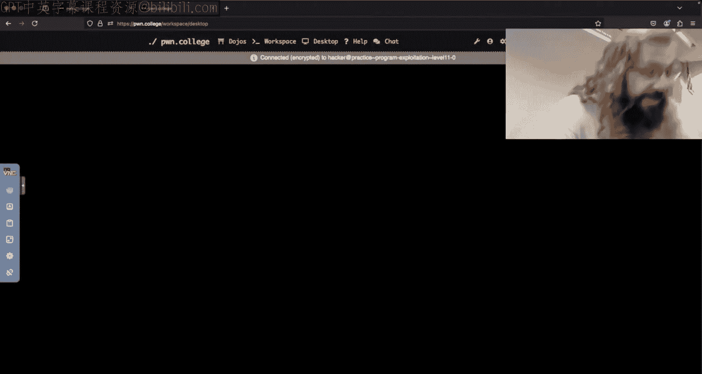
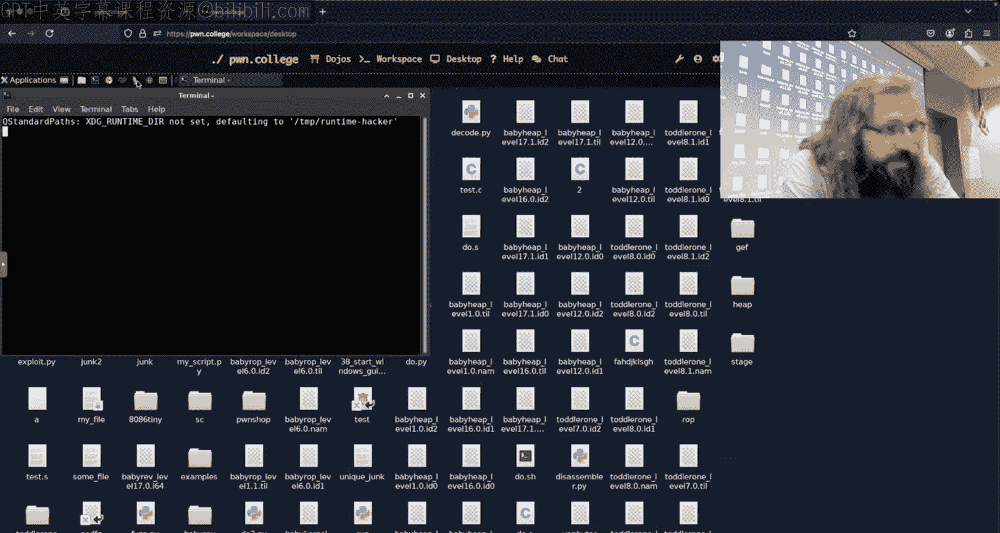
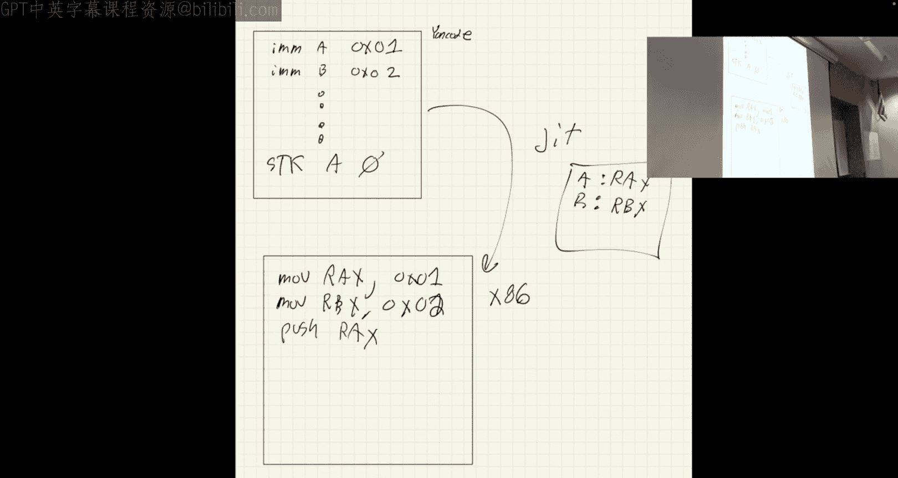
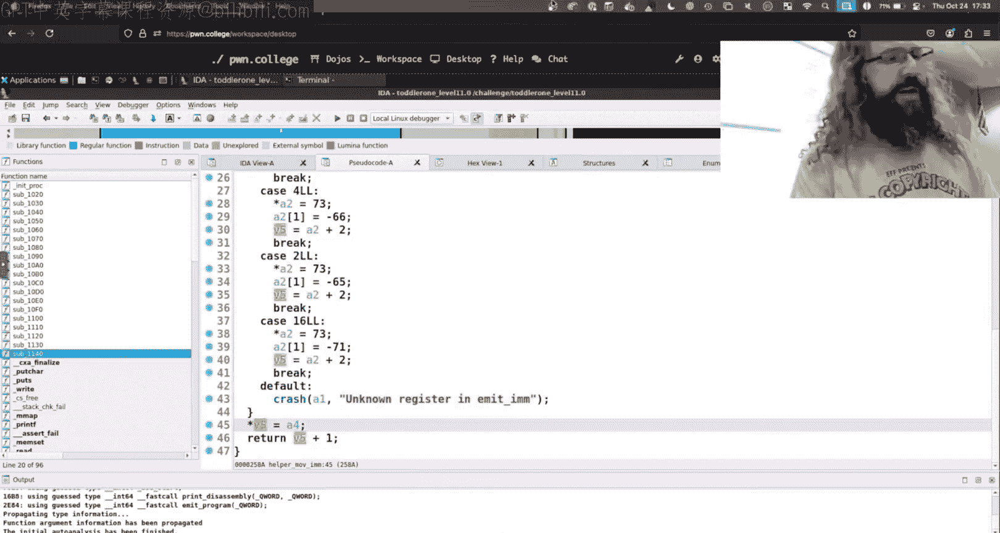

# 19：程序利用

在本节课中，我们将学习程序利用中的两个核心概念：**竞态条件** 和 **即时编译**。我们将通过分析一个具体的挑战程序，理解输入处理中的时序问题，并探讨如何利用JIT编译器的特性来执行任意代码。

---

## 竞态条件与输入处理

上一节我们介绍了程序利用的基本概念，本节中我们来看看一个常见的陷阱：**竞态条件**。当多个操作（如发送输入和程序读取）的执行顺序不确定时，就会发生竞态条件。

### 问题分析

考虑一个简单的C程序，它连续两次调用 `read` 函数从标准输入读取数据：

```c
#include <stdio.h>
#include <unistd.h>

int main() {
    char buff1[64];
    char buff2[64];
    read(0, buff1, 64); // 第一次读取
    read(0, buff2, 64); // 第二次读取
    printf("%s\n", buff1);
    printf("%s\n", buff2);
    return 0;
}
```

一个典型的利用脚本可能如下所示：

```python
from pwn import *

p = process('./a.out')
payload1 = b"payload one"
payload2 = b"payload two"
p.send(payload1)
p.send(payload2)
p.interactive()
```

脚本的意图是让 `payload1` 进入第一次 `read`，`payload2` 进入第二次 `read`。然而，这并不能保证。因为 `p.send()` 操作和程序的 `read()` 操作是并发执行的。如果程序在脚本发送第二个负载之前就执行了两次 `read`，那么第一次 `read` 可能会因为管道为空而阻塞等待，直到两个负载都被发送，然后一次性读取它们。这就是一个**竞态条件**。

### GDB调试的影响

当使用GDB调试程序时，问题会更加明显。GDB会暂停被调试的程序，但不会暂停Python脚本。因此，脚本可能会在程序开始执行任何 `read` 调用之前，就将两个负载全部发送到管道中。当程序恢复执行并调用 `read` 时，它会一次性读取管道中的所有数据（即两个负载），导致行为与预期不符。

### 解决方案

以下是几种解决竞态条件、确保输入顺序的方法：






1.  **使用 `recvuntil` 进行同步**：在每次发送后，等待程序输出特定的提示字符串（例如 “Enter input:”），这表示程序已准备好接收下一次输入。
    ```python
    p.send(payload1)
    p.recvuntil(b"Prompt for second read:") # 假设程序会输出这个提示
    p.send(payload2)
    ```

2.  **填充缓冲区**：如果知道每次 `read` 读取的确切字节数（例如64字节），可以精确控制每次发送的数据量，并用空字节填充。
    ```python
    payload1 = b"payload one".ljust(64, b'\x00')
    payload2 = b"payload two".ljust(64, b'\x00')
    p.send(payload1 + payload2) # 一次性发送，但依靠填充确保分割
    ```
    这里，第一个 `read` 会读取前64字节（包含 `payload one` 和填充的空字节），第二个 `read` 会读取接下来的64字节。空字节（`\x00`）在C字符串中表示结束，因此 `printf` 打印时只会显示到第一个空字节之前的内容。

3.  **使用延时**：在两次发送之间插入短暂的延时（例如 `time.sleep(0.1)` 或 `p.clean()`），但这是一种不可靠的“权宜之计”，不推荐在生产代码中使用。

---


## JIT编译与代码注入

在理解了输入处理的时序问题后，我们转向一个更高级的话题：**即时编译**。JIT（Just-In-Time）编译是一种在运行时将中间代码（如字节码）编译成机器码的技术。某些挑战会模拟一个JIT编译器，这为我们提供了新的攻击面。

### 挑战分析


考虑一个“Yan85 64位”挑战。它接受Yan85代码，通过一个JIT编译器将其转换为x86-64机器码，然后执行。关键观察点在于JIT编译器如何映射指令。

例如，Yan85指令 `immediate a, 0x0102030405060708` 可能会被JIT编译为以下x86-64指令：
```
mov r10, 0x0102030405060708
```
对应的机器码可能是：`49 BA 08 07 06 05 04 03 02 01`。

### JIT Spray 攻击原理



JIT Spray的核心思想是：**将恶意shellcode隐藏在JIT编译器生成的“常量”数据中，然后通过偏移执行流来执行这些常量字节**。

1.  **构造恶意常量**：我们控制传入JIT的Yan85代码中的立即数。例如，我们可以让立即数本身就是一个有效的x86指令序列。
    *   假设我们想让程序执行 `push rax; pop rbx`。对应的机器码很短（例如 `0x50 0x5B`）。
    *   我们可以构造一个Yan85指令，其立即数为 `0x5B50000000000000`（注意x86是小端字节序，所以有效指令 `50 5B` 在内存中看起来是 `5B 50`）。



2.  **偏移执行**：JIT编译器会将我们的指令编译成类似 `mov r10, 0x5B50000000000000` 的代码，并写入一块内存（假设地址是 `0x13370000`）。正常执行会从 `0x13370000` 开始，执行 `mov` 指令。但是，如果我们能**将程序计数器（EIP/RIP）重定向到 `0x13370002`**（即跳过开头的 `49 BA` 这两个字节），处理器就会开始将后续的字节 `5B 50 00 00...` 解释为指令，从而执行 `pop rbx; push rax`。

3.  **处理垃圾字节**：由于我们跳过了JIT生成的前缀字节，后续的指令流中会夹杂着其他JIT指令的“垃圾”字节（如其他 `mov` 指令的操作码）。为了保持执行连贯，我们的shellcode必须在每执行完一小段（例如8字节）后，包含一个**跳转指令**，跳过接下来的垃圾字节，到达下一个由我们控制的常量区域。

### 攻击链总结

1.  编写Yan85代码，其中包含多个 `immediate` 指令。
2.  精心设置每个立即数的值，使得它们从某个偏移量（例如+2）开始看，是一段连贯的x86 shellcode，并且每段shellcode末尾都有一个短跳转，指向下一个“常量”区域的起始偏移点。
3.  利用程序中的内存破坏漏洞（例如缓冲区溢出），将返回地址覆盖为JIT代码区域的某个偏移地址（例如 `0x13370002`）。
4.  当程序执行到我们的shellcode时，它会沿着我们布置的“跳板”执行，最终达成攻击目标（如启动一个shell）。


---

### 本节课总结

本节课中我们一起学习了程序利用中的两个重要方面：
1.  **竞态条件**：在多进程/线程环境中，操作的时序不确定性可能导致程序行为异常。在编写漏洞利用脚本时，需要使用同步机制（如 `recvuntil`）或精确的缓冲区填充来确保输入按预期被处理。
2.  **JIT Spray**：这是一种利用即时编译器特性的高级代码注入技术。通过将shellcode隐藏在JIT生成的代码常量中，并巧妙地偏移执行起点，可以绕过诸如W^X（不可同时写和执行）的内存保护机制。这要求攻击者对目标JIT的编译逻辑有深入的理解，并能精心构造输入数据。


理解这些概念有助于我们更全面地认识软件漏洞的多样性和利用手法的巧妙性。