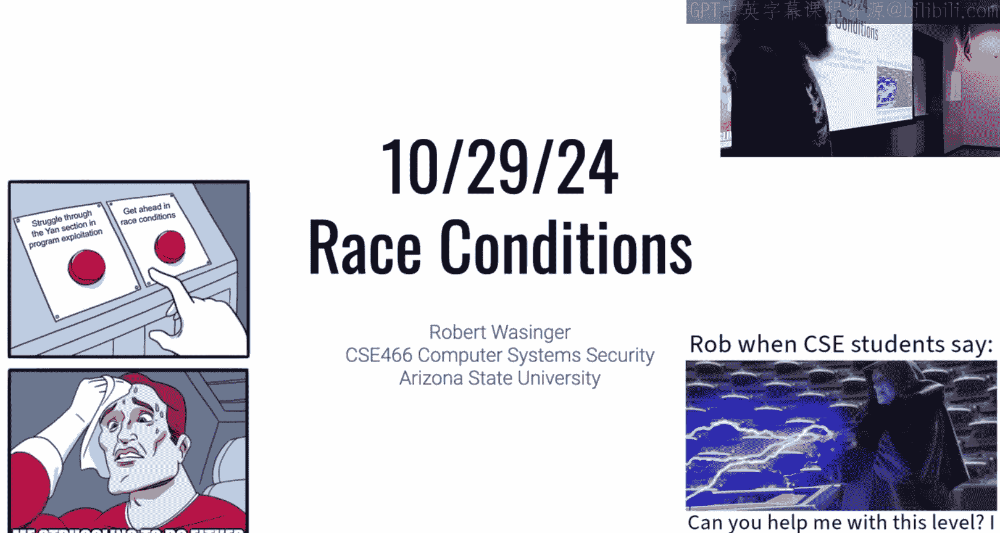
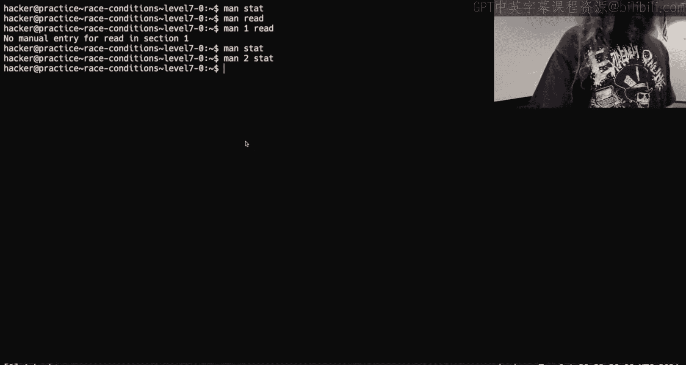
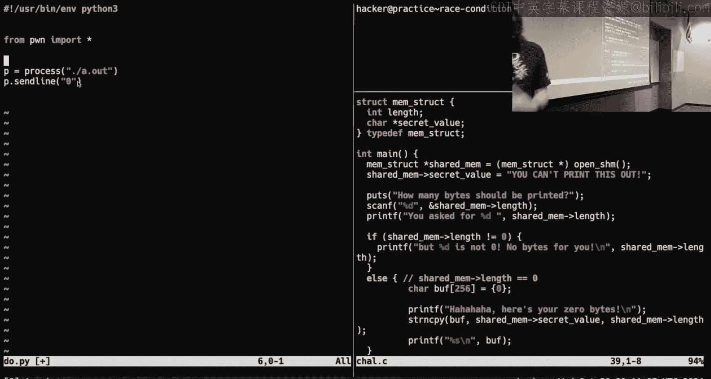
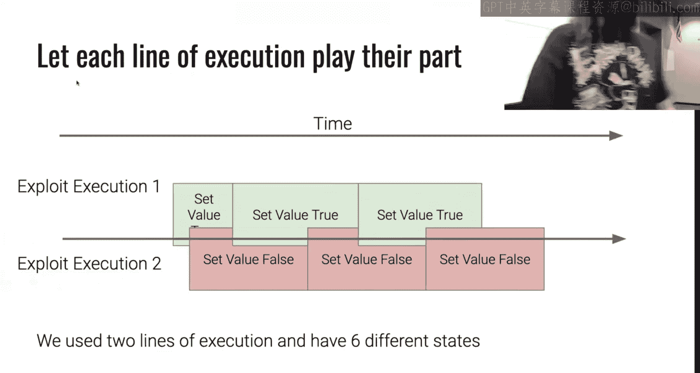
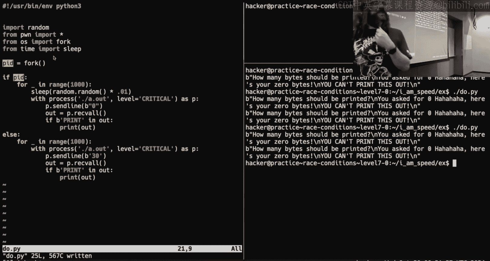
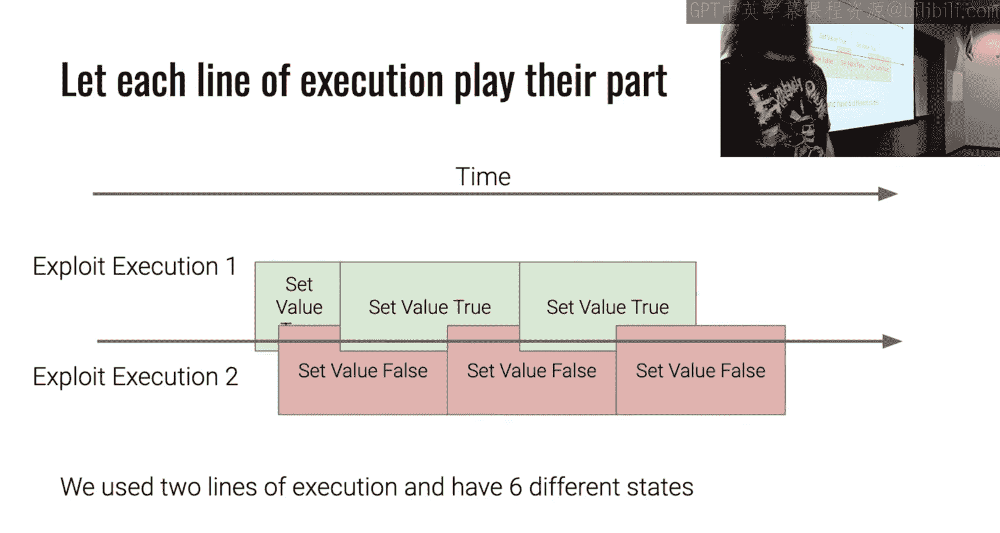
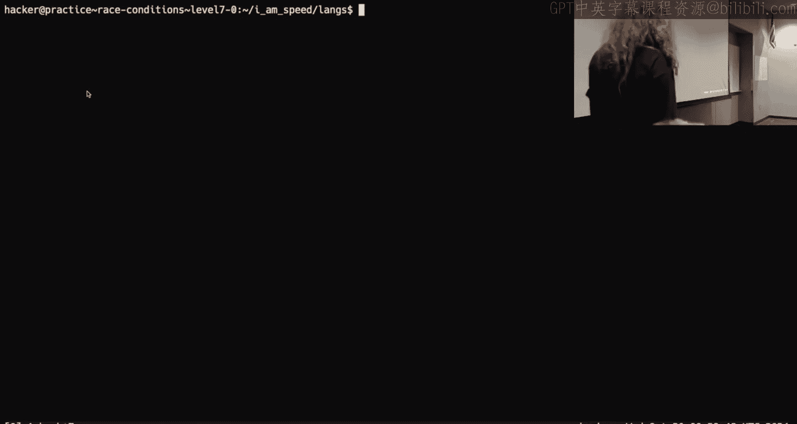
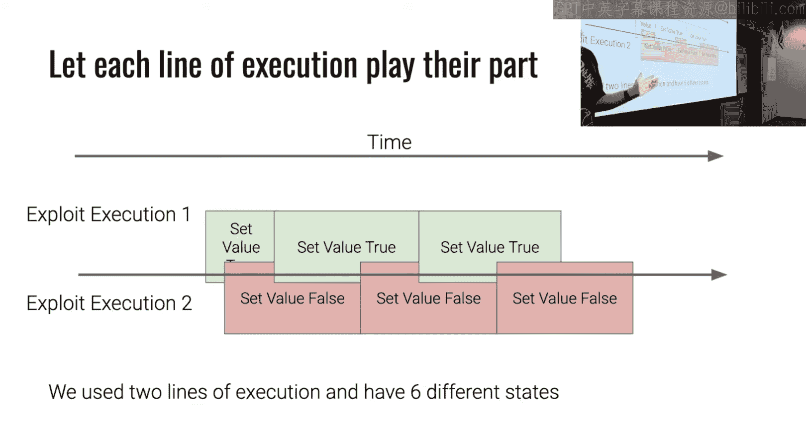
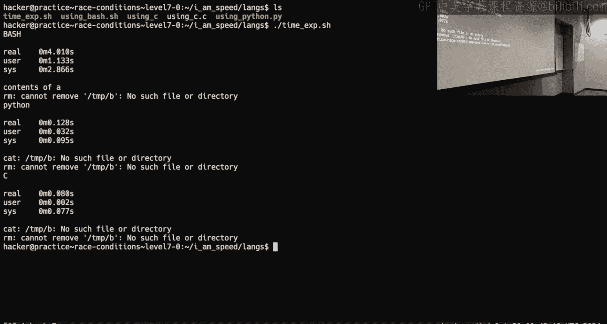
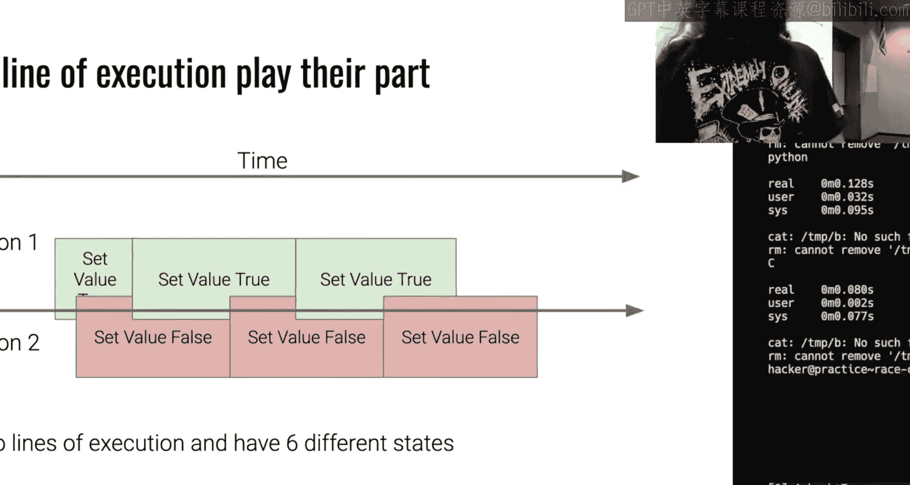

# 20：竞态条件




在本节课中，我们将学习竞态条件的概念，特别是“检查时间-使用时间”漏洞。我们将探讨其原理、调试的挑战性，并学习如何通过理解时序而非单纯追求速度来有效利用竞态条件。


## 概述

竞态条件是计算机安全中的一个重要议题，它源于多个进程或线程在未受控的情况下访问和操作共享资源。本节课我们将深入理解竞态条件的本质，学习如何分析和利用这类漏洞，并掌握编写有效利用代码的策略。

## 竞态条件的核心概念

竞态条件，特别是“检查时间-使用时间”漏洞，包含三个关键部分：
1.  **共享资源**：一个可以被多个执行流访问的变量、文件或内存区域。
2.  **检查时间**：程序检查共享资源状态（例如，检查一个值是否为真或一个文件是否存在）的时刻。
3.  **使用时间**：程序基于之前的检查结果，实际使用该共享资源的时刻。

漏洞存在于检查和使用的两个操作之间。如果攻击者能在检查之后、使用之前改变共享资源的状态，就可能使程序执行非预期的操作。

## 对速度的误解

许多初学者认为，赢得竞态条件的关键是编写极快的利用代码。然而，这种想法并不完全正确。

上一节我们介绍了竞态条件的核心概念，本节中我们来看看为什么单纯追求速度可能无效。

想象一个简单的“检查时间-使用时间”场景：程序检查一个标志是否为真，如果是，则稍后使用它。攻击者的目标是让检查时为真，而使用时为假。

*   **理想情况**：攻击代码完美同步，在检查后立即将标志从真翻转为假。
*   **仅追求速度**：如果攻击代码只是非常快地来回翻转标志（真->假->真->假...），但翻转的节奏与程序的检查/使用节奏完全同步，那么检查时可能恰好是假，使用时可能恰好是真，导致攻击失败。
*   **调整节奏**：有时，在攻击代码开始时加入一个短暂的随机延迟（`sleep(random_amount)`），稍微改变攻击的启动时间点，反而可能让翻转动作与程序的脆弱时间窗口对齐。


因此，赢得竞态的关键在于**时机和节奏**的把握，而不仅仅是执行速度。你需要让你的状态变化“击中”程序检查和使用这两个特定的时间点。

## 并行化的正确使用



既然速度不是唯一答案，那么使用多线程或多进程进行并行攻击是否有效呢？答案取决于如何使用。

以下是并行化的两种思路：

1.  **错误的并行化**：创建多个线程或进程，但让它们都执行完全相同的任务（例如，都快速循环翻转同一个标志）。这就像一支乐队里所有乐手都在同一时刻演奏同一个音符，并没有创造出更丰富的“音乐”（即状态变化序列），对提高成功率帮助有限。
2.  **正确的并行化**：创建多个线程或进程，并让它们执行**不同**的任务或具有**不同时序**的相同任务。例如，一个进程负责将标志设为“真”，另一个进程负责将其设为“假”，并且它们以略有偏移的节奏运行。这就像乐队中有鼓手、贝斯手和吉他手，他们演奏不同的音符和节奏，共同创造出复杂多变的声音。这样能显著增加共享资源状态在关键时间点恰好是攻击者所需值的概率。

通过引入具有不同行为的并行执行流，你可以创造更密集、更多样的状态变化，从而增加“命中”目标时间窗口的机会。


## 语言选择与性能考量

在编写利用代码时，语言选择是一个常见问题。许多人认为C语言最快，因此是唯一选择。但实际情况更为复杂。






我们通过一个简单的测试来比较不同语言执行相同操作（创建和删除符号链接）的性能：

```bash
# Bash 脚本示例
ln -s /tmp/A /tmp/B
rm /tmp/B


# C 程序示例（调用系统调用）
symlink(“/tmp/B”, “/tmp/A”);
unlink(“/tmp/B”);

# Python 程序示例
import os
os.symlink(“/tmp/B”, “/tmp/A”)
os.unlink(“/tmp/B”)
```





**单次执行结果分析**：
*   **C语言**：直接编译为机器码，系统调用开销极小，用户态时间最短。
*   **Bash脚本**：需要启动子进程来执行`ln`和`rm`命令，这些命令本身是C编译的二进制文件。主要开销在于进程创建。
*   **Python脚本**：需要启动Python解释器，导入`os`模块，解释字节码，然后通过解释器内部的C代码调用系统调用。主要开销在于解释器启动和初始化。

因此，单次运行时，C最快，Bash次之，Python最慢。

**循环执行（例如1000次）结果分析**：
*   **Python**：启动解释器的开销只支付一次，后续循环只是在解释器内部快速调用系统调用，总时间可能变得很有竞争力。
*   **Bash**：每次循环都需要创建新的子进程，进程创建的开销会累积，可能变得较慢。
*   **C**：依然保持最快。

**结论**：语言性能特征很重要，但需要结合具体场景理解。对于竞态条件利用，通常需要循环或并行运行攻击代码。Python虽然启动慢，但一旦运行起来，在循环中可能足够快，且编写和调试更便捷。Bash的进程创建开销在需要大量并行时可能成为瓶颈。C语言性能最好，但开发效率较低。选择哪种语言取决于你对性能瓶颈的理解和开发效率的权衡。





**关于Python线程的注意事项**：由于全局解释器锁的存在，CPython的多线程并不能实现真正的并行执行（多个线程无法同时执行Python字节码）。对于需要真并行的竞态攻击，建议使用`multiprocessing`模块（多进程）或`subprocess`调用外部程序，而不是`threading`模块。

## 调试竞态条件

调试竞态条件非常困难，因为它们依赖于难以复现的精确时序。传统的单步调试器（如GDB）通常不是最佳工具，因为你需要在多个进程间同步断点并控制执行流，这极其复杂且容易破坏原有的竞态条件。

更有效的方法是：
1.  **理解概念**：建立对程序逻辑、共享资源以及检查/使用时间点的清晰概念模型。
2.  **增加可观测性**：在攻击代码和/或目标程序中添加日志输出，记录关键事件（如“检查开始”、“检查结束”、“使用开始”、“状态改变”等）。通过分析日志来推断发生了什么。
3.  **使用统计和重复**：由于一次尝试可能失败，编写利用代码使其自动重复尝试成千上万次，并统计成功次数。通过调整参数（如延迟、并行度）观察成功率变化。
4.  **简化与放大**：如果可能，尝试让目标程序的操作变慢（例如，在文件路径中插入大量`/`，或使用`nice`降低优先级），以扩大攻击窗口，但这在真实攻击中往往不可行。



培养对竞态条件的“直觉”和基于对代码的理解进行推理的能力，比依赖调试器更为重要。



## 总结

本节课中我们一起学习了竞态条件，特别是“检查时间-使用时间”漏洞。我们了解到，成功的利用关键在于把握状态变化的**时机和节奏**，而非单纯追求代码执行速度。正确使用**并行化**（让不同执行流执行不同任务）可以显著提高成功率。在选择实现语言时，需要权衡**性能特征**和开发效率，Python在多数场景下是足够且高效的选择。最后，我们认识到调试竞态条件极具挑战性，依赖于**概念理解、日志分析和统计方法**，而非传统调试技术。


通过掌握这些核心思想，你将能够更有效地分析和利用竞态条件漏洞。