# 21：沙箱逃逸

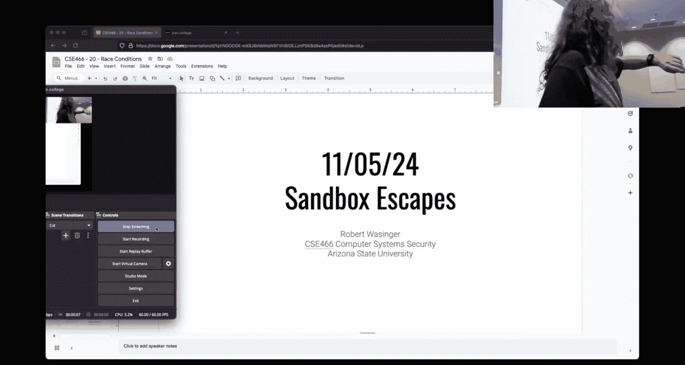

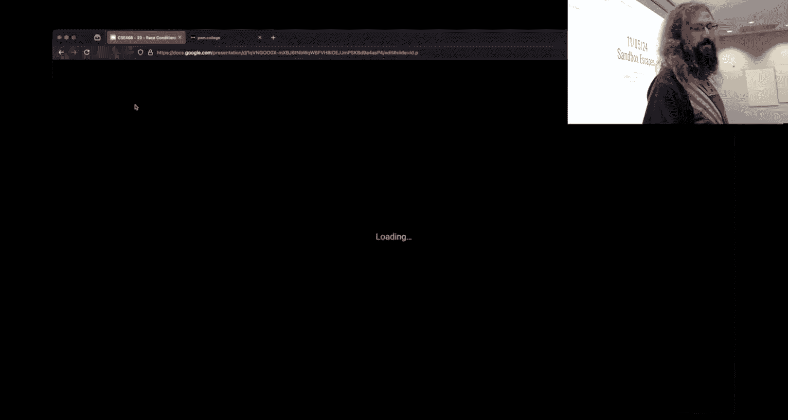

## 概述

在本节课中，我们将学习沙箱逃逸（Sandbox Escapes）这一主题。沙箱是一种安全机制，用于隔离运行程序，限制其对系统资源的访问。然而，攻击者有时能找到方法“逃出”沙箱的限制。我们将探讨几种关键的沙箱技术，包括 `chroot`、`seccomp` 和命名空间，并了解如何利用它们的设计特性或绕过其限制。


---


## 沙箱技术核心概念

上一节我们概述了沙箱逃逸，本节中我们来看看构成沙箱的几种核心隔离技术。

### Chroot：改变根目录

`chroot` 是一个系统调用，其核心功能是改变进程及其子进程的根目录（`/`）。这意味着进程将无法访问新根目录之外的任何文件路径。

**公式/代码描述：**
```c
int chroot(const char *path); // 系统调用，将根目录更改为 `path`
```


然而，仅仅调用 `chroot` 并不足以创建完整的“监狱”（jail）。你通常还需要使用 `chdir(“/”)` 将当前工作目录切换到新的根目录下，否则进程可能仍能通过相对路径访问外部文件。

更重要的是，文件描述符（File Descriptors）提供了一种逃逸途径。如果在调用 `chroot` 之前打开了一个文件（例如 `/etc/passwd`），那么即使之后根目录被改变，进程仍然可以通过这个已经打开的文件描述符访问该文件。内核的文件访问检查发生在 `open` 调用时，而不是后续的读写操作时。


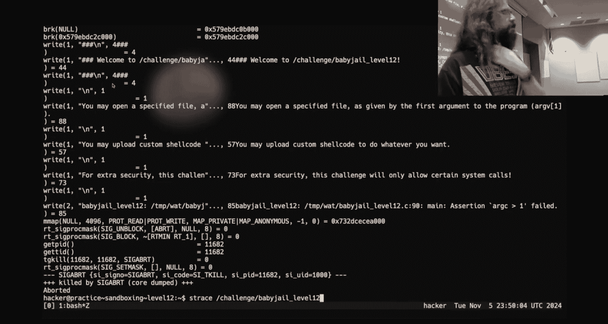

### Seccomp：系统调用过滤

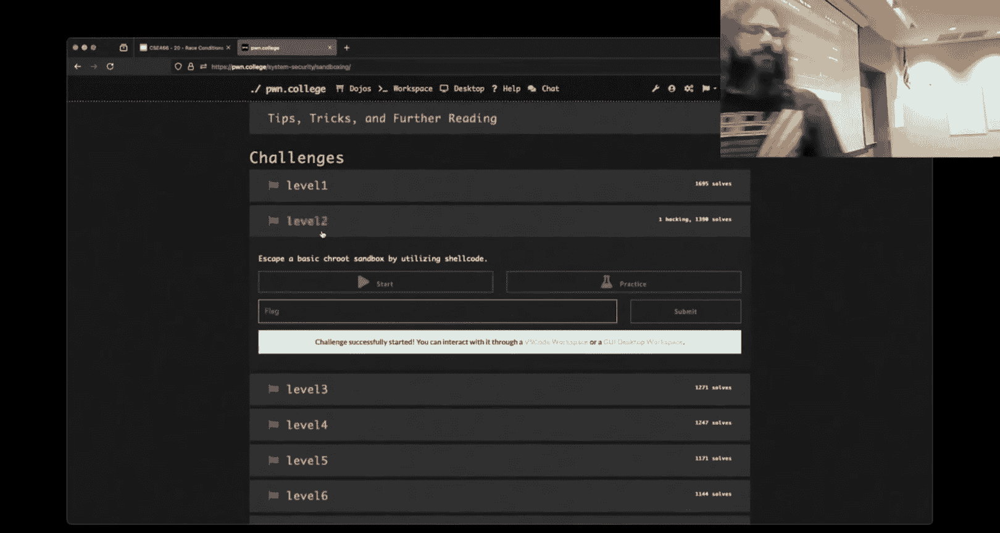

`seccomp`（secure computing mode）是 Linux 内核的一个功能，用于限制进程可以执行的系统调用。这能极大减少攻击面。

**公式/代码描述：**
```c
prctl(PR_SET_SECCOMP, SECCOMP_MODE_FILTER, filter); // 设置 seccomp 过滤器
```

`seccomp` 的工作原理是在内核中维护一个允许的系统调用列表（过滤器）。当进程执行一个系统调用（如通过 `syscall` 指令）时，内核会检查其系统调用号（存储在 `RAX` 寄存器中）是否在允许列表中。如果不在，进程通常会收到 `SIGSYS` 信号并被终止。


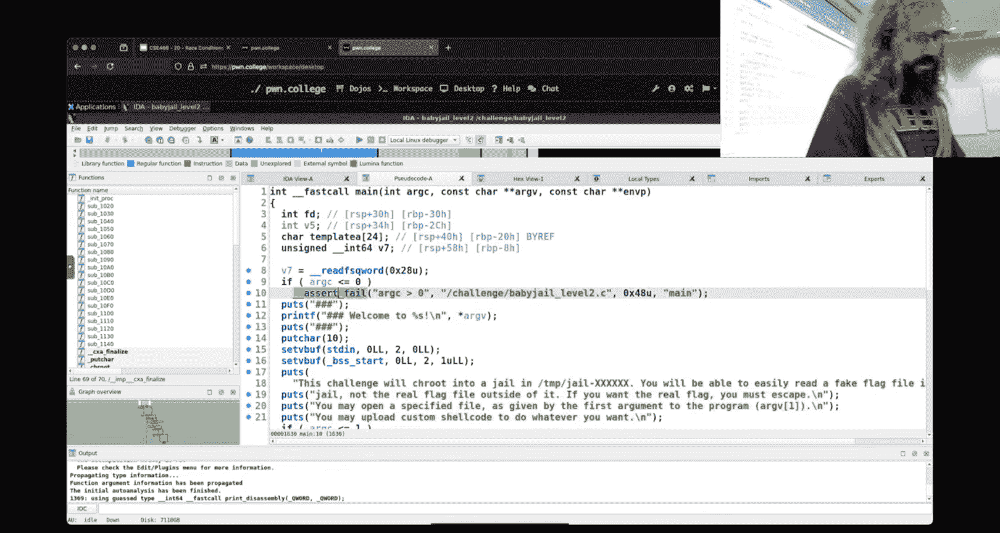

绕过 `seccomp` 的一种可能方法是利用程序漏洞，在过滤器生效前篡改其规则（例如，通过内存破坏漏洞）。另一种思路是寻找未被过滤的、功能相近的系统调用来达到目的。

### 命名空间（Namespaces）

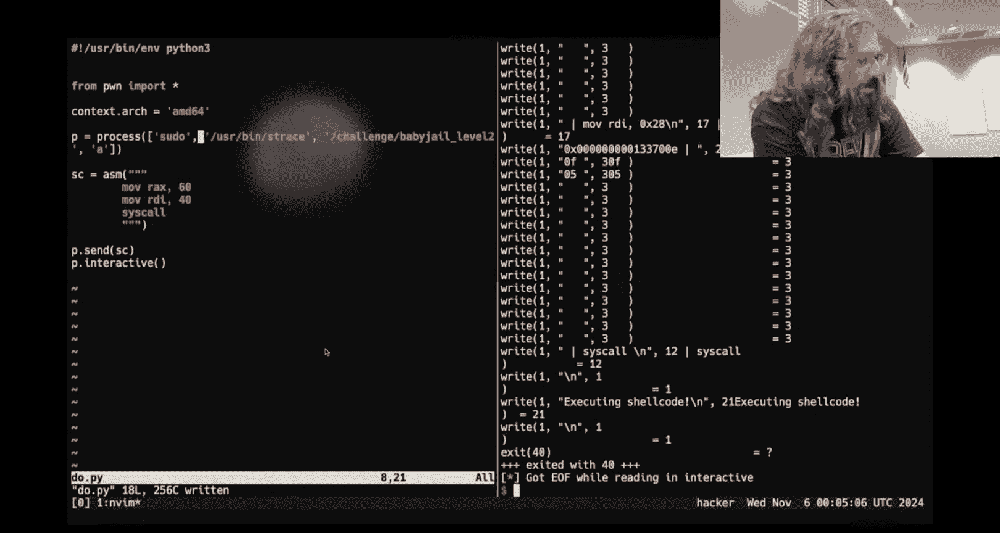


命名空间是 Linux 内核更强大的隔离机制，可以为进程提供独立的网络、进程ID、挂载点等视图。Docker 等容器技术就基于此实现。

虽然本节课没有深入代码细节，但其核心思想是为进程组创建独立的系统资源实例，使其与主机和其他容器隔离开来。

---

## 侧信道攻击：在不被察觉的情况下泄露信息


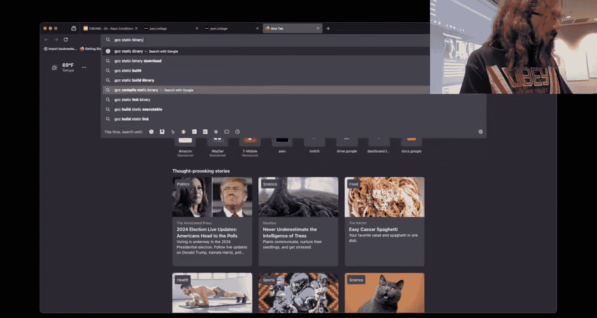

上一节我们介绍了如何通过文件描述符绕过 `chroot`，本节中我们来看看当直接输出被禁止时，如何利用侧信道（Side Channel）泄露信息。

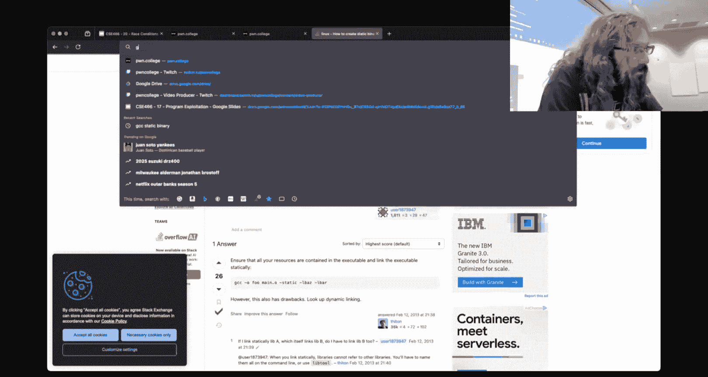

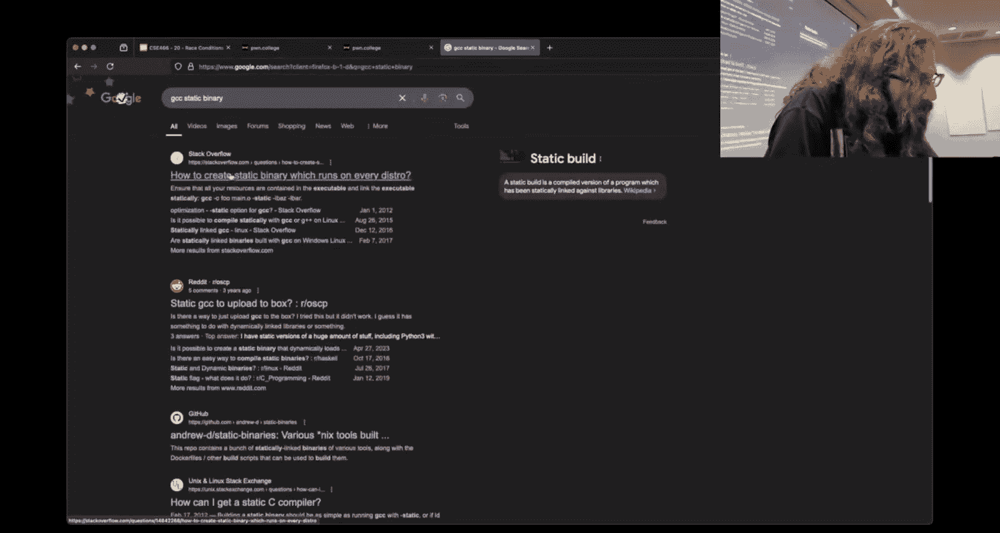


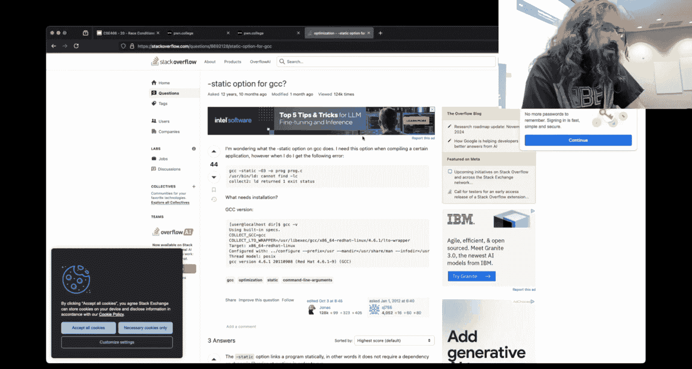

侧信道攻击不直接读取受保护的数据，而是通过观察程序行为（如执行时间、错误代码、资源使用情况）的细微差异来推断信息。

以下是几种常见的侧信道技术：

### 1. 退出码（Exit Codes）

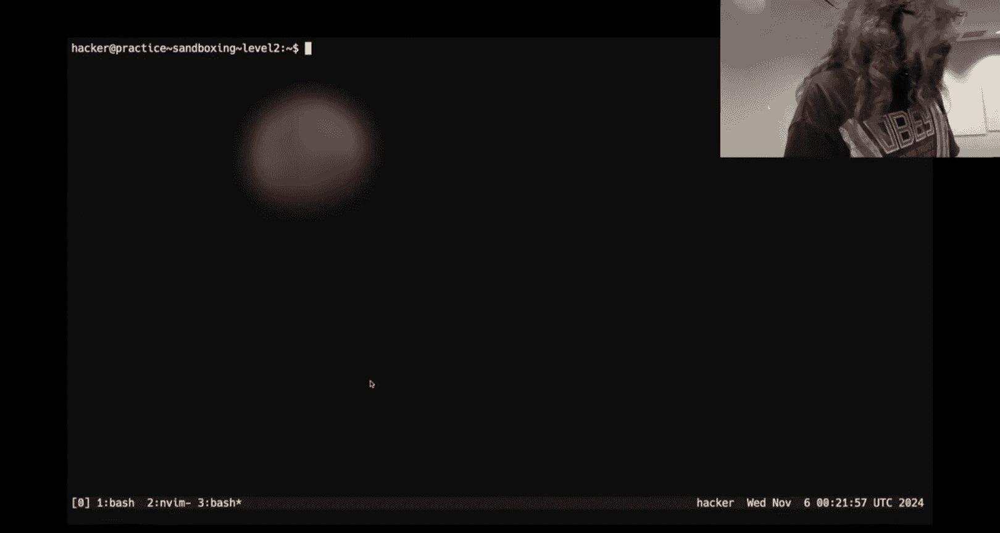


程序结束时必须返回一个退出码。我们可以利用这个机制来传递信息。

**示例：**
```c
// 一个简单的程序，其退出码等于传入的参数个数
int main(int argc, char *argv[]) {
    return argc;
}
```
通过检查进程的退出码（例如在 Bash 中用 `$?`，在 Python 的 `pwntools` 中用 `process.poll()`），攻击者可以获取一个有限范围内的整数值。

### 2. 睡眠时间（Sleep Timing）

通过控制程序睡眠的时长来编码信息。例如，让程序根据某个秘密字节的值睡眠相应的秒数。

**示例思路：**
```c
sleep(secret_byte_value); // 睡眠秒数等于秘密字节的值
```
外部攻击者通过测量程序的运行总时间，可以推断出 `secret_byte_value`。为了提高精度和减少时间，可以使用 `nanosleep` 来指定纳秒级的睡眠。

### 3. 条件分支与二分搜索

最有效的侧信道往往只泄露一个比特（bit）的信息：程序是否执行了某条特定路径。我们可以利用这一点，结合二分搜索算法，高效地逐位泄露数据。

**核心思想：**
1.  构造一个条件判断，例如 `if (secret_byte > guess)`。
2.  如果条件为真，让程序执行一个可被外部观测的“慢操作”（如睡眠一小段时间）。
3.  如果条件为假，程序快速执行。
4.  攻击者根据程序总体运行时间是“长”还是“短”，就能判断条件是否成立（泄露1比特信息）。
5.  对字节值的可能范围（0-255）进行二分搜索，只需约 `log2(256) = 8` 次猜测就能确定一个字节的值，而不是暴力尝试256次。

**简化示例：**
```c
// 假设 secret_byte 是我们要泄露的字节
if (secret_byte == our_guess) {
    nanosleep(&long_time, NULL); // 匹配时睡眠
}
// 不匹配时什么也不做
```
通过外部计时，攻击者可以判断 `our_guess` 是否等于 `secret_byte`。重复此过程并对所有字节进行二分搜索，即可高效地泄露整个秘密（如 flag）。

这种方法的关键在于找到一种稳定且可被外部区分的“慢操作”，即使在限制严格的沙箱中（可能无法使用 `sleep`），也需要发挥创造性。

---

## 总结


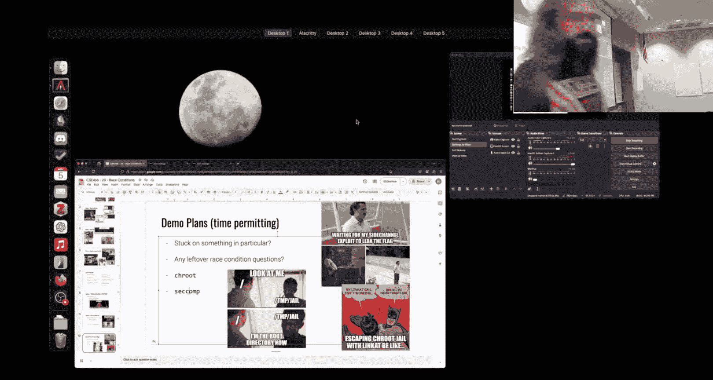

本节课中我们一起学习了沙箱逃逸的基本概念。我们首先了解了 `chroot`、`seccomp` 和命名空间这三种核心的沙箱隔离技术，并探讨了它们潜在的绕过方法，例如利用预先打开的文件描述符。接着，我们深入研究了侧信道攻击，学习了如何通过退出码、程序执行时间等间接渠道泄露信息，并重点掌握了利用条件分支和二分搜索算法进行高效数据泄露的原理。这些知识揭示了安全机制的设计复杂性以及攻击者思维的创造性，是理解现代系统安全攻防的重要基础。